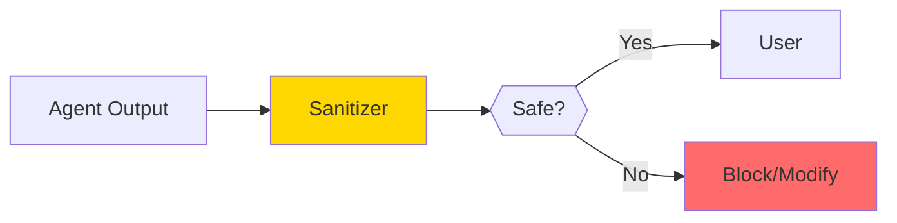
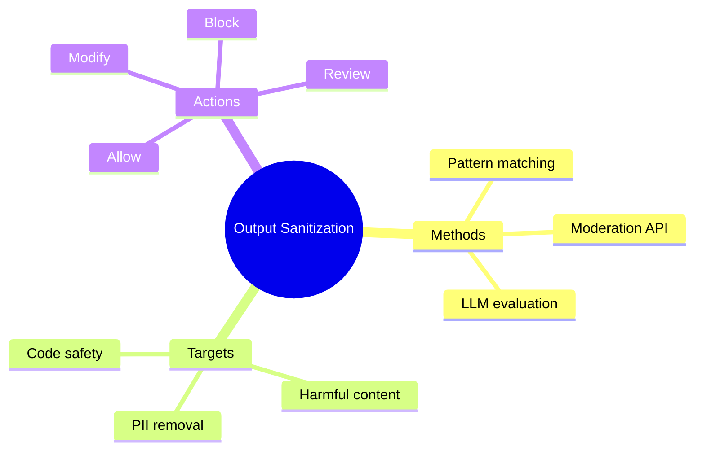

# Output Sanitization

Agents can produce harmful or inappropriate content. Output sanitization catches and cleans problematic responses before they reach users.

> **Coming from Software Engineering?** Output sanitization is exactly like escaping HTML output to prevent XSS, or validating API responses before passing them to the frontend. You never trust output from an external system — and an LLM is an external system whose output you can't fully predict. The pattern is the same: validate, sanitize, and escape before delivering to the user. If you've implemented Content Security Policies or output encoding, you have the right mindset.

---

## Why Sanitize Outputs?



Risks without sanitization:
- **Harmful content**: Violence, hate speech
- **PII leakage**: Exposing personal data
- **Prompt injection echos**: Repeating malicious inputs
- **Misinformation**: False or dangerous advice
- **Code injection**: Malicious scripts

---

## Basic Output Sanitization

```python
# script_id: day_063_output_sanitization/sanitization_pipeline
import re
from typing import List, Tuple

class OutputSanitizer:
    """Sanitize agent outputs before showing to users."""

    def __init__(self):
        self.blocked_patterns = []
        self.pii_patterns = []
        self.setup_default_patterns()

    def setup_default_patterns(self):
        """Set up default blocking patterns."""

        # PII patterns
        self.pii_patterns = [
            (r'\b\d{3}-\d{2}-\d{4}\b', '[SSN REDACTED]'),  # SSN
            (r'\b\d{16}\b', '[CARD NUMBER REDACTED]'),     # Credit card
            (r'\b[A-Za-z0-9._%+-]+@[A-Za-z0-9.-]+\.[A-Z|a-z]{2,}\b', '[EMAIL REDACTED]'),
            (r'\b\d{3}[-.]?\d{3}[-.]?\d{4}\b', '[PHONE REDACTED]'),
        ]

        # Harmful content patterns
        self.blocked_patterns = [
            r'how to (make|build|create) (a )?(bomb|weapon|explosive)',
            r'instructions for (illegal|harmful)',
        ]

    def sanitize(self, text: str) -> Tuple[str, List[str]]:
        """
        Sanitize text and return cleaned version with list of issues found.

        Returns:
            (sanitized_text, list_of_issues)
        """
        issues = []

        # Check for blocked patterns
        for pattern in self.blocked_patterns:
            if re.search(pattern, text, re.IGNORECASE):
                issues.append(f"Blocked content pattern detected")
                return "[Content blocked due to policy violation]", issues

        # Redact PII
        sanitized = text
        for pattern, replacement in self.pii_patterns:
            matches = re.findall(pattern, text)
            if matches:
                issues.append(f"PII detected and redacted: {len(matches)} instance(s)")
                sanitized = re.sub(pattern, replacement, sanitized)

        return sanitized, issues

# Usage
sanitizer = OutputSanitizer()

# Test with PII
text1 = "Contact John at john@example.com or call 555-123-4567"
clean1, issues1 = sanitizer.sanitize(text1)
print(f"Original: {text1}")
print(f"Cleaned: {clean1}")
print(f"Issues: {issues1}")

# Test with harmful content
text2 = "Here's how to make a bomb..."
clean2, issues2 = sanitizer.sanitize(text2)
print(f"\nOriginal: {text2[:30]}...")
print(f"Cleaned: {clean2}")
```

---

## LLM-Based Content Moderation

Use an LLM to evaluate content safety:

```python
# script_id: day_063_output_sanitization/sanitization_pipeline
from openai import OpenAI
import json

client = OpenAI()

def moderate_with_llm(content: str) -> dict:
    """Use LLM to moderate content."""

    prompt = f"""Analyze this content for safety issues.

Content to analyze:
{content}

Check for:
1. Harmful instructions (violence, illegal activities)
2. Hate speech or discrimination
3. Personal information exposure
4. Misinformation or dangerous advice
5. Inappropriate content

Return JSON:
{{
    "safe": true/false,
    "issues": ["list of specific issues"],
    "severity": "none/low/medium/high/critical",
    "recommendation": "allow/modify/block"
}}"""

    response = client.chat.completions.create(
        model="gpt-4o",
        messages=[{"role": "user", "content": prompt}],
        response_format={"type": "json_object"}
    )

    return json.loads(response.choices[0].message.content)

# Usage
result = moderate_with_llm("Here's how to pick a lock...")
print(f"Safe: {result['safe']}")
print(f"Severity: {result['severity']}")
print(f"Recommendation: {result['recommendation']}")
```

---

## OpenAI Moderation API

Use OpenAI's built-in moderation:

```python
# script_id: day_063_output_sanitization/sanitization_pipeline
from openai import OpenAI

client = OpenAI()

def check_moderation(text: str) -> dict:
    """Check content with OpenAI's moderation endpoint."""

    response = client.moderations.create(input=text)

    result = response.results[0]

    return {
        "flagged": result.flagged,
        "categories": {
            cat: flagged
            for cat, flagged in result.categories.model_dump().items()
            if flagged
        },
        "scores": {
            cat: score
            for cat, score in result.category_scores.model_dump().items()
            if score > 0.1  # Only show significant scores
        }
    }

# Usage
text = "I love programming and helping people!"
result = check_moderation(text)
print(f"Flagged: {result['flagged']}")
print(f"Flagged categories: {result['categories']}")
```

---

## Comprehensive Sanitization Pipeline

```python
# script_id: day_063_output_sanitization/sanitization_pipeline
from dataclasses import dataclass
from typing import List, Optional
from enum import Enum

class SanitizationAction(Enum):
    ALLOW = "allow"
    MODIFY = "modify"
    BLOCK = "block"
    REVIEW = "review"

@dataclass
class SanitizationResult:
    original: str
    sanitized: str
    action: SanitizationAction
    issues: List[str]
    confidence: float

class ComprehensiveSanitizer:
    """Multi-layer output sanitization."""

    def __init__(self):
        self.client = OpenAI()
        self.pattern_sanitizer = OutputSanitizer()

    def sanitize(self, content: str) -> SanitizationResult:
        """Run content through all sanitization layers."""

        issues = []
        current_content = content
        confidence = 1.0

        # Layer 1: Pattern-based sanitization
        current_content, pattern_issues = self.pattern_sanitizer.sanitize(current_content)
        issues.extend(pattern_issues)

        if "[Content blocked" in current_content:
            return SanitizationResult(
                original=content,
                sanitized=current_content,
                action=SanitizationAction.BLOCK,
                issues=issues,
                confidence=1.0
            )

        # Layer 2: OpenAI Moderation
        moderation = check_moderation(current_content)
        if moderation["flagged"]:
            issues.append(f"Moderation flagged: {list(moderation['categories'].keys())}")
            return SanitizationResult(
                original=content,
                sanitized="[Content flagged by moderation system]",
                action=SanitizationAction.BLOCK,
                issues=issues,
                confidence=0.95
            )

        # Layer 3: Custom LLM moderation for edge cases
        if any(score > 0.3 for score in moderation["scores"].values()):
            llm_check = moderate_with_llm(current_content)
            if not llm_check["safe"]:
                issues.extend(llm_check["issues"])

                if llm_check["recommendation"] == "block":
                    return SanitizationResult(
                        original=content,
                        sanitized="[Content blocked by policy]",
                        action=SanitizationAction.BLOCK,
                        issues=issues,
                        confidence=0.85
                    )
                elif llm_check["recommendation"] == "modify":
                    current_content = self._modify_content(current_content, llm_check["issues"])
                    return SanitizationResult(
                        original=content,
                        sanitized=current_content,
                        action=SanitizationAction.MODIFY,
                        issues=issues,
                        confidence=0.8
                    )

        # Content passed all checks
        return SanitizationResult(
            original=content,
            sanitized=current_content,
            action=SanitizationAction.ALLOW,
            issues=issues,
            confidence=confidence
        )

    def _modify_content(self, content: str, issues: List[str]) -> str:
        """Modify content to address issues."""

        prompt = f"""Modify this content to be safe while preserving the helpful information.

Original content:
{content}

Issues to address:
{issues}

Return the modified, safe version. If content cannot be made safe, return "[Content cannot be safely modified]"."""

        response = self.client.chat.completions.create(
            model="gpt-4o",
            messages=[{"role": "user", "content": prompt}]
        )

        return response.choices[0].message.content

# Usage
sanitizer = ComprehensiveSanitizer()

result = sanitizer.sanitize("Here's some helpful information about Python programming!")
print(f"Action: {result.action.value}")
print(f"Sanitized: {result.sanitized[:100]}...")
print(f"Issues: {result.issues}")
```

---

## Sanitization for Different Content Types

### Code Output Sanitization

```python
# script_id: day_063_output_sanitization/code_output_sanitizer
def sanitize_code_output(code: str) -> Tuple[str, List[str]]:
    """Sanitize code to remove dangerous operations."""

    issues = []

    dangerous_patterns = [
        (r'os\.system\s*\(', "os.system call"),
        (r'subprocess\.(run|call|Popen)', "subprocess call"),
        (r'eval\s*\(', "eval statement"),
        (r'exec\s*\(', "exec statement"),
        (r'__import__', "dynamic import"),
        (r'open\s*\([^)]*["\']w["\']', "file write operation"),
        (r'rm\s+-rf', "dangerous rm command"),
        (r'DROP\s+TABLE', "SQL drop table"),
    ]

    for pattern, description in dangerous_patterns:
        if re.search(pattern, code, re.IGNORECASE):
            issues.append(f"Dangerous pattern: {description}")

    if issues:
        return f"# Code blocked due to safety concerns:\n# {', '.join(issues)}", issues

    return code, []
```

### JSON Output Sanitization

```python
# script_id: day_063_output_sanitization/json_output_sanitizer
def sanitize_json_output(data: dict, sensitive_keys: List[str] = None) -> dict:
    """Remove sensitive data from JSON outputs."""

    sensitive_keys = sensitive_keys or ["password", "secret", "token", "api_key", "ssn", "credit_card"]

    def redact(obj, path=""):
        if isinstance(obj, dict):
            return {
                k: "[REDACTED]" if any(s in k.lower() for s in sensitive_keys) else redact(v, f"{path}.{k}")
                for k, v in obj.items()
            }
        elif isinstance(obj, list):
            return [redact(item, f"{path}[{i}]") for i, item in enumerate(obj)]
        else:
            return obj

    return redact(data)

# Usage
data = {
    "user": "john",
    "password": "secret123",
    "api_key": "sk-123456",
    "profile": {"email": "john@example.com"}
}

clean_data = sanitize_json_output(data)
print(clean_data)
# {'user': 'john', 'password': '[REDACTED]', 'api_key': '[REDACTED]', 'profile': {'email': 'john@example.com'}}
```

---

## Integration with Agent

```python
# script_id: day_063_output_sanitization/sanitization_pipeline
class SanitizedAgent:
    """Agent with built-in output sanitization."""

    def __init__(self):
        self.client = OpenAI()
        self.sanitizer = ComprehensiveSanitizer()

    def generate(self, prompt: str) -> str:
        """Generate and sanitize output."""

        # Generate response
        response = self.client.chat.completions.create(
            model="gpt-4o",
            messages=[{"role": "user", "content": prompt}]
        )
        raw_output = response.choices[0].message.content

        # Sanitize
        result = self.sanitizer.sanitize(raw_output)

        if result.action == SanitizationAction.BLOCK:
            return "I'm sorry, but I can't provide that information."

        return result.sanitized

# Usage
agent = SanitizedAgent()
response = agent.generate("Tell me about Python programming")
print(response)
```

## Checkpoint

Run the `sanitize_json_output(...)` example — pure Python, no API. Confirm the printed dict shows `password` and `api_key` as `[REDACTED]` while `user` and the nested `profile.email` are left untouched. If a nested secret survives, your `redact` helper isn't recursing into sub-dicts; if `email` got redacted too, your `sensitive_keys` substring match is too loose (e.g. matching "ail" inside "email").

---

## Summary



---

## Quick Reference

```python
# script_id: day_063_output_sanitization/sanitization_pipeline
# Pattern-based
sanitizer = OutputSanitizer()
clean, issues = sanitizer.sanitize(text)

# OpenAI moderation
result = client.moderations.create(input=text)
flagged = result.results[0].flagged

# LLM moderation
result = moderate_with_llm(content)
safe = result["safe"]

# Code sanitization
clean_code, issues = sanitize_code_output(code)
```

---

## Exercises

1. Add an IP-address redaction rule to `OutputSanitizer.pii_patterns` (IPv4) that replaces matches with `[IP REDACTED]`, and test it on a sample string containing one.
2. The `\b\d{16}\b` credit-card pattern misses cards written with spaces or dashes (`4111 1111 1111 1111`). Improve it to catch those groupings without flagging unrelated long numbers.
3. Combine the layers in order: run `OutputSanitizer` first, then `check_moderation`, then `moderate_with_llm` only if a moderation score exceeds 0.3 — exactly as `ComprehensiveSanitizer` does — and log which layer made the final decision.
4. Extend `sanitize_json_output` so it also redacts values that *look* like secrets (e.g. strings matching `sk-...`) even when the key name is innocuous.

<details><summary>Solutions (approaches)</summary>

1. Add `(r'\b(?:\d{1,3}\.){3}\d{1,3}\b', '[IP REDACTED]')` to `pii_patterns`.
2. Use `r'\b(?:\d[ -]?){13,16}\b'` then strip separators and validate length (optionally a Luhn check) before redacting, to avoid false positives.
3. Track a `decided_by` variable set to `"pattern"`, `"moderation"`, or `"llm"` at each early return; include it in the `SanitizationResult.issues` or as a new field.
4. In the leaf branch of `redact`, also test the value: `if isinstance(obj, str) and re.match(r'sk-[A-Za-z0-9]{8,}', obj): return "[REDACTED]"`.
</details>

---

## What's Next?

Now let's explore **NeMo Guardrails** - a framework for building comprehensive safety guardrails!
