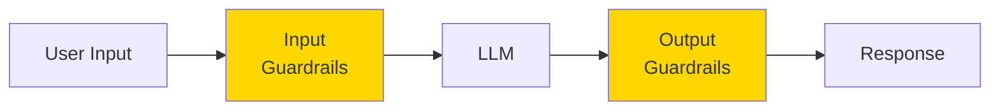
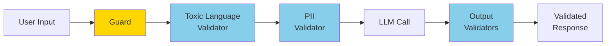
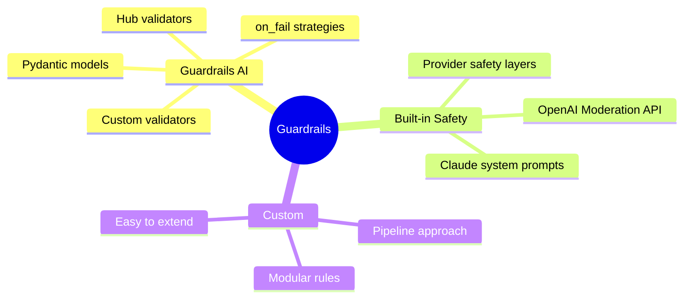

# LLM Guardrails

Guardrails keep AI systems safe, on-topic, and predictable. They validate inputs before they reach the LLM and sanitize outputs before they reach the user.

> **Coming from Software Engineering?** Guardrails are middleware — just like Express middleware validates requests before they hit your route handler, guardrails validate inputs and outputs before they reach the LLM or the user. If you've written request validation middleware (checking auth tokens, sanitizing input, rate limiting), you've built a simpler version of this. Guardrails AI adds a declarative validator layer on top, similar to how WAF rules or API gateway policies work.

---

## What are Guardrails?



Guardrails provide:
- **Topic control**: Keep conversations on-topic
- **Safety filters**: Block harmful or toxic content
- **PII protection**: Detect and redact personal information
- **Format validation**: Ensure structured outputs
- **Action control**: Limit what agents can do

---

## Guardrails AI

Guardrails AI is the leading open-source framework for adding input/output validation to LLM applications. It provides a hub of pre-built validators and integrates directly into your LLM calls.

### Installation

```bash
pip install guardrails-ai
guardrails hub install hub://guardrails/toxic_language
guardrails hub install hub://guardrails/detect_pii
guardrails hub install hub://guardrails/restrict_to_topic
```

### Core Concept: Guards and Validators

A `Guard` wraps your LLM call and runs validators on input and output. Validators come from the Guardrails Hub — a registry of community and official validators.



### Basic Input/Output Validation

```python
# script_id: day_064_llm_guardrails/basic_input_output_validation
import openai
from guardrails import Guard
from guardrails.hub import ToxicLanguage, DetectPII, RestrictToTopic

# Input validation guard
input_guard = Guard().use_many(
    ToxicLanguage(on_fail="exception"),
    DetectPII(["EMAIL", "PHONE"], on_fail="fix"),
)

# Use with LLM — the guard wraps the API call
result = input_guard(
    llm_api=openai.chat.completions.create,
    model="gpt-4o-mini",
    messages=[{"role": "user", "content": user_input}],
)

print(result.validated_output)
```

**`on_fail` strategies:**

| Strategy    | Behavior                                  |
|-------------|-------------------------------------------|
| `exception` | Raise an error, block the request         |
| `fix`       | Attempt to fix the issue automatically    |
| `reask`     | Ask the LLM to regenerate its response    |
| `noop`      | Log but allow through                     |
| `filter`    | Remove the failing content                |

### Structured Output Validation

Guardrails AI works with Pydantic models to enforce structured outputs:

```python
# script_id: day_064_llm_guardrails/structured_output_validation
from guardrails import Guard
from pydantic import BaseModel, Field
from typing import List

class ProductReview(BaseModel):
    product_name: str = Field(description="Name of the product")
    rating: float = Field(ge=1, le=5, description="Rating from 1 to 5")
    pros: List[str] = Field(min_length=1, description="List of pros")
    cons: List[str] = Field(description="List of cons")
    summary: str = Field(max_length=200, description="Brief summary")

guard = Guard.from_pydantic(ProductReview)

result = guard(
    llm_api=openai.chat.completions.create,
    model="gpt-4o-mini",
    messages=[{
        "role": "user",
        "content": "Review the Sony WH-1000XM5 headphones."
    }],
)

# result.validated_output is a validated dict matching ProductReview
print(result.validated_output["rating"])
print(result.validated_output["pros"])
```

### Topic Restriction

```python
# script_id: day_064_llm_guardrails/topic_restriction
from guardrails import Guard
from guardrails.hub import RestrictToTopic

guard = Guard().use(
    RestrictToTopic(
        valid_topics=["programming", "technology", "software engineering"],
        invalid_topics=["politics", "religion", "medical advice"],
        on_fail="exception",
    )
)

# This passes
result = guard.validate("How do I implement a binary search tree?")

# This raises an exception
result = guard.validate("What's your opinion on the election?")
```

### Custom Validators

```python
# script_id: day_064_llm_guardrails/custom_validator
from guardrails.validators import Validator, register_validator
from typing import Any, Dict, List

@register_validator("no-competitor-mention", data_type="string")
class NoCompetitorMention(Validator):
    """Block mentions of competitor names."""

    def __init__(self, competitors: List[str], on_fail: str = "fix"):
        super().__init__(on_fail=on_fail)
        self.competitors = [c.lower() for c in competitors]

    def validate(self, value: Any, metadata: Dict) -> Any:
        lower_value = value.lower()
        for competitor in self.competitors:
            if competitor in lower_value:
                raise ValueError(f"Competitor '{competitor}' mentioned in output")
        return value

    def fix(self, value: Any, metadata: Dict) -> Any:
        result = value
        for competitor in self.competitors:
            result = result.replace(competitor, "[competitor]")
            result = result.replace(competitor.title(), "[Competitor]")
        return result

# Usage
guard = Guard().use(
    NoCompetitorMention(
        competitors=["microsoft", "google", "amazon"],
        on_fail="fix"
    )
)

result = guard.validate("Our product is better than Microsoft's solution")
print(result.validated_output)
# "Our product is better than [Competitor]'s solution"
```

---

## Built-in Model Safety APIs

Before reaching for a framework, consider the safety features already built into major LLM providers. These are lightweight, require no extra dependencies, and handle common moderation needs.

### OpenAI Moderation API

OpenAI provides a free moderation endpoint that classifies text across safety categories:

```python
# script_id: day_064_llm_guardrails/openai_moderation
from openai import OpenAI

client = OpenAI()

def check_moderation(text: str) -> dict:
    """Check text against OpenAI's moderation categories."""
    response = client.moderations.create(input=text)
    result = response.results[0]

    if result.flagged:
        # Identify which categories were triggered
        triggered = [
            category for category, flagged
            in result.categories.model_dump().items()
            if flagged
        ]
        return {"safe": False, "categories": triggered}

    return {"safe": True, "categories": []}

# Use as a pre-check before LLM calls
user_input = "How do I write a Python function?"
moderation = check_moderation(user_input)

if not moderation["safe"]:
    print(f"Blocked: {moderation['categories']}")
else:
    # Proceed with LLM call
    response = client.chat.completions.create(
        model="gpt-4o-mini",
        messages=[{"role": "user", "content": user_input}]
    )
```

**Categories detected:** hate, harassment, self-harm, sexual, violence, and their "graphic" sub-categories.

### Claude System Prompt Guardrails

Anthropic's Claude has strong built-in safety, and you can reinforce it with system prompt instructions:

```python
# script_id: day_064_llm_guardrails/claude_system_guardrails
from anthropic import Anthropic

client = Anthropic()

response = client.messages.create(
    model="claude-sonnet-4-6",
    max_tokens=1024,
    system="""You are a helpful programming assistant.

GUARDRAILS:
- Only answer questions about programming, software engineering, and technology.
- If asked about topics outside your scope, politely decline.
- Never include personal information (emails, phone numbers, addresses) in responses.
- Do not generate code that could be used for hacking or exploitation.
- Keep responses concise and under 500 words.""",
    messages=[{"role": "user", "content": user_input}]
)
```

### When to Use What

| Approach | Best For | Tradeoffs |
|----------|----------|-----------|
| **System prompt rules** | Simple topic/behavior constraints | No enforcement guarantee; LLM can ignore |
| **OpenAI Moderation API** | Content safety screening | Limited to safety categories; no custom rules |
| **Guardrails AI** | Structured validation, PII, custom rules | Extra dependency; adds latency per validator |

---

## Combining Guardrails with Agents

```python
# script_id: day_064_llm_guardrails/guarded_agent
import openai
from guardrails import Guard
from guardrails.hub import ToxicLanguage, DetectPII

class GuardedAgent:
    """Agent with layered guardrails on input and output."""

    def __init__(self):
        self.client = openai.OpenAI()

        # Input: block toxic content, redact PII
        self.input_guard = Guard().use_many(
            ToxicLanguage(on_fail="exception"),
            DetectPII(["EMAIL", "PHONE", "SSN"], on_fail="fix"),
        )

        # Output: clean PII leaks, enforce length
        self.output_guard = Guard().use_many(
            DetectPII(["EMAIL", "PHONE", "SSN"], on_fail="fix"),
            ToxicLanguage(on_fail="fix"),
        )

    def generate(self, user_input: str) -> str:
        """Generate a guarded response."""

        # Validate input
        try:
            input_result = self.input_guard.validate(user_input)
            clean_input = input_result.validated_output
        except Exception as e:
            return f"I can't process that request: {e}"

        # Call LLM
        response = self.client.chat.completions.create(
            model="gpt-4o-mini",
            messages=[{"role": "user", "content": clean_input}]
        )
        raw_output = response.choices[0].message.content

        # Validate output
        output_result = self.output_guard.validate(raw_output)
        return output_result.validated_output

# Usage
agent = GuardedAgent()
print(agent.generate("How do I write a Python function?"))
```

---

## Historical Context: NeMo Guardrails

NVIDIA developed NeMo Guardrails as an early framework for adding programmable guardrails to LLM applications. It used a custom language called **Colang** to define conversational flows and rules declaratively -- you would write dialog patterns specifying how the bot should respond to certain user intents, and the framework would enforce those flows at runtime.

NeMo Guardrails was notable for its dialog-flow approach to safety: rather than validating individual strings, it modeled entire conversation trajectories. This made it powerful for complex multi-turn guardrail scenarios. However, the Colang language had a steep learning curve and the framework required significant configuration overhead compared to simpler validation-based approaches.

As of 2025, NeMo Guardrails and Colang are in **maintenance mode** and are not recommended for new projects. The ecosystem has moved toward validator-based frameworks like Guardrails AI, which offer a more composable and Pythonic approach. If you encounter NeMo Guardrails in existing codebases, consider migrating to Guardrails AI or built-in provider safety APIs.

## Checkpoint

Run the `NoCompetitorMention` custom-validator example and confirm `result.validated_output` comes back as `"Our product is better than [Competitor]'s solution"` — the competitor name swapped out by the `fix` path. If the original "Microsoft" survives, your `validate`/`fix` casing isn't covering the title-case form; if it raises instead of fixing, you passed `on_fail="exception"` rather than `on_fail="fix"`.

---

## Summary



**Key takeaways:**
- **Guardrails AI** is the go-to framework -- use Hub validators for common checks (toxicity, PII, topic) and Pydantic models for structured output
- **Built-in model safety** (OpenAI Moderation API, Claude system prompts) covers basic content moderation with zero extra dependencies
- Layer your guardrails: system prompt constraints + moderation API + framework validators for defense in depth
- Always validate both **input** (what the user sends) and **output** (what the LLM returns)

---

## Quick Reference

```python
# script_id: day_064_llm_guardrails/quick_reference
# fragment: illustrative cheat-sheet / not standalone-runnable
# Guardrails AI — input/output validation
from guardrails import Guard
from guardrails.hub import ToxicLanguage, DetectPII

guard = Guard().use_many(ToxicLanguage(on_fail="exception"), DetectPII(on_fail="fix"))
result = guard(llm_api=openai.chat.completions.create, model="gpt-4o-mini", messages=[...])

# Guardrails AI — structured output
guard = Guard.from_pydantic(MyModel)
result = guard(llm_api=..., messages=[...])

# OpenAI Moderation API
response = client.moderations.create(input=text)
flagged = response.results[0].flagged

# Claude system prompt guardrails
response = client.messages.create(model="claude-sonnet-4-6", system="GUARDRAILS: ...", ...)
```

---

## Exercises

1. Write a custom validator `MaxSentences` (subclass `Validator`) that fails when output exceeds N sentences, with an `on_fail="fix"` that truncates to N. Wire it into a `Guard`.
2. Add a `RestrictToTopic` guard to `GuardedAgent` so it only answers programming questions, and confirm an off-topic question is refused with a clear message.
3. Compare the three approaches from the "When to Use What" table on the same toxic input: system-prompt rule, OpenAI Moderation API, and a Guardrails `ToxicLanguage` validator. Note which block it and which let it through.
4. Layer a Claude system-prompt guardrail (using `claude-sonnet-4-6`) in front of the OpenAI Moderation API as a two-stage check, and log which stage rejected a bad input.

<details><summary>Solutions (approaches)</summary>

1. ```text
   @register_validator("max-sentences", data_type="string")
   class MaxSentences(Validator):
       def __init__(self, n, on_fail="fix"):
           super().__init__(on_fail=on_fail); self.n = n
       def validate(self, value, metadata):
           if value.count(".") > self.n: raise ValueError("too long")
           return value
       def fix(self, value, metadata):
           return ".".join(value.split(".")[: self.n]) + "."
   ```
2. Add `RestrictToTopic(valid_topics=["programming"], on_fail="exception")` to `input_guard`; catch the exception in `generate` and return the refusal string.
3. Feed one toxic sentence to each path; expect Moderation API and `ToxicLanguage` to flag it, while a bare system-prompt rule may or may not, depending on the model.
4. Call Claude with a GUARDRAILS system prompt first; if it declines, stop. Otherwise run `client.moderations.create`. Record `rejected_by = "claude"` or `"moderation"`.
</details>

---

## What's Next?

Now let's learn about **Safe Sandboxing** - containerizing agent code execution for security!
