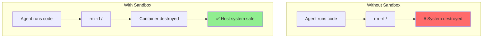
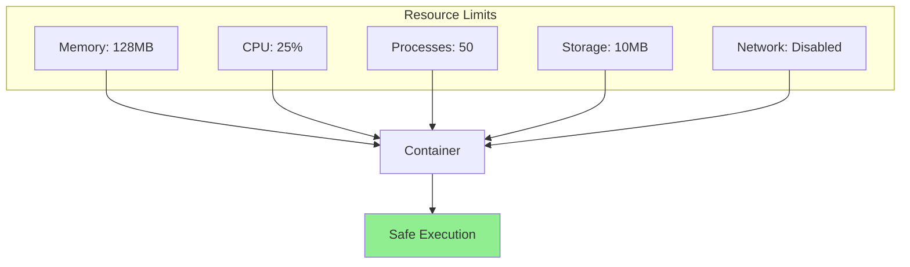
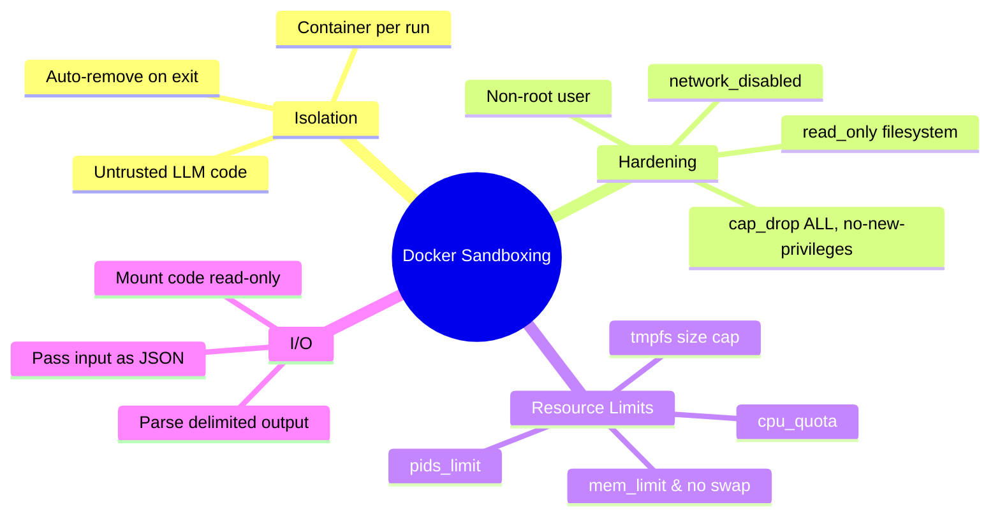

# Safe Sandboxing with Docker — Part 1: Isolation & Resource Limits

When agents execute code, they need a safe environment. In this guide, you'll learn to sandbox agent execution with Docker and cap its resources; protecting API keys gets its own treatment in Part 2.

> **Coming from Software Engineering?** You already know Docker — this is using it the same way CI/CD systems do: spin up an isolated container, run untrusted code inside it, capture the output, tear it down. The difference is the "untrusted code" is generated by an LLM at runtime rather than written by a developer. Your Docker, resource limiting, and security hardening skills transfer completely.

---

## Why Sandboxing Matters



Risks of unsandboxed code execution:
- **File system access** - Delete or modify important files
- **Network access** - Make unauthorized requests
- **Resource exhaustion** - Infinite loops, memory bombs
- **Data exfiltration** - Steal sensitive information
- **Privilege escalation** - Gain system access

---

## Docker Basics for Sandboxing

Docker creates isolated containers that protect your host system:

```bash
# Install Docker (if not installed)
# macOS: brew install --cask docker  # Docker Desktop (includes the daemon)
# Ubuntu: apt install docker.io
# Windows: Download Docker Desktop

# Verify installation
docker --version

# Python SDK the code below imports:
pip install docker
# Note: `docker --version` checks the engine; `pip install docker` installs the Python client the code imports.
```

### Your First Sandbox

```python
# script_id: day_065_docker_sandboxing_part1/basic_sandbox
import docker
import tempfile
import os
import shutil
import requests  # docker-py raises requests.exceptions.ReadTimeout on wait() timeout

def run_code_in_sandbox(code: str, timeout: int = 30) -> dict:
    """
    Run Python code safely in a Docker container.

    Args:
        code: Python code to execute
        timeout: Maximum execution time in seconds

    Returns:
        dict with stdout, stderr, and exit code
    """

    # Initialize Docker client
    client = docker.from_env()

    # Write the code to a file LITERALLY named script.py inside a temp directory,
    # then mount that directory at /code. (NamedTemporaryFile would give a random
    # name like tmpXXXX.py, which wouldn't match the `python /code/script.py`
    # command — the container would fail with "can't open file '/code/script.py'".)
    tmp_dir = tempfile.mkdtemp()
    code_file = os.path.join(tmp_dir, "script.py")
    with open(code_file, "w") as f:
        f.write(code)

    container = None
    try:
        # Run detached so we can enforce a wall-clock timeout. The blocking
        # form of run() has no kwarg that kills a hung container — only the
        # detached form + container.wait(timeout=...) can do that.
        container = client.containers.run(
            image="python:3.11-slim",
            command=["python", "/code/script.py"],
            volumes={
                tmp_dir: {'bind': '/code', 'mode': 'ro'}
            },
            working_dir="/code",
            detach=True,
            mem_limit="256m",  # Limit memory
            network_disabled=True,  # No network access
            read_only=True,  # Read-only filesystem
        )

        # wait(timeout=...) only abandons our wait; it does NOT stop the
        # container. On expiry docker-py raises requests.exceptions.ReadTimeout,
        # so we catch it and kill the still-running container ourselves.
        result = container.wait(timeout=timeout)
        logs = container.logs().decode('utf-8')

        # A program that errors out (non-zero exit) prints its traceback to the
        # container's logs and reports a non-zero StatusCode — that's where
        # Exercise 2's failing write surfaces, not the success path below.
        return {
            "stdout": logs,
            "stderr": "" if result['StatusCode'] == 0 else logs,
            "exit_code": result['StatusCode']
        }

    except requests.exceptions.ReadTimeout:
        if container is not None:
            container.kill()
        return {
            "stdout": "",
            "stderr": f"Execution exceeded {timeout}s and was killed.",
            "exit_code": -1
        }
    except docker.errors.APIError as e:
        return {
            "stdout": "",
            "stderr": str(e),
            "exit_code": -1
        }
    finally:
        # Force-remove the container (it's no longer auto-removed) and clean
        # up the temp directory and its contents.
        if container is not None:
            try:
                container.remove(force=True)
            except Exception:
                pass
        shutil.rmtree(tmp_dir, ignore_errors=True)

# Example usage
code = """
print("Hello from sandbox!")
print(2 + 2)
"""

result = run_code_in_sandbox(code)
print(f"Output: {result['stdout']}")
print(f"Exit code: {result['exit_code']}")
```

---

## Building a Secure Sandbox Image

Create a custom Docker image with security restrictions:

```dockerfile
# Dockerfile.sandbox
FROM python:3.11-slim

# Create non-root user
RUN useradd -m -s /bin/bash sandbox

# Install common packages
RUN pip install --no-cache-dir \
    numpy \
    pandas \
    matplotlib \
    requests

# Remove dangerous packages
RUN pip uninstall -y pip setuptools wheel

# Set working directory
WORKDIR /sandbox

# Switch to non-root user
USER sandbox

# Default command
CMD ["python"]
```

Build and use the image:

```bash
docker build -t sandbox:latest -f Dockerfile.sandbox .
```

`run_in_secure_sandbox` below uses `image="sandbox:latest"`, so this build step is a prerequisite for that function; the earlier examples use the public `python:3.11-slim` and need no build.

```python
# script_id: day_065_docker_sandboxing_part1/secure_sandbox
import docker
import tempfile
import os
import requests

def run_in_secure_sandbox(code: str, timeout: int = 30) -> dict:
    """Run code in a custom secure sandbox."""

    client = docker.from_env()

    # Write code to temp file
    with tempfile.NamedTemporaryFile(mode='w', suffix='.py', delete=False) as f:
        f.write(code)
        code_file = f.name

    container = None
    try:
        container = client.containers.run(
            image="sandbox:latest",  # Our custom image
            # Reference the temp file's real basename (NamedTemporaryFile names
            # it randomly, e.g. tmpXXXX.py — it is NOT "script.py").
            command=["python", f"/sandbox/{os.path.basename(code_file)}"],
            volumes={
                os.path.dirname(code_file): {'bind': '/sandbox', 'mode': 'ro'}
            },
            detach=True,
            mem_limit="512m",
            memswap_limit="512m",  # No swap
            cpu_period=100000,
            cpu_quota=50000,  # 50% of one CPU
            network_disabled=True,
            read_only=True,
            security_opt=["no-new-privileges"],
            cap_drop=["ALL"],  # Drop all capabilities
        )

        # Wait for completion with timeout. wait(timeout=...) only abandons our
        # wait; it does NOT stop the container, so on a hang we kill it ourselves.
        result = container.wait(timeout=timeout)
        logs = container.logs()

        return {
            "stdout": logs.decode('utf-8'),
            "exit_code": result['StatusCode']
        }

    except requests.exceptions.ReadTimeout:
        if container is not None:
            container.kill()
        return {"error": f"Execution exceeded {timeout}s and was killed."}
    except Exception as e:
        return {"error": str(e)}
    finally:
        # Force-remove the container (detached containers aren't auto-removed)
        # and clean up the temp file.
        if container is not None:
            try:
                container.remove(force=True)
            except Exception:
                pass
        os.unlink(code_file)
```

---

## Container Resource Limits

Prevent resource exhaustion attacks:

```python
# script_id: day_065_docker_sandboxing_part1/resource_limits
import docker

def create_limited_container(code: str) -> dict:
    """Create container with strict resource limits."""

    client = docker.from_env()

    container_config = {
        "image": "python:3.11-slim",
        "command": ["python", "-c", code],

        # Memory limits
        "mem_limit": "128m",       # Max 128MB RAM
        "memswap_limit": "128m",   # No swap

        # CPU limits
        "cpu_period": 100000,
        "cpu_quota": 25000,        # 25% of one CPU
        "cpu_shares": 256,         # Low priority

        # Process limits
        "pids_limit": 50,          # Max 50 processes

        # Storage limits
        "read_only": True,
        "tmpfs": {"/tmp": "size=10m"},  # 10MB temp space

        # Network
        "network_disabled": True,

        # Security
        "security_opt": ["no-new-privileges"],
        "cap_drop": ["ALL"],

        # Auto cleanup
        "remove": True,
    }

    try:
        result = client.containers.run(**container_config)
        return {"output": result.decode('utf-8')}
    except docker.errors.ContainerError as e:
        return {"error": str(e)}
```



---

## Input/Output Handling

Safely pass data to and from sandboxed code:

You can't hand a Python object across the container boundary, so the input is serialized to JSON and baked into the script as a constant. The result comes back the same way: the code prints it wrapped in unique marker strings, and the host slices them back out of stdout — the same trick as parsing a known delimiter out of a subprocess's stdout. One caveat: if the user's own code prints those marker strings, the parser would pick up the wrong section.

```python
# script_id: day_065_docker_sandboxing_part1/sandbox_io
import json
import docker
import tempfile
import os

class SandboxIO:
    """Handle input/output with sandboxed code."""

    def __init__(self):
        self.client = docker.from_env()

    def run_with_data(self, code: str, input_data: dict) -> dict:
        """
        Run code with input data and capture structured output.

        Args:
            code: Python code to execute
            input_data: Data to pass to the code

        Returns:
            Output data from the code
        """

        # Wrap code to handle I/O
        wrapped_code = f'''
import json
import sys

# Input data (passed from host)
INPUT_DATA = {json.dumps(input_data)}

# User code
{code}

# Capture output if 'result' variable exists
if 'result' in dir():
    print("__OUTPUT_START__")
    print(json.dumps(result))
    print("__OUTPUT_END__")
'''

        result = self._execute(wrapped_code)

        # Parse output
        if "__OUTPUT_START__" in result.get("stdout", ""):
            output_section = result["stdout"].split("__OUTPUT_START__")[1]
            output_section = output_section.split("__OUTPUT_END__")[0].strip()
            try:
                result["data"] = json.loads(output_section)
            except json.JSONDecodeError:
                result["data"] = None

        return result

    def _execute(self, code: str) -> dict:
        """Execute code in container."""

        with tempfile.NamedTemporaryFile(mode='w', suffix='.py', delete=False) as f:
            f.write(code)
            code_path = f.name

        try:
            output = self.client.containers.run(
                image="python:3.11-slim",
                # Use the temp file's actual basename (it's not literally "script.py")
                command=["python", f"/code/{os.path.basename(code_path)}"],
                volumes={os.path.dirname(code_path): {'bind': '/code', 'mode': 'ro'}},
                remove=True,
                network_disabled=True,
                mem_limit="128m"
            )
            return {"stdout": output.decode('utf-8'), "exit_code": 0}
        except docker.errors.ContainerError as e:
            return {"stderr": str(e), "exit_code": e.exit_status}
        finally:
            os.unlink(code_path)

# Example usage
sandbox = SandboxIO()

code = """
# Access input data
numbers = INPUT_DATA['numbers']

# Process
result = {
    'sum': sum(numbers),
    'average': sum(numbers) / len(numbers),
    'count': len(numbers)
}
"""

output = sandbox.run_with_data(code, {"numbers": [1, 2, 3, 4, 5]})
print(f"Result: {output.get('data')}")
# Result: {'sum': 15, 'average': 3.0, 'count': 5}
```

## Checkpoint

Run the `run_code_in_sandbox(...)` example with Docker running and confirm `result["stdout"]` contains "Hello from sandbox!" and "4", with `exit_code` 0. If you get a "Cannot connect to the Docker daemon" error, Docker Desktop (or the `docker` daemon) isn't started — that's the prerequisite, not a bug in the code. A non-zero exit code with empty stdout usually means the sandbox image failed to build or pull.

---

## Summary



---

## Quick Reference

| Setting | Purpose |
|---|---|
| `remove=True` | Auto-delete container after it exits |
| `network_disabled=True` | No outbound/inbound network |
| `read_only=True` | Immutable root filesystem |
| `mem_limit` / `memswap_limit` | Cap RAM; equal values disable swap |
| `cpu_period` + `cpu_quota` | Limit CPU (quota/period = fraction of one core) |
| `pids_limit` | Cap process count (stops fork bombs) |
| `tmpfs={"/tmp": "size=10m"}` | Small writable scratch space |
| `cap_drop=["ALL"]` | Drop all Linux capabilities |
| `security_opt=["no-new-privileges"]` | Block privilege escalation |

Tips:
- Mount the code directory as `mode: 'ro'` so the running code can't rewrite its own script.
- A timeout is not optional — pair `detach=True` with `container.wait(timeout=...)`. Note that `wait(timeout=...)` only abandons the client's wait and does NOT stop the container, so catch `requests.exceptions.ReadTimeout`, then `container.kill()` and `container.remove(force=True)` to actually terminate a hung program.

---

## Exercises

1. Take `run_code_in_sandbox` and submit code with an infinite loop (`while True: pass`). Confirm the timeout fires AND that you explicitly `kill()` + `remove(force=True)` the still-running container, rather than letting it hang your process or leak.
2. Submit code that tries `open("/etc/passwd", "w")`. With `read_only=True` it should fail — verify the error surfaces in `stderr`, then explain why read-only is a stronger control than trusting the code.
3. Add a `cpu_quota` and `pids_limit` to `run_code_in_sandbox` (it currently sets neither) and test with a small fork bomb to confirm the process cap holds.
4. Extend `SandboxIO.run_with_data` to also return how long execution took, by timestamping before and after the `_execute` call.

<details><summary>Solutions (approaches)</summary>

1. `container.wait(timeout=...)` raises `requests.exceptions.ReadTimeout`, but the container keeps running — `wait`'s timeout is only the client's HTTP request timeout. Catch `requests.exceptions.ReadTimeout`, call `container.kill()`, return an error dict, and force-remove the container in the `finally` block (`container.remove(force=True)`).
2. `read_only=True` makes the write raise `OSError`; it's stronger because it's enforced by the kernel/container runtime, not by hoping the LLM-generated code behaves.
3. Add `cpu_period=100000, cpu_quota=25000, pids_limit=50` to the `run(...)` call; the fork bomb hits the pid cap and fails instead of exhausting the host.
4. ```text
   import time
   t0 = time.time()
   result = self._execute(wrapped_code)
   result["elapsed_s"] = round(time.time() - t0, 3)
   ```
</details>

---

## What's Next?

This covered isolation and resource limits. Next up: **Docker Sandboxing Part 2** — injecting secrets into containers without writing them to disk, pulling credentials from secret managers (AWS Secrets Manager, Vault), and assembling a production-ready `SecureSandbox` with auditing.
