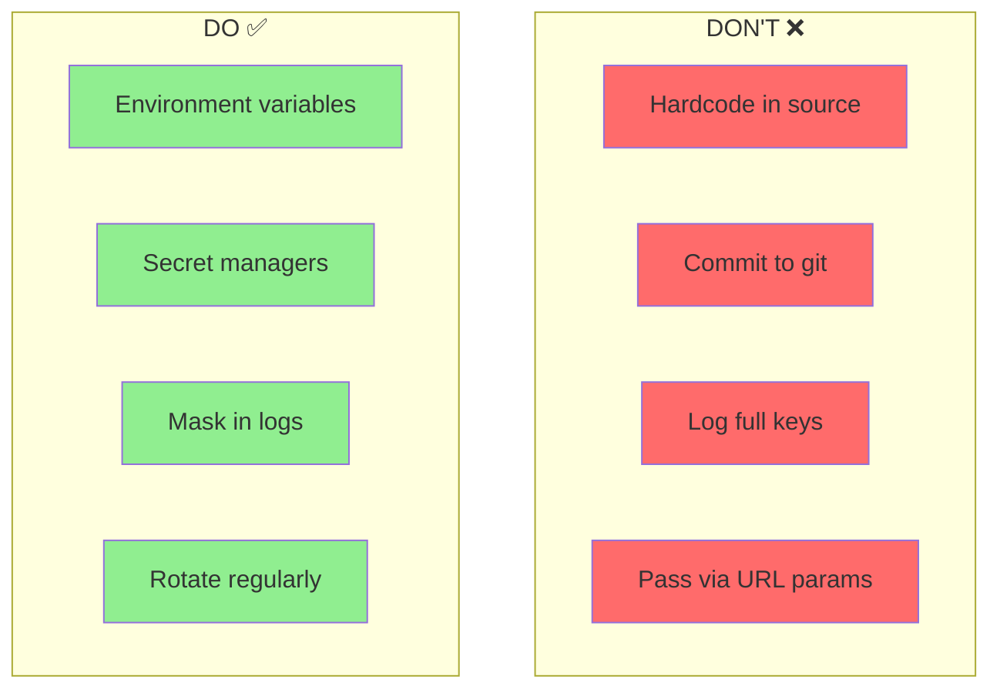
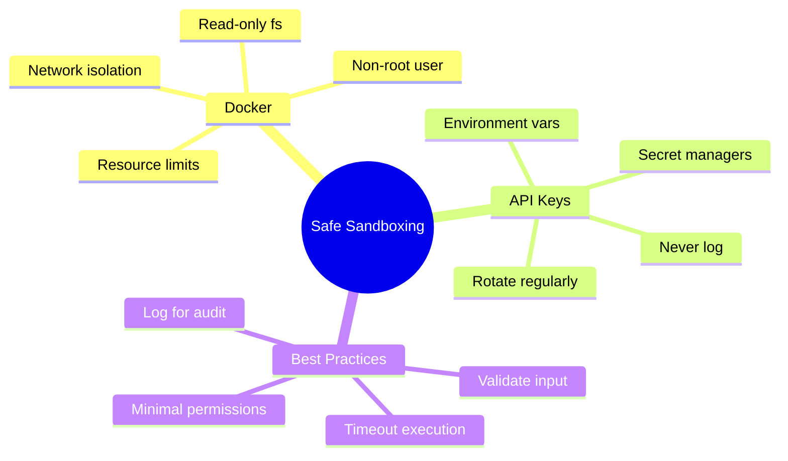

# Docker Sandboxing — Part 2: Injecting Secrets & a Production SecureSandbox

> **Coming from Software Engineering?** Everything in this section is standard secrets management — the same practices you follow for database passwords, cloud credentials, and service tokens. Environment variables, secrets managers (Vault, AWS Secrets Manager), and never logging credentials are all practices you already know. The AI-specific twist: agents may try to *include* API keys in their output or tool calls, so you need output filtering too.

In Part 1 (Day 065) you built the sandbox container itself — resource limits, network isolation, dropped capabilities. Part 2 adds the secrets layer and assembles the full SecureSandbox.

## API Key Security

Never expose API keys in agent code or logs!

### Environment Variable Pattern

```python
# script_id: day_066_docker_sandboxing_part2/secure_api_client
import os
from typing import Optional

class SecureAPIClient:
    """API client that securely handles credentials."""

    def __init__(self):
        self.api_key = self._load_api_key()

    def _load_api_key(self) -> str:
        """Load API key from secure source."""

        # Priority: Environment variable > Secret file > Error
        api_key = os.environ.get("OPENAI_API_KEY")

        if not api_key:
            secret_path = os.path.expanduser("~/.secrets/openai_key")
            if os.path.exists(secret_path):
                with open(secret_path, 'r') as f:
                    api_key = f.read().strip()

        if not api_key:
            raise ValueError(
                "API key not found! Set OPENAI_API_KEY environment variable "
                "or create ~/.secrets/openai_key"
            )

        return api_key

    def get_masked_key(self) -> str:
        """Return masked version for logging."""
        if len(self.api_key) > 8:
            return self.api_key[:4] + "****" + self.api_key[-4:]
        return "****"

# Usage
client = SecureAPIClient()
print(f"Using API key: {client.get_masked_key()}")  # sk-ab****wxyz
```

### Secret Injection for Containers

```python
# script_id: day_066_docker_sandboxing_part2/secret_injection
import docker
import os
import tempfile

def run_with_secrets(code: str, secrets: dict) -> dict:
    """
    Run code with secrets injected as environment variables.

    Secrets are NEVER written to disk or logs!
    """

    client = docker.from_env()

    with tempfile.NamedTemporaryFile(mode='w', suffix='.py', delete=False) as f:
        f.write(code)
        code_path = f.name

    try:
        # Inject secrets as environment variables
        result = client.containers.run(
            image="python:3.11-slim",
            # Use the temp file's actual basename (it's not literally "script.py")
            command=["python", f"/code/{os.path.basename(code_path)}"],
            volumes={os.path.dirname(code_path): {'bind': '/code', 'mode': 'ro'}},
            environment=secrets,  # Secrets passed here
            remove=True,
            mem_limit="128m"
        )
        return {"output": result.decode('utf-8')}
    except docker.errors.ContainerError as e:
        return {"error": str(e)}
    finally:
        os.unlink(code_path)

# Usage - secrets never touch disk!
code = """
import os
api_key = os.environ.get('API_KEY')
print(f"API key loaded: {'Yes' if api_key else 'No'}")
# Do something with API key...
"""

result = run_with_secrets(code, {"API_KEY": "sk-secret-key-here"})
```

### Secrets Management Best Practices



---

## Using Secret Managers

For production, use dedicated secret management:

### AWS Secrets Manager

```python
# script_id: day_066_docker_sandboxing_part2/aws_secrets_manager
import boto3
import json

def get_secret(secret_name: str, region: str = "us-east-1") -> dict:
    """Retrieve secret from AWS Secrets Manager."""

    client = boto3.client('secretsmanager', region_name=region)

    try:
        response = client.get_secret_value(SecretId=secret_name)
        return json.loads(response['SecretString'])
    except Exception as e:
        raise ValueError(f"Failed to retrieve secret: {e}")

# Usage
secrets = get_secret("my-app/api-keys")
openai_key = secrets["OPENAI_API_KEY"]
```

### HashiCorp Vault

```python
# script_id: day_066_docker_sandboxing_part2/hashicorp_vault
import hvac
import os

def get_vault_secret(path: str, vault_url: str = "http://localhost:8200") -> dict:
    """Retrieve secret from HashiCorp Vault."""

    client = hvac.Client(url=vault_url)
    client.token = os.environ.get("VAULT_TOKEN")

    secret = client.secrets.kv.v2.read_secret_version(path=path)
    return secret['data']['data']

# Usage
secrets = get_vault_secret("secret/my-app")
api_key = secrets["api_key"]
```

### Local Development with .env

```python
# script_id: day_066_docker_sandboxing_part2/dotenv_loading
# .env file (add to .gitignore!)
# OPENAI_API_KEY=sk-your-key-here

from dotenv import load_dotenv
import os

# Load environment variables from .env
load_dotenv()

# Now access normally
api_key = os.environ.get("OPENAI_API_KEY")
```

---

## Complete Secure Sandbox System

Putting it all together:

```python
# script_id: day_066_docker_sandboxing_part2/secure_sandbox_system
import docker
import tempfile
import os
import json
import hashlib
from datetime import datetime
from typing import Optional

class SecureSandbox:
    """Production-ready secure code execution sandbox."""

    def __init__(self,
                 image: str = "python:3.11-slim",
                 max_memory: str = "256m",
                 max_cpu: float = 0.5,
                 timeout: int = 30):

        self.client = docker.from_env()
        self.image = image
        self.max_memory = max_memory
        self.max_cpu = max_cpu
        self.timeout = timeout
        self.execution_log = []

    def execute(self,
                code: str,
                input_data: Optional[dict] = None,
                allowed_packages: list = None) -> dict:
        """
        Execute code safely in a sandboxed container.

        Args:
            code: Python code to execute
            input_data: Data to pass to the code
            allowed_packages: List of allowed import statements

        Returns:
            Execution result with output, errors, and metadata
        """

        # Validate code (basic checks)
        validation = self._validate_code(code, allowed_packages)
        if not validation["valid"]:
            return {"error": validation["reason"], "executed": False}

        # Prepare execution
        execution_id = self._generate_execution_id(code)
        wrapped_code = self._wrap_code(code, input_data)

        # Create temp file
        with tempfile.NamedTemporaryFile(mode='w', suffix='.py', delete=False) as f:
            f.write(wrapped_code)
            code_path = f.name

        start_time = datetime.now()
        container = None

        try:
            container = self.client.containers.run(
                image=self.image,
                # Use the temp file's actual basename (it's not literally "script.py")
                command=["python", f"/sandbox/{os.path.basename(code_path)}"],
                volumes={
                    os.path.dirname(code_path): {'bind': '/sandbox', 'mode': 'ro'}
                },
                detach=True,
                mem_limit=self.max_memory,
                memswap_limit=self.max_memory,
                cpu_period=100000,
                cpu_quota=int(self.max_cpu * 100000),
                network_disabled=True,
                read_only=True,
                tmpfs={"/tmp": "size=10m,mode=1777"},
                security_opt=["no-new-privileges"],
                cap_drop=["ALL"],
            )

            # Wait with timeout
            result = container.wait(timeout=self.timeout)
            logs = container.logs().decode('utf-8')
            exit_code = result['StatusCode']

            execution_time = (datetime.now() - start_time).total_seconds()

            # Parse output
            output = self._parse_output(logs)

            result = {
                "execution_id": execution_id,
                "executed": True,
                "exit_code": exit_code,
                "stdout": output.get("stdout", ""),
                "data": output.get("data"),
                "execution_time": execution_time,
                "success": exit_code == 0
            }

        except docker.errors.ContainerError as e:
            result = {
                "execution_id": execution_id,
                "executed": True,
                "exit_code": e.exit_status,
                "error": str(e),
                "success": False
            }
        except Exception as e:
            result = {
                "execution_id": execution_id,
                "executed": False,
                "error": str(e),
                "success": False
            }
        finally:
            # wait(timeout=...) bounds how long we wait for logs, not the
            # container itself, so always tear it down here — a hung or
            # timed-out container is killed and removed regardless of outcome.
            if container is not None:
                try:
                    container.kill()
                except Exception:
                    pass  # already stopped
                try:
                    container.remove(force=True)
                except Exception:
                    pass
            os.unlink(code_path)

        # Log execution
        self._log_execution(result)

        return result

    def _validate_code(self, code: str, allowed_packages: list = None) -> dict:
        """Basic code validation."""

        dangerous_patterns = [
            "subprocess",
            "os.system",
            "eval(",
            "exec(",
            "__import__",
            "open(",  # Can be allowed selectively
        ]

        # Note: the default blocklist also rejects `open(`, so plain file I/O
        # fails this static check — relax this list per use case. The container's
        # read-only filesystem is the real guard, not the substring check.
        for pattern in dangerous_patterns:
            if pattern in code:
                return {"valid": False, "reason": f"Forbidden pattern: {pattern}"}

        return {"valid": True}

    def _wrap_code(self, code: str, input_data: Optional[dict]) -> str:
        """Wrap user code with I/O handling.

        To get structured data back out of the container we use a convention
        SWEs already know for cross-process I/O — the wrapper prints a sentinel
        marker (__RESULT_JSON__) followed by JSON, then the parent splits the
        logs on that marker. It also shadows print so it can both capture and
        forward output, and it agrees with the user code on one rule: assign
        your answer to a variable named `result`.
        """

        return f'''
import json
import sys

# Input data
INPUT_DATA = {json.dumps(input_data or {})}

# Capture print output
_original_print = print
_output_lines = []

def print(*args, **kwargs):
    import io
    output = io.StringIO()
    _original_print(*args, file=output, **kwargs)
    _output_lines.append(output.getvalue())
    _original_print(*args, **kwargs)

# User code
try:
{self._indent_code(code)}
except Exception as e:
    print(f"Error: {{e}}")
    sys.exit(1)

# Output result
if 'result' in dir():
    print("__RESULT_JSON__")
    print(json.dumps(result))
'''

    def _indent_code(self, code: str) -> str:
        """Indent code for wrapping."""
        return '\n'.join('    ' + line for line in code.split('\n'))

    def _parse_output(self, logs: str) -> dict:
        """Parse container output."""

        output = {"stdout": logs}

        if "__RESULT_JSON__" in logs:
            parts = logs.split("__RESULT_JSON__")
            output["stdout"] = parts[0].strip()
            try:
                output["data"] = json.loads(parts[1].strip())
            except:
                pass

        return output

    def _generate_execution_id(self, code: str) -> str:
        """Generate unique execution ID."""
        timestamp = datetime.now().isoformat()
        content = f"{timestamp}:{code}"
        return hashlib.sha256(content.encode()).hexdigest()[:12]

    def _log_execution(self, result: dict):
        """Log execution for auditing."""
        self.execution_log.append({
            "timestamp": datetime.now().isoformat(),
            **result
        })

# Usage
sandbox = SecureSandbox(
    max_memory="128m",
    max_cpu=0.25,
    timeout=10
)

# The sandbox injects INPUT_DATA for you, and returns whatever you assign to a variable named `result`.
code = """
numbers = INPUT_DATA.get('numbers', [])
result = {
    'sum': sum(numbers),
    'product': 1
}
for n in numbers:
    result['product'] *= n
print(f"Processed {len(numbers)} numbers")
"""

output = sandbox.execute(code, input_data={"numbers": [1, 2, 3, 4, 5]})
print(f"Success: {output['success']}")
print(f"Output: {output.get('stdout')}")
print(f"Result: {output.get('data')}")
```

## Checkpoint

With `OPENAI_API_KEY` exported, run the `SecureAPIClient` example and confirm `client.get_masked_key()` prints something like `sk-ab****wxyz` — first four and last four characters only, middle masked. If you instead see a `ValueError` about a missing key, the env var isn't set in the shell you're running from; if the full key prints unmasked, your `get_masked_key` is returning `self.api_key` directly instead of the sliced version.

If you have Docker running, also call `sandbox.execute(code, input_data={"numbers": [1, 2, 3, 4, 5]})` and confirm `output["success"]` is `True` and `output["data"]["sum"] == 15`. If Docker is not running you'll get an error from `docker.from_env()` instead — that's expected, and exercises only the masking-helper path above.

---

## Summary



---

## Quick Reference

```python
# script_id: day_066_docker_sandboxing_part2/quick_reference
# fragment: illustrative cheat-sheet / not standalone-runnable
# Basic Docker sandbox
result = client.containers.run(
    image="python:3.11-slim",
    command=["python", "-c", code],
    mem_limit="128m",
    network_disabled=True,
    read_only=True,
    remove=True
)

# Load API key safely
api_key = os.environ.get("API_KEY")

# Mask for logging
masked = key[:4] + "****" + key[-4:]

# Inject secrets to container
client.containers.run(
    environment={"API_KEY": secret_key},
    ...
)
```

---

## Security Checklist

Before deploying sandboxed execution:

- [ ] Memory limits set
- [ ] CPU limits set
- [ ] Network disabled
- [ ] Filesystem read-only
- [ ] Non-root user
- [ ] Capabilities dropped
- [ ] Timeout configured
- [ ] Input validation enabled
- [ ] API keys in environment variables
- [ ] Secrets never logged
- [ ] Execution auditing enabled

---

## Exercises

1. Use `run_with_secrets` to pass a fake `API_KEY` into a container, then prove the secret never lands on disk: the code is written to a temp file but the env var is not — inspect the temp file's contents to confirm.
2. `SecureSandbox._validate_code` does a naive substring check that both over-blocks (`open(` appears in `reopen(`) and under-blocks (obfuscated calls). Replace it with word-boundary regex and note one obfuscation that still gets through — motivating why container isolation matters more than static checks.
3. Add a `get_audit_log()` method to `SecureSandbox` that returns the `execution_log` with full keys/secrets stripped, suitable for shipping to a logging system.
4. Swap the hardcoded secret in `run_with_secrets` for one fetched via `get_secret` (AWS Secrets Manager) so no secret ever appears in source.

<details><summary>Solutions (approaches)</summary>

1. After the call, `open(code_path).read()` (before the `finally` deletes it) shows only the user code; the secret exists only in the container's `environment=`. Mask it if you log anything.
2. Use patterns like `r'\bos\.system\b'`, `r'\bsubprocess\b'`. Obfuscation such as `getattr(os, "sys"+"tem")` still passes — hence the container limits are the real boundary.
3. ```text
   def get_audit_log(self):
       return [{k: v for k, v in e.items() if k not in ("error",)} for e in self.execution_log]
   ```
   (Ensure no secret was ever placed into the log in the first place.)
4. `secrets = get_secret("my-app/api-keys"); run_with_secrets(code, {"API_KEY": secrets["OPENAI_API_KEY"]})`.
</details>

---

## What's Next?

You've locked down code execution and secrets (never hardcode keys — use environment variables or a secrets manager, rotate regularly, and scope to least privilege). Next up (Day 67): **PII & Data Privacy in RAG/Agents** — keeping users' personal data out of your chunks, embeddings, prompts, and logs, and being able to delete it on request.
