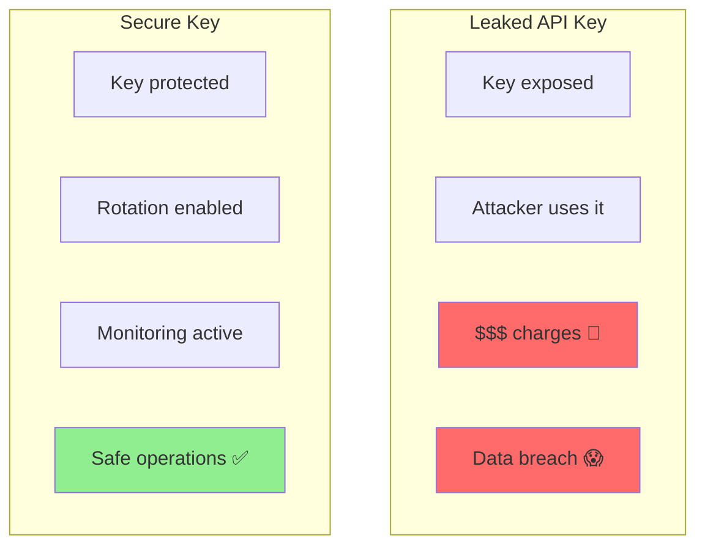
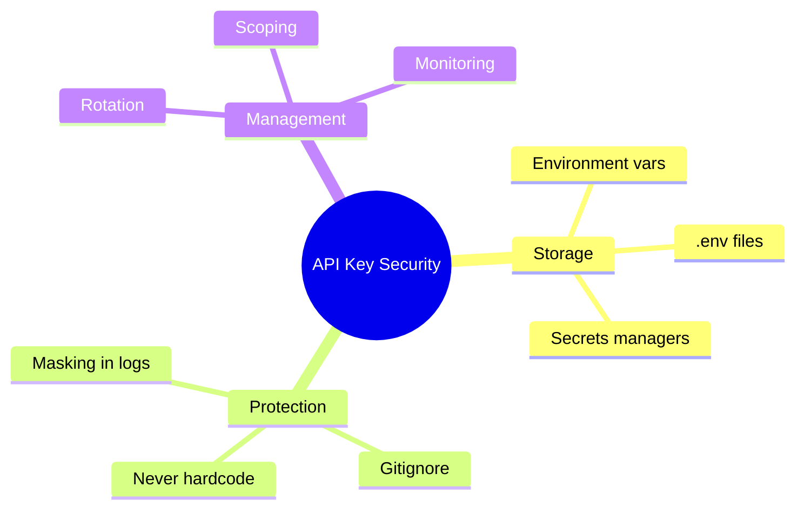

# API Key Security in Agent Workflows

API keys are the keys to your kingdom. This guide shows you how to protect them in agent workflows.

> **Coming from Software Engineering?** This is secrets management 101 — you've been doing this since your first `.env` file. The AI-specific concern: LLM agents can leak secrets through their output (printing keys in responses), through tool calls (passing keys to external APIs), or through logs (verbose tracing capturing full request bodies). Apply the same principle of least privilege you use for IAM roles: agents should only have access to the keys they need, with the minimum required permissions.

---

## Why API Key Security Matters



Risks of exposed keys:
- **Financial loss**: Unauthorized API usage
- **Data breach**: Access to your systems
- **Reputation damage**: Security incident
- **Service disruption**: Key revoked

---

## Never Hardcode Keys

```python
# script_id: day_067_api_key_security/never_hardcode_keys
# ❌ NEVER DO THIS
api_key = "sk-abc123secretkey"

# ❌ ALSO NEVER DO THIS
config = {
    "openai_key": "sk-abc123secretkey"
}

# ✅ DO THIS - Use environment variables
import os
api_key = os.environ.get("OPENAI_API_KEY")

# ✅ OR THIS - Use a secrets manager
from my_secrets import get_secret
api_key = get_secret("openai_api_key")
```

---

## Environment Variables

The simplest secure approach:

### Setting Environment Variables

```bash
# Linux/Mac
export OPENAI_API_KEY="sk-your-key-here"
export ANTHROPIC_API_KEY="sk-ant-your-key-here"

# Add to ~/.bashrc or ~/.zshrc for persistence
echo 'export OPENAI_API_KEY="sk-your-key"' >> ~/.bashrc

# Windows Command Prompt
set OPENAI_API_KEY=sk-your-key-here

# Windows PowerShell
$env:OPENAI_API_KEY="sk-your-key-here"
```

### Using in Python

```python
# script_id: day_067_api_key_security/env_var_usage
import os
from openai import OpenAI

# Client auto-reads from OPENAI_API_KEY env var
client = OpenAI()

# Or explicitly
client = OpenAI(api_key=os.environ.get("OPENAI_API_KEY"))

# With validation
def get_api_key(key_name: str) -> str:
    """Get API key from environment with validation."""
    key = os.environ.get(key_name)

    if not key:
        raise ValueError(f"Environment variable {key_name} not set")

    if not key.startswith(("sk-", "sk-ant-")):
        raise ValueError(f"Invalid API key format for {key_name}")

    return key

openai_key = get_api_key("OPENAI_API_KEY")
```

---

## Using .env Files

For local development:

```python
# script_id: day_067_api_key_security/dotenv_file_example
# .env file (add to .gitignore!)
OPENAI_API_KEY=sk-your-key-here
ANTHROPIC_API_KEY=sk-ant-your-key-here
DATABASE_URL=postgresql://localhost/mydb
```

```python
# script_id: day_067_api_key_security/dotenv_loading
# Python code
from dotenv import load_dotenv
import os

# Load .env file
load_dotenv()

# Access variables
api_key = os.environ.get("OPENAI_API_KEY")
```

### Gitignore Setup

```gitignore
# .gitignore
.env
.env.local
.env.*.local
*.key
*_key.txt
secrets/
credentials.json
```

---

## Secrets Managers

For production environments:

### AWS Secrets Manager

```python
# script_id: day_067_api_key_security/aws_secrets_manager
import boto3
import json

def get_aws_secret(secret_name: str, region: str = "us-east-1") -> dict:
    """Retrieve secret from AWS Secrets Manager."""

    client = boto3.client("secretsmanager", region_name=region)

    try:
        response = client.get_secret_value(SecretId=secret_name)
        return json.loads(response["SecretString"])
    except Exception as e:
        raise RuntimeError(f"Failed to retrieve secret: {e}")

# Usage
secrets = get_aws_secret("prod/api-keys")
openai_key = secrets["OPENAI_API_KEY"]
```

### HashiCorp Vault

```python
# script_id: day_067_api_key_security/hashicorp_vault
import hvac
import os

def get_vault_secret(path: str) -> dict:
    """Retrieve secret from HashiCorp Vault."""

    client = hvac.Client(url=os.environ.get("VAULT_ADDR", "http://localhost:8200"))
    client.token = os.environ.get("VAULT_TOKEN")

    secret = client.secrets.kv.v2.read_secret_version(path=path)
    return secret["data"]["data"]

# Usage
secrets = get_vault_secret("secret/api-keys")
openai_key = secrets["openai"]
```

### Azure Key Vault

```python
# script_id: day_067_api_key_security/azure_key_vault
from azure.identity import DefaultAzureCredential
from azure.keyvault.secrets import SecretClient

def get_azure_secret(vault_url: str, secret_name: str) -> str:
    """Retrieve secret from Azure Key Vault."""

    credential = DefaultAzureCredential()
    client = SecretClient(vault_url=vault_url, credential=credential)

    secret = client.get_secret(secret_name)
    return secret.value

# Usage
openai_key = get_azure_secret(
    "https://my-vault.vault.azure.net/",
    "openai-api-key"
)
```

---

## Key Rotation

Rotate keys regularly for security:

```python
# script_id: day_067_api_key_security/key_rotation
from datetime import datetime, timedelta
from dataclasses import dataclass
from typing import Optional

@dataclass
class ManagedKey:
    """API key with rotation tracking."""
    key: str
    created_at: datetime
    expires_at: Optional[datetime] = None
    rotation_days: int = 90

    def is_expired(self) -> bool:
        if self.expires_at:
            return datetime.now() > self.expires_at
        return False

    def needs_rotation(self) -> bool:
        age = datetime.now() - self.created_at
        return age.days >= self.rotation_days

class KeyManager:
    """Manage API keys with rotation."""

    def __init__(self, secrets_provider):
        self.provider = secrets_provider
        self.keys = {}
        self.key_metadata = {}

    def get_key(self, key_name: str) -> str:
        """Get current valid key."""

        # Check if we have a cached key
        if key_name in self.keys:
            metadata = self.key_metadata.get(key_name)
            if metadata and not metadata.needs_rotation():
                return self.keys[key_name]

        # Fetch fresh key
        key = self.provider.get(key_name)
        self.keys[key_name] = key
        self.key_metadata[key_name] = ManagedKey(
            key=key,
            created_at=datetime.now(),
            rotation_days=90
        )

        return key

    def check_rotation_needed(self) -> list:
        """Check which keys need rotation."""
        needs_rotation = []

        for key_name, metadata in self.key_metadata.items():
            if metadata.needs_rotation():
                needs_rotation.append({
                    "key": key_name,
                    "age_days": (datetime.now() - metadata.created_at).days
                })

        return needs_rotation
```

---

## Key Scoping and Permissions

Use least-privilege keys:

```python
# script_id: day_067_api_key_security/scoped_api_client
class ScopedAPIClient:
    """Client with scoped API access."""

    def __init__(self, scopes: list):
        """
        Initialize with specific scopes.

        Scopes: ["chat", "embeddings", "fine-tuning", "images"]
        """
        self.scopes = scopes
        self._validate_scopes()

    def _validate_scopes(self):
        """Ensure we only have needed permissions."""
        allowed = ["chat", "embeddings"]  # Minimum required

        for scope in self.scopes:
            if scope not in allowed:
                print(f"Warning: Scope '{scope}' not in allowed list")

    def chat(self, messages: list) -> str:
        if "chat" not in self.scopes:
            raise PermissionError("Chat scope not authorized")
        # Make API call

    def embed(self, text: str) -> list:
        if "embeddings" not in self.scopes:
            raise PermissionError("Embeddings scope not authorized")
        # Make API call
```

---

## Logging and Monitoring

Track key usage without exposing keys:

```python
# script_id: day_067_api_key_security/key_usage_logging
import hashlib
from datetime import datetime

def mask_key(key: str) -> str:
    """Mask API key for safe logging."""
    if len(key) > 8:
        return key[:4] + "*" * (len(key) - 8) + key[-4:]
    return "*" * len(key)

def hash_key(key: str) -> str:
    """Hash key for tracking without exposure."""
    return hashlib.sha256(key.encode()).hexdigest()[:16]

class KeyUsageLogger:
    """Log API key usage safely."""

    def __init__(self):
        self.usage_log = []

    def log_usage(self, key: str, operation: str, success: bool):
        """Log key usage without exposing the key."""

        entry = {
            "timestamp": datetime.now().isoformat(),
            "key_hash": hash_key(key),
            "key_preview": mask_key(key),
            "operation": operation,
            "success": success
        }
        self.usage_log.append(entry)

        # Alert on failures
        if not success:
            self._alert_failure(entry)

    def _alert_failure(self, entry: dict):
        """Alert on suspicious activity."""
        print(f"⚠️ API call failed: {entry}")

    def get_usage_report(self) -> dict:
        """Get usage statistics."""
        total = len(self.usage_log)
        failures = sum(1 for e in self.usage_log if not e["success"])

        return {
            "total_calls": total,
            "failures": failures,
            "failure_rate": failures / total if total > 0 else 0
        }

# Usage
logger = KeyUsageLogger()

# When making API calls
try:
    result = make_api_call()
    logger.log_usage(api_key, "chat_completion", success=True)
except Exception:
    logger.log_usage(api_key, "chat_completion", success=False)
```

---

## Agent-Specific Security

Secure keys in agent workflows:

```python
# script_id: day_067_api_key_security/secure_agent
class SecureAgent:
    """Agent with secure key handling."""

    def __init__(self):
        # Keys loaded at initialization only
        self._api_key = self._load_key_securely()
        self._client = None

    def _load_key_securely(self) -> str:
        """Load API key from secure source."""
        # Try environment variable first
        key = os.environ.get("OPENAI_API_KEY")

        if not key:
            # Fall back to secrets manager
            key = get_aws_secret("prod/openai")["key"]

        return key

    @property
    def client(self):
        """Lazy-load client."""
        if self._client is None:
            self._client = OpenAI(api_key=self._api_key)
        return self._client

    def generate(self, prompt: str) -> str:
        """Generate response - key never exposed in prompts."""

        # Never include key in messages
        response = self.client.chat.completions.create(
            model="gpt-4o-mini",
            messages=[{"role": "user", "content": prompt}]
        )

        # Never log key
        result = response.choices[0].message.content

        # Check for key leakage in output
        if self._api_key[:10] in result:
            raise SecurityError("Potential key leakage detected!")

        return result

    def __repr__(self):
        """Safe string representation."""
        return "SecureAgent(key=***)"
```

---

## Checklist

Before deploying:

- [ ] No hardcoded API keys in code
- [ ] Keys in environment variables or secrets manager
- [ ] `.env` files in `.gitignore`
- [ ] Key rotation policy in place
- [ ] Usage monitoring enabled
- [ ] Keys masked in all logs
- [ ] Least-privilege key scoping
- [ ] Alerts for suspicious activity

---

## Summary



---

## Quick Reference

```python
# script_id: day_067_api_key_security/quick_reference
# Environment variable
api_key = os.environ.get("OPENAI_API_KEY")

# .env file
from dotenv import load_dotenv
load_dotenv()

# AWS Secrets Manager
secrets = get_aws_secret("prod/keys")

# Mask for logging
masked = key[:4] + "****" + key[-4:]

# Never log full keys!
logger.info(f"Using key: {mask_key(api_key)}")
```

---

## What's Next?

You've secured your API keys! Next, we'll tackle **Production Hardening** — retries, circuit breakers, rate limiting, and graceful degradation so your agents survive real-world failure modes.
