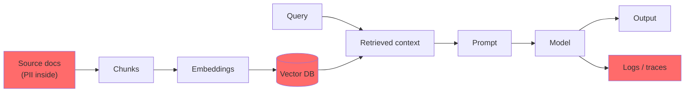
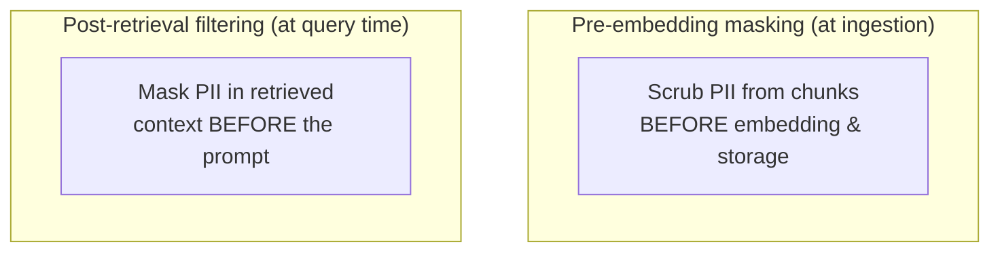
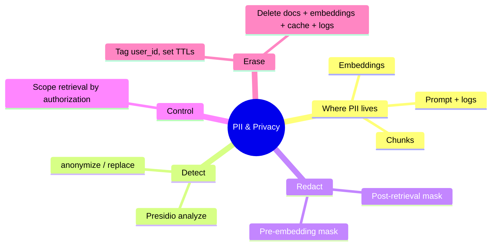

# PII & Data Privacy in RAG/Agents

Your RAG system ingests support tickets, contracts, chat logs — documents full of names, emails, card numbers, medical details. Every one of those is now in your chunks, your embeddings, your prompt context, and probably your logs. If you build for healthcare, finance, or anyone in the EU, "we sanitize the output" is far too late. This lesson is about handling **personally identifiable information (PII)** across the whole pipeline — and being able to delete it on request.

> **Coming from Software Engineering?** This is the same discipline you already apply to user data: **input validation at the boundary**, **field-level redaction before storage**, **access control on reads**, and a **data-retention/deletion policy**. The new twist is that an LLM pipeline has *more* places data lands — chunks, embeddings, prompt context, cache, model logs — so "where does PII live?" has more answers than in a normal CRUD app.

> **Note:** This lesson covers engineering patterns, not legal advice. GDPR/HIPAA/PCI obligations are real and specific — confirm requirements with your compliance/legal team.

---

## Where PII Enters the Pipeline

The mistake is treating PII as an output problem (Day 63, sanitization). By then it's already in five places:



The leverage point is the **left side**: scrub or gate PII at ingestion and retrieval, so it never reaches the embeddings, the prompt, or the logs in the first place. Output filtering is the last line of defense, not the first.

---

## Detecting PII

You can't redact what you can't find. **Microsoft Presidio** detects PII (names, emails, phone numbers, cards, SSNs, and more) using a mix of NER models and pattern rules, and anonymizes it.

```python
# script_id: day_067_pii_data_privacy/detect
# pip install presidio-analyzer presidio-anonymizer
# python -m spacy download en_core_web_lg
from presidio_analyzer import AnalyzerEngine
from presidio_anonymizer import AnonymizerEngine
from presidio_anonymizer.entities import OperatorConfig

analyzer = AnalyzerEngine()
anonymizer = AnonymizerEngine()

text = "Contact Alice Chen at alice.chen@acme.com or 415-555-0142 about invoice 8841."

# 1. Detect — returns spans with an entity type and a confidence score
results = analyzer.analyze(text=text, language="en")
for r in results:
    print(r.entity_type, text[r.start:r.end], round(r.score, 2))
# PERSON Alice Chen 0.85
# EMAIL_ADDRESS alice.chen@acme.com 1.0
# PHONE_NUMBER 415-555-0142 0.75

# 2. Anonymize — replace each detected span with a placeholder
redacted = anonymizer.anonymize(
    text=text,
    analyzer_results=results,
    operators={"DEFAULT": OperatorConfig("replace", {"new_value": "<REDACTED>"})},
)
print(redacted.text)
# Contact <REDACTED> at <REDACTED> or <REDACTED> about invoice 8841.
```

> As of 2026, verify the Presidio package/API at microsoft.github.io/presidio — detector coverage and entity types evolve, and you should tune recognizers (and add custom ones for your domain's IDs) before relying on it in production.

---

## Two Redaction Strategies — and Where They Sit



- **Pre-embedding masking** — redact at ingestion, so PII never enters the vector store or embeddings at all. Strongest guarantee; the trade-off is you lose that information permanently (you can't answer "what's Alice's email?" because it's gone). Use when the PII is never needed for answers.
- **Post-retrieval filtering** — store the real text, but mask PII in the chunks *after* retrieval and *before* they hit the prompt and logs. Keeps the data usable for exact lookups behind access control, but PII still lives in the store (so it's in scope for breach and deletion).

```python
# script_id: day_067_pii_data_privacy/strategies
def mask(text: str) -> str:
    results = analyzer.analyze(text=text, language="en")
    return anonymizer.anonymize(
        text=text, analyzer_results=results,
        operators={"DEFAULT": OperatorConfig("replace", {"new_value": "<REDACTED>"})},
    ).text

# Pre-embedding: scrub before the document ever reaches the vector store
def ingest(doc_text: str, store):
    store.add(mask(doc_text))            # embeddings are built from masked text

# Post-retrieval: store raw, mask on the way into the prompt
def build_context(retrieved_chunks: list[str]) -> str:
    return "\n\n".join(mask(c) for c in retrieved_chunks)
```

---

## Retrieval Filtering: Don't Fetch What This User Can't See

In a multi-tenant system, the most dangerous leak isn't a clever prompt — it's retrieval returning *another tenant's* document. Vector similarity has no notion of "who's allowed to see this." Enforce scope as a metadata filter on the query (the filtered-search pattern from Day 23), so the candidate set is access-controlled before similarity even runs.

```python
# script_id: day_067_pii_data_privacy/scoped_retrieval
def retrieve_scoped(query: str, user, collection):
    """Only ever search documents this user is authorized to see."""
    return collection.query(
        query_texts=[query],
        n_results=5,
        # access control happens in the WHERE filter, not after retrieval
        where={"$and": [
            {"tenant_id": user.tenant_id},
            {"classification": {"$in": user.allowed_classifications}},
        ]},
    )
```

The rule: **filter by authorization, then rank by similarity** — never the other way around. Retrieving broadly and trimming afterward means the unauthorized chunks were already in memory (and maybe your logs).

---

## Retention & Deletion (the GDPR "Delete My Data" Request)

A user invokes their right to erasure. In a CRUD app that's a `DELETE` on a row. In a RAG system the same identity is scattered: source documents, **chunks**, **embeddings in the vector store**, **caches** (Day 91), and provider/observability **logs**. A deletion that misses any of these isn't a deletion.

```python
# script_id: day_067_pii_data_privacy/deletion
def delete_user_data(user_id: str, *, docs, vector_store, cache):
    """Right-to-erasure: purge every place a user's data can live."""
    doc_ids = docs.find_ids_for_user(user_id)
    docs.delete(doc_ids)                          # 1. source documents
    vector_store.delete(where={"user_id": user_id})  # 2. chunks + embeddings
    cache.delete_by_user(user_id)                 # 3. semantic/exact caches
    # 4. logs/traces: ensure your retention policy expires them (see below)
    return {"deleted_docs": len(doc_ids)}
```

Two design rules make this feasible: **tag every chunk/embedding with the owning `user_id`** at ingestion (you can't delete what you can't find), and **set a retention TTL on logs and caches** so PII doesn't accumulate indefinitely. The cheapest PII to protect is the PII you never stored or already expired.

---

## A Practical Compliance Checklist

Directional, not legal advice — but these are the questions an auditor (and your own incident review) will ask:

- **Minimize:** do you ingest PII you don't actually need? Drop it at the boundary.
- **Detect:** is there a PII scan at ingestion *and* on outputs (defense in depth)?
- **Scope:** is retrieval filtered by tenant/authorization *before* similarity?
- **Encrypt:** is the vector store encrypted at rest and in transit?
- **Retain:** do logs, traces, and caches have a TTL? Are prompts sent to providers covered by your data-processing terms?
- **Erase:** can you delete one user's data from docs, embeddings, caches, and logs in one operation?

---

## Checkpoint

Run the detect-and-anonymize block on a sentence containing a name, an email, and a phone number, and confirm all three are replaced with `<REDACTED>` while non-PII (an invoice number, ordinary words) is left intact. Then wire `mask()` into a tiny ingestion function and verify the text added to your store contains no original PII.

---

## Summary



---

## Quick Reference

| Concern | Pattern | SWE analogy |
|---|---|---|
| Find PII | Presidio `analyze()` | Input validation/scanning |
| Remove PII | `anonymize()` + `OperatorConfig("replace")` | Field-level redaction |
| Pre-embedding mask | Scrub before storage | Don't persist secrets |
| Post-retrieval mask | Scrub before prompt/logs | Redact on read |
| Scoped retrieval | Metadata filter by authorization | Row-level security |
| Right to erasure | Delete docs + embeddings + cache + logs | Cascading delete |

---

## Exercises

1. Add a **custom recognizer** to Presidio for an identifier specific to your domain (e.g. a member ID like `MBR-xxxxxx`) and confirm it's detected and redacted.
2. Implement pre-embedding masking in your Day 34 RAG ingestion and show that querying for a known email returns `<REDACTED>` rather than the real value.
3. Implement `delete_user_data` against your real vector store and prove a follow-up query for that user's content returns nothing.

<details><summary>Solutions (approaches)</summary>

1. Use a `PatternRecognizer` with a regex for your ID format and register it on the `AnalyzerEngine`'s registry; re-run `analyze()` and check your entity type appears.
2. Pipe each document through `mask()` before `store.add()`; the embeddings are now built from masked text, so the original email is unrecoverable from retrieval.
3. Tag every chunk with `user_id` at ingestion so the `where={"user_id": ...}` delete matches; after deleting, a scoped query returns an empty candidate set.

</details>

---

## What's Next?

Next up is **Day 68 — Production Hardening**: retries, circuit breakers, graceful degradation, rate limiting, and structured logging — the resilience layer around the secure pipeline you've now built. (Secrets/API-key injection for containers is covered on Day 66.)
