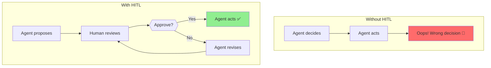
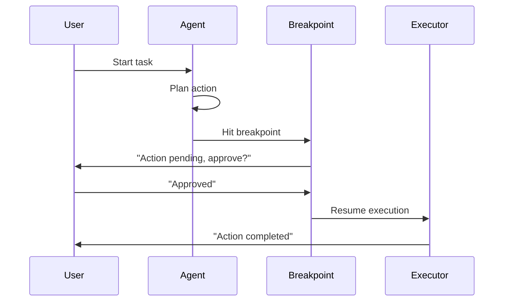
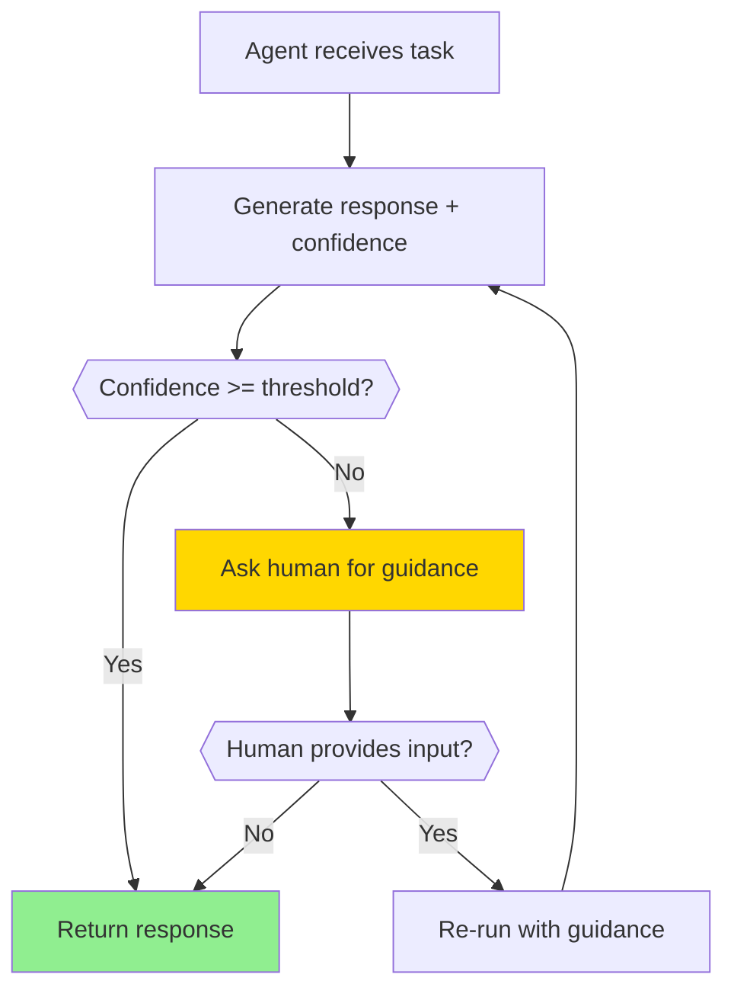
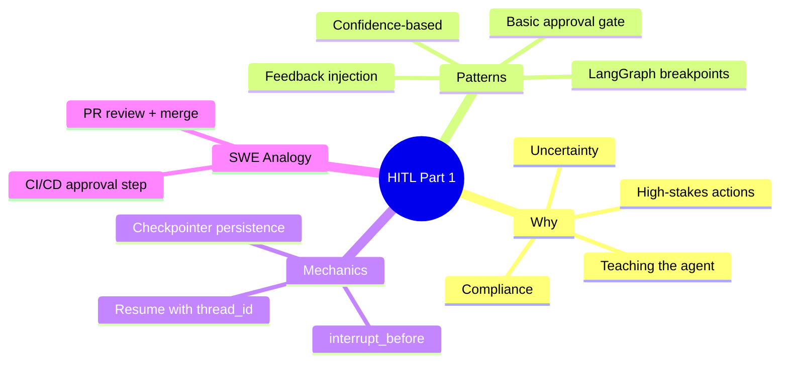

# Human-in-the-Loop (HITL) Patterns

Agents are powerful, but sometimes you need a human to make critical decisions. Human-in-the-Loop (HITL) patterns let you pause agents, get human input, and resume execution.

> **Coming from Software Engineering?** HITL is the approval gate pattern you've seen in CI/CD pipelines — like requiring a manual approval step before deploying to production, or a Terraform plan that waits for `apply` confirmation. You've also seen it in pull request workflows: automated checks run, then a human reviews and merges. The same concept applies to agents: let them do automated work, but pause at high-stakes decisions for human judgment.

---

## Why Human-in-the-Loop?



Use cases for HITL:
- **High-stakes decisions** (financial transactions, emails)
- **Uncertain situations** (agent isn't confident)
- **Learning** (human teaches agent what's right)
- **Compliance** (legal/regulatory requirements)

---

## Basic Approval Pattern

The simplest HITL: ask before acting.

```python
# script_id: day_069_hitl_patterns_part1/basic_approval_pattern
from openai import OpenAI

client = OpenAI()

def get_human_approval(action: str, details: str) -> bool:
    """Ask human to approve an action."""
    print("\n" + "="*50)
    print("🤖 AGENT WANTS TO TAKE AN ACTION")
    print("="*50)
    print(f"Action: {action}")
    print(f"Details: {details}")
    print("="*50)

    while True:
        response = input("Approve? (yes/no): ").strip().lower()
        if response in ["yes", "y"]:
            return True
        elif response in ["no", "n"]:
            return False
        print("Please enter 'yes' or 'no'")

def agent_with_approval(task: str):
    """Agent that asks for approval before critical actions."""

    # Agent generates a plan
    response = client.chat.completions.create(
        model="gpt-4o",
        messages=[
            {"role": "system", "content": """You are a helpful assistant.
            When you want to take an action, describe it clearly.
            Format critical actions as: ACTION: [action name] | DETAILS: [details]"""},
            {"role": "user", "content": task}
        ]
    )

    agent_response = response.choices[0].message.content
    print(f"\n🤖 Agent: {agent_response}")

    # Check if agent wants to take an action
    if "ACTION:" in agent_response:
        # Parse the action
        parts = agent_response.split("ACTION:")[1].split("|")
        action = parts[0].strip()
        details = parts[1].replace("DETAILS:", "").strip() if len(parts) > 1 else ""

        # Get human approval
        if get_human_approval(action, details):
            print("✅ Action approved! Executing...")
            # Execute the action here
            return execute_action(action, details)
        else:
            print("❌ Action rejected. Agent will not proceed.")
            return None

    return agent_response

def execute_action(action: str, details: str):
    """Execute an approved action."""
    print(f"Executing: {action}")
    # Your action execution logic here
    return f"Completed: {action}"

# Example usage
result = agent_with_approval("Send an email to john@example.com saying the meeting is confirmed")
```

---

## LangGraph Breakpoints

LangGraph has built-in support for breakpoints - points where execution pauses for human input. A checkpointer + `thread_id` is the durable equivalent of a paused workflow run you can resume later — like a suspended CI job that picks up where it left off, not a fresh start.

```python
# script_id: day_069_hitl_patterns_part1/langgraph_breakpoints
from langgraph.graph import StateGraph, END
from langgraph.checkpoint.memory import InMemorySaver
from typing import TypedDict, Annotated, Literal
from operator import add

# Define state
class AgentState(TypedDict):
    # Annotated[list, add] tells LangGraph: when a node returns messages, APPEND to
    # the existing list instead of replacing it (like a Redux reducer, or += on a
    # list). Plain fields without this are overwritten.
    messages: Annotated[list, add]
    pending_action: str
    human_feedback: str

# Create checkpointer for persistence.
# The checkpointer saves run state at each step — like serializing a workflow to a
# job queue/DB so a paused run can resume later (even in another process), keyed by
# thread_id. (Exercise 2 swaps this for a file-backed SqliteSaver for cross-process resume.)
checkpointer = InMemorySaver()

def plan_action(state: AgentState) -> dict:
    """Agent plans an action."""
    # In real code, call LLM here
    return {
        "messages": ["Planning to send email..."],
        "pending_action": "send_email:john@example.com:Meeting confirmed"
    }

def execute_action(state: AgentState) -> dict:
    """Execute the approved action."""
    # The breakpoint pauses BEFORE this node; we only get here after a human resumes.
    # Gate the side-effect on the human's decision so a rejected action never runs.
    if state.get("human_feedback") != "approved":
        return {"messages": ["Action not approved — skipped."], "pending_action": ""}
    action = state["pending_action"]
    # Execute the action
    return {
        "messages": [f"Executed: {action}"],
        "pending_action": ""
    }

# Build graph
workflow = StateGraph(AgentState)

workflow.add_node("plan", plan_action)
workflow.add_node("execute", execute_action)

workflow.set_entry_point("plan")

# plan -> execute is unconditional; the breakpoint (below) is what gates execution.
workflow.add_edge("plan", "execute")
workflow.add_edge("execute", END)

# Compile with checkpointer and interrupt points
app = workflow.compile(
    checkpointer=checkpointer,
    interrupt_before=["execute"]  # THIS creates the breakpoint — pause before entering execute
)
```

### Using the Breakpoint

```python
# script_id: day_069_hitl_patterns_part1/langgraph_breakpoints
# Start execution
config = {"configurable": {"thread_id": "session-123"}}

# Run until breakpoint
result = app.invoke(
    {"messages": [], "pending_action": "", "human_feedback": ""},
    config=config
)

print("Paused at breakpoint!")
print(f"Pending action: {result['pending_action']}")

# Human reviews and provides feedback
human_decision = input("Approve this action? (yes/no): ")

# Resume with human feedback
if human_decision.lower() == "yes":
    # Write the human's decision into the saved state, then resume by passing None.
    app.update_state(config, {"human_feedback": "approved"})
    final_result = app.invoke(None, config=config)
    print("Action executed!")
else:
    print("Action cancelled by human.")
```

The second `invoke` does NOT restart the graph. Because we reuse the same `thread_id`, LangGraph loads the state it saved at the breakpoint (the checkpointer's job), we write the human's decision into that saved state, and execution resumes from the node right after the pause — not from the entry point. It's like clicking Approve to resume a paused CI job: the job keeps its earlier state and you only supply the approval.



---

## Feedback Injection

Approval gates are binary (proceed / stop), but sometimes you want to inject *guidance* mid-execution — steering the agent rather than just gating it. That's a topic in its own right: **Day 72 (Injecting Feedback)** covers it in depth, including periodic feedback loops, structured feedback forms, and feeding human corrections back into agent state. For now, the key idea is that the same breakpoint mechanism above can pause to collect a free-text instruction and append it to the message history before resuming.

---

## Confidence-Based HITL

Only ask for human input when the agent is uncertain:

Important: this "confidence" is NOT a real probability the model measures about itself — it's just the model writing a number that sounds plausible, the same way it picks words. Treat it as a rough, gameable hint. Pick the threshold by running real tasks and watching where it over- or under-asks; don't trust the number itself.

```python
# script_id: day_069_hitl_patterns_part1/confidence_based_hitl
from openai import OpenAI
import json

client = OpenAI()

def agent_with_confidence(task: str, confidence_threshold: float = 0.7):
    """
    Agent that asks for help when confidence is low.

    Args:
        task: The task to complete
        confidence_threshold: Ask human if confidence below this (0-1)
    """

    response = client.chat.completions.create(
        model="gpt-4o",
        messages=[
            {"role": "system", "content": """You are a helpful assistant.
            For each response, also provide a confidence score (0-1).

            Return JSON format:
            {
                "response": "your response here",
                "confidence": 0.85,
                "reasoning": "why you're confident or uncertain"
            }

            Be honest about uncertainty!"""},
            {"role": "user", "content": task}
        ],
        response_format={"type": "json_object"}  # forces a valid-JSON reply so json.loads() below won't choke on prose/backticks
    )

    result = json.loads(response.choices[0].message.content)

    print(f"🤖 Agent response: {result['response']}")
    print(f"📊 Confidence: {result['confidence']:.0%}")
    print(f"💭 Reasoning: {result['reasoning']}")

    # Check confidence
    if result['confidence'] < confidence_threshold:
        print("\n⚠️ Low confidence! Requesting human input...")
        print("-" * 40)

        human_input = input("Please provide guidance or press Enter to accept: ").strip()

        if human_input:
            # Re-run with human guidance
            return agent_with_confidence(
                f"{task}\n\nHuman guidance: {human_input}",
                confidence_threshold
            )

    return result['response']

# Examples
print("High confidence task:")
agent_with_confidence("What is 2 + 2?")

print("\n" + "="*50 + "\n")

print("Low confidence task:")
agent_with_confidence("What will the stock market do tomorrow?")
```



---

## Checkpoint

Run the `agent_with_approval(...)` example and confirm the flow pauses at the `input()` prompt before any action runs: type "no" and the agent should print the rejection message and stop without executing; run it again and type "yes" and you should see "Executing: ...". If the action fires before you're ever asked, the approval gate is being bypassed — make sure `execute_action` is only called inside the `if get_human_approval(...)` branch, not before it.

---

## Summary



---

## Quick Reference

| Pattern | When to use | Core mechanism |
|---|---|---|
| Basic approval | Single irreversible action | `input()` gate before `execute_action` |
| LangGraph breakpoint | Stateful, resumable pause | `compile(checkpointer=..., interrupt_before=["execute"])` |
| Resume after pause | Continue a paused run | Re-`invoke` with same `thread_id` config |
| Feedback injection | Steer mid-task, not just yes/no | Append `{"role": "user", "content": "Human feedback: ..."}` |
| Confidence-based | Only interrupt when unsure | Ask model for `confidence`; gate on a threshold |

Tips:
- Always show the human *what* and *why* before asking — a bare "Approve?" gets rubber-stamped.
- A breakpoint needs a checkpointer; without persistence there's no state to resume.
- Confidence scores are self-reported and noisy — calibrate the threshold against real cases.

---

## Exercises

1. Modify `get_human_approval` to also accept an `[e]` (edit) option that lets the human rewrite the action details before approving.
2. In the LangGraph example, change `interrupt_before=["execute"]` to also persist to a file-backed checkpointer and resume the run in a *separate* Python process using the same `thread_id`.
3. Add a confidence *band*: auto-approve above 0.85, auto-reject below 0.3, and only ask the human in between.
4. Wrap `agent_with_approval` so a rejected action is logged with a timestamp and reason to a `decisions.jsonl` audit file.

<details><summary>Solutions (approaches)</summary>

1. Add an `elif response in ["e", "edit"]:` branch that calls `input("New details: ")`, mutates `details`, then re-displays and returns `True`.
2. Use `SqliteSaver.from_conn_string("hitl.db")`; in process two, build the same graph, then `app.invoke(None, config)` with `config={"configurable": {"thread_id": "session-123"}}` resumes from the stored checkpoint.
3. `if conf >= 0.85: return result` / `elif conf < 0.3: reject()` / `else: ask_human()` — three branches instead of one threshold.
4. After the reject branch, `json.dump({"ts": datetime.now(timezone.utc).isoformat(), "action": action, "decision": "rejected"}, f)` appended to the file.
</details>

---

## What's Next?

Next up is **Day 070 — HITL Patterns, Part 2**, where you'll graduate from single approvals to multi-stage approval pipelines, risk-based escalation, and timeout handling for when a human never responds.
