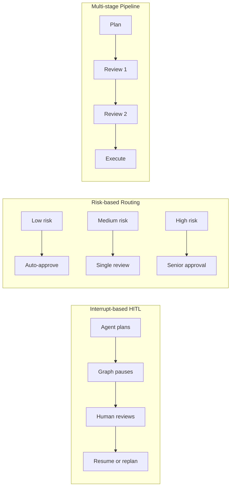
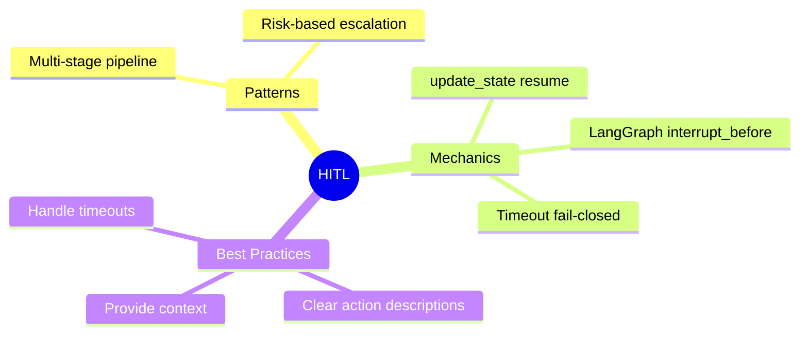

# Human-in-the-Loop (HITL) Patterns Part 2

> **Coming from Software Engineering?** Multi-stage approval pipelines are exactly like promotion gates in deployment pipelines: dev -> staging -> prod, each requiring sign-off. If you've configured GitHub Actions environments with required reviewers, or set up Spinnaker deployment stages with manual judgments, this is the same pattern applied to agent workflows.

## Multi-Stage Approval Pipeline

For critical workflows, require approval at multiple stages:

```python
# script_id: day_070_hitl_patterns_part2/multi_stage_approval_pipeline
from typing import Callable, List, Dict, Any, Optional
from dataclasses import dataclass
from enum import Enum

class ApprovalStatus(Enum):
    PENDING = "pending"
    APPROVED = "approved"
    REJECTED = "rejected"
    NEEDS_REVISION = "needs_revision"

@dataclass
class Stage:
    name: str
    action: Callable
    requires_approval: bool = True
    approvers: Optional[List[str]] = None

class ApprovalPipeline:
    """Multi-stage pipeline with human approvals."""

    def __init__(self, stages: List[Stage]):
        self.stages = stages
        self.results = {}
        self.current_stage = 0

    def run(self, initial_input: Any) -> Dict:
        """Run the pipeline with approval gates."""
        current_input = initial_input

        for i, stage in enumerate(self.stages):
            self.current_stage = i
            print(f"\n{'='*50}")
            print(f"Stage {i+1}: {stage.name}")
            print('='*50)

            # Execute stage action
            result = stage.action(current_input)
            print(f"\nOutput: {result}")

            # Check if approval needed
            if stage.requires_approval:
                status = self._get_approval(stage, result)

                if status == ApprovalStatus.REJECTED:
                    print(f"Stage '{stage.name}' rejected. Pipeline stopped.")
                    return {"status": "rejected", "stage": stage.name, "results": self.results}

                elif status == ApprovalStatus.NEEDS_REVISION:
                    revision = input("Enter revision instructions: ")
                    result = stage.action(f"{current_input}\nRevision: {revision}")
                    print(f"Revised output: {result}")

            self.results[stage.name] = result
            current_input = result

        print(f"\nPipeline completed successfully!")
        return {"status": "completed", "results": self.results}

    def _get_approval(self, stage: Stage, result: Any) -> ApprovalStatus:
        """Get human approval for a stage."""
        print(f"\nReview required for: {stage.name}")
        if stage.approvers:
            print(f"   Approvers: {', '.join(stage.approvers)}")

        print("\nOptions:")
        print("  [a] Approve")
        print("  [r] Reject")
        print("  [v] Request revision")

        while True:
            choice = input("\nYour choice: ").strip().lower()
            if choice == 'a':
                return ApprovalStatus.APPROVED
            elif choice == 'r':
                return ApprovalStatus.REJECTED
            elif choice == 'v':
                return ApprovalStatus.NEEDS_REVISION
            print("Invalid choice. Enter 'a', 'r', or 'v'")

# Example: Email drafting pipeline
def draft_email(task):
    return f"Draft email about: {task}"

def review_tone(draft):
    return f"Reviewed: {draft} [Tone: Professional]"

def add_signature(content):
    return f"{content}\n\nBest regards,\nThe Team"

pipeline = ApprovalPipeline([
    Stage("Draft", draft_email, requires_approval=True),
    Stage("Tone Review", review_tone, requires_approval=True, approvers=["manager"]),
    Stage("Finalize", add_signature, requires_approval=False)
])

# Run pipeline
result = pipeline.run("Project update for stakeholders")
```

---

## LangGraph Human-in-the-Loop

LangGraph pauses a graph by marking a node as a breakpoint with `interrupt_before` — the named node (`human_review`) becomes a checkpoint where execution stops and waits for input:

```python
# script_id: day_070_hitl_patterns_part2/langgraph_hitl_interrupt
from langgraph.graph import StateGraph, END
from langgraph.checkpoint.memory import MemorySaver
from typing import TypedDict, Literal

class AgentState(TypedDict):
    task: str
    plan: str
    human_feedback: str
    result: str

def plan_step(state: AgentState) -> AgentState:
    """Agent creates a plan for human review."""
    # In practice, call an LLM here
    return {"plan": f"Proposed plan for: {state['task']}"}

def human_review(state: AgentState) -> AgentState:
    """Checkpoint node where the graph pauses for human feedback."""
    # Intentionally a no-op placeholder — the pause is caused by interrupt_before
    # at compile time, not by code in this node. Human input arrives via update_state().
    return state

def execute_step(state: AgentState) -> AgentState:
    """Execute after human approval."""
    return {"result": f"Executed: {state['plan']} with feedback: {state['human_feedback']}"}

def should_continue(state: AgentState) -> Literal["execute", "replan"]:
    """Route based on human feedback."""
    if state.get("human_feedback", "").lower().startswith("approved"):
        return "execute"
    return "replan"

# Build graph with interrupt
graph = StateGraph(AgentState)
graph.add_node("plan", plan_step)
graph.add_node("human_review", human_review)
graph.add_node("execute", execute_step)

graph.set_entry_point("plan")
graph.add_edge("plan", "human_review")
graph.add_conditional_edges("human_review", should_continue, {
    "execute": "execute",
    "replan": "plan"
})
graph.add_edge("execute", END)

# Compile with checkpointer and interrupt
# MemorySaver is the same checkpointer role from Part 1 — it stores the paused
# state so the run can resume — just in-memory for demos, vs SqliteSaver when the
# pause must survive a process restart.
memory = MemorySaver()
app = graph.compile(
    checkpointer=memory,
    interrupt_before=["human_review"]  # Pause before human review
)

# Run until interrupt
config = {"configurable": {"thread_id": "hitl-1"}}
result = app.invoke({"task": "Deploy to production"}, config)
# Graph pauses here — waiting for human input

# Human provides feedback
app.update_state(config, {"human_feedback": "Approved - proceed"})

# Resume execution
final = app.invoke(None, config)
# Resume reuses the same thread_id — the checkpointer restores the paused state.
# A new thread_id would start over from the beginning.
```

Think of `thread_id` like a session or transaction ID. The first `invoke` runs the graph until it hits the pause and saves its state under that `thread_id` (like a debugger stopped at a breakpoint). `update_state` patches the human feedback into that saved state. Calling `invoke(None, config)` means "don't start a new run — resume the saved one for this `thread_id` and continue from the pause." The `None` is what distinguishes resume from restart.

### Risk-Based Escalation

Like routing a deploy to different approvers based on target environment — prod needs senior sign-off, dev auto-approves.

```python
# script_id: day_070_hitl_patterns_part2/risk_based_escalation
# Define escalation levels based on risk
def classify_risk(state: AgentState) -> Literal["low", "medium", "high"]:
    """Route to appropriate approval level."""
    # In practice, use an LLM or rule engine
    if "production" in state.get("task", "").lower():
        return "high"
    elif "staging" in state.get("task", "").lower():
        return "medium"
    return "low"

# Wire classify_risk in as a conditional edge: low risk skips the pause,
# medium/high route through human_review before executing.
graph.add_conditional_edges("plan", classify_risk, {
    "low": "execute",         # auto-approve, no human pause
    "medium": "human_review",  # single reviewer
    "high": "human_review",    # senior approval
})
```



---

## Best Practices

### 1. Clear Action Descriptions

```python
# script_id: day_070_hitl_patterns_part2/clear_action_descriptions
# Bad - vague
action = "do the thing"

# Good - specific and clear
action = {
    "type": "send_email",
    "recipient": "john@example.com",
    "subject": "Meeting Confirmation",
    "body": "Your meeting is confirmed for tomorrow at 2pm.",
    "details": "Send confirmation email to john@example.com",
    "impact": "Email will be sent immediately and cannot be unsent",
    "reversible": False
}
```

### 2. Provide Context

```python
# script_id: day_070_hitl_patterns_part2/provide_context
def format_approval_request(action: dict, context: dict) -> str:
    """Format a clear approval request."""
    return f"""
    ACTION APPROVAL REQUEST
    ========================

    What: {action['type']}
    Details: {action['details']}

    Context:
    - Task: {context['task']}
    - Step: {context['step']} of {context['total_steps']}
    - Previous actions: {context['history']}

    Impact: {action['impact']}
    Reversible: {action['reversible']}

    ========================
    """
```

### 3. Timeout Handling

Same instinct as a deny-by-default firewall rule or a circuit breaker that opens when it gets no response — when in doubt, block.

```python
# script_id: day_070_hitl_patterns_part2/timeout_handling
import threading

def get_approval_with_timeout(action: str, timeout: int = 300) -> bool:
    """Get approval with timeout."""
    result = {"approved": None}

    def ask_human():
        response = input(f"Approve '{action}'? (yes/no): ")
        result["approved"] = response.lower() in ["yes", "y"]

    thread = threading.Thread(target=ask_human)
    thread.start()
    thread.join(timeout=timeout)

    if thread.is_alive():
        print(f"\nTimeout! No response in {timeout}s. Defaulting to reject.")
        return False

    return result["approved"]
```

## Checkpoint

Call `get_approval_with_timeout("test action", timeout=3)` and just don't type anything — after ~3 seconds it should print the "Timeout! ... Defaulting to reject." message and return `False`. That fail-closed default is the whole point: if a human walks away, a high-risk action must NOT proceed. If it instead hangs forever waiting for input, the `thread.join(timeout=...)` argument isn't being passed, so the timeout never fires.

---

## Summary



---

## Quick Reference

```python
# script_id: day_070_hitl_patterns_part2/quick_reference
# LangGraph Breakpoint
app = workflow.compile(
    checkpointer=checkpointer,
    interrupt_before=["critical_node"]
)

# LangGraph HITL with interrupt + update_state
from langgraph.graph import StateGraph, END
from langgraph.checkpoint.memory import MemorySaver

memory = MemorySaver()
app = graph.compile(checkpointer=memory, interrupt_before=["review"])

# Run until interrupt
config = {"configurable": {"thread_id": "1"}}
result = app.invoke({"task": "Deploy"}, config)

# Inject human feedback and resume
app.update_state(config, {"feedback": "Approved"})
final = app.invoke(None, config)

# Confidence-based HITL (covered in Part 1): the model self-reports a 0-1 score; pause when it dips below your cutoff.
if agent_confidence < threshold:
    human_feedback = get_human_input()
```

---

## Exercises

1. Extend `ApprovalPipeline` so that a `NEEDS_REVISION` result loops back and re-reviews the revised output (instead of accepting it after a single revision).
2. Add a `default_on_timeout` parameter to `get_approval_with_timeout` so a caller can choose whether an unanswered prompt defaults to approve or reject — and explain which default is safer for an irreversible action.
3. Extend the `classify_risk` routing above with a fourth `"critical"` tier that requires a second reviewer before executing.
4. Add a fourth pipeline stage that logs every approval decision (who, what, when, outcome) to an audit trail before the next stage runs.

<details><summary>Solutions (approaches)</summary>

1. After the revision, call `self._get_approval(stage, result)` again inside a `while status == ApprovalStatus.NEEDS_REVISION:` loop so each revision is re-reviewed.
2. `def get_approval_with_timeout(action, timeout=300, default_on_timeout=False)`; return `default_on_timeout` when the thread is still alive. Safer default for irreversible actions is `False` (reject) — fail closed.
3. Add a `"critical"` branch to the `classify_risk` conditional edges that routes to a `second_review` node before `execute`; classify a task critical when it touches both production and data deletion.
4. Insert a `Stage("Audit", log_decision, requires_approval=False)` whose action appends `{"approver", "stage", "ts", "status"}` to a JSONL file.
</details>

---

## What's Next?

You've built multi-stage approval pipelines. Next up is **Day 071 — Breakpoints Design**, where you'll place conditional and risk-based breakpoints so agents pause only when a high-risk operation actually warrants human review.
