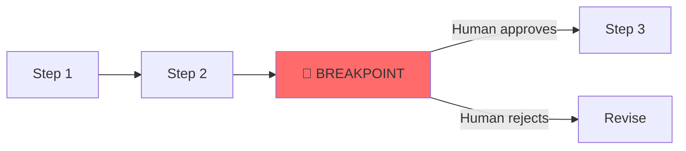
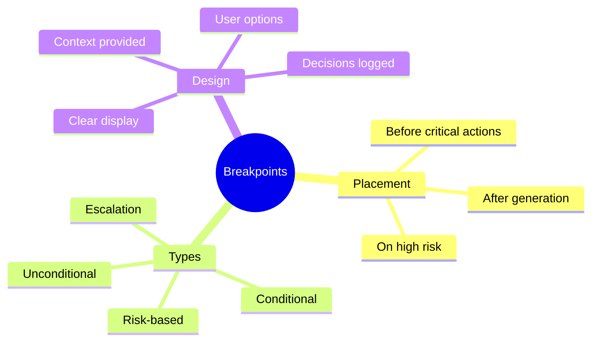

# Designing Breakpoints in Agent Systems

Breakpoints let you pause agents at critical moments for human review. This guide shows you how to strategically place and design effective breakpoints.

> **Coming from Software Engineering?** Agent breakpoints are analogous to debugger breakpoints and circuit breakers combined. Like a debugger breakpoint, they pause execution at a specific point so you can inspect state. Like a circuit breaker (Hystrix, Resilience4j), they prevent cascading failures by stopping execution when conditions are met. The strategic question — "where do I place breakpoints?" — is the same as choosing where to put health checks and monitoring alerts in a production system.

---

## What are Breakpoints?



Breakpoints are strategic pause points where:
- Execution stops
- Human reviews current state
- Human can approve, reject, or modify
- Execution resumes based on human decision

---

## When to Use Breakpoints

### Critical Decision Points

```python
# script_id: day_071_breakpoints_design/critical_decision_points
# Before irreversible actions
breakpoints = [
    "before_send_email",      # Can't unsend
    "before_api_payment",     # Financial impact
    "before_delete_data",     # Data loss
    "before_external_call"    # External effects
]
```

### High-Risk Operations

```python
# script_id: day_071_breakpoints_design/high_risk_operations
# Operations that need verification
breakpoints = [
    "before_code_execution",  # Security risk
    "before_database_write",  # Data integrity
    "before_file_modification"  # File changes
]
```

### Quality Gates

```python
# script_id: day_071_breakpoints_design/quality_gates
# Quality checkpoints
breakpoints = [
    "after_draft_complete",   # Review draft
    "after_analysis",         # Verify analysis
    "before_final_output"     # Final check
]
```

---

## LangGraph Breakpoint Design

### Strategic Placement

```python
# script_id: day_071_breakpoints_design/strategic_placement
from langgraph.graph import StateGraph, END
from langgraph.checkpoint.sqlite import SqliteSaver
from typing import TypedDict, Annotated
from operator import add

class WorkflowState(TypedDict):
    task: str
    draft: str
    final: str
    messages: Annotated[list, add]

def create_draft(state: WorkflowState) -> dict:
    """Create initial draft."""
    return {"draft": f"Draft for: {state['task']}", "messages": ["Draft created"]}

def review_and_edit(state: WorkflowState) -> dict:
    """Edit based on review."""
    return {"draft": state["draft"] + " [edited]", "messages": ["Draft edited"]}

def finalize(state: WorkflowState) -> dict:
    """Finalize the output."""
    return {"final": state["draft"], "messages": ["Finalized"]}

def send_output(state: WorkflowState) -> dict:
    """Send the final output (irreversible!)."""
    # This is where we want a breakpoint!
    return {"messages": ["Output sent!"]}

# Build workflow
workflow = StateGraph(WorkflowState)

workflow.add_node("draft", create_draft)
workflow.add_node("edit", review_and_edit)
workflow.add_node("finalize", finalize)
workflow.add_node("send", send_output)  # Breakpoint before this!

workflow.set_entry_point("draft")
workflow.add_edge("draft", "edit")
workflow.add_edge("edit", "finalize")
workflow.add_edge("finalize", "send")
workflow.add_edge("send", END)

# Compile with breakpoint BEFORE send
checkpointer = SqliteSaver.from_conn_string("breakpoints.db")
app = workflow.compile(
    checkpointer=checkpointer,
    interrupt_before=["send"]  # Pause before sending!
)
```

### Using the Breakpoint

```python
# script_id: day_071_breakpoints_design/strategic_placement
# Run until breakpoint
config = {"configurable": {"thread_id": "task-123"}}
result = app.invoke(
    {"task": "Write email", "draft": "", "final": "", "messages": []},
    config=config
)

print("Paused before 'send' node")
print(f"Final draft: {result['final']}")
print()

# Human reviews and decides
human_approval = input("Approve sending? (yes/no): ")

if human_approval.lower() == "yes":
    # Resume execution
    final_result = app.invoke(None, config=config)
    print("Sent successfully!")
else:
    print("Sending cancelled")
```

---

## Designing Breakpoint Conditions

### Conditional Breakpoints

Only pause when certain conditions are met:

```python
# script_id: day_071_breakpoints_design/conditional_breakpoints
class ConditionalBreakpoint:
    """Breakpoint that only triggers under certain conditions."""

    def __init__(self, conditions: list):
        self.conditions = conditions

    def should_break(self, state: dict) -> tuple[bool, str]:
        """Check if breakpoint should trigger."""

        for condition in self.conditions:
            if condition["check"](state):
                return True, condition["reason"]

        return False, ""

# Define conditions
breakpoint = ConditionalBreakpoint([
    {
        "check": lambda s: s.get("cost", 0) > 100,
        "reason": "Cost exceeds $100 threshold"
    },
    {
        "check": lambda s: "delete" in s.get("action", "").lower(),
        "reason": "Deletion action detected"
    },
    {
        "check": lambda s: s.get("confidence", 1) < 0.7,
        "reason": "Low confidence score"
    }
])

# Use in workflow
def check_breakpoint(state):
    should_break, reason = breakpoint.should_break(state)
    if should_break:
        print(f"Breakpoint triggered: {reason}")
        human_input = input("Continue? (yes/no): ")
        return human_input.lower() == "yes"
    return True  # Continue if no breakpoint
```

### Risk-Based Breakpoints

```python
# script_id: day_071_breakpoints_design/risk_based_breakpoints
def calculate_risk_score(state: dict) -> float:
    """Calculate risk score for current operation."""
    risk = 0.0

    # Factor 1: Operation type
    operation = state.get("operation", "")
    if operation in ["delete", "modify", "send"]:
        risk += 0.3

    # Factor 2: Scope
    scope = state.get("affected_records", 0)
    if scope > 100:
        risk += 0.3
    elif scope > 10:
        risk += 0.1

    # Factor 3: Reversibility
    if not state.get("reversible", True):
        risk += 0.2

    # Factor 4: External effects
    if state.get("external_effects", False):
        risk += 0.2

    return min(risk, 1.0)

def risk_based_breakpoint(state: dict, threshold: float = 0.5) -> bool:
    """Trigger breakpoint if risk exceeds threshold."""
    risk = calculate_risk_score(state)
    print(f"Risk score: {risk:.2f}")

    if risk >= threshold:
        print(f"⚠️ High risk operation (score: {risk:.2f})")
        return True  # Trigger breakpoint

    return False  # No breakpoint needed
```

---

## Breakpoint UI Patterns

### Clear Status Display

```python
# script_id: day_071_breakpoints_design/breakpoint_ui_display
def display_breakpoint_info(state: dict, node_name: str):
    """Display clear breakpoint information."""

    print("\n" + "=" * 60)
    print("🛑 EXECUTION PAUSED - Human Review Required")
    print("=" * 60)
    print(f"\n📍 Paused before: {node_name}")
    print(f"\n📊 Current State:")

    # Display relevant state info
    for key, value in state.items():
        if key != "messages":  # Skip message history
            display_value = str(value)[:100] + "..." if len(str(value)) > 100 else value
            print(f"   • {key}: {display_value}")

    print("\n" + "-" * 60)
    print("Options:")
    print("  [A] Approve and continue")
    print("  [R] Reject and stop")
    print("  [M] Modify state and continue")
    print("  [V] View full details")
    print("-" * 60)
```

### Action Options

```python
# script_id: day_071_breakpoints_design/breakpoint_ui_actions
def handle_breakpoint(state: dict) -> tuple[str, dict]:
    """Handle breakpoint with user options."""

    while True:
        choice = input("\nYour choice (A/R/M/V): ").strip().upper()

        if choice == "A":
            return "continue", state

        elif choice == "R":
            return "stop", state

        elif choice == "M":
            # Allow state modification
            key = input("Enter key to modify: ")
            if key in state:
                new_value = input(f"New value for {key}: ")
                state[key] = new_value
                print(f"Updated {key} = {new_value}")
            else:
                print(f"Key '{key}' not found in state")

        elif choice == "V":
            # Show full details
            print("\nFull state:")
            import json
            print(json.dumps(state, indent=2, default=str))

        else:
            print("Invalid choice. Please enter A, R, M, or V")
```

---

## Breakpoint Patterns

### 1. Pre-Action Breakpoint

```python
# script_id: day_071_breakpoints_design/pre_action_breakpoint
# Pause BEFORE an action
app = workflow.compile(
    interrupt_before=["critical_action"]
)
```

### 2. Post-Action Breakpoint

```python
# script_id: day_071_breakpoints_design/post_action_breakpoint
# Pause AFTER an action (for review)
app = workflow.compile(
    interrupt_after=["generate_output"]
)
```

### 3. Checkpoint Breakpoint

```python
# script_id: day_071_breakpoints_design/checkpoint_breakpoint
# Breakpoint at specific checkpoints
def add_checkpoint_breakpoint(state, checkpoint_name):
    state["checkpoint"] = checkpoint_name
    state["requires_review"] = True
    return state
```

### 4. Escalation Breakpoint

```python
# script_id: day_071_breakpoints_design/escalation_breakpoint
def escalation_breakpoint(state: dict, escalation_level: int = 1):
    """Breakpoint that escalates based on severity."""

    levels = {
        1: "Team Lead",
        2: "Manager",
        3: "Director",
        4: "Executive"
    }

    approver = levels.get(escalation_level, "Unknown")
    print(f"⚠️ Escalation required: Level {escalation_level} ({approver})")

    return state.get("approvals", {}).get(approver, False)
```

---

## Best Practices

### 1. Clear Breakpoint Reasons

```python
# script_id: day_071_breakpoints_design/clear_breakpoint_reasons
# Good: Explain why we're pausing
breakpoint_info = {
    "reason": "About to send email to 500+ recipients",
    "risk": "High - Mass communication",
    "reversible": False,
    "recommended_action": "Review recipient list"
}

# Bad: Vague breakpoint
breakpoint_info = {
    "reason": "Paused"
}
```

### 2. Provide Context

```python
# script_id: day_071_breakpoints_design/provide_context
def breakpoint_with_context(state: dict, history: list):
    """Show context at breakpoint."""

    print("Recent actions:")
    for action in history[-5:]:
        print(f"  - {action}")

    print("\nPending action:")
    print(f"  {state['next_action']}")

    print("\nExpected outcome:")
    print(f"  {state['expected_outcome']}")
```

### 3. Log Breakpoint Decisions

```python
# script_id: day_071_breakpoints_design/log_breakpoint_decisions
import datetime

def log_breakpoint_decision(
    breakpoint_id: str,
    state: dict,
    decision: str,
    user: str
):
    """Log breakpoint decisions for audit."""

    log_entry = {
        "timestamp": datetime.datetime.now().isoformat(),
        "breakpoint_id": breakpoint_id,
        "decision": decision,
        "user": user,
        "state_snapshot": state
    }

    # Save to log file or database
    with open("breakpoint_log.jsonl", "a") as f:
        import json
        f.write(json.dumps(log_entry) + "\n")
```

---

## Summary



---

## Quick Reference

```python
# script_id: day_071_breakpoints_design/quick_reference
# LangGraph breakpoints
app = workflow.compile(
    interrupt_before=["node_name"],  # Pause before
    interrupt_after=["node_name"]    # Pause after
)

# Run to breakpoint
result = app.invoke(state, config)

# Resume after approval
final = app.invoke(None, config)

# Conditional breakpoint
if risk_score > threshold:
    await human_approval()
```

---

## What's Next?

Now let's learn how to **inject human feedback** back into agent state to influence future behavior!
