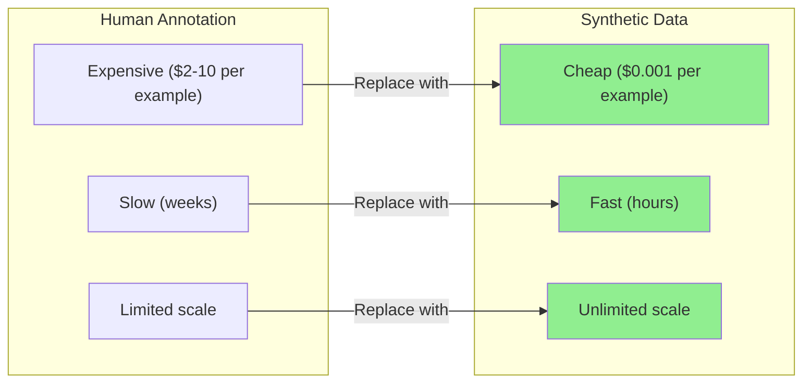
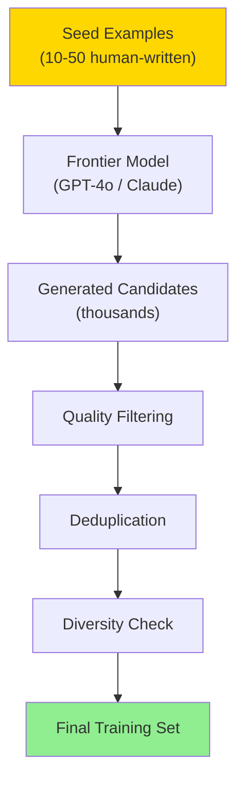
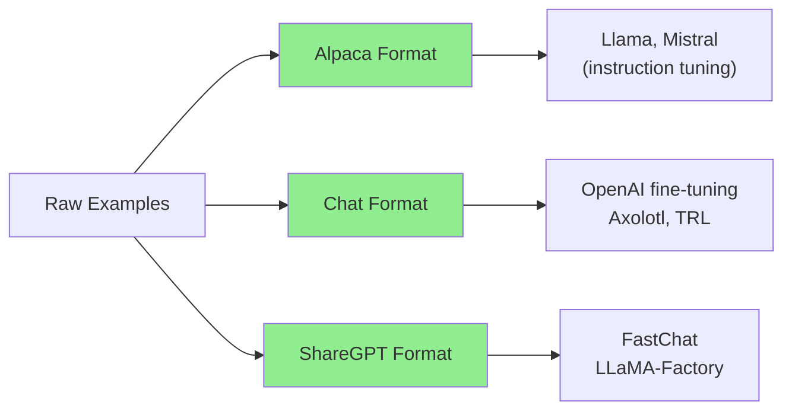
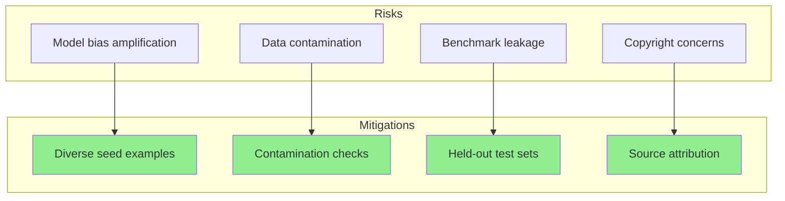
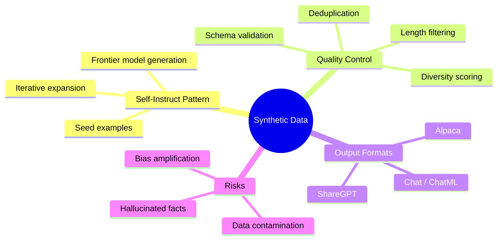

# Synthetic Data Generation

Fine-tuning an LLM requires thousands of high-quality examples, but human annotation is expensive and slow. Synthetic data generation uses frontier models to create training data at scale -- producing diverse, domain-specific examples for a fraction of the cost. This guide walks you through building a complete synthetic data pipeline.

> **Coming from Software Engineering?** Synthetic data generation is like property-based testing for ML -- you define the shape of good data, then auto-generate thousands of examples. Just as tools like Hypothesis generate test inputs from specifications, you use a powerful LLM to generate training examples from seed data and quality constraints. The pipeline even looks similar: define schema, generate candidates, filter invalid ones.

---

## Why Synthetic Data?



| Aspect | Human Annotation | Synthetic Data |
|--------|-----------------|----------------|
| Cost per 1K examples | $2,000-$10,000 | $1-$10 |
| Time to 10K examples | 2-4 weeks | 2-4 hours |
| Domain expertise | Required | Encoded in prompts |
| Consistency | Variable | High |
| Diversity | Limited by annotators | Controllable |
| Risk | Low | Model bias, contamination |

---

## The Self-Instruct Pattern

The most common approach: start with a handful of seed examples, use a frontier model to generate more, then filter for quality.



```python
from openai import OpenAI
import json

client = OpenAI()

# Step 1: Define seed examples
seed_examples = [
    {
        "instruction": "Convert this temperature from Fahrenheit to Celsius",
        "input": "72°F",
        "output": "72°F is equal to 22.2°C. Formula: (72 - 32) × 5/9 = 22.2"
    },
    {
        "instruction": "Explain this Python error message",
        "input": "TypeError: unsupported operand type(s) for +: 'int' and 'str'",
        "output": "This error means you tried to add an integer and a string together. Python doesn't automatically convert types. Fix: convert one to match the other, e.g., str(number) + text or number + int(text)."
    },
    {
        "instruction": "Write a SQL query for this request",
        "input": "Find all users who signed up in the last 30 days",
        "output": "SELECT * FROM users WHERE created_at >= NOW() - INTERVAL '30 days' ORDER BY created_at DESC;"
    },
]

# Step 2: Generate new examples using a frontier model
def generate_examples(seed_examples: list, num_to_generate: int = 10) -> list:
    """Generate new instruction-response pairs from seeds."""

    seed_text = "\n\n".join([
        f"Instruction: {ex['instruction']}\nInput: {ex['input']}\nOutput: {ex['output']}"
        for ex in seed_examples
    ])

    prompt = f"""Here are some example instruction-input-output triples for a coding assistant:

{seed_text}

Generate {num_to_generate} NEW and DIVERSE instruction-input-output triples.
Requirements:
- Cover different programming topics (debugging, SQL, APIs, data structures, etc.)
- Vary difficulty from beginner to intermediate
- Make outputs detailed and educational
- Do NOT repeat or closely paraphrase the examples above

Return as a JSON array with keys: instruction, input, output"""

    response = client.chat.completions.create(
        model="gpt-4o",
        messages=[{"role": "user", "content": prompt}],
        temperature=0.9,  # Higher temperature for diversity
        response_format={"type": "json_object"},
    )

    result = json.loads(response.choices[0].message.content)
    return result.get("examples", result.get("data", []))

generated = generate_examples(seed_examples, num_to_generate=20)
print(f"Generated {len(generated)} new examples")
```

---

## Quality Filtering

Not all generated examples are good. Filter aggressively.

```python
from pydantic import BaseModel, validator
from openai import OpenAI
import hashlib

client = OpenAI()

class TrainingExample(BaseModel):
    instruction: str
    input: str
    output: str

    @validator("instruction")
    def instruction_not_empty(cls, v):
        if len(v.strip()) < 10:
            raise ValueError("Instruction too short")
        return v

    @validator("output")
    def output_has_substance(cls, v):
        if len(v.strip()) < 20:
            raise ValueError("Output too short to be useful")
        return v

def filter_quality(examples: list) -> list:
    """Filter examples for quality."""
    filtered = []

    for ex in examples:
        # 1. Schema validation
        try:
            validated = TrainingExample(**ex)
        except Exception:
            continue

        # 2. Length checks
        if len(validated.output) < 50:
            continue  # Too short to be educational
        if len(validated.output) > 2000:
            continue  # Too long, may be rambling

        # 3. No refusals or meta-commentary
        refusal_phrases = [
            "I cannot", "I can't", "as an AI", "I don't have",
            "I'm not able", "here is an example",
        ]
        if any(phrase in validated.output.lower() for phrase in refusal_phrases):
            continue

        filtered.append(validated.model_dump())

    print(f"Kept {len(filtered)}/{len(examples)} examples after quality filter")
    return filtered
```

---

## Deduplication

Frontier models often generate near-duplicates. Remove them.

```python
from difflib import SequenceMatcher

def compute_hash(text: str) -> str:
    """Compute hash for exact dedup."""
    normalized = text.lower().strip()
    return hashlib.md5(normalized.encode()).hexdigest()

def is_near_duplicate(text1: str, text2: str, threshold: float = 0.85) -> bool:
    """Check if two texts are near-duplicates."""
    return SequenceMatcher(None, text1.lower(), text2.lower()).ratio() > threshold

def deduplicate(examples: list) -> list:
    """Remove exact and near-duplicate examples."""
    seen_hashes = set()
    unique = []

    for ex in examples:
        # Exact dedup on instruction + input
        key = compute_hash(ex["instruction"] + ex["input"])
        if key in seen_hashes:
            continue
        seen_hashes.add(key)

        # Near-duplicate check against kept examples
        is_dup = False
        for kept in unique:
            if is_near_duplicate(ex["instruction"], kept["instruction"]):
                is_dup = True
                break

        if not is_dup:
            unique.append(ex)

    print(f"Kept {len(unique)}/{len(examples)} after deduplication")
    return unique
```

---

## Diversity Scoring

Ensure your dataset covers a broad range of topics, not just variations of the same thing.

```python
from collections import Counter

def score_diversity(examples: list) -> dict:
    """Score dataset diversity across multiple dimensions."""

    # Instruction length distribution
    lengths = [len(ex["instruction"].split()) for ex in examples]
    avg_length = sum(lengths) / len(lengths)

    # Topic clustering (simple keyword approach)
    topic_keywords = {
        "python": ["python", "def ", "class ", "import"],
        "sql": ["sql", "select", "query", "database"],
        "debugging": ["error", "bug", "fix", "debug"],
        "api": ["api", "endpoint", "request", "http"],
        "data_structures": ["list", "dict", "array", "tree", "graph"],
    }

    topic_counts = Counter()
    for ex in examples:
        text = (ex["instruction"] + " " + ex["input"]).lower()
        for topic, keywords in topic_keywords.items():
            if any(kw in text for kw in keywords):
                topic_counts[topic] += 1

    # Output length distribution
    output_lengths = [len(ex["output"].split()) for ex in examples]

    return {
        "total_examples": len(examples),
        "avg_instruction_words": round(avg_length, 1),
        "topic_distribution": dict(topic_counts),
        "avg_output_words": round(sum(output_lengths) / len(output_lengths), 1),
        "coverage": len(topic_counts) / len(topic_keywords),
    }

diversity = score_diversity(filtered_examples)
print(f"Topic coverage: {diversity['coverage']:.0%}")
print(f"Topics: {diversity['topic_distribution']}")
```

---

## Formatting for Fine-Tuning

Different fine-tuning approaches expect different formats.

### Alpaca Format (Instruction Tuning)

```python
def to_alpaca_format(examples: list) -> list:
    """Convert to Alpaca/Stanford format."""
    return [
        {
            "instruction": ex["instruction"],
            "input": ex["input"],
            "output": ex["output"],
        }
        for ex in examples
    ]
```

### Chat Format (ChatML / OpenAI)

```python
def to_chat_format(examples: list, system_prompt: str = "") -> list:
    """Convert to chat/conversation format."""
    formatted = []
    for ex in examples:
        conversation = {
            "messages": [
                {"role": "system", "content": system_prompt or "You are a helpful coding assistant."},
                {"role": "user", "content": f"{ex['instruction']}\n\n{ex['input']}"},
                {"role": "assistant", "content": ex["output"]},
            ]
        }
        formatted.append(conversation)
    return formatted
```

### ShareGPT Format

```python
def to_sharegpt_format(examples: list) -> list:
    """Convert to ShareGPT format (used by many open-source trainers)."""
    formatted = []
    for ex in examples:
        conversation = {
            "conversations": [
                {"from": "human", "value": f"{ex['instruction']}\n\n{ex['input']}"},
                {"from": "gpt", "value": ex["output"]},
            ]
        }
        formatted.append(conversation)
    return formatted
```



---

## End-to-End Pipeline

```python
import json
from pathlib import Path

def run_synthetic_data_pipeline(
    seed_examples: list,
    target_count: int = 1000,
    output_path: str = "training_data.jsonl",
    batch_size: int = 20,
):
    """Run the full synthetic data generation pipeline."""

    all_examples = list(seed_examples)  # Start with seeds
    iterations = 0

    while len(all_examples) < target_count:
        iterations += 1
        print(f"\n--- Iteration {iterations} ---")

        # Generate new examples
        new_examples = generate_examples(
            seed_examples=seed_examples,  # Always use original seeds for consistency
            num_to_generate=batch_size,
        )
        print(f"Generated: {len(new_examples)}")

        # Quality filter
        quality_filtered = filter_quality(new_examples)

        # Add to pool
        all_examples.extend(quality_filtered)

        # Deduplicate the entire pool
        all_examples = deduplicate(all_examples)

        print(f"Total after iteration {iterations}: {len(all_examples)}")

    # Final diversity check
    diversity = score_diversity(all_examples)
    print(f"\nFinal dataset: {diversity['total_examples']} examples")
    print(f"Topic coverage: {diversity['coverage']:.0%}")

    # Format and save
    formatted = to_chat_format(all_examples)

    output = Path(output_path)
    with output.open("w") as f:
        for item in formatted:
            f.write(json.dumps(item) + "\n")

    print(f"Saved to {output_path}")
    return all_examples

# Run it
final_data = run_synthetic_data_pipeline(
    seed_examples=seed_examples,
    target_count=500,
    output_path="coding_assistant_train.jsonl",
)
```

---

## Ethical Considerations



Key risks to watch for:
- **Bias amplification**: The generator model's biases get baked into training data
- **Data contamination**: Generated data may contain memorized benchmark answers
- **Hallucinated facts**: Frontier models confidently generate incorrect information
- **Homogeneity**: Without careful prompting, outputs converge to similar patterns

Mitigations:
- Use diverse seed examples that represent edge cases and minority patterns
- Run contamination checks against common benchmarks (MMLU, HumanEval, etc.)
- Have humans spot-check a random sample (even 50-100 examples helps)
- Vary temperature, system prompts, and generation strategies across batches

---

## Summary



---

## Quick Reference

```python
# Generate with frontier model
response = client.chat.completions.create(
    model="gpt-4o",
    messages=[{"role": "user", "content": generation_prompt}],
    temperature=0.9,
)

# Validate with Pydantic
validated = TrainingExample(**raw_example)

# Dedup with SequenceMatcher
is_dup = SequenceMatcher(None, text1, text2).ratio() > 0.85

# Save as JSONL
with open("train.jsonl", "w") as f:
    for item in data:
        f.write(json.dumps(item) + "\n")
```

---

## Exercises

1. **Domain Pipeline**: Build a synthetic data pipeline for a specific domain (legal Q&A, medical triage, or code review). Start with 10 seed examples and generate 200 filtered examples. Measure topic coverage.

2. **Quality Showdown**: Generate 100 examples at temperature 0.5 and 100 at temperature 1.0. Compare quality (manually score 20 from each batch) and diversity. Which temperature produces better training data?

3. **Contamination Detector**: Write a script that checks your synthetic dataset against a set of known benchmark questions (e.g., from MMLU or HumanEval). Flag any examples with >80% similarity to benchmark items.

---

## What's Next?

With training data in hand, let's understand the **fundamentals of fine-tuning** -- LoRA, QLoRA, and when to use each!
