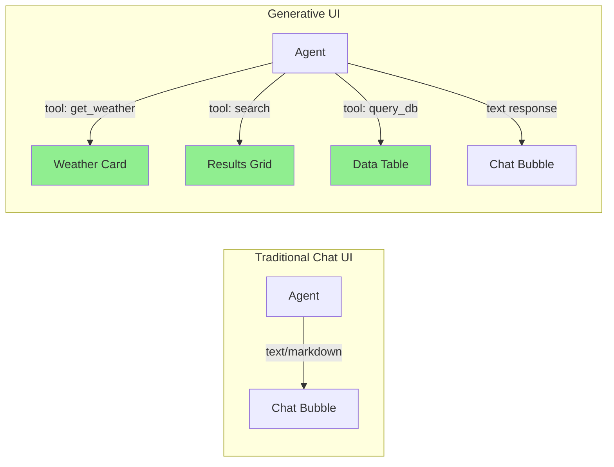
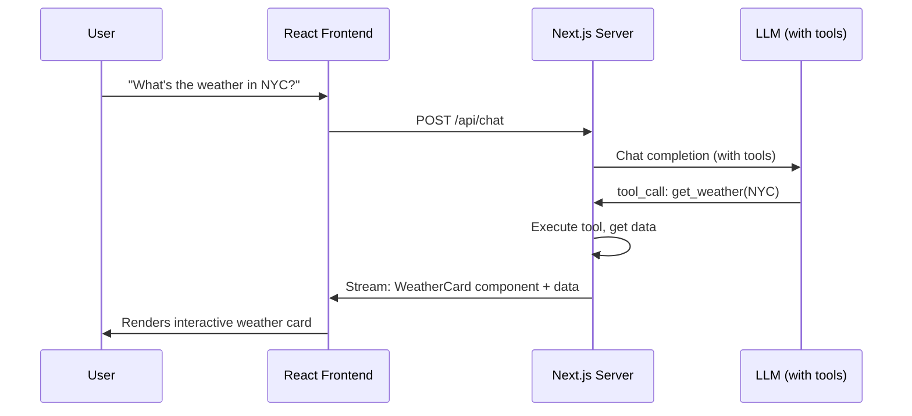
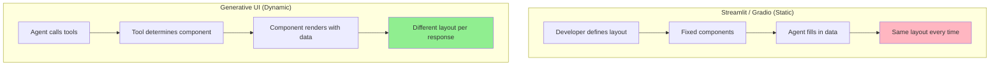
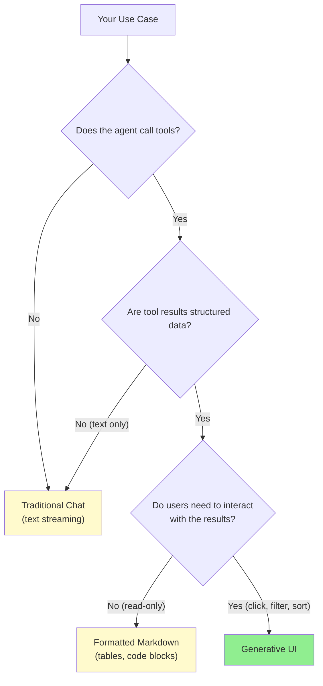
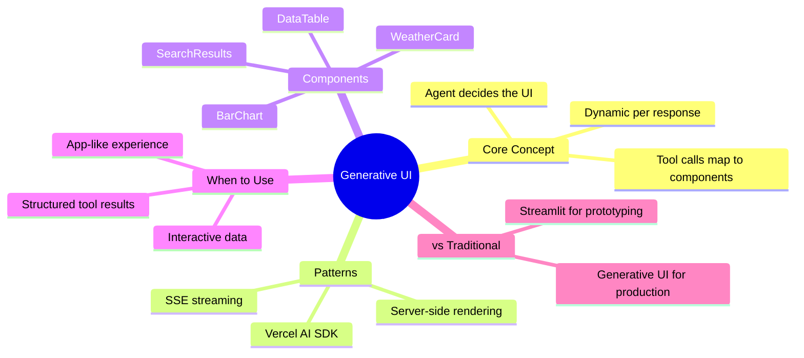

# Agentic UI / Generative UI

Your agent is smart. It calls tools, retrieves data, runs calculations. But the user sees... a wall of markdown text. **Generative UI** changes this: instead of rendering plain text, your agent renders **dynamic UI components** -- charts, forms, tables, interactive cards -- based on what tool it called. The agent decides both the data AND how to display it.

> **Coming from Software Engineering?** Generative UI is like server-side rendering, but the server is an LLM -- it decides both the data AND the component to display it. Think of it as a dynamic component factory: instead of hardcoding which React component handles each API response, the agent streams the right component based on context. If you've built server-driven UIs (like Airbnb's or Instagram's backend-driven rendering), this is the AI-native version of that pattern.

---

## Beyond Markdown Streaming



The key insight: **tool calls map to UI components**. When your agent calls `get_weather`, the frontend doesn't just show the JSON -- it renders a weather card. When it calls `search`, the frontend renders a results grid. The agent's tool choice drives the entire UI.

---

## The Vercel AI SDK Pattern

The Vercel AI SDK pioneered this pattern: stream React components from the server alongside text tokens. The server decides what component to render based on the tool call.



```python
# Server-side: mapping tool calls to UI components (Python/FastAPI equivalent)
from fastapi import FastAPI
from fastapi.responses import StreamingResponse
from pydantic import BaseModel
import json

app = FastAPI()

# Define the mapping: tool name -> UI component type
TOOL_UI_MAP = {
    "get_weather":   "WeatherCard",
    "search_web":    "SearchResults",
    "query_database": "DataTable",
    "get_chart_data": "BarChart",
    "create_form":   "DynamicForm",
}

class UIComponent(BaseModel):
    """A UI component streamed to the frontend."""
    type: str           # Component name (e.g., "WeatherCard")
    props: dict         # Data to pass to the component
    tool_call_id: str   # Link back to the tool call

def tool_call_to_component(tool_name: str, tool_result: dict, call_id: str) -> UIComponent:
    """Convert a tool call result into a UI component."""
    component_type = TOOL_UI_MAP.get(tool_name, "GenericCard")

    return UIComponent(
        type=component_type,
        props=tool_result,
        tool_call_id=call_id,
    )

# Example: weather tool returns data, we stream a WeatherCard
weather_data = {"city": "New York", "temp": 72, "condition": "Sunny", "humidity": 45}
component = tool_call_to_component("get_weather", weather_data, "call_001")
print(f"Streaming component: {component.type} with props: {component.props}")
```

---

## Streaming UI Components Over SSE

```python
from openai import OpenAI
import json

client = OpenAI()

# Tool definitions for the LLM
tools = [
    {
        "type": "function",
        "function": {
            "name": "get_weather",
            "description": "Get weather for a city",
            "parameters": {
                "type": "object",
                "properties": {
                    "city": {"type": "string"},
                },
                "required": ["city"]
            }
        }
    },
    {
        "type": "function",
        "function": {
            "name": "search_products",
            "description": "Search for products",
            "parameters": {
                "type": "object",
                "properties": {
                    "query": {"type": "string"},
                    "max_results": {"type": "integer", "default": 5},
                },
                "required": ["query"]
            }
        }
    },
]

# Simulated tool execution
def execute_tool(name: str, args: dict) -> dict:
    """Execute a tool and return structured data."""
    if name == "get_weather":
        return {"city": args["city"], "temp": 72, "condition": "Sunny", "high": 78, "low": 65}
    elif name == "search_products":
        return {
            "results": [
                {"name": "Widget A", "price": 29.99, "rating": 4.5},
                {"name": "Widget B", "price": 19.99, "rating": 4.2},
                {"name": "Widget C", "price": 39.99, "rating": 4.8},
            ]
        }
    return {"error": "Unknown tool"}

@app.post("/api/chat/generative")
async def generative_chat(message: str):
    """Chat endpoint that streams UI components for tool calls."""

    async def generate():
        response = client.chat.completions.create(
            model="gpt-4o",
            messages=[{"role": "user", "content": message}],
            tools=tools,
        )

        choice = response.choices[0]

        # If the model called tools, stream UI components
        if choice.message.tool_calls:
            for tool_call in choice.message.tool_calls:
                fn_name = tool_call.function.name
                fn_args = json.loads(tool_call.function.arguments)

                # Execute the tool
                result = execute_tool(fn_name, fn_args)

                # Stream a UI component event
                component = {
                    "type": "ui_component",
                    "component": TOOL_UI_MAP.get(fn_name, "GenericCard"),
                    "props": result,
                    "id": tool_call.id,
                }
                yield f"data: {json.dumps(component)}\n\n"

        # Stream any text content
        if choice.message.content:
            yield f"data: {json.dumps({'type': 'text', 'content': choice.message.content})}\n\n"

        yield f"data: {json.dumps({'type': 'done'})}\n\n"

    return StreamingResponse(generate(), media_type="text/event-stream")
```

---

## Comparison: Static vs Generative UI



| Feature | Streamlit/Gradio | Generative UI |
|---------|-----------------|---------------|
| Layout | Fixed by developer | Dynamic per response |
| Components | Pre-defined set | Agent-selected |
| Interactivity | Form inputs | Contextual actions |
| Complexity | Low | Medium-High |
| Best for | Prototyping, internal tools | Production chat UIs |
| Framework | Python-only | React/Next.js + Python backend |

---

## Building a Generative UI: Weather + Search Example

```python
# Frontend component registry (conceptual -- actual implementation in React/TypeScript)
# This shows the data contract between backend and frontend

COMPONENT_REGISTRY = {
    "WeatherCard": {
        "description": "Displays weather info with icon, temperature, and forecast",
        "required_props": ["city", "temp", "condition"],
        "optional_props": ["high", "low", "humidity", "icon"],
        "example": {
            "city": "San Francisco",
            "temp": 62,
            "condition": "Foggy",
            "high": 68,
            "low": 55,
        }
    },
    "SearchResults": {
        "description": "Grid of search result cards with title, snippet, and link",
        "required_props": ["results"],
        "optional_props": ["total_count", "query"],
        "example": {
            "query": "best restaurants",
            "results": [
                {"title": "Top 10 Spots", "snippet": "...", "url": "https://..."},
            ],
            "total_count": 42,
        }
    },
    "DataTable": {
        "description": "Sortable, filterable table for structured data",
        "required_props": ["columns", "rows"],
        "optional_props": ["title", "sortable", "filterable"],
        "example": {
            "title": "Sales Report",
            "columns": ["Date", "Revenue", "Orders"],
            "rows": [["2024-01-01", "$1,200", 15]],
        }
    },
    "BarChart": {
        "description": "Bar chart for comparing values across categories",
        "required_props": ["labels", "values"],
        "optional_props": ["title", "color", "x_label", "y_label"],
        "example": {
            "title": "Monthly Revenue",
            "labels": ["Jan", "Feb", "Mar"],
            "values": [1200, 1800, 1500],
        }
    },
}

def validate_component_props(component_type: str, props: dict) -> bool:
    """Validate that a component has all required props."""
    if component_type not in COMPONENT_REGISTRY:
        return False

    spec = COMPONENT_REGISTRY[component_type]
    for required in spec["required_props"]:
        if required not in props:
            print(f"Missing required prop '{required}' for {component_type}")
            return False

    return True

# Validate before streaming
weather_props = {"city": "NYC", "temp": 72, "condition": "Sunny"}
print(f"WeatherCard valid: {validate_component_props('WeatherCard', weather_props)}")
```

---

## Server-Side Rendering of Tool Results

For SEO and initial load performance, you can render tool results as HTML on the server before hydrating with React on the client.

```python
from typing import Optional

def render_component_html(component_type: str, props: dict) -> str:
    """Server-side render a UI component as HTML."""

    if component_type == "WeatherCard":
        return f"""
        <div class="weather-card" data-component="WeatherCard">
            <h3>{props['city']}</h3>
            <div class="temperature">{props['temp']}°F</div>
            <div class="condition">{props['condition']}</div>
            {'<div class="range">' + str(props.get('low', '')) + '° / ' + str(props.get('high', '')) + '°</div>' if 'high' in props else ''}
        </div>
        """

    elif component_type == "DataTable":
        headers = "".join(f"<th>{col}</th>" for col in props["columns"])
        rows = ""
        for row in props["rows"]:
            cells = "".join(f"<td>{cell}</td>" for cell in row)
            rows += f"<tr>{cells}</tr>"

        return f"""
        <div class="data-table" data-component="DataTable">
            {'<h3>' + props['title'] + '</h3>' if 'title' in props else ''}
            <table>
                <thead><tr>{headers}</tr></thead>
                <tbody>{rows}</tbody>
            </table>
        </div>
        """

    elif component_type == "SearchResults":
        items = ""
        for result in props["results"]:
            items += f"""
            <div class="search-result">
                <a href="{result.get('url', '#')}">{result['title']}</a>
                <p>{result.get('snippet', '')}</p>
            </div>
            """
        return f"""
        <div class="search-results" data-component="SearchResults">
            {items}
        </div>
        """

    return f'<div class="generic-card">{json.dumps(props)}</div>'

# Example: render a weather card as HTML
html = render_component_html("WeatherCard", {"city": "NYC", "temp": 72, "condition": "Sunny", "high": 78, "low": 65})
print(html)
```

---

## When to Use Generative UI vs Traditional Chat



**Use generative UI when:**
- Tool results are structured data (weather, products, charts)
- Users need to interact with results (sort, filter, click)
- Different tools need different visual treatments
- You want a polished, app-like experience

**Stick with traditional chat when:**
- Responses are primarily text
- No tool calling involved
- Rapid prototyping / internal tools
- Team lacks frontend resources

---

## Full Example: Generative UI Chat Handler

```python
class GenerativeUIHandler:
    """Complete handler that processes messages and returns UI components."""

    def __init__(self):
        self.client = OpenAI()
        self.tool_ui_map = TOOL_UI_MAP
        self.tools = tools  # Tool definitions from earlier

    def process_message(self, user_message: str) -> list[dict]:
        """Process a user message and return a list of UI events."""
        events = []

        response = self.client.chat.completions.create(
            model="gpt-4o",
            messages=[{"role": "user", "content": user_message}],
            tools=self.tools,
        )

        choice = response.choices[0]

        # Handle tool calls -> UI components
        if choice.message.tool_calls:
            for tool_call in choice.message.tool_calls:
                fn_name = tool_call.function.name
                fn_args = json.loads(tool_call.function.arguments)

                # Execute tool
                result = execute_tool(fn_name, fn_args)

                # Map to UI component
                component_type = self.tool_ui_map.get(fn_name, "GenericCard")

                # Validate props
                if validate_component_props(component_type, result):
                    events.append({
                        "type": "ui_component",
                        "component": component_type,
                        "props": result,
                    })
                else:
                    # Fallback to text if validation fails
                    events.append({
                        "type": "text",
                        "content": f"Here's what I found: {json.dumps(result, indent=2)}"
                    })

        # Handle text response
        if choice.message.content:
            events.append({
                "type": "text",
                "content": choice.message.content,
            })

        return events

# Usage
# handler = GenerativeUIHandler()
# events = handler.process_message("What's the weather in Tokyo?")
# for event in events:
#     if event["type"] == "ui_component":
#         print(f"Render: {event['component']} with {event['props']}")
#     else:
#         print(f"Text: {event['content']}")
```

---

## Summary



---

## Quick Reference

```python
# Core pattern: tool name -> UI component
TOOL_UI_MAP = {
    "get_weather":    "WeatherCard",
    "search_web":     "SearchResults",
    "query_database": "DataTable",
}

# Stream UI components over SSE
yield f"data: {json.dumps({'type': 'ui_component', 'component': 'WeatherCard', 'props': data})}\n\n"

# Validate component props before rendering
validate_component_props("WeatherCard", {"city": "NYC", "temp": 72, "condition": "Sunny"})

# Decision: use generative UI when
# - Agent calls tools with structured results
# - Users need to interact with the data
# - Different tools need different visual treatments
```

---

## Exercises

1. **Component Registry**: Build a component registry with 5 tool-to-component mappings. Each mapping should include the tool definition, the component name, required props, and a validation function. Test with mock tool outputs.

2. **SSE Streaming Demo**: Create a FastAPI endpoint that accepts a user message, calls an LLM with tools, and streams back a mix of text events and UI component events over Server-Sent Events. Test with curl.

3. **Fallback Strategy**: Implement a generative UI handler that gracefully degrades -- if a tool result doesn't match the expected component schema, it falls back to formatted markdown. Test with both valid and invalid tool outputs.

---

## What's Next?

Now let's refine our UI skills by learning to **display rich content** -- tables, charts, and interactive elements!
