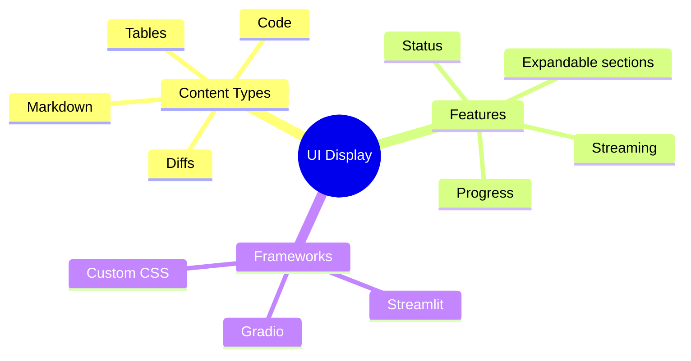

# Displaying Markdown, Tables & Agent Reasoning in UIs

Make your agent's output beautiful and understandable! This guide shows you how to display rich content in Streamlit and Gradio.

> **Coming from Software Engineering?** This is frontend rendering — taking structured data and displaying it nicely. If you've worked with template engines (Jinja2, Handlebars), component libraries (Material UI), or even just rendered API responses in a UI, these are the same skills. The AI-specific challenge is rendering streaming content (tokens arriving one by one) and displaying agent "thinking" steps transparently, which is like building a live log viewer.

---

## Markdown Rendering

### Streamlit Markdown

```python
import streamlit as st

# Basic markdown
st.markdown("""
# Agent Response

Here's what I found:

- **Point 1**: Important finding
- **Point 2**: Another discovery
- **Point 3**: Final observation

> This is a key quote from the research.

Learn more at [this link](https://example.com).
""")

# With syntax highlighting
st.markdown("""
```python
def hello():
    print("Hello, World!")
```
""")

# Unsafe HTML (when needed)
st.markdown(
    "<span style='color: red'>Important!</span>",
    unsafe_allow_html=True
)
```

### Gradio Markdown

```python
import gradio as gr

def format_response(response: str) -> str:
    """Format agent response as markdown."""
    return f"""
## Agent Analysis

{response}

---
*Generated by AI Agent*
"""

with gr.Blocks() as demo:
    output = gr.Markdown()

    def process(input_text):
        response = "This is the agent's response..."
        return format_response(response)

    gr.Textbox().submit(process, outputs=output)

demo.launch()
```

---

## Tables Display

### Streamlit Tables

```python
import streamlit as st
import pandas as pd

# From dictionary
data = {
    "Model": ["GPT-4", "Claude", "Llama 2"],
    "Parameters": ["1.7T", "Unknown", "70B"],
    "Strengths": ["Reasoning", "Safety", "Open Source"]
}
df = pd.DataFrame(data)

# Simple table
st.table(df)

# Interactive dataframe
st.dataframe(df, use_container_width=True)

# Editable dataframe
edited_df = st.data_editor(df)

# Styled dataframe
st.dataframe(
    df.style.highlight_max(axis=0),
    use_container_width=True
)
```

### Agent Results as Tables

```python
import streamlit as st
import pandas as pd

def display_search_results(results: list):
    """Display agent search results as a table."""

    if not results:
        st.warning("No results found")
        return

    df = pd.DataFrame(results)

    # Add styling
    st.markdown("### Search Results")
    st.dataframe(
        df,
        column_config={
            "score": st.column_config.ProgressColumn(
                "Relevance",
                min_value=0,
                max_value=1,
                format="%.2f"
            ),
            "url": st.column_config.LinkColumn("Source")
        },
        use_container_width=True
    )

# Example usage
results = [
    {"title": "Result 1", "score": 0.95, "url": "https://example.com/1"},
    {"title": "Result 2", "score": 0.82, "url": "https://example.com/2"},
    {"title": "Result 3", "score": 0.71, "url": "https://example.com/3"},
]
display_search_results(results)
```

---

## Agent Reasoning Steps

### Expandable Steps

```python
import streamlit as st

def display_reasoning(steps: list):
    """Display agent reasoning steps."""

    st.markdown("### Agent Reasoning")

    for i, step in enumerate(steps):
        with st.expander(f"Step {i+1}: {step['type']}", expanded=(i == len(steps)-1)):
            if step['type'] == 'thought':
                st.info(f"💭 {step['content']}")
            elif step['type'] == 'action':
                st.warning(f"🔧 Action: {step['action']}")
                st.code(step.get('input', ''))
            elif step['type'] == 'observation':
                st.success(f"👁️ {step['content']}")
            elif step['type'] == 'answer':
                st.markdown(f"**✅ Final Answer:**\n\n{step['content']}")

# Example
steps = [
    {"type": "thought", "content": "I need to search for information about Python"},
    {"type": "action", "action": "search", "input": "Python programming basics"},
    {"type": "observation", "content": "Found 10 relevant results"},
    {"type": "thought", "content": "Let me summarize the findings"},
    {"type": "answer", "content": "Python is a versatile programming language..."}
]
display_reasoning(steps)
```

### Timeline View

```python
import streamlit as st

def display_timeline(steps: list):
    """Display reasoning as a timeline."""

    st.markdown("### Agent Timeline")

    for i, step in enumerate(steps):
        col1, col2 = st.columns([1, 10])

        with col1:
            # Icon based on step type
            icons = {
                "thought": "💭",
                "action": "⚡",
                "observation": "👁️",
                "answer": "✅"
            }
            st.markdown(f"### {icons.get(step['type'], '•')}")

        with col2:
            st.markdown(f"**{step['type'].title()}**")
            st.markdown(step['content'])

        if i < len(steps) - 1:
            st.markdown("---")
```

---

## Code Display

### Syntax Highlighted Code

```python
import streamlit as st

def display_code_result(code: str, language: str = "python", output: str = None):
    """Display code with syntax highlighting and output."""

    st.markdown("### Generated Code")
    st.code(code, language=language)

    if output:
        st.markdown("### Output")
        st.text(output)

# Example
code = '''
def fibonacci(n):
    if n <= 1:
        return n
    return fibonacci(n-1) + fibonacci(n-2)

print(fibonacci(10))
'''
display_code_result(code, "python", "55")
```

### Diff Display

```python
import streamlit as st
import difflib

def display_diff(original: str, modified: str):
    """Display differences between two texts."""

    diff = difflib.unified_diff(
        original.splitlines(keepends=True),
        modified.splitlines(keepends=True),
        fromfile='Original',
        tofile='Modified'
    )

    diff_text = ''.join(diff)

    st.markdown("### Changes")
    st.code(diff_text, language="diff")
```

---

## Rich Content in Gradio

### Combined Display

```python
import gradio as gr
import pandas as pd

def agent_response(query: str):
    """Generate rich agent response."""

    # Simulate agent work
    reasoning = """
## Reasoning Process

1. **Understanding**: Analyzed your query about Python
2. **Research**: Searched documentation and examples
3. **Synthesis**: Combined findings into response
"""

    code = '''
# Here's a solution
def greet(name):
    return f"Hello, {name}!"

print(greet("World"))
'''

    table_data = pd.DataFrame({
        "Step": ["Parse", "Analyze", "Generate"],
        "Time (ms)": [12, 45, 230],
        "Status": ["✅", "✅", "✅"]
    })

    return reasoning, code, table_data

with gr.Blocks() as demo:
    gr.Markdown("# AI Agent Interface")

    with gr.Row():
        input_box = gr.Textbox(label="Your Question")
        submit_btn = gr.Button("Ask Agent")

    with gr.Tabs():
        with gr.TabItem("Reasoning"):
            reasoning_output = gr.Markdown()

        with gr.TabItem("Code"):
            code_output = gr.Code(language="python")

        with gr.TabItem("Details"):
            table_output = gr.Dataframe()

    submit_btn.click(
        agent_response,
        inputs=[input_box],
        outputs=[reasoning_output, code_output, table_output]
    )

demo.launch()
```

---

## Streaming Display

### Streamlit Streaming

```python
import streamlit as st
import time

def stream_agent_response(prompt: str):
    """Simulate streaming agent response."""

    response_placeholder = st.empty()
    full_response = ""

    # Simulate streaming
    words = "This is a streaming response from the agent that demonstrates real-time text generation.".split()

    for word in words:
        full_response += word + " "
        response_placeholder.markdown(full_response + "▌")
        time.sleep(0.1)

    response_placeholder.markdown(full_response)

# Usage
if prompt := st.chat_input("Ask something"):
    with st.chat_message("assistant"):
        stream_agent_response(prompt)
```

### Gradio Streaming

```python
import gradio as gr
import time

def streaming_response(message, history):
    """Stream response word by word."""
    response = "This is a streaming response that appears word by word."

    partial = ""
    for word in response.split():
        partial += word + " "
        time.sleep(0.1)
        yield partial

demo = gr.ChatInterface(
    streaming_response,
    title="Streaming Agent"
)
demo.launch()
```

---

## Status and Progress

### Progress Indicators

```python
import streamlit as st
import time

def run_agent_with_progress(prompt: str):
    """Run agent with progress display."""

    progress_bar = st.progress(0)
    status_text = st.empty()

    steps = [
        ("Understanding query...", 20),
        ("Searching knowledge base...", 40),
        ("Analyzing results...", 60),
        ("Generating response...", 80),
        ("Finalizing...", 100)
    ]

    for text, progress in steps:
        status_text.text(text)
        progress_bar.progress(progress)
        time.sleep(0.5)

    progress_bar.empty()
    status_text.empty()

    return "Agent response here..."

# Usage
if st.button("Run Agent"):
    with st.spinner("Agent is working..."):
        result = run_agent_with_progress("test")
    st.success("Done!")
    st.write(result)
```

---

## Summary



---

## Quick Reference

```python
# Streamlit
st.markdown("**Bold** and *italic*")
st.table(df)
st.code("print('hello')", language="python")
st.expander("Details")

# Gradio
gr.Markdown("# Title")
gr.Dataframe(df)
gr.Code(language="python")

# Streaming
for word in response.split():
    placeholder.markdown(partial + "▌")
```

---

## What's Next?

Now let's deploy your agent to the **cloud** with Docker and production best practices!
