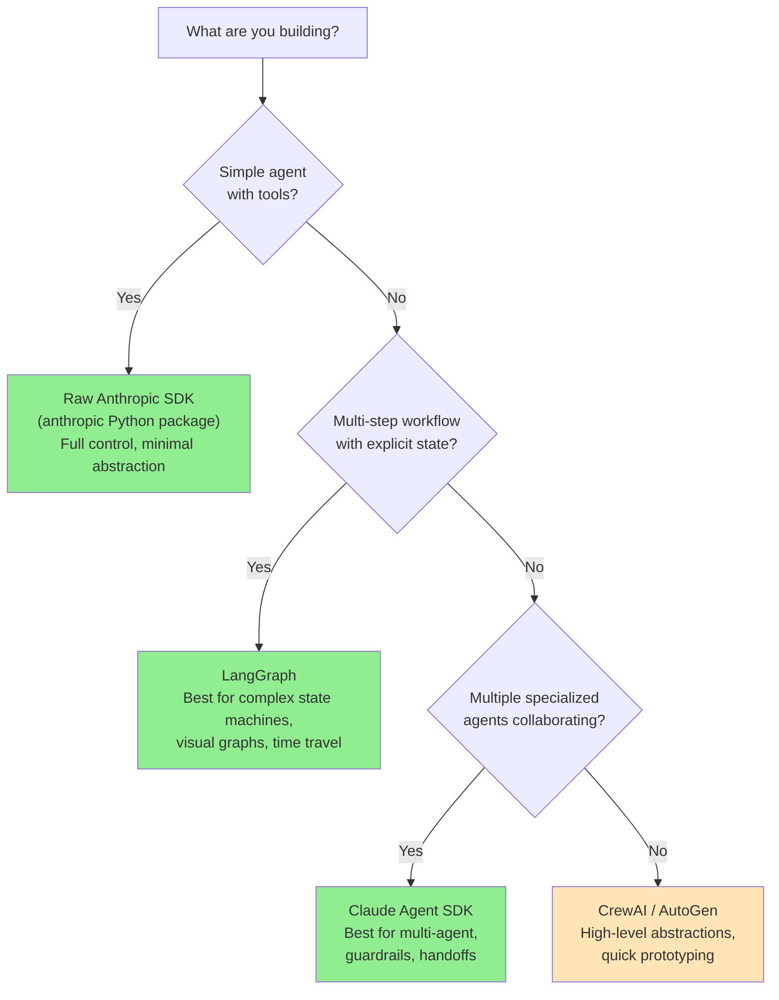
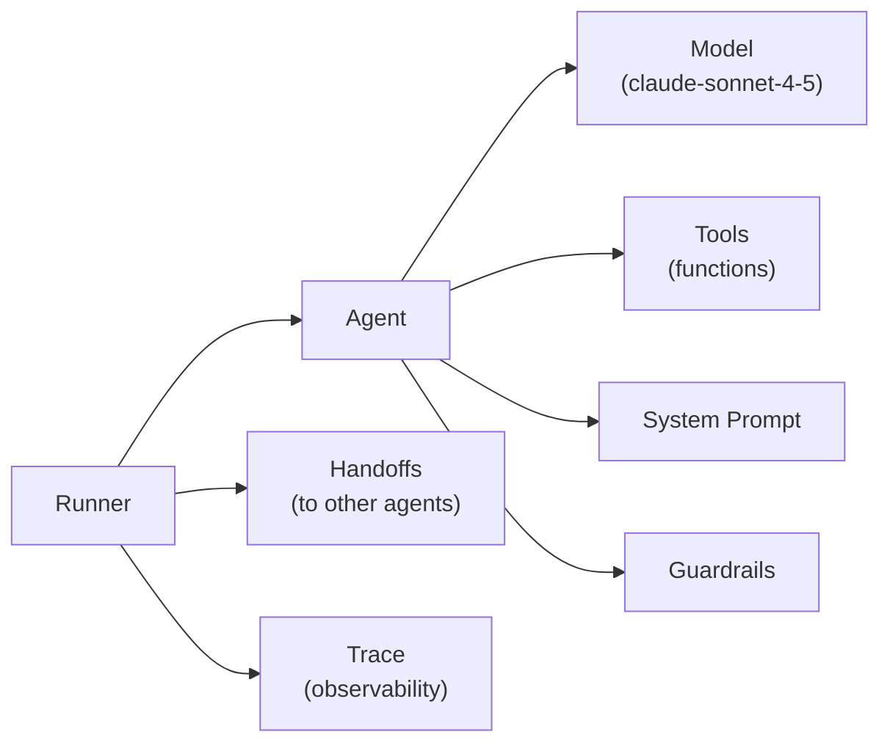

# Claude Agent SDK

You have built agents in three different ways over this journey: raw API calls with a ReAct loop, LangGraph state machines, and CrewAI multi-agent pipelines. Each had trade-offs. Now meet Anthropic's own answer to the question: what is the right way to build Claude-powered agents?

> **Coming from Software Engineering?** The Claude Agent SDK is to Claude what the AWS SDK is to AWS services — a first-party, opinionated library that handles the common patterns so you don't reinvent them. Like choosing between raw HTTP calls, Boto3, and CDK for AWS, you're choosing the right abstraction level. The SDK handles the agent loop, tool dispatch, and guardrails, similar to how a web framework handles routing, middleware, and request lifecycle.

The Claude Agent SDK (also called the Anthropic Agents SDK) is Anthropic's opinionated framework for building production agents. It handles the orchestration, tool execution, safety guardrails, and multi-agent handoffs — so you focus on the logic, not the plumbing.

---

## When to Use What



Use the Claude Agent SDK when:
- You want Anthropic's opinionated best practices baked in
- You need multi-agent orchestration with handoffs
- You want built-in guardrails and tracing
- You are building primarily with Claude (not multi-model)

---

## Installation and Setup

```bash
pip install claude-agent-sdk
# The Agent SDK is a separate package from the base anthropic SDK
```

> **API status note (April 2026):** The Claude Agent SDK is in active development and the package name, import paths, and class names shown here may have changed since these notes were written. Anthropic has also released an open-source "Agents SDK" (package: `agents`) with a similar but not identical API. Always check the [official docs](https://docs.anthropic.com/en/docs/agents) and the [GitHub repo](https://github.com/anthropics/anthropic-sdk-python) for the current installation instructions and import paths before using any code from this page.

---

## Core Concepts



- **Agent** — an AI entity with a model, tools, and instructions
- **Tool** — a Python function the agent can call
- **Runner** — executes the agent loop (handles turns, tool calls, handoffs)
- **Handoff** — transfers control from one agent to another
- **Guardrail** — validation that runs before/after agent responses

---

## Building a Basic Agent

```python
import anthropic
from claude_agent_sdk import Agent, Tool, Runner
import json

client = anthropic.Anthropic()


# Define tools as decorated functions
def search_web(query: str) -> str:
    """Search the web for current information on a topic.
    
    Args:
        query: The search query string
        
    Returns:
        Search results as formatted text
    """
    # In production, integrate with a real search API
    # For now, simulate results
    return f"Search results for '{query}':\n1. Example result 1\n2. Example result 2"


def calculate(expression: str) -> str:
    """Evaluate a mathematical expression safely.
    
    Args:
        expression: A mathematical expression like '2 + 2' or '100 * 0.15'
        
    Returns:
        The numeric result as a string
    """
    try:
        # Safe math evaluation using AST (never use eval with untrusted input!)
        import ast, operator
        def safe_eval(node):
            if isinstance(node, ast.Constant): return node.value
            elif isinstance(node, ast.BinOp):
                ops = {ast.Add: operator.add, ast.Sub: operator.sub,
                       ast.Mult: operator.mul, ast.Div: operator.truediv}
                return ops[type(node.op)](safe_eval(node.left), safe_eval(node.right))
            elif isinstance(node, ast.UnaryOp) and isinstance(node.op, ast.USub):
                return -safe_eval(node.operand)
            raise ValueError("Unsupported expression")
        result = safe_eval(ast.parse(expression, mode='eval').body)
        return str(result)
    except Exception as e:
        return f"Error: {e}"


def get_current_date() -> str:
    """Get the current date and time."""
    from datetime import datetime, timezone
    return datetime.now(timezone.utc).strftime("%Y-%m-%d %H:%M UTC")


# Create the agent
research_agent = Agent(
    name="Research Assistant",
    model="claude-sonnet-4-5",
    instructions="""You are a helpful research assistant. You have access to web search 
    and calculation tools. Use them to answer questions accurately.
    
    Always:
    - Search for current information before answering factual questions
    - Show your calculations when doing math
    - Cite your sources when possible
    """,
    tools=[
        Tool.from_function(search_web),
        Tool.from_function(calculate),
        Tool.from_function(get_current_date),
    ],
)

# Run the agent
runner = Runner(client=client)

result = runner.run(
    agent=research_agent,
    messages=[
        {"role": "user", "content": "What is 15% of $847, and when was Python first released?"}
    ],
)

print(result.final_output)
```

---

## Adding Custom Tools with Schemas

For tools that need precise input control, define the schema explicitly:

```python
from claude_agent_sdk import Tool
import requests


def query_internal_api(
    endpoint: str,
    method: str = "GET",
    params: dict | None = None,
) -> str:
    """Query the internal company API.
    
    Args:
        endpoint: API endpoint path (e.g., '/users/123' or '/orders')
        method: HTTP method - GET or POST
        params: Query parameters as a dict
        
    Returns:
        API response as JSON string
    """
    base_url = "https://api.internal.company.com"
    
    try:
        if method.upper() == "GET":
            response = requests.get(
                f"{base_url}{endpoint}",
                params=params or {},
                headers={"Authorization": "Bearer ..."},
                timeout=10,
            )
        else:
            return "Only GET requests are supported"
        
        response.raise_for_status()
        return json.dumps(response.json(), indent=2)
    except requests.Timeout:
        return "Error: API request timed out"
    except requests.HTTPError as e:
        return f"Error: API returned {e.response.status_code}"
    except Exception as e:
        return f"Error: {e}"


# Create tool with explicit schema for tighter control
api_tool = Tool(
    name="query_internal_api",
    description="Query the company's internal API to look up customer data, orders, and inventory.",
    input_schema={
        "type": "object",
        "properties": {
            "endpoint": {
                "type": "string",
                "description": "API endpoint path starting with /",
                "examples": ["/customers/search", "/orders/123"],
            },
            "method": {
                "type": "string",
                "enum": ["GET"],
                "description": "HTTP method",
                "default": "GET",
            },
            "params": {
                "type": "object",
                "description": "Query parameters",
                "additionalProperties": {"type": "string"},
            },
        },
        "required": ["endpoint"],
    },
    function=query_internal_api,
)
```

---

## Multi-Agent Orchestration with Handoffs

This is where the SDK shines. Handoffs let a triage agent route to specialist agents.

```python
from claude_agent_sdk import Agent, Tool, Runner, Handoff


# Specialist agents
billing_agent = Agent(
    name="Billing Specialist",
    model="claude-haiku-4-5",  # Cheaper model for specialized tasks
    instructions="""You are a billing specialist. You handle:
    - Invoice questions
    - Payment processing issues  
    - Refund requests
    - Subscription changes
    
    Be precise with amounts and dates. Always confirm before processing changes.""",
    tools=[
        Tool.from_function(query_internal_api),
    ],
)

technical_agent = Agent(
    name="Technical Support",
    model="claude-sonnet-4-5",
    instructions="""You are a technical support specialist. You handle:
    - Bug reports and error messages
    - Integration questions
    - API documentation questions
    - Performance issues
    
    Ask for error messages and stack traces when relevant.""",
    tools=[
        Tool.from_function(search_web),
        Tool.from_function(query_internal_api),
    ],
)

general_agent = Agent(
    name="General Support",
    model="claude-haiku-4-5",
    instructions="You handle general product questions, how-to guides, and account management.",
    tools=[Tool.from_function(search_web)],
)


# Triage agent routes to specialists
triage_agent = Agent(
    name="Support Triage",
    model="claude-haiku-4-5",
    instructions="""You are a customer support triage agent. Your job is to:
    1. Understand the customer's issue
    2. Route to the appropriate specialist:
       - Billing questions → billing_specialist
       - Technical/API issues → technical_support
       - Everything else → general_support
    
    Do NOT attempt to answer questions yourself. Always route to a specialist.""",
    handoffs=[
        Handoff(
            agent=billing_agent,
            name="billing_specialist",
            description="Route billing, payment, invoice, and refund questions here",
        ),
        Handoff(
            agent=technical_agent,
            name="technical_support",
            description="Route bug reports, API questions, and technical issues here",
        ),
        Handoff(
            agent=general_agent,
            name="general_support",
            description="Route general product and account questions here",
        ),
    ],
)


# Run with the triage agent as entry point
runner = Runner(client=client)

result = runner.run(
    agent=triage_agent,
    messages=[
        {"role": "user", "content": "I was charged twice for my subscription this month"}
    ],
)

print(f"Final agent: {result.last_agent.name}")
print(f"Answer: {result.final_output}")
```

---

## Guardrails

Guardrails run validation before or after agent responses. They are the SDK's answer to "what if the agent says something it shouldn't?"

```python
from claude_agent_sdk import InputGuardrail, OutputGuardrail, GuardrailFunctionOutput
import re


async def check_for_pii(context, agent, input_data) -> GuardrailFunctionOutput:
    """Input guardrail: detect and block PII in user messages."""
    message = str(input_data)
    
    pii_patterns = {
        "SSN": r'\b\d{3}-\d{2}-\d{4}\b',
        "Credit Card": r'\b(?:4[0-9]{12}(?:[0-9]{3})?|5[1-5][0-9]{14})\b',
    }
    
    for pii_type, pattern in pii_patterns.items():
        if re.search(pattern, message):
            return GuardrailFunctionOutput(
                output_info={"detected_pii": pii_type},
                tripwire_triggered=True,  # Block the request
            )
    
    return GuardrailFunctionOutput(
        output_info={"pii_detected": False},
        tripwire_triggered=False,  # Allow through
    )


async def check_response_quality(context, agent, output) -> GuardrailFunctionOutput:
    """Output guardrail: ensure response meets quality standards."""
    response_text = str(output)
    
    # Block responses that are too short to be useful
    if len(response_text.strip()) < 20:
        return GuardrailFunctionOutput(
            output_info={"issue": "response too short"},
            tripwire_triggered=True,
        )
    
    # Block responses containing known harmful patterns
    harmful_patterns = ["ignore previous instructions", "jailbreak"]
    for pattern in harmful_patterns:
        if pattern.lower() in response_text.lower():
            return GuardrailFunctionOutput(
                output_info={"issue": f"harmful pattern: {pattern}"},
                tripwire_triggered=True,
            )
    
    return GuardrailFunctionOutput(
        output_info={"quality": "ok"},
        tripwire_triggered=False,
    )


# Attach guardrails to agent
guarded_agent = Agent(
    name="Safe Assistant",
    model="claude-sonnet-4-5",
    instructions="You are a helpful assistant.",
    tools=[],
    input_guardrails=[
        InputGuardrail(guardrail_function=check_for_pii),
    ],
    output_guardrails=[
        OutputGuardrail(guardrail_function=check_response_quality),
    ],
)
```

---

## Tracing and Debugging

The SDK has built-in tracing. In production, you would send traces to LangSmith or your own observability platform.

```python
from claude_agent_sdk import Runner, RunConfig
import json


runner = Runner(client=client)

# Enable verbose tracing
result = runner.run(
    agent=research_agent,
    messages=[{"role": "user", "content": "What is the population of Tokyo?"}],
    run_config=RunConfig(
        workflow_name="research_query",
        trace_metadata={"user_id": "user_123", "session_id": "sess_abc"},
    ),
)

# Inspect the trace
for item in result.new_items:
    item_type = type(item).__name__
    print(f"\n--- {item_type} ---")
    
    if hasattr(item, 'message'):
        msg = item.message
        print(f"Role: {msg.role}")
        if hasattr(msg, 'content'):
            for block in msg.content:
                if hasattr(block, 'text'):
                    print(f"Text: {block.text[:200]}")
                elif hasattr(block, 'name'):
                    print(f"Tool: {block.name}({block.input})")

print(f"\nFinal output: {result.final_output}")
```

---

## Async Execution

For production web apps, use the async runner:

```python
import asyncio
from claude_agent_sdk import Runner


async def handle_user_request(user_id: str, message: str) -> str:
    """Handle a user request asynchronously."""
    async_runner = Runner(client=client)
    
    result = await async_runner.run_async(
        agent=triage_agent,
        messages=[{"role": "user", "content": message}],
        run_config=RunConfig(
            trace_metadata={"user_id": user_id},
        ),
    )
    
    return result.final_output


# FastAPI integration
from fastapi import FastAPI

app = FastAPI()


@app.post("/chat")
async def chat(user_id: str, message: str):
    response = await handle_user_request(user_id, message)
    return {"response": response}
```

---

## SDK vs LangGraph: The Real Comparison

| Feature | Claude Agent SDK | LangGraph |
|---|---|---|
| Learning curve | Low | Medium-High |
| State management | Automatic | Explicit (TypedDict) |
| Multi-model support | Claude only | Any model |
| Visual graph | No | Yes |
| Checkpointing / time travel | No | Yes |
| Guardrails | Built-in | Manual |
| Handoffs | Built-in | Manual routing |
| Streaming | Yes | Yes |
| Best for | Claude-native production agents | Complex stateful workflows |

---

## SWE to AI Engineering Bridge

| Software Pattern | SDK Equivalent |
|---|---|
| Microservices routing | Agent handoffs |
| Input validation middleware | Input guardrails |
| Response interceptors | Output guardrails |
| Distributed tracing | Runner traces |
| Service mesh | Multi-agent network |
| Worker pool | Runner executing agents |

---

## Key Takeaways

1. **The SDK is opinionated** — that's a feature, not a limitation; it encodes best practices
2. **Handoffs are the killer feature** — multi-agent routing without complex state machines
3. **Guardrails are first-class** — input and output validation are part of the agent definition
4. **Use cheap models for routing** — Haiku for triage, Sonnet for specialists
5. **Async is the production path** — `run_async` for web apps
6. **The SDK is Claude-only** — use LangGraph if you need multiple model providers

---

## Practice Exercises

1. Build a customer support system with three specialist agents (billing, technical, general) and a triage agent that routes between them
2. Add a guardrail that detects off-topic requests (not related to your product) and politely declines them
3. Implement async handling and integrate it with a FastAPI endpoint that streams the response
4. Compare the token usage of the same task run with the SDK vs raw Anthropic API calls

---

**Next up:** Model Context Protocol (MCP), where we move beyond ad-hoc prompting to systematic, measurable prompt management.
