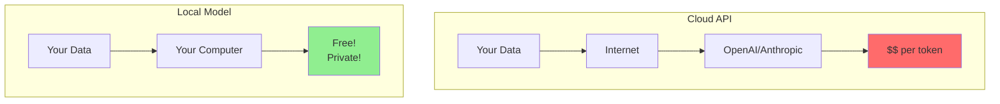
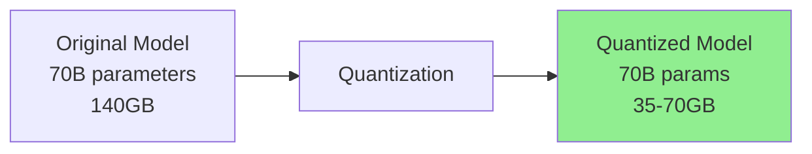
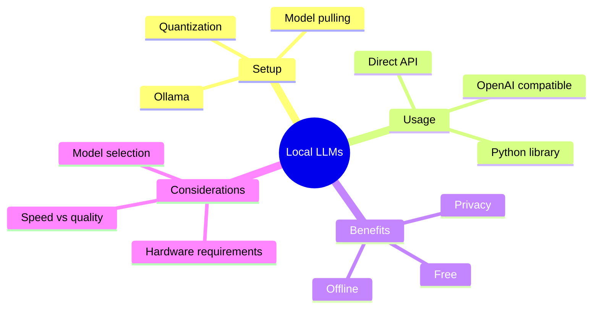

# Running Models Locally with Ollama

Welcome to Phase 6! You've learned to build powerful AI systems. Now let's explore running models **locally** - no API calls, no costs, complete privacy.

> **Coming from Software Engineering?** Ollama is like Docker for ML models — you `pull` a model, `run` it, and it exposes a local API on a port. If you've used Docker Hub to pull images and run containers locally, or even Homebrew to install services, the workflow is nearly identical. The local API is OpenAI-compatible, so your existing API integration code works unchanged — just swap the base URL to `localhost:11434`.

---

## Why Run Models Locally?



Benefits:
- **Privacy**: Data never leaves your machine
- **Cost**: No per-token charges
- **Offline**: Works without internet
- **Customization**: Fine-tune for your needs
- **Speed**: No network latency

---

## Installing Ollama

Ollama makes running local models easy:

```bash
# macOS
brew install ollama

# Linux
curl -fsSL https://ollama.com/install.sh | sh

# Windows - Download from ollama.com

# Start the server
ollama serve
```

### Pulling Models

```bash
# Pull popular models
ollama pull llama3.2         # Meta's Llama 3.2 (8B)
ollama pull llama3.2:70b     # Larger version
ollama pull mistral          # Mistral 7B
ollama pull qwen2.5-coder   # Code-specialized (modern alternative to codellama)
ollama pull phi4             # Microsoft's small model

# List downloaded models
ollama list
```

---

## Using Ollama from Python

### Direct API

```python
# script_id: day_074_ollama_local_models/ollama_api
import requests

def ollama_generate(prompt: str, model: str = "llama3.2") -> str:
    """Generate text using Ollama."""
    response = requests.post(
        "http://localhost:11434/api/generate",
        json={
            "model": model,
            "prompt": prompt,
            "stream": False
        }
    )
    return response.json()["response"]

# Usage
result = ollama_generate("Explain Python in one sentence")
print(result)
```

### Chat API

```python
# script_id: day_074_ollama_local_models/ollama_api
def ollama_chat(messages: list, model: str = "llama3.2") -> str:
    """Chat using Ollama."""
    response = requests.post(
        "http://localhost:11434/api/chat",
        json={
            "model": model,
            "messages": messages,
            "stream": False
        }
    )
    return response.json()["message"]["content"]

# Usage
result = ollama_chat([
    {"role": "system", "content": "You are a helpful assistant."},
    {"role": "user", "content": "What is machine learning?"}
])
print(result)
```

### Using the Ollama Python Library

```bash
pip install ollama
```

```python
# script_id: day_074_ollama_local_models/ollama_library
import ollama

# Simple generation
response = ollama.generate(model='llama3.2', prompt='Why is the sky blue?')
print(response['response'])

# Chat
response = ollama.chat(model='llama3.2', messages=[
    {'role': 'user', 'content': 'Hello!'}
])
print(response['message']['content'])

# Streaming
for chunk in ollama.chat(
    model='llama3.2',
    messages=[{'role': 'user', 'content': 'Tell me a joke'}],
    stream=True
):
    print(chunk['message']['content'], end='', flush=True)
```

---

## OpenAI-Compatible Interface

Use Ollama as a drop-in replacement for OpenAI:

```python
# script_id: day_074_ollama_local_models/openai_compatible
from openai import OpenAI

# Point to local Ollama server
client = OpenAI(
    base_url="http://localhost:11434/v1",
    api_key="ollama"  # Required but not used
)

# Use exactly like OpenAI!
response = client.chat.completions.create(
    model="llama3.2",
    messages=[
        {"role": "system", "content": "You are a helpful assistant."},
        {"role": "user", "content": "What is Python?"}
    ]
)

print(response.choices[0].message.content)
```

### Swap Between Local and Cloud

```python
# script_id: day_074_ollama_local_models/swap_local_cloud
from openai import OpenAI
import os

def get_llm_client(use_local: bool = False):
    """Get LLM client - local or cloud."""
    if use_local:
        return OpenAI(
            base_url="http://localhost:11434/v1",
            api_key="ollama"
        ), "llama3.2"
    else:
        return OpenAI(), "gpt-4o-mini"

# Usage - easy to switch!
client, model = get_llm_client(use_local=True)

response = client.chat.completions.create(
    model=model,
    messages=[{"role": "user", "content": "Hello!"}]
)
```

---

## Understanding Quantization

Local models use **quantization** to fit in memory:



### Quantization Levels

| Format | Bits | Size Reduction | Quality |
|--------|------|----------------|---------|
| F16 | 16-bit | 50% | Best |
| Q8 | 8-bit | 75% | Excellent |
| Q4_K_M | 4-bit | 87% | Good |
| Q4_0 | 4-bit | 87% | Acceptable |
| Q2_K | 2-bit | 94% | Degraded |

### Choosing Model Size

```python
# script_id: day_074_ollama_local_models/recommend_model
def recommend_model(available_ram_gb: int) -> str:
    """Recommend model based on available RAM."""
    if available_ram_gb >= 64:
        return "llama3.2:70b"    # Best quality
    elif available_ram_gb >= 32:
        return "llama3.2:70b-q4" # Good quality, fits in RAM
    elif available_ram_gb >= 16:
        return "llama3.2"        # 8B model
    elif available_ram_gb >= 8:
        return "phi4"            # Small but capable
    else:
        return "tinyllama"       # Minimal requirements
```

---

## Model Comparison

```python
# script_id: day_074_ollama_local_models/benchmark_models
import ollama
import time

def benchmark_models(prompt: str, models: list) -> dict:
    """Compare models on the same prompt."""
    results = {}

    for model in models:
        try:
            start = time.time()
            response = ollama.generate(model=model, prompt=prompt)
            elapsed = time.time() - start

            results[model] = {
                "response": response["response"][:200],
                "time_seconds": elapsed,
                "tokens_per_second": response.get("eval_count", 0) / elapsed if elapsed > 0 else 0
            }
        except Exception as e:
            results[model] = {"error": str(e)}

    return results

# Compare
prompt = "Explain recursion in programming"
models = ["llama3.2", "mistral", "phi4"]

results = benchmark_models(prompt, models)
for model, data in results.items():
    print(f"\n{model}:")
    print(f"  Time: {data.get('time_seconds', 'N/A'):.2f}s")
    print(f"  Speed: {data.get('tokens_per_second', 'N/A'):.1f} tok/s")
```

---

## Using Local Models in Your Code

### Replace Cloud Calls

```python
# script_id: day_074_ollama_local_models/llm_provider
class LLMProvider:
    """Unified LLM provider supporting local and cloud."""

    def __init__(self, provider: str = "openai"):
        self.provider = provider

        if provider == "ollama":
            self.client = OpenAI(
                base_url="http://localhost:11434/v1",
                api_key="ollama"
            )
            self.default_model = "llama3.2"
        elif provider == "openai":
            self.client = OpenAI()
            self.default_model = "gpt-4o-mini"

    def chat(self, messages: list, **kwargs) -> str:
        """Send chat completion request."""
        model = kwargs.pop("model", self.default_model)

        response = self.client.chat.completions.create(
            model=model,
            messages=messages,
            **kwargs
        )
        return response.choices[0].message.content

    def embed(self, text: str) -> list:
        """Get embeddings."""
        if self.provider == "ollama":
            import ollama
            # ollama.embed (input=) is the current API; it returns a list of
            # vectors under "embeddings". (The legacy ollama.embeddings(prompt=)
            # with a singular "embedding" key still exists but is deprecated.)
            response = ollama.embed(model="nomic-embed-text", input=text)
            return response["embeddings"][0]
        else:
            response = self.client.embeddings.create(
                model="text-embedding-3-small",
                input=text
            )
            return response.data[0].embedding

# Usage
llm = LLMProvider("ollama")  # or "openai"
response = llm.chat([{"role": "user", "content": "Hello!"}])
```

### Local Embeddings

```python
# script_id: day_074_ollama_local_models/local_embeddings
import ollama

# Pull embedding model
# ollama pull nomic-embed-text

def local_embed(texts: list) -> list:
    """Generate embeddings locally."""
    embeddings = []
    for text in texts:
        response = ollama.embed(
            model="nomic-embed-text",
            input=text
        )
        embeddings.append(response["embeddings"][0])
    return embeddings

# Usage
texts = ["Hello world", "Machine learning is cool"]
embeddings = local_embed(texts)
print(f"Got {len(embeddings)} embeddings of dimension {len(embeddings[0])}")
```

---

## Performance Tips

### GPU Acceleration

```bash
# Check if GPU is being used
ollama run llama3.2 --verbose

# For NVIDIA GPUs, install CUDA drivers
# Models automatically use GPU if available
```

### Concurrent Requests

```python
# script_id: day_074_ollama_local_models/concurrent_requests
import ollama
import asyncio

async def process_batch(prompts: list, model: str = "llama3.2"):
    """Process multiple prompts (note: Ollama processes sequentially)."""
    results = []
    for prompt in prompts:
        response = ollama.generate(model=model, prompt=prompt)
        results.append(response["response"])
    return results

# For true concurrency, run multiple Ollama instances
# or use vLLM for production batching
```

---

## Checkpoint

Run the `benchmark_models` script (or just `ollama run llama3.2` from the shell) and confirm you get a coherent completion back with a tokens-per-second number printed. If the call hangs or you get a connection-refused error, check that the Ollama daemon is actually running (`ollama serve`) and that you've pulled the model first (`ollama pull llama3.2`).

## Summary



---

## Quick Reference

```bash
# Ollama commands
ollama pull llama3.2      # Download model
ollama run llama3.2       # Interactive chat
ollama list               # Show models
ollama rm llama3.2        # Delete model
```

```python
# script_id: day_074_ollama_local_models/quick_reference
# Python usage
import ollama
response = ollama.chat(model='llama3.2', messages=[...])

# OpenAI-compatible
from openai import OpenAI
client = OpenAI(base_url="http://localhost:11434/v1", api_key="ollama")
```

---

## Exercises

1. **Pull and chat.** Install Ollama, `ollama pull llama3.2`, and run a single chat turn from Python with the `ollama` package. Print the response text.
2. **Swap the client, keep the code.** Point the OpenAI SDK at Ollama's `http://localhost:11434/v1` base URL and send the *same* request shape you'd send to OpenAI. Confirm your existing code path works unchanged.
3. **Compare two local models.** Pull a second model (e.g. `qwen2.5`), ask both the same prompt, and eyeball the difference in quality and latency.
4. **Inspect what you're running.** Use `ollama list` and `ollama show llama3.2` to report the model's parameter count and quantization level.

<details><summary>Solutions (approaches)</summary>

1. `import ollama; print(ollama.chat(model='llama3.2', messages=[{'role':'user','content':'hi'}])['message']['content'])`.
2. `client = OpenAI(base_url="http://localhost:11434/v1", api_key="ollama")`, then `client.chat.completions.create(model="llama3.2", messages=[...])` — only the client constructor changes.
3. Loop over `["llama3.2", "qwen2.5"]`, time each `ollama.chat` call with `time.perf_counter()`, print response + elapsed.
4. `ollama list` shows size/quant in the tag; `ollama show <model>` prints the full modelfile including parameter count.
</details>

---

## What's Next?

Now let's go deeper on **Quantization and Model Swapping** — the GGUF/AWQ/GPTQ formats, bit-level tradeoffs, and choosing the right quantization for your hardware.
