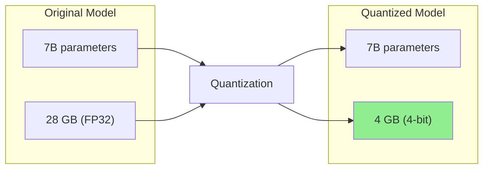
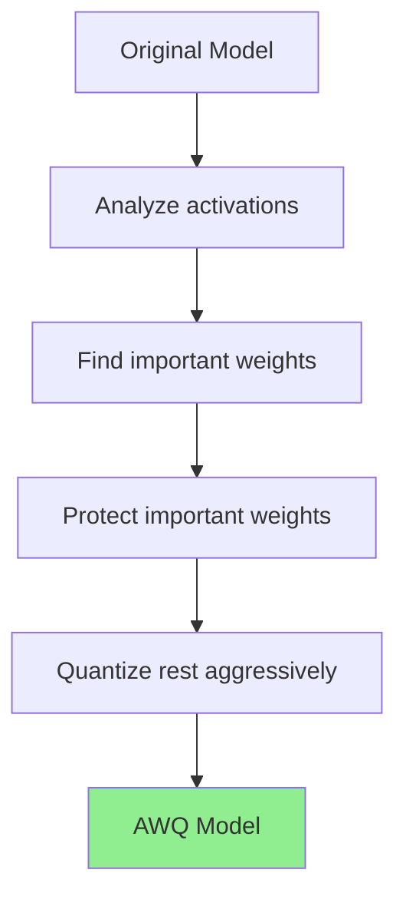
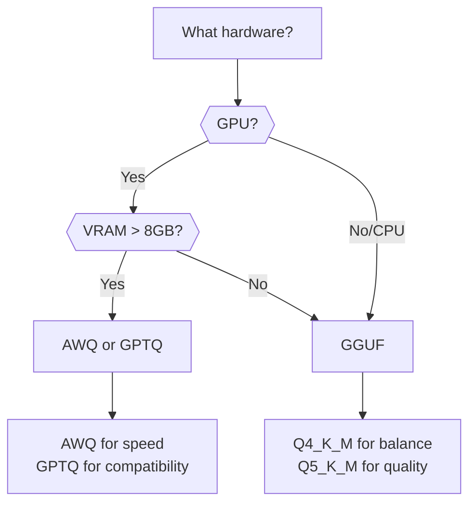
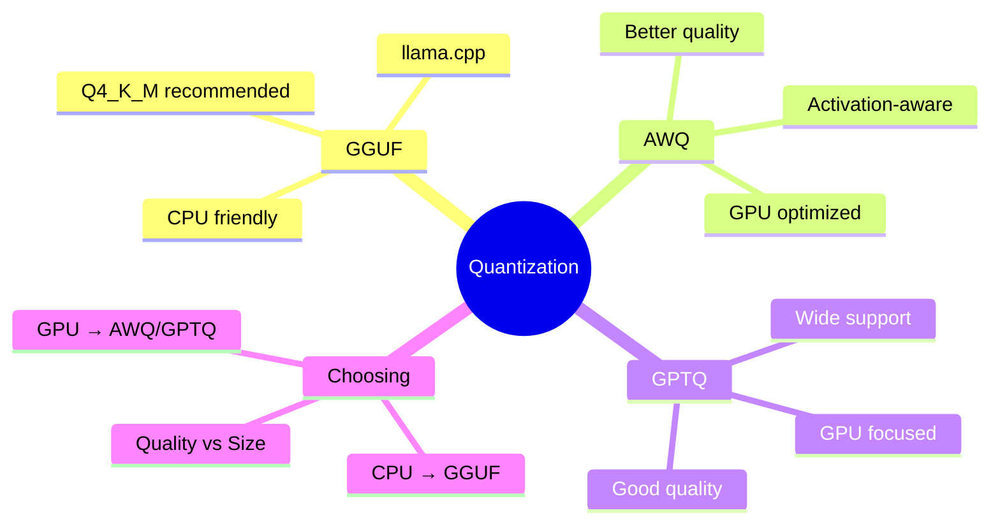
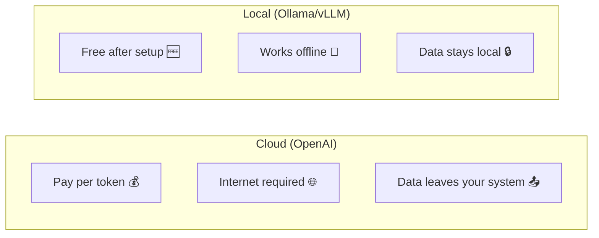
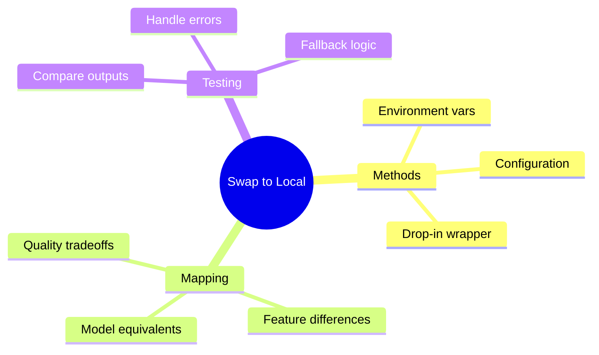

# Understanding Quantization: GGUF & AWQ

Want to run large models on your laptop? Quantization makes models smaller and faster while keeping quality. This guide explains how.

> **Coming from Software Engineering?** Quantization is like image compression (JPEG vs. PNG) or video encoding (bitrate settings) applied to neural network weights. You're trading precision for size/speed — going from 32-bit floats to 8-bit or 4-bit integers, just like going from lossless to lossy compression. The quality-vs-size tradeoff curves behave similarly: the first rounds of compression are nearly free, but aggressive compression eventually degrades output quality noticeably.

---

## What is Quantization?



Quantization reduces precision of model weights:
- **FP32**: 32 bits per parameter (full precision)
- **FP16**: 16 bits per parameter (half precision)
- **INT8**: 8 bits per parameter (1/4 size)
- **INT4**: 4 bits per parameter (1/8 size)

---

## Why Quantize?

| Aspect | Original (FP32) | Quantized (4-bit) |
|--------|-----------------|-------------------|
| Size | 28 GB | 4 GB |
| RAM needed | 32+ GB | 6 GB |
| Speed | Slow | Fast |
| Quality | Best | ~95% of original |

Trade-offs:
- **Smaller** = fits on consumer hardware
- **Faster** = better inference speed
- **Slight quality loss** = usually acceptable

---

## GGUF Format

GGUF (GPT-Generated Unified Format) is the standard for llama.cpp:

### Understanding GGUF Naming

```
llama-2-7b-chat.Q4_K_M.gguf
         │         │  │
         │         │  └─ M = Medium (size variant)
         │         └──── K = K-quant method
         └────────────── Q4 = 4-bit quantization
```

### Quantization Levels

| Name | Bits | Size (7B) | Quality | Use Case |
|------|------|-----------|---------|----------|
| Q2_K | 2-bit | ~2.5 GB | Low | Extreme constraints |
| Q3_K_S | 3-bit | ~3 GB | Fair | Very limited RAM |
| Q4_K_S | 4-bit | ~4 GB | Good | Balanced |
| Q4_K_M | 4-bit | ~4.5 GB | Better | **Recommended** |
| Q5_K_S | 5-bit | ~5 GB | Great | Quality focus |
| Q5_K_M | 5-bit | ~5.5 GB | Excellent | Best balance |
| Q6_K | 6-bit | ~6 GB | Near FP16 | Quality priority |
| Q8_0 | 8-bit | ~7.5 GB | ~FP16 | Maximum quality |

### Using GGUF with Ollama

```bash
# Ollama automatically uses GGUF
ollama pull llama3.3:7b-q4_K_M

# Or specify quantization
ollama run llama3.3:7b-chat-q5_K_M
```

### Using GGUF with llama.cpp

```bash
# Install llama.cpp
git clone https://github.com/ggerganov/llama.cpp
cd llama.cpp && make

# Download GGUF model
wget https://huggingface.co/TheBloke/Llama-2-7B-Chat-GGUF/resolve/main/llama-2-7b-chat.Q4_K_M.gguf

# Run inference (the CLI binary was renamed from `main` to `llama-cli`)
./llama-cli -m llama-2-7b-chat.Q4_K_M.gguf -p "Hello, how are you?"
```

### Using with Python

```python
# script_id: day_075_quantization_and_swapping_models/gguf_llama_cpp
from llama_cpp import Llama

# Load quantized model
llm = Llama(
    model_path="./models/llama-2-7b-chat.Q4_K_M.gguf",
    n_ctx=2048,  # Context window
    n_threads=4  # CPU threads
)

# Generate
output = llm(
    "What is machine learning?",
    max_tokens=256,
    temperature=0.7
)

print(output["choices"][0]["text"])
```

---

## AWQ Quantization

AWQ (Activation-aware Weight Quantization) preserves important weights:



### Why AWQ?

- **Smarter** quantization than uniform methods
- **Better quality** at same bit-width
- **GPU optimized** (faster than GGUF on GPU)

### Using AWQ Models

```bash
# Install dependencies
pip install autoawq transformers

# Or with vLLM
pip install vllm
```

```python
# script_id: day_075_quantization_and_swapping_models/awq_load_generate
from awq import AutoAWQForCausalLM
from transformers import AutoTokenizer

# Load AWQ model
model_path = "TheBloke/Llama-2-7B-Chat-AWQ"

model = AutoAWQForCausalLM.from_quantized(
    model_path,
    fuse_layers=True,
    trust_remote_code=True
)
tokenizer = AutoTokenizer.from_pretrained(model_path)

# Generate
prompt = "What is quantum computing?"
inputs = tokenizer(prompt, return_tensors="pt").to("cuda")

outputs = model.generate(
    **inputs,
    max_new_tokens=256,
    temperature=0.7
)

print(tokenizer.decode(outputs[0]))
```

### AWQ with vLLM

```python
# script_id: day_075_quantization_and_swapping_models/awq_with_vllm
from vllm import LLM, SamplingParams

# Load AWQ model with vLLM
llm = LLM(
    model="TheBloke/Llama-2-7B-Chat-AWQ",
    quantization="awq",
    dtype="half"
)

# Generate
sampling_params = SamplingParams(
    temperature=0.7,
    max_tokens=256
)

outputs = llm.generate(["What is AI?"], sampling_params)
print(outputs[0].outputs[0].text)
```

---

## GPTQ Quantization

Another popular GPU-focused quantization:

```python
# script_id: day_075_quantization_and_swapping_models/gptq_usage
from transformers import AutoModelForCausalLM, AutoTokenizer

# Load GPTQ model
model_name = "TheBloke/Llama-2-7B-Chat-GPTQ"

model = AutoModelForCausalLM.from_pretrained(
    model_name,
    device_map="auto",
    trust_remote_code=True
)
tokenizer = AutoTokenizer.from_pretrained(model_name)

# Generate
inputs = tokenizer("Hello!", return_tensors="pt").to("cuda")
outputs = model.generate(**inputs, max_new_tokens=100)
print(tokenizer.decode(outputs[0]))
```

---

## Choosing the Right Format



| Format | Best For | Hardware |
|--------|----------|----------|
| GGUF | CPU or mixed | Any |
| AWQ | GPU inference | NVIDIA GPU |
| GPTQ | GPU inference | NVIDIA GPU |

---

## Quantizing Your Own Models

### Convert to GGUF

```bash
# Clone llama.cpp
git clone https://github.com/ggerganov/llama.cpp
cd llama.cpp

# Convert HuggingFace model to GGUF
# (the script was renamed from convert.py to convert_hf_to_gguf.py)
python convert_hf_to_gguf.py /path/to/model --outfile model-f16.gguf

# Quantize to desired level (binary renamed from `quantize` to `llama-quantize`)
./llama-quantize model-f16.gguf model-q4_K_M.gguf Q4_K_M
```

### Create AWQ Model

```python
# script_id: day_075_quantization_and_swapping_models/create_awq_model
from awq import AutoAWQForCausalLM
from transformers import AutoTokenizer

model_path = "meta-llama/Llama-2-7b-hf"
quant_path = "llama-2-7b-awq"

# Load model
model = AutoAWQForCausalLM.from_pretrained(model_path)
tokenizer = AutoTokenizer.from_pretrained(model_path)

# Quantize
quant_config = {
    "zero_point": True,
    "q_group_size": 128,
    "w_bit": 4
}

model.quantize(tokenizer, quant_config=quant_config)

# Save
model.save_quantized(quant_path)
tokenizer.save_pretrained(quant_path)
```

---

## Quality Comparison

```python
# script_id: day_075_quantization_and_swapping_models/compare_quantizations
def compare_quantizations(prompt: str, original_model, quantized_model):
    """Compare output quality between models."""

    # Original
    original_output = original_model.generate(prompt)

    # Quantized
    quantized_output = quantized_model.generate(prompt)

    print("Original:", original_output[:200])
    print("Quantized:", quantized_output[:200])

    # Simple similarity check
    from difflib import SequenceMatcher
    similarity = SequenceMatcher(None, original_output, quantized_output).ratio()
    print(f"Similarity: {similarity:.2%}")
```

---

## Summary



---

## Quick Reference

```bash
# Ollama with quantization
ollama pull llama3.3:7b-q4_K_M

# GGUF quantization levels
Q4_K_M  # Balanced (recommended)
Q5_K_M  # Better quality
Q8_0    # Maximum quality
```

```python
# script_id: day_075_quantization_and_swapping_models/quantization_quick_ref
# GGUF with llama-cpp-python
llm = Llama(model_path="model.Q4_K_M.gguf")

# AWQ with AutoAWQ
model = AutoAWQForCausalLM.from_quantized("model-awq")

# GPTQ with transformers
model = AutoModelForCausalLM.from_pretrained("model-gptq")
```

---

## Exercises

1. **Read the labels.** Given the tags `Q4_K_M`, `Q5_K_M`, and `Q8_0`, rank them by file size and by expected quality, and explain the tradeoff in one sentence each.
2. **Pick a format for hardware.** You have (a) a CPU-only laptop and (b) a single 24GB GPU. Choose GGUF/AWQ/GPTQ for each and justify it.
3. **Quantize your own.** Take a Hugging Face model and produce a `Q4_K_M` GGUF using llama.cpp (`convert_hf_to_gguf.py` then `llama-quantize`). Note the size before/after.
4. **Measure the cost of compression.** Run the same 5 prompts through the full-precision and the Q4 version; record any quality regressions you can spot.

<details><summary>Solutions (approaches)</summary>

1. Size: `Q4_K_M < Q5_K_M < Q8_0`; quality is the reverse. Lower bits = smaller + faster but more rounding error.
2. CPU-only → GGUF (built for CPU via llama.cpp); 24GB GPU → AWQ or GPTQ (GPU-optimized, activation-aware AWQ usually edges quality).
3. `python convert_hf_to_gguf.py ./model --outfile model.f16.gguf` then `llama-quantize model.f16.gguf model.Q4_K_M.gguf Q4_K_M`; compare `ls -lh`.
4. Loop the prompts through both, diff outputs; watch for degraded reasoning/formatting on the quantized one.
</details>

---

## What's Next?

Now let's learn how to **swap OpenAI for local models** in your existing code!

---

# Swapping OpenAI for Local Models

You've built with OpenAI. Now run locally for free! This guide shows you how to swap in local models with minimal code changes.

---

## Why Swap to Local?



Benefits:
- **Cost savings**: No per-token charges
- **Privacy**: Data never leaves your machine
- **Offline**: Works without internet
- **Speed**: No network latency

---

## The OpenAI-Compatible Interface

Most local tools support OpenAI's API format:

```python
# script_id: day_075_quantization_and_swapping_models/openai_compatible_interface
# OpenAI original
from openai import OpenAI
client = OpenAI()

# Ollama (same interface!)
from openai import OpenAI
client = OpenAI(
    base_url="http://localhost:11434/v1",
    api_key="ollama"  # Required but not used
)

# The rest of your code stays the same!
response = client.chat.completions.create(
    model="llama3.3",
    messages=[{"role": "user", "content": "Hello!"}]
)
```

---

## Method 1: Environment Variable Switch

```python
# script_id: day_075_quantization_and_swapping_models/env_variable_switch
import os
from openai import OpenAI

def get_client():
    """Get appropriate client based on environment."""

    provider = os.environ.get("LLM_PROVIDER", "openai")

    if provider == "ollama":
        return OpenAI(
            base_url="http://localhost:11434/v1",
            api_key="ollama"
        )
    elif provider == "local":
        return OpenAI(
            base_url="http://localhost:8000/v1",
            api_key="local"
        )
    else:
        return OpenAI()  # Default to OpenAI

# Usage
client = get_client()
```

Set environment:
```bash
# Use OpenAI
export LLM_PROVIDER=openai

# Use Ollama
export LLM_PROVIDER=ollama

# Use local vLLM
export LLM_PROVIDER=local
```

---

## Method 2: Configuration-Based

```python
# script_id: day_075_quantization_and_swapping_models/config_based_client
from dataclasses import dataclass
from openai import OpenAI
from typing import Optional

@dataclass
class LLMConfig:
    provider: str = "openai"
    model: str = "gpt-4o-mini"
    base_url: Optional[str] = None
    api_key: Optional[str] = None

# Preset configurations
CONFIGS = {
    "openai": LLMConfig(
        provider="openai",
        model="gpt-4o-mini"
    ),
    "ollama-llama3.3": LLMConfig(
        provider="ollama",
        model="llama3.3",
        base_url="http://localhost:11434/v1",
        api_key="ollama"
    ),
    "ollama-mistral": LLMConfig(
        provider="ollama",
        model="mistral",
        base_url="http://localhost:11434/v1",
        api_key="ollama"
    ),
    "local-vllm": LLMConfig(
        provider="vllm",
        model="meta-llama/Llama-2-7b-chat-hf",
        base_url="http://localhost:8000/v1",
        api_key="token"
    )
}

class LLMClient:
    """Unified LLM client supporting multiple providers."""

    def __init__(self, config_name: str = "openai"):
        self.config = CONFIGS[config_name]
        self._setup_client()

    def _setup_client(self):
        if self.config.base_url:
            self.client = OpenAI(
                base_url=self.config.base_url,
                api_key=self.config.api_key
            )
        else:
            self.client = OpenAI()

    def chat(self, messages: list, **kwargs) -> str:
        response = self.client.chat.completions.create(
            model=self.config.model,
            messages=messages,
            **kwargs
        )
        return response.choices[0].message.content

# Usage
# Easy to switch!
client = LLMClient("ollama-llama3.3")
response = client.chat([{"role": "user", "content": "Hello!"}])
```

---

## Method 3: Drop-In Replacement

Create a wrapper that works like OpenAI:

```python
# script_id: day_075_quantization_and_swapping_models/universal_llm
from openai import OpenAI
import os

class UniversalLLM:
    """Drop-in replacement for OpenAI client."""

    def __init__(self, provider: str = None):
        provider = provider or os.environ.get("LLM_PROVIDER", "openai")

        self.provider = provider
        self.client = self._create_client()
        self.model_map = self._get_model_map()

    def _create_client(self) -> OpenAI:
        configs = {
            "openai": {"base_url": None, "api_key": None},
            "ollama": {"base_url": "http://localhost:11434/v1", "api_key": "ollama"},
            "vllm": {"base_url": "http://localhost:8000/v1", "api_key": "token"},
        }

        config = configs.get(self.provider, configs["openai"])

        if config["base_url"]:
            return OpenAI(base_url=config["base_url"], api_key=config["api_key"])
        return OpenAI()

    def _get_model_map(self) -> dict:
        """Map OpenAI model names to local equivalents."""
        return {
            "openai": {
                "gpt-4o-mini": "gpt-4o-mini",
                "gpt-4": "gpt-4",
            },
            "ollama": {
                "gpt-4o-mini": "llama3.3",
                "gpt-4": "mixtral",
            },
            "vllm": {
                "gpt-4o-mini": "meta-llama/Llama-2-7b-chat-hf",
                "gpt-4": "meta-llama/Llama-2-70b-chat-hf",
            }
        }

    def _map_model(self, model: str) -> str:
        """Map requested model to provider's model."""
        return self.model_map.get(self.provider, {}).get(model, model)

    def chat_completion(self, model: str, messages: list, **kwargs) -> str:
        """Create chat completion - same interface as OpenAI."""
        actual_model = self._map_model(model)

        response = self.client.chat.completions.create(
            model=actual_model,
            messages=messages,
            **kwargs
        )

        return response.choices[0].message.content

# Usage - exactly like OpenAI!
llm = UniversalLLM("ollama")

# This works regardless of provider
response = llm.chat_completion(
    model="gpt-4o-mini",  # Automatically mapped to llama3.3
    messages=[{"role": "user", "content": "Hello!"}]
)
```

---

## LangChain Provider Swapping

```python
# script_id: day_075_quantization_and_swapping_models/langchain_swap
from langchain_openai import ChatOpenAI
from langchain_ollama import ChatOllama

def get_langchain_llm(provider: str = "openai"):
    """Get LangChain LLM based on provider."""

    if provider == "ollama":
        return ChatOllama(model="llama3.3")
    elif provider == "local":
        return ChatOpenAI(
            base_url="http://localhost:8000/v1",
            api_key="not-needed",
            model="local-model"
        )
    else:
        return ChatOpenAI()

# Usage
llm = get_langchain_llm("ollama")
response = llm.invoke("Hello!")
```

---

## Model Quality Mapping

Choose appropriate local models:

```python
# script_id: day_075_quantization_and_swapping_models/model_quality_map
MODEL_QUALITY_MAP = {
    # OpenAI -> Local equivalents by capability
    "gpt-4o-mini": {
        "ollama": "llama3.3:7b",
        "alternatives": ["mistral:7b", "neural-chat"],
        "notes": "Good general purpose"
    },
    "gpt-4": {
        "ollama": "mixtral:8x7b",
        "alternatives": ["llama3.3:70b", "deepseek-coder:33b"],
        "notes": "Requires more resources"
    },
    "gpt-4-turbo": {
        "ollama": "mixtral:8x7b",
        "alternatives": ["llama3:70b"],
        "notes": "Best local option"
    }
}

def suggest_local_model(openai_model: str) -> dict:
    """Suggest local model equivalent."""
    return MODEL_QUALITY_MAP.get(openai_model, {
        "ollama": "llama3.3:7b",
        "notes": "Default fallback"
    })

# Usage
suggestion = suggest_local_model("gpt-4o-mini")
print(f"Use: {suggestion['ollama']}")
```

---

## Handling Differences

Local models may behave differently:

```python
# script_id: day_075_quantization_and_swapping_models/adaptive_llm
class AdaptiveLLM:
    """LLM client that adapts to provider differences."""

    def __init__(self, provider: str):
        self.provider = provider
        self.client = self._create_client()

    def generate(self, prompt: str, **kwargs) -> str:
        # Adapt parameters for local models
        if self.provider in ["ollama", "vllm"]:
            # Local models may need different defaults
            kwargs.setdefault("temperature", 0.7)  # Often need higher temp
            kwargs.setdefault("max_tokens", 512)  # Limit for speed

            # Some features not supported
            kwargs.pop("response_format", None)  # JSON mode may not work
            kwargs.pop("functions", None)  # Function calling limited

        messages = [{"role": "user", "content": prompt}]

        try:
            response = self.client.chat.completions.create(
                model=self._get_model(),
                messages=messages,
                **kwargs
            )
            return response.choices[0].message.content
        except Exception as e:
            # Fallback behavior
            print(f"Error with {self.provider}: {e}")
            return self._fallback_generate(prompt)

    def _fallback_generate(self, prompt: str) -> str:
        """Fallback to simpler generation if features fail."""
        response = self.client.chat.completions.create(
            model=self._get_model(),
            messages=[{"role": "user", "content": prompt}],
            max_tokens=256
        )
        return response.choices[0].message.content
```

---

## Testing Your Swap

```python
# script_id: day_075_quantization_and_swapping_models/universal_llm
def test_provider_swap():
    """Test that local model produces reasonable output."""

    providers = ["openai", "ollama"]
    test_prompt = "What is 2 + 2? Reply with just the number."

    results = {}
    for provider in providers:
        try:
            client = UniversalLLM(provider)
            response = client.chat_completion(
                model="gpt-4o-mini",
                messages=[{"role": "user", "content": test_prompt}]
            )
            results[provider] = {
                "success": True,
                "response": response,
                "contains_4": "4" in response
            }
        except Exception as e:
            results[provider] = {
                "success": False,
                "error": str(e)
            }

    # Compare results
    print("Provider Test Results:")
    for provider, result in results.items():
        status = "✅" if result.get("success") else "❌"
        print(f"  {status} {provider}: {result}")

test_provider_swap()
```

---

## Summary



---

## Quick Reference

```python
# script_id: day_075_quantization_and_swapping_models/swap_quick_ref
# fragment: illustrative cheat-sheet / not standalone-runnable
# Quick swap using base_url
client = OpenAI(
    base_url="http://localhost:11434/v1",  # Ollama
    api_key="ollama"
)

# Model mapping
openai_to_local = {
    "gpt-4o-mini": "llama3.3",
    "gpt-4": "mixtral"
}

# Environment-based
export LLM_PROVIDER=ollama
```

---

## Exercises

1. **One-line provider switch.** Take a working OpenAI call and make it hit a local Ollama server by changing only the `base_url` and `api_key`. No other code should change.
2. **Config-driven selection.** Add an `LLM_PROVIDER` env var that picks between `openai` and `ollama` at startup, mapping a friendly model name to the right concrete model per provider.
3. **Build a model map.** Write a dict that maps each OpenAI model you use to its closest local equivalent, and a helper that resolves the name based on the active provider.
4. **Add a fallback.** Wrap the local call so that if the local server is down, it transparently falls back to OpenAI (and logs which path it took).

<details><summary>Solutions (approaches)</summary>

1. `OpenAI(base_url="http://localhost:11434/v1", api_key="ollama")` — the request body stays identical.
2. Read `os.getenv("LLM_PROVIDER", "openai")`; branch the client constructor and look the model up in a per-provider table.
3. `{"gpt-4o-mini": "llama3.3", "gpt-4": "mixtral"}`; `resolve(name, provider)` returns the mapped value when provider is local, else `name`.
4. `try:` local call; `except (ConnectionError, APIError):` fall back to the OpenAI client and `logging.warning("fell back to openai")`.
</details>

---

## What's Next?

Next up: **vLLM for Production Inference** — PagedAttention, continuous batching, and serving open-weight models at scale.
