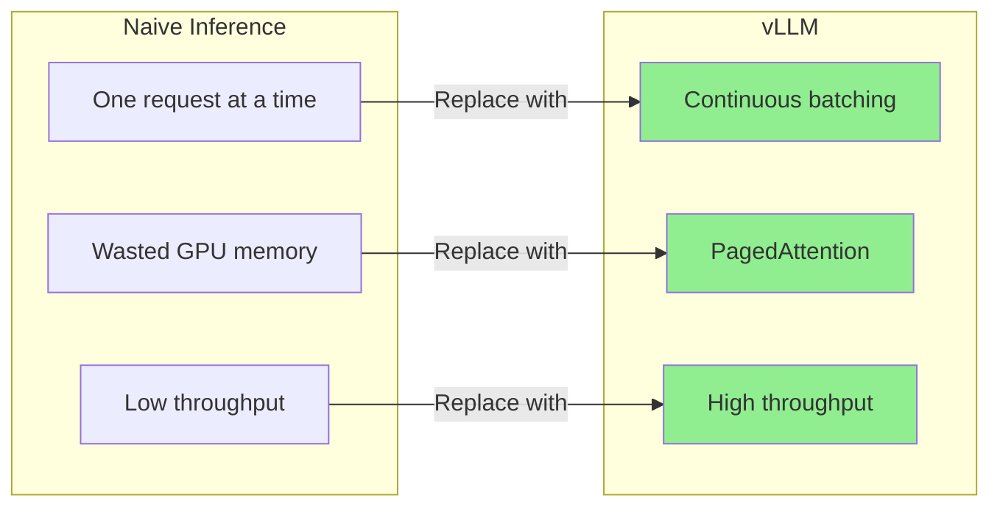
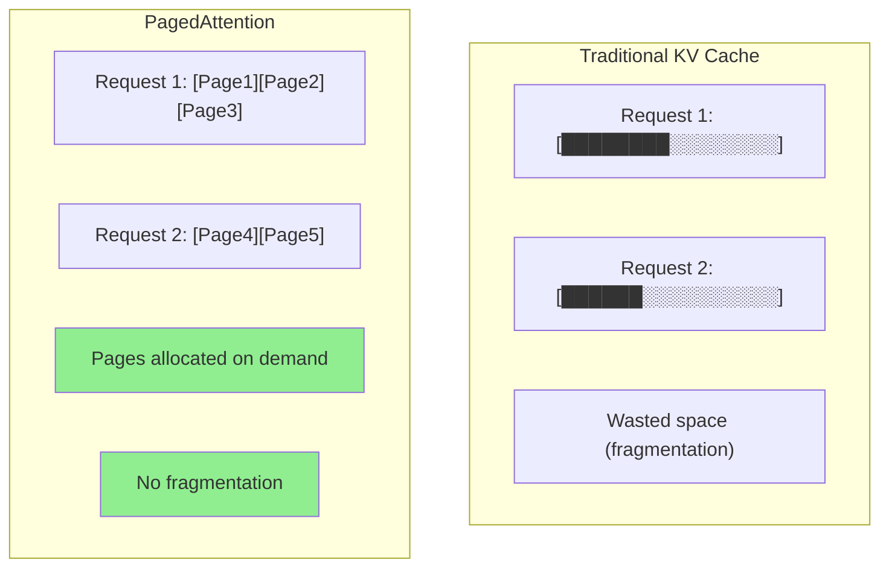
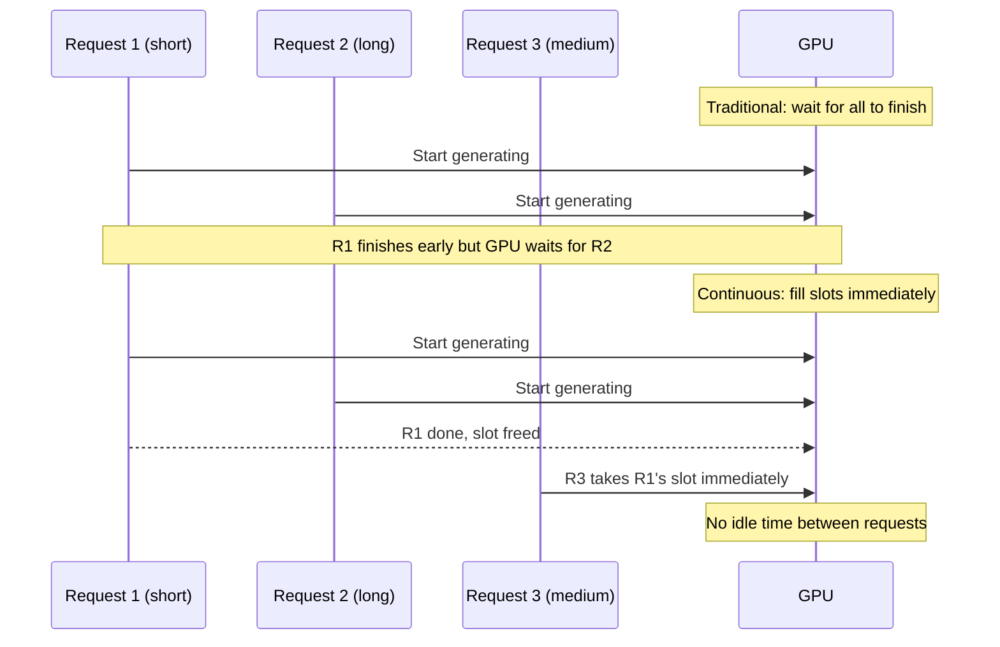
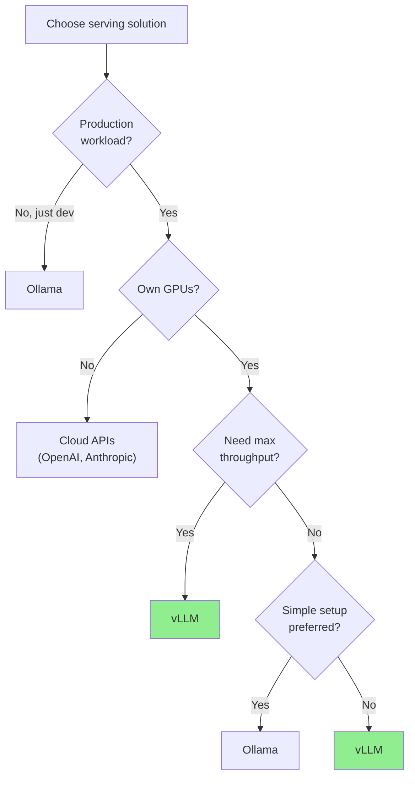
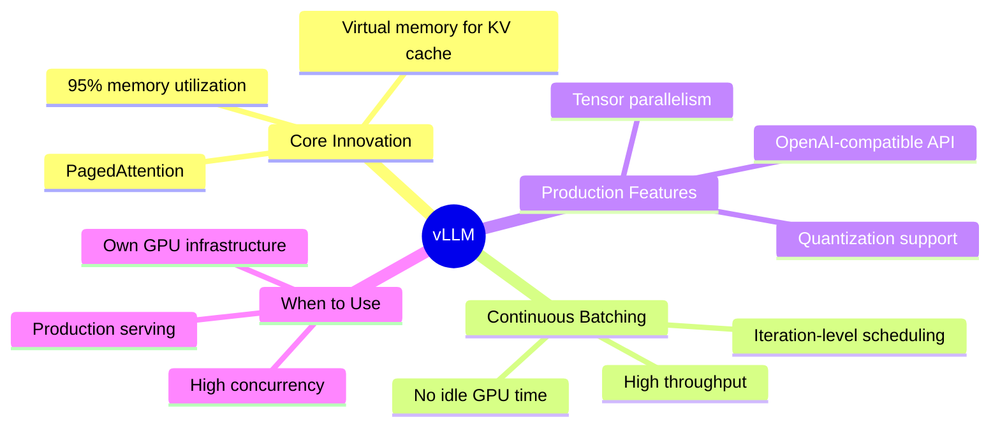

# vLLM for Production Inference

When you need to serve LLMs at scale, raw HuggingFace Transformers won't cut it. vLLM is a high-throughput serving engine that uses clever memory management and batching to squeeze maximum performance out of your GPUs. It's the go-to choice for production LLM inference.

> **Coming from Software Engineering?** vLLM is like nginx for LLMs -- it sits in front of a model and maximizes throughput with smart scheduling. Just as nginx handles thousands of concurrent HTTP connections through event-driven architecture, vLLM handles concurrent LLM requests through PagedAttention and continuous batching. You configure it, point it at a model, and it handles the rest.

---

## Why vLLM?



| Metric | HF Transformers | Ollama | vLLM |
|--------|----------------|--------|------|
| Throughput (tok/s) | ~30 | ~50 | ~500+ |
| Concurrent users | 1 | Limited | Hundreds |
| Memory efficiency | Low | Medium | High |
| Production-ready | No | Dev/small | Yes |
| OpenAI-compatible API | No | Yes | Yes |

---

## PagedAttention Explained

The key innovation in vLLM is PagedAttention -- it applies virtual memory concepts from operating systems to the KV cache that LLMs use during generation.



Traditional inference pre-allocates a contiguous block of GPU memory for each request's KV cache. This leads to:
- **Internal fragmentation**: allocated memory that goes unused
- **External fragmentation**: free memory too scattered to use
- **Over-reservation**: must assume max sequence length

PagedAttention splits the KV cache into fixed-size pages (like OS virtual memory):
- Pages allocated on demand as tokens are generated
- Non-contiguous physical memory mapped to contiguous logical blocks
- Memory utilization jumps from ~50% to ~95%

---

## Installation

```bash
# Basic installation (requires CUDA)
pip install vllm

# With specific CUDA version
pip install vllm --extra-index-url https://download.pytorch.org/whl/cu121
```

**Hardware requirements:**
- NVIDIA GPU with compute capability >= 7.0 (V100, T4, A100, H100, RTX 3090+)
- Sufficient VRAM for your model (7B ~ 14GB FP16, 13B ~ 26GB FP16)

---

## Serving a Model

### Command Line (Quickest Start)

```bash
# Serve Llama 3.1 8B with OpenAI-compatible API
vllm serve meta-llama/Llama-3.1-8B-Instruct \
    --host 0.0.0.0 \
    --port 8000 \
    --max-model-len 4096

# With quantization for smaller GPUs
vllm serve meta-llama/Llama-3.1-8B-Instruct \
    --quantization awq \
    --max-model-len 4096
```

### Python API

```python
# script_id: day_076_vllm/batch_inference
from vllm import LLM, SamplingParams

# Load model
llm = LLM(
    model="meta-llama/Llama-3.1-8B-Instruct",
    max_model_len=4096,
    gpu_memory_utilization=0.9,  # Use 90% of GPU memory
)

# Define sampling parameters
sampling_params = SamplingParams(
    temperature=0.7,
    top_p=0.9,
    max_tokens=256,
)

# Batch inference -- vLLM handles batching automatically
prompts = [
    "Explain quantum computing in one sentence.",
    "Write a haiku about Python programming.",
    "What is the capital of Japan?",
]

outputs = llm.generate(prompts, sampling_params)

for output in outputs:
    prompt = output.prompt
    generated = output.outputs[0].text
    print(f"Prompt: {prompt[:50]}...")
    print(f"Output: {generated}\n")
```

---

## Continuous Batching

Traditional batching waits for a full batch before processing. Continuous batching (also called iteration-level scheduling) is smarter:



- **Static batching**: All requests in a batch must finish before new ones start
- **Continuous batching**: As soon as one request finishes, a new one takes its slot
- Result: GPU stays busy, throughput increases dramatically

---

## OpenAI-Compatible API

vLLM exposes an API that's a drop-in replacement for OpenAI's. Your existing code works with zero changes.

```python
# script_id: day_076_vllm/openai_compatible_api
from openai import OpenAI

# Point to your vLLM server instead of OpenAI
client = OpenAI(
    base_url="http://localhost:8000/v1",
    api_key="not-needed",  # vLLM doesn't require a key by default
)

# Same interface as OpenAI
response = client.chat.completions.create(
    model="meta-llama/Llama-3.1-8B-Instruct",
    messages=[
        {"role": "system", "content": "You are a helpful assistant."},
        {"role": "user", "content": "Explain PagedAttention in simple terms."},
    ],
    temperature=0.7,
    max_tokens=256,
)

print(response.choices[0].message.content)

# Streaming also works
stream = client.chat.completions.create(
    model="meta-llama/Llama-3.1-8B-Instruct",
    messages=[{"role": "user", "content": "Write a short poem."}],
    stream=True,
)

for chunk in stream:
    if chunk.choices[0].delta.content:
        print(chunk.choices[0].delta.content, end="")
```

---

## Benchmarking: vLLM vs Ollama vs Transformers

```python
# script_id: day_076_vllm/benchmark_provider
import time
from openai import OpenAI

def benchmark_provider(base_url: str, model: str, num_requests: int = 20) -> dict:
    """Benchmark throughput of an LLM provider."""
    client = OpenAI(base_url=base_url, api_key="test")

    prompt = "Write a 100-word summary of machine learning."
    start = time.time()
    total_tokens = 0

    for i in range(num_requests):
        response = client.chat.completions.create(
            model=model,
            messages=[{"role": "user", "content": prompt}],
            max_tokens=150,
        )
        total_tokens += response.usage.completion_tokens

    elapsed = time.time() - start

    return {
        "provider": base_url,
        "requests": num_requests,
        "total_time": f"{elapsed:.1f}s",
        "tokens_per_second": f"{total_tokens / elapsed:.1f}",
        "avg_latency": f"{elapsed / num_requests:.2f}s",
    }

# Run benchmarks (ensure each server is running)
results = []
results.append(benchmark_provider(
    "http://localhost:8000/v1", "meta-llama/Llama-3.1-8B-Instruct"  # vLLM
))
results.append(benchmark_provider(
    "http://localhost:11434/v1", "llama3.1"  # Ollama
))

for r in results:
    print(f"{r['provider']}: {r['tokens_per_second']} tok/s, {r['avg_latency']} avg latency")
```

---

## Decision Matrix: When to Use What



| Scenario | Recommended | Why |
|----------|-------------|-----|
| Local development | Ollama | Easy setup, good enough speed |
| Production, own GPUs | vLLM | Maximum throughput, battle-tested |
| Production, no GPUs | Cloud APIs | No infrastructure to manage |
| Batch processing | vLLM | Continuous batching shines |
| Single user, laptop | Ollama | Low resource overhead |
| Multi-GPU cluster | vLLM | Native tensor parallelism |

---

## Tensor Parallelism for Multi-GPU

For models too large for one GPU, vLLM supports tensor parallelism out of the box.

```bash
# Serve a 70B model across 4 GPUs
vllm serve meta-llama/Llama-3.1-70B-Instruct \
    --tensor-parallel-size 4 \
    --max-model-len 4096 \
    --gpu-memory-utilization 0.9
```

```python
# script_id: day_076_vllm/tensor_parallelism
from vllm import LLM, SamplingParams

# Python API with tensor parallelism
llm = LLM(
    model="meta-llama/Llama-3.1-70B-Instruct",
    tensor_parallel_size=4,  # Split across 4 GPUs
    max_model_len=4096,
)

# Usage is identical -- vLLM handles the distribution
outputs = llm.generate(
    ["Summarize the theory of relativity."],
    SamplingParams(max_tokens=200),
)
```

| Model Size | GPUs Needed (FP16) | GPUs Needed (AWQ 4-bit) |
|------------|-------------------|------------------------|
| 7-8B | 1x A100 (80GB) | 1x RTX 3090 (24GB) |
| 13B | 1x A100 (80GB) | 1x RTX 4090 (24GB) |
| 34B | 2x A100 (80GB) | 1x A100 (80GB) |
| 70B | 4x A100 (80GB) | 2x A100 (80GB) |

---

## Production Configuration

```python
# script_id: day_076_vllm/production_config
# production_config.py
"""Production vLLM configuration."""

VLLM_CONFIG = {
    "model": "meta-llama/Llama-3.1-8B-Instruct",
    "host": "0.0.0.0",
    "port": 8000,
    "max_model_len": 4096,
    "gpu_memory_utilization": 0.9,
    "max_num_seqs": 256,           # Max concurrent sequences
    "max_num_batched_tokens": 8192, # Max tokens per batch
    "enforce_eager": False,         # Use CUDA graphs for speed
    "swap_space": 4,                # CPU swap space in GB
    "disable_log_requests": True,   # Reduce log noise in production
}

# Health check endpoint
import httpx

async def check_vllm_health(base_url: str = "http://localhost:8000") -> bool:
    """Check if vLLM server is healthy."""
    try:
        async with httpx.AsyncClient() as client:
            resp = await client.get(f"{base_url}/health", timeout=5)
            return resp.status_code == 200
    except Exception:
        return False
```

---

## Checkpoint

Start the vLLM OpenAI-compatible server (`vllm serve <model>`) and run the `openai_compatible_api` client against it — you should get a normal chat completion back, just pointed at `localhost:8000` instead of OpenAI. If the request 404s or refuses the connection, check that the server finished loading weights (watch its startup logs for "Uvicorn running") and that your `base_url` ends in `/v1`.

## Summary



---

## Quick Reference

```bash
# Serve a model
vllm serve meta-llama/Llama-3.1-8B-Instruct --port 8000

# With quantization
vllm serve model-name --quantization awq

# Multi-GPU
vllm serve model-name --tensor-parallel-size 4
```

```python
# script_id: day_076_vllm/quick_reference
# Python offline inference
from vllm import LLM, SamplingParams
llm = LLM(model="meta-llama/Llama-3.1-8B-Instruct")
outputs = llm.generate(["prompt"], SamplingParams(max_tokens=256))

# OpenAI-compatible client
from openai import OpenAI
client = OpenAI(base_url="http://localhost:8000/v1", api_key="na")
```

---

## Exercises

1. **Serve and Query**: Install vLLM, serve a 7B model, and query it using the OpenAI-compatible API. Measure tokens per second with 1, 5, and 20 concurrent requests.

2. **Benchmark Battle**: Run the same prompt through vLLM, Ollama, and direct HuggingFace Transformers. Compare throughput, latency, and memory usage. Create a table of results.

3. **Production Wrapper**: Build a FastAPI application that proxies requests to vLLM, adding rate limiting, request logging, and a health check endpoint. Test with concurrent requests using `asyncio.gather`.

---

## What's Next?

Now that we can serve models efficiently, let's learn to **generate training data** for fine-tuning them!
