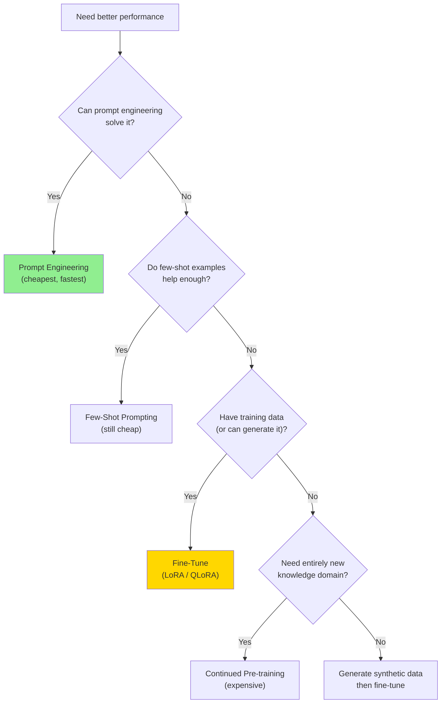
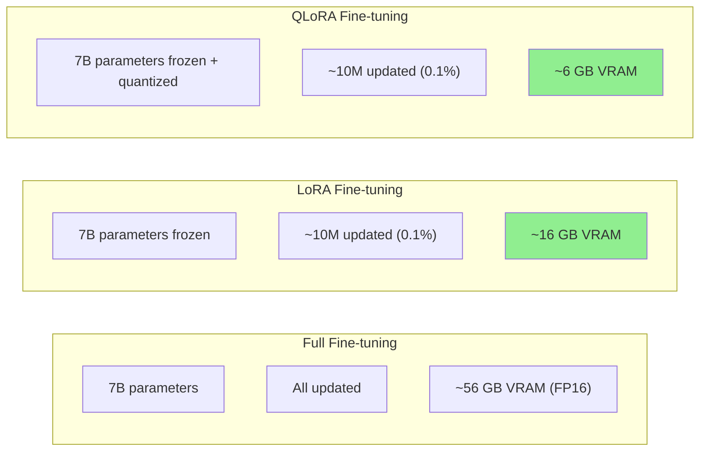
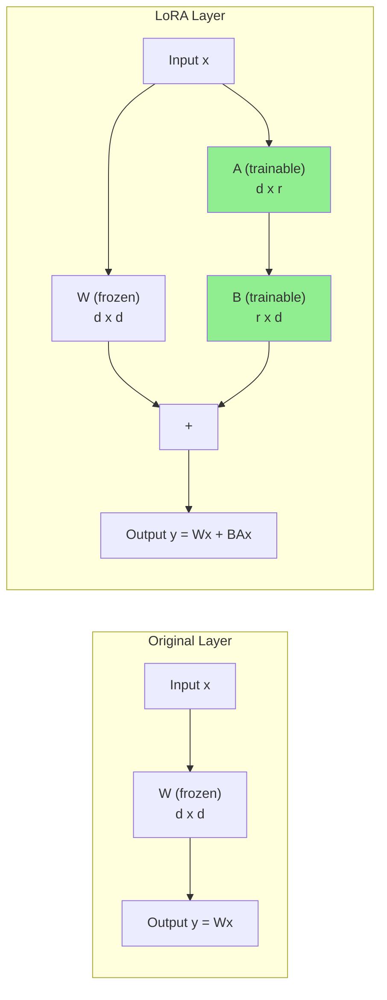
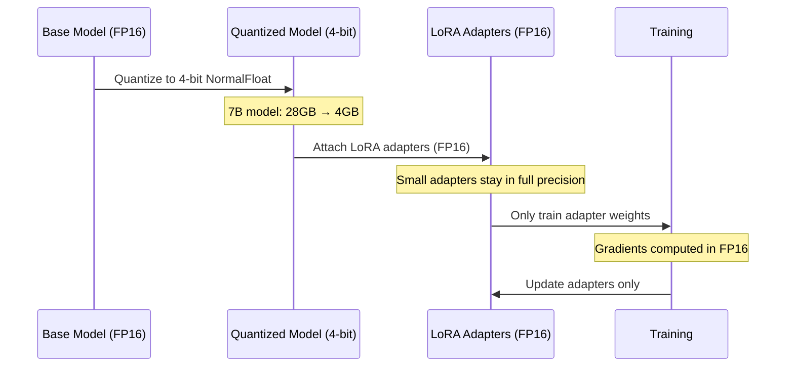
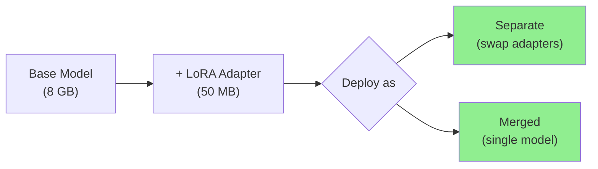
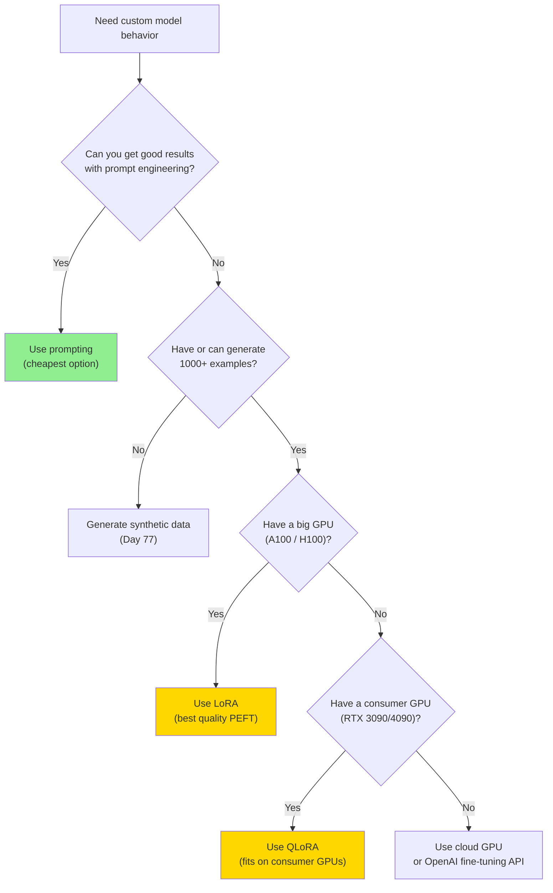
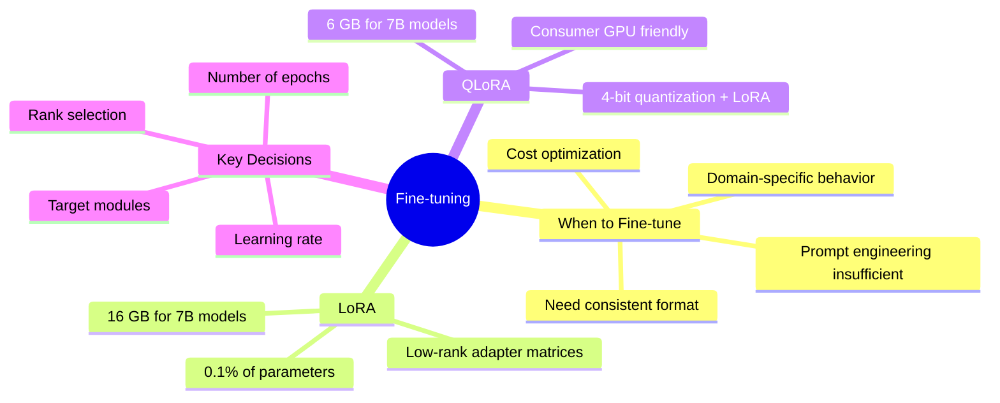

# Fine-tuning Fundamentals (LoRA, QLoRA)

Prompt engineering gets you 80% of the way, but sometimes you need a model that deeply understands your domain, follows your exact format, or runs cheaply on a small model. Fine-tuning adapts a pre-trained model to your specific task -- and with LoRA and QLoRA, you can do it on consumer hardware.

> **Coming from Software Engineering?** LoRA is like monkey-patching a large library -- instead of forking and modifying the whole codebase, you inject small changes at key points. The original weights stay frozen (like the original library), and you train tiny adapter matrices that modify behavior at specific layers. At inference time, these adapters merge cleanly into the base model, just like monkey patches get applied at runtime.

---

## When Fine-tuning Beats Prompting



| Approach | Cost | Time | When to Use |
|----------|------|------|-------------|
| Prompt engineering | Free | Minutes | First attempt, always |
| Few-shot prompting | Low (more tokens) | Hours | Need format/style guidance |
| Fine-tuning (LoRA) | Medium ($10-100) | Hours | Domain-specific behavior |
| Full fine-tuning | High ($100-10K) | Days | Maximum performance |
| Continued pre-training | Very high | Weeks | New language or domain |

---

## Full Fine-tuning vs PEFT

Full fine-tuning updates every parameter in the model. For a 7B model, that means modifying 7 billion weights -- requiring massive GPU memory and risking catastrophic forgetting.

**Parameter-Efficient Fine-Tuning (PEFT)** methods update only a tiny fraction of parameters while keeping most weights frozen.



| Method | Trainable Params | VRAM (7B) | Quality |
|--------|-----------------|-----------|---------|
| Full fine-tuning | 100% | ~56 GB | Best |
| LoRA | 0.1-1% | ~16 GB | ~98% of full |
| QLoRA | 0.1-1% | ~6 GB | ~96% of full |

---

## LoRA Explained

LoRA (Low-Rank Adaptation) inserts small trainable matrices into the model's attention layers. Instead of updating a massive weight matrix W directly, it learns two small matrices A and B such that the update is W + BA.



### Key Parameters

```python
# script_id: day_078_finetuning_fundamentals/lora_config_example
# LoRA configuration
lora_config = {
    "r": 16,              # Rank: size of the low-rank matrices
    "lora_alpha": 32,     # Scaling factor (usually 2x rank)
    "lora_dropout": 0.05, # Dropout for regularization
    "target_modules": [   # Which layers to adapt
        "q_proj",         # Query projection
        "k_proj",         # Key projection
        "v_proj",         # Value projection
        "o_proj",         # Output projection
    ],
}
```

**Rank (r)**: Controls adapter capacity
- `r=8`: Minimal, good for simple tasks
- `r=16`: Balanced (most common)
- `r=32-64`: For complex tasks requiring more capacity
- Higher rank = more parameters = more VRAM

**Alpha**: Scaling factor, typically `alpha = 2 * r`

**Target modules**: Which weight matrices get LoRA adapters
- At minimum: `q_proj`, `v_proj` (attention queries and values)
- Better: add `k_proj`, `o_proj` (all attention projections)
- Maximum: add `gate_proj`, `up_proj`, `down_proj` (MLP layers too)

---

## QLoRA: Fine-tuning on Consumer GPUs

QLoRA combines 4-bit quantization with LoRA, enabling fine-tuning on a single GPU with 6-8 GB of VRAM.



Key innovations in QLoRA:
- **4-bit NormalFloat (NF4)**: Quantization format optimized for normally-distributed neural network weights
- **Double quantization**: Quantize the quantization constants too, saving additional memory
- **Paged optimizers**: Offload optimizer states to CPU when GPU runs out

```python
# script_id: day_078_finetuning_fundamentals/qlora_peft_workflow
from transformers import BitsAndBytesConfig
import torch

# QLoRA quantization config
bnb_config = BitsAndBytesConfig(
    load_in_4bit=True,                    # Load model in 4-bit
    bnb_4bit_quant_type="nf4",            # NormalFloat4 quantization
    bnb_4bit_compute_dtype=torch.bfloat16, # Compute in bfloat16
    bnb_4bit_use_double_quant=True,       # Double quantization
)
```

---

## Training Hyperparameters

```python
# script_id: day_078_finetuning_fundamentals/training_args
from transformers import TrainingArguments

training_args = TrainingArguments(
    output_dir="./output",

    # Learning rate
    learning_rate=2e-4,           # Standard for LoRA (higher than full FT)
    lr_scheduler_type="cosine",   # Cosine decay works well

    # Batch size
    per_device_train_batch_size=4,
    gradient_accumulation_steps=4, # Effective batch size = 4 * 4 = 16

    # Duration
    num_train_epochs=3,           # 1-3 epochs for most tasks
    max_steps=-1,                 # Or set specific step count

    # Precision
    bf16=True,                    # Use bfloat16 mixed precision

    # Logging
    logging_steps=10,
    save_strategy="steps",
    save_steps=100,

    # Optimization
    warmup_ratio=0.03,            # Warmup for 3% of training
    weight_decay=0.01,
    optim="paged_adamw_8bit",     # Memory-efficient optimizer
)
```

### Hyperparameter Guidelines

| Parameter | Small Dataset (<1K) | Medium (1K-10K) | Large (>10K) |
|-----------|---------------------|------------------|--------------|
| Learning rate | 1e-4 | 2e-4 | 2e-4 to 5e-4 |
| Epochs | 3-5 | 2-3 | 1-2 |
| Batch size | 8-16 | 16-32 | 32-64 |
| LoRA rank | 8-16 | 16-32 | 16-64 |
| Warmup ratio | 0.05 | 0.03 | 0.03 |

---

## Hardware Requirements

| Model Size | Full FT (FP16) | LoRA (FP16) | QLoRA (4-bit) |
|------------|----------------|-------------|---------------|
| 1-3B | 24 GB | 12 GB | 6 GB |
| 7-8B | 56 GB | 16 GB | 8 GB |
| 13B | 104 GB | 32 GB | 12 GB |
| 34B | 272 GB | 80 GB | 24 GB |
| 70B | 560 GB | 160 GB | 48 GB |

**Consumer GPU options for QLoRA:**
- RTX 3090 / 4090 (24 GB): Up to 13B models
- RTX 3080 / 4080 (16 GB): Up to 8B models
- RTX 3070 (8 GB): Up to 3B models

**Cloud options:**
- A100 40GB ($1-2/hr): Up to 34B with QLoRA
- A100 80GB ($2-4/hr): Up to 70B with QLoRA
- H100 80GB ($3-5/hr): Fastest training for any size

---

## Putting It Together: LoRA with PEFT

```python
# script_id: day_078_finetuning_fundamentals/qlora_peft_workflow
from peft import LoraConfig, get_peft_model, TaskType
from transformers import AutoModelForCausalLM, AutoTokenizer

# Load base model
model_name = "meta-llama/Llama-3.1-8B-Instruct"
model = AutoModelForCausalLM.from_pretrained(
    model_name,
    quantization_config=bnb_config,  # QLoRA: load in 4-bit
    device_map="auto",
)
tokenizer = AutoTokenizer.from_pretrained(model_name)

# Configure LoRA
lora_config = LoraConfig(
    task_type=TaskType.CAUSAL_LM,
    r=16,
    lora_alpha=32,
    lora_dropout=0.05,
    target_modules=["q_proj", "k_proj", "v_proj", "o_proj"],
)

# Apply LoRA to model
model = get_peft_model(model, lora_config)

# Check trainable parameters
model.print_trainable_parameters()
# Output: trainable params: 13,631,488 || all params: 8,030,261,248 || trainable%: 0.17%
```

---

## Saving and Loading Adapters

```python
# script_id: day_078_finetuning_fundamentals/qlora_peft_workflow
# Save only the LoRA adapter (tiny file, ~50-100 MB)
model.save_pretrained("./my-lora-adapter")

# Load adapter onto base model later
from peft import PeftModel

base_model = AutoModelForCausalLM.from_pretrained(model_name)
model = PeftModel.from_pretrained(base_model, "./my-lora-adapter")

# Merge adapter into base model for faster inference
merged_model = model.merge_and_unload()
merged_model.save_pretrained("./merged-model")
```



Separate adapters are useful when you have multiple fine-tuned versions of the same base model -- just swap the adapter file instead of loading a whole new model.

---

## Decision Framework



---

## Summary



---

## Quick Reference

```python
# script_id: day_078_finetuning_fundamentals/quick_reference
# QLoRA quantization config
bnb_config = BitsAndBytesConfig(
    load_in_4bit=True,
    bnb_4bit_quant_type="nf4",
    bnb_4bit_compute_dtype=torch.bfloat16,
    bnb_4bit_use_double_quant=True,
)

# LoRA config
lora_config = LoraConfig(
    r=16, lora_alpha=32, lora_dropout=0.05,
    target_modules=["q_proj", "k_proj", "v_proj", "o_proj"],
)

# Apply and check
model = get_peft_model(model, lora_config)
model.print_trainable_parameters()

# Save adapter
model.save_pretrained("./adapter")

# Merge for deployment
merged = model.merge_and_unload()
```

---

## Exercises

1. **Parameter Calculator**: Write a script that calculates the number of trainable parameters for a given model size, LoRA rank, and target modules. Compare r=8, r=16, r=32, and r=64 for a 7B model.

2. **Config Explorer**: Load a 7B model with QLoRA (using `BitsAndBytesConfig`) and try different target module combinations. Print `model.print_trainable_parameters()` for each and create a table comparing them.

3. **Cost Estimator**: Build a calculator that estimates fine-tuning cost given: model size, dataset size, number of epochs, and cloud GPU pricing. Include both QLoRA (single GPU) and LoRA (multi-GPU) estimates.

---

## What's Next?

Theory done! Let's get hands-on and **fine-tune a real model** using Unsloth!
