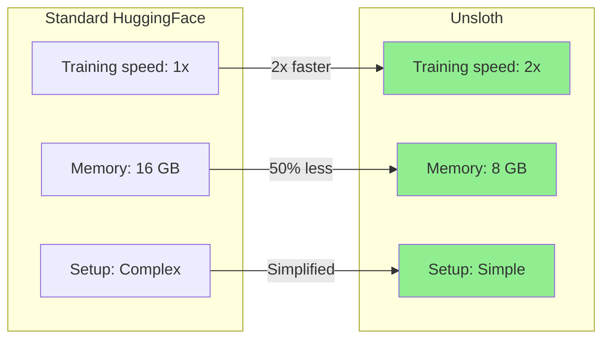
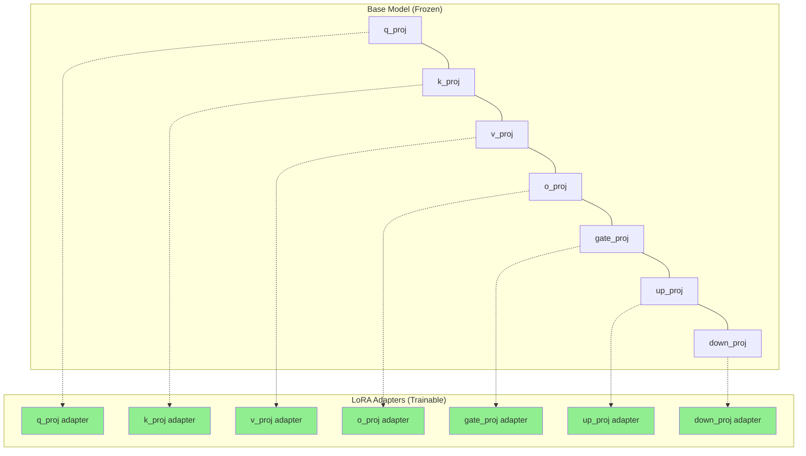
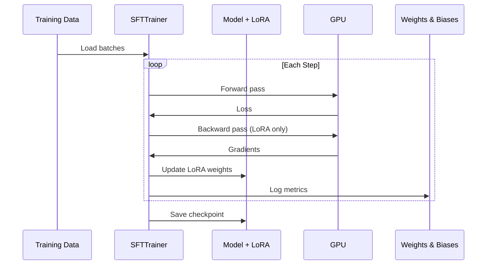
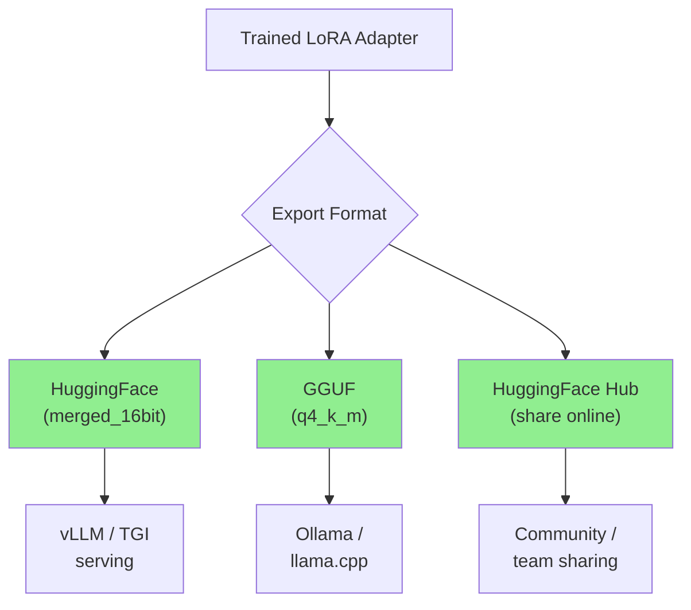
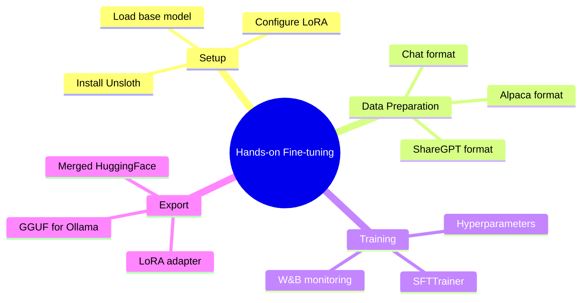

# Hands-on Fine-tuning with Unsloth

Time to get your hands dirty. Unsloth is an optimized fine-tuning library that's 2x faster and uses 50% less memory than standard HuggingFace training -- same output quality, dramatically faster iteration. This guide walks you through fine-tuning a real model end-to-end.

> **Coming from Software Engineering?** Fine-tuning with Unsloth is like using a profiler-optimized build tool -- same output, dramatically faster iteration cycles. Think of it as the difference between `gcc -O0` and `gcc -O3`: your code is identical, but the optimized toolchain compiles (trains) much faster. Unsloth achieves this through custom CUDA kernels and memory optimizations under the hood.

---

## Why Unsloth?



| Aspect | Standard HF + PEFT | Unsloth |
|--------|-------------------|---------|
| Training speed | Baseline | 2x faster |
| Memory usage | Baseline | 50% less |
| Supported models | All | Llama, Mistral, Phi, Gemma, Qwen |
| API compatibility | HuggingFace | HuggingFace (drop-in) |
| Custom CUDA kernels | No | Yes |
| Free tier | N/A | Yes (open source) |

---

## Installation

```bash
# Basic installation
pip install unsloth

# With all dependencies for training
pip install "unsloth[colab-new] @ git+https://github.com/unslothai/unsloth.git"
pip install --no-deps trl peft accelerate bitsandbytes

# Optional: Weights & Biases for monitoring
pip install wandb
```

---

## Step 1: Load the Base Model

```python
# script_id: day_079_handson_finetuning/finetune_workflow
from unsloth import FastLanguageModel
import torch

# Configuration
max_seq_length = 2048
dtype = None  # Auto-detect (Float16 for older GPUs, BFloat16 for Ampere+)
load_in_4bit = True  # QLoRA: use 4-bit quantization

# Load model and tokenizer
model, tokenizer = FastLanguageModel.from_pretrained(
    model_name="unsloth/Llama-3.2-8B-Instruct",  # Or "unsloth/Phi-4"
    max_seq_length=max_seq_length,
    dtype=dtype,
    load_in_4bit=load_in_4bit,
)

print(f"Model loaded: {model.config._name_or_path}")
print(f"Parameters: {model.num_parameters():,}")
```

Unsloth provides pre-optimized model downloads that are faster to load:
- `unsloth/Llama-3.2-8B-Instruct` -- Meta's Llama 3.2
- `unsloth/Phi-4` -- Microsoft's Phi-4
- `unsloth/Mistral-7B-Instruct-v0.3` -- Mistral AI
- `unsloth/gemma-2-9b-it` -- Google's Gemma 2

---

## Step 2: Configure LoRA

```python
# script_id: day_079_handson_finetuning/finetune_workflow
model = FastLanguageModel.get_peft_model(
    model,
    r=16,                          # LoRA rank
    target_modules=[
        "q_proj", "k_proj", "v_proj", "o_proj",  # Attention
        "gate_proj", "up_proj", "down_proj",       # MLP
    ],
    lora_alpha=16,                 # Scaling factor
    lora_dropout=0,                # Unsloth recommends 0 (uses its own regularization)
    bias="none",
    use_gradient_checkpointing="unsloth",  # Unsloth's optimized checkpointing
    random_state=42,
)

# Check what we're training
model.print_trainable_parameters()
# trainable params: 41,943,040 || all params: 8,072,204,288 || trainable%: 0.52%
```



---

## Step 3: Prepare the Dataset

```python
# script_id: day_079_handson_finetuning/finetune_workflow
from datasets import load_dataset

# Load a dataset (or use your synthetic data from Day 77)
dataset = load_dataset("json", data_files="coding_assistant_train.jsonl", split="train")

# Define the chat template formatting function
def format_chat(example):
    """Format example into the model's chat template."""
    messages = example["messages"]

    # Use the tokenizer's built-in chat template
    text = tokenizer.apply_chat_template(
        messages,
        tokenize=False,
        add_generation_prompt=False,
    )

    return {"text": text}

# Apply formatting
dataset = dataset.map(format_chat)

# Preview a formatted example
print(dataset[0]["text"][:500])
```

### If Your Data Is in Alpaca Format

```python
# script_id: day_079_handson_finetuning/format_alpaca
# Convert Alpaca format to chat format
alpaca_prompt = """Below is an instruction that describes a task, paired with an input that provides further context. Write a response that appropriately completes the request.

### Instruction:
{instruction}

### Input:
{input}

### Response:
{output}"""

def format_alpaca(example):
    """Format Alpaca-style example."""
    text = alpaca_prompt.format(
        instruction=example["instruction"],
        input=example.get("input", ""),
        output=example["output"],
    )
    return {"text": text}

dataset = dataset.map(format_alpaca)
```

### If Your Data Is in ShareGPT Format

```python
# script_id: day_079_handson_finetuning/format_sharegpt
from unsloth.chat_templates import get_chat_template

# Unsloth has built-in support for ShareGPT format
tokenizer = get_chat_template(
    tokenizer,
    chat_template="llama-3.1",  # Or "chatml", "mistral", "phi-3", etc.
)

def format_sharegpt(example):
    """Format ShareGPT-style conversations."""
    convos = example["conversations"]
    messages = []
    for turn in convos:
        role = "user" if turn["from"] == "human" else "assistant"
        messages.append({"role": role, "content": turn["value"]})

    text = tokenizer.apply_chat_template(messages, tokenize=False)
    return {"text": text}

dataset = dataset.map(format_sharegpt)
```

---

## Step 4: Train

```python
# script_id: day_079_handson_finetuning/finetune_workflow
from trl import SFTTrainer
from transformers import TrainingArguments

trainer = SFTTrainer(
    model=model,
    tokenizer=tokenizer,
    train_dataset=dataset,
    dataset_text_field="text",
    max_seq_length=max_seq_length,
    dataset_num_proc=2,           # Parallel data processing
    packing=False,                # True = pack short examples together (faster)
    args=TrainingArguments(
        output_dir="./output",

        # Training duration
        num_train_epochs=3,
        max_steps=-1,             # Set to positive number to override epochs

        # Batch size
        per_device_train_batch_size=2,
        gradient_accumulation_steps=4,  # Effective batch = 2 * 4 = 8

        # Learning rate
        learning_rate=2e-4,
        lr_scheduler_type="cosine",
        warmup_steps=10,

        # Precision and optimization
        fp16=not torch.cuda.is_bf16_supported(),
        bf16=torch.cuda.is_bf16_supported(),
        optim="adamw_8bit",

        # Logging
        logging_steps=10,
        save_strategy="steps",
        save_steps=100,

        # Weights & Biases (optional)
        report_to="wandb",        # Remove this line if not using W&B

        # Misc
        seed=42,
    ),
)

# Show GPU memory before training
gpu_stats = torch.cuda.get_device_properties(0)
print(f"GPU: {gpu_stats.name}")
print(f"VRAM: {gpu_stats.total_mem / 1024**3:.1f} GB")

# Start training
trainer_stats = trainer.train()

# Print results
print(f"Training time: {trainer_stats.metrics['train_runtime']:.0f}s")
print(f"Final loss: {trainer_stats.metrics['train_loss']:.4f}")
```



---

## Step 5: Monitor with Weights & Biases

```python
# script_id: day_079_handson_finetuning/finetune_workflow
import wandb

# Initialize W&B (run before training)
wandb.init(
    project="my-finetune",
    name="llama-3.2-8b-coding-assistant",
    config={
        "model": "Llama-3.2-8B-Instruct",
        "lora_r": 16,
        "lora_alpha": 16,
        "learning_rate": 2e-4,
        "epochs": 3,
        "dataset_size": len(dataset),
    },
)

# After training, log final metrics
wandb.log({
    "final_loss": trainer_stats.metrics["train_loss"],
    "training_time_seconds": trainer_stats.metrics["train_runtime"],
    "samples_per_second": trainer_stats.metrics["train_samples_per_second"],
})

wandb.finish()
```

What to watch in W&B:
- **Loss curve**: Should decrease smoothly, flatten by end of training
- **Learning rate**: Should follow your scheduler (cosine decay)
- **GPU memory**: Stable, no OOM spikes
- **Gradient norm**: Stable, no explosions

---

## Step 6: Test the Fine-tuned Model

```python
# script_id: day_079_handson_finetuning/finetune_workflow
# Switch to inference mode
FastLanguageModel.for_inference(model)

# Test with a prompt
messages = [
    {"role": "system", "content": "You are a helpful coding assistant."},
    {"role": "user", "content": "Write a Python function to find the longest common subsequence of two strings."},
]

inputs = tokenizer.apply_chat_template(
    messages,
    tokenize=True,
    add_generation_prompt=True,
    return_tensors="pt",
).to("cuda")

outputs = model.generate(
    input_ids=inputs,
    max_new_tokens=512,
    temperature=0.7,
    top_p=0.9,
)

# Decode and print (skip the input tokens)
response = tokenizer.decode(outputs[0][inputs.shape[-1]:], skip_special_tokens=True)
print(response)
```

### Batch Testing

```python
# script_id: day_079_handson_finetuning/finetune_workflow
test_prompts = [
    "Explain what a decorator is in Python.",
    "Write a SQL query to find duplicate emails in a users table.",
    "What's the difference between a list and a tuple?",
    "Debug this: TypeError: 'NoneType' object is not iterable",
]

for prompt in test_prompts:
    messages = [{"role": "user", "content": prompt}]
    inputs = tokenizer.apply_chat_template(
        messages, tokenize=True, add_generation_prompt=True, return_tensors="pt"
    ).to("cuda")

    outputs = model.generate(input_ids=inputs, max_new_tokens=256, temperature=0.3)
    response = tokenizer.decode(outputs[0][inputs.shape[-1]:], skip_special_tokens=True)

    print(f"Q: {prompt}")
    print(f"A: {response[:200]}...")
    print("---")
```

---

## Step 7: Save the LoRA Adapter

```python
# script_id: day_079_handson_finetuning/finetune_workflow
# Save just the LoRA adapter (small, ~50-100 MB)
model.save_pretrained("./lora-adapter")
tokenizer.save_pretrained("./lora-adapter")

print("Adapter saved! Contents:")
import os
for f in os.listdir("./lora-adapter"):
    size = os.path.getsize(f"./lora-adapter/{f}") / 1024 / 1024
    print(f"  {f}: {size:.1f} MB")
```

---

## Step 8: Merge and Export

For deployment, you can merge the LoRA adapter back into the base model.

```python
# script_id: day_079_handson_finetuning/finetune_workflow
# Option 1: Save merged model in HuggingFace format (for vLLM, TGI)
model.save_pretrained_merged(
    "./merged-model",
    tokenizer,
    save_method="merged_16bit",  # Full precision merged model
)

# Option 2: Save as GGUF for Ollama / llama.cpp
model.save_pretrained_gguf(
    "./model-gguf",
    tokenizer,
    quantization_method="q4_k_m",  # Recommended quantization
)

# Option 3: Push to HuggingFace Hub
model.push_to_hub_merged(
    "your-username/my-coding-assistant",
    tokenizer,
    save_method="merged_16bit",
    token="hf_your_token",
)
```



---

## Loading Your Model in Ollama

After exporting to GGUF, create a Modelfile for Ollama:

```bash
# Create Modelfile
cat > Modelfile << 'EOF'
FROM ./model-gguf/unsloth.Q4_K_M.gguf

TEMPLATE """{{ if .System }}<|start_header_id|>system<|end_header_id|>
{{ .System }}<|eot_id|>{{ end }}<|start_header_id|>user<|end_header_id|>
{{ .Prompt }}<|eot_id|><|start_header_id|>assistant<|end_header_id|>
{{ .Response }}<|eot_id|>"""

PARAMETER temperature 0.7
PARAMETER top_p 0.9
SYSTEM "You are a helpful coding assistant."
EOF

# Build and run
ollama create my-coding-assistant -f Modelfile
ollama run my-coding-assistant "Write a Python decorator for caching"
```

---

## Common Issues and Fixes

| Issue | Cause | Fix |
|-------|-------|-----|
| CUDA out of memory | Model too large for GPU | Reduce `per_device_train_batch_size` or `max_seq_length` |
| Loss not decreasing | Learning rate too low/high | Try 1e-4 to 5e-4 range |
| Loss spikes | Batch too small or bad data | Increase `gradient_accumulation_steps`, check data quality |
| Garbage output | Overfitting or wrong template | Reduce epochs, verify chat template matches model |
| Slow training | Not using Unsloth optimizations | Ensure `use_gradient_checkpointing="unsloth"` |

---

## Summary



---

## Quick Reference

```python
# script_id: day_079_handson_finetuning/quick_reference
# fragment: illustrative cheat-sheet / not standalone-runnable
# Load model
from unsloth import FastLanguageModel
model, tokenizer = FastLanguageModel.from_pretrained(
    "unsloth/Llama-3.2-8B-Instruct", load_in_4bit=True
)

# Add LoRA
model = FastLanguageModel.get_peft_model(model, r=16, target_modules=[...])

# Train
from trl import SFTTrainer
trainer = SFTTrainer(model=model, train_dataset=dataset, ...)
trainer.train()

# Save adapter
model.save_pretrained("./adapter")

# Export GGUF
model.save_pretrained_gguf("./gguf", tokenizer, quantization_method="q4_k_m")
```

---

## Exercises

1. **Your First Fine-tune**: Fine-tune Llama 3.2 8B (or Phi-4) on a small dataset (100-500 examples) using QLoRA. Export to GGUF and run in Ollama. Compare the fine-tuned model's responses to the base model on 10 test prompts.

2. **Hyperparameter Sweep**: Train the same model 3 times with different LoRA ranks (r=8, r=16, r=32). Compare final loss, training time, adapter size, and output quality. Which rank gives the best quality-to-cost ratio?

3. **End-to-End Pipeline**: Combine Day 77 (synthetic data) with today's lesson. Generate 500 synthetic examples for a specific domain (e.g., customer support, code review), fine-tune a model on them, export to GGUF, and deploy with Ollama. Evaluate with 20 held-out test cases.

---

## What's Next?

Now let's fine-tune specifically for **agentic tasks** -- tool calling, JSON adherence, and function execution!
