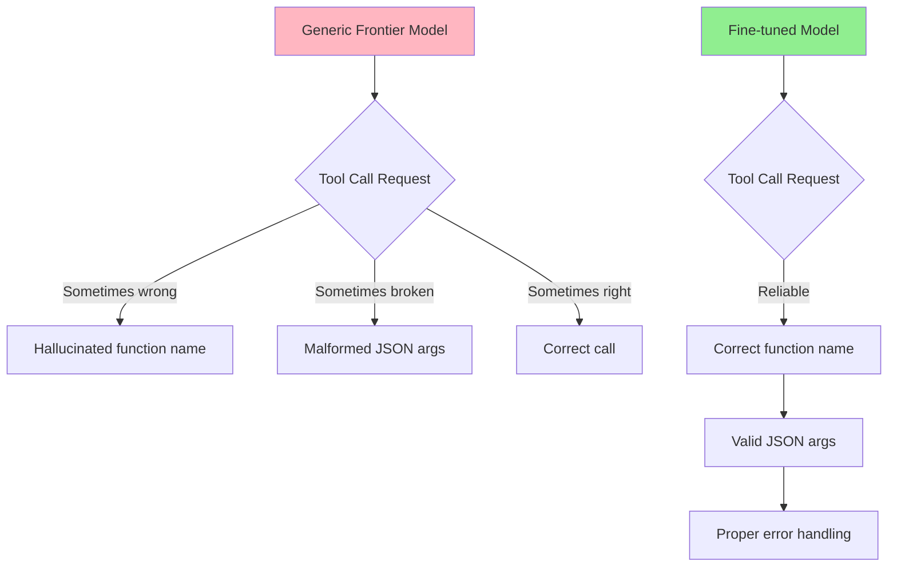
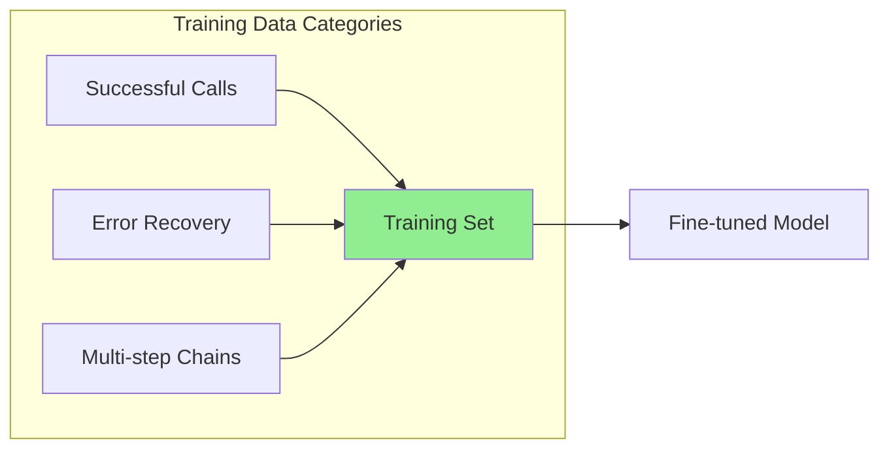
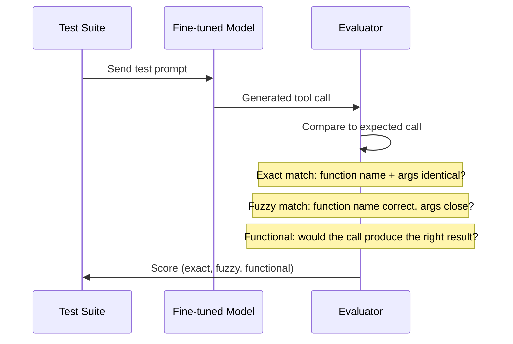
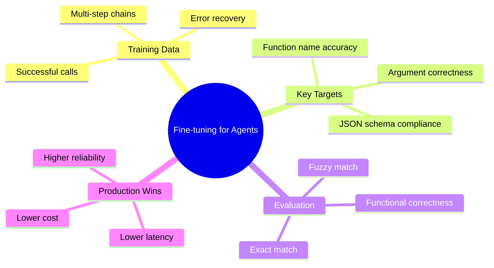

# Fine-tuning for Agentic Tasks

Your agent calls tools, parses JSON, and chains multi-step actions. But frontier models sometimes hallucinate function names, produce malformed arguments, or ignore your schema. Fine-tuning a smaller model on your exact tool-calling patterns can produce a specialist that outperforms a generalist on **your** workflow -- at a fraction of the cost and latency.

> **Coming from Software Engineering?** Fine-tuning for tool use is like writing a specialized API client -- you train the model to speak your API's protocol fluently. Instead of hoping a generic HTTP library guesses the right headers, you build a typed client that knows every endpoint, every parameter, and every error code by heart.

---

## Why Fine-tune for Agents?



Three core reasons to fine-tune for agentic tasks:

- **Reliable tool calling**: The model learns your exact function signatures, not generic patterns
- **JSON schema adherence**: No more missing required fields or wrong types
- **Domain-specific execution**: Multi-step chains that follow your business logic, not generic reasoning

---

## Training Data Format for Tool Use

The key to fine-tuning for tool calling is structured training examples. Each example shows the model a conversation with tool definitions, a user request, and the correct tool call response.

```python
# script_id: day_080_finetuning_agentic/training_data_format
# Training example format for tool-use fine-tuning
training_example = {
    "messages": [
        {
            "role": "system",
            "content": "You are an assistant with access to the following tools."
        },
        {
            "role": "user",
            "content": "What's the weather in San Francisco?"
        },
        {
            "role": "assistant",
            "tool_calls": [
                {
                    "id": "call_001",
                    "type": "function",
                    "function": {
                        "name": "get_weather",
                        "arguments": '{"location": "San Francisco", "unit": "fahrenheit"}'
                    }
                }
            ]
        },
        {
            "role": "tool",
            "tool_call_id": "call_001",
            "content": '{"temperature": 62, "condition": "foggy"}'
        },
        {
            "role": "assistant",
            "content": "It's 62F and foggy in San Francisco."
        }
    ],
    "tools": [
        {
            "type": "function",
            "function": {
                "name": "get_weather",
                "description": "Get current weather for a location",
                "parameters": {
                    "type": "object",
                    "properties": {
                        "location": {"type": "string"},
                        "unit": {"type": "string", "enum": ["celsius", "fahrenheit"]}
                    },
                    "required": ["location"]
                }
            }
        }
    ]
}
```

---

## Building Tool-Use Training Sets

A strong training set covers three categories: successful calls, error recovery, and multi-step chains.



```python
# script_id: day_080_finetuning_agentic/build_tool_use_dataset
import json
import random

def build_tool_use_dataset(tools: list, scenarios: list) -> list:
    """Build a training dataset for tool-use fine-tuning."""
    dataset = []

    for scenario in scenarios:
        # Category 1: Successful single-step calls
        if scenario["type"] == "single_call":
            dataset.append({
                "messages": [
                    {"role": "user", "content": scenario["query"]},
                    {"role": "assistant", "tool_calls": [scenario["expected_call"]]},
                    {"role": "tool", "tool_call_id": "call_1", "content": scenario["tool_response"]},
                    {"role": "assistant", "content": scenario["final_answer"]}
                ],
                "tools": tools
            })

        # Category 2: Error recovery (model retries after a failed call)
        elif scenario["type"] == "error_recovery":
            dataset.append({
                "messages": [
                    {"role": "user", "content": scenario["query"]},
                    {"role": "assistant", "tool_calls": [scenario["first_call"]]},
                    {"role": "tool", "tool_call_id": "call_1", "content": scenario["error_response"]},
                    {"role": "assistant", "tool_calls": [scenario["retry_call"]]},
                    {"role": "tool", "tool_call_id": "call_2", "content": scenario["success_response"]},
                    {"role": "assistant", "content": scenario["final_answer"]}
                ],
                "tools": tools
            })

        # Category 3: Multi-step chains
        elif scenario["type"] == "multi_step":
            messages = [{"role": "user", "content": scenario["query"]}]
            for i, step in enumerate(scenario["steps"]):
                messages.append({"role": "assistant", "tool_calls": [step["call"]]})
                messages.append({"role": "tool", "tool_call_id": f"call_{i+1}", "content": step["response"]})
            messages.append({"role": "assistant", "content": scenario["final_answer"]})
            dataset.append({"messages": messages, "tools": tools})

    return dataset

# Example: build a dataset with 3 categories
tools = [
    {"type": "function", "function": {"name": "search_db", "parameters": {"type": "object", "properties": {"query": {"type": "string"}}}}},
    {"type": "function", "function": {"name": "send_email", "parameters": {"type": "object", "properties": {"to": {"type": "string"}, "body": {"type": "string"}}}}},
]

print(f"Tools defined: {len(tools)}")
```

---

## Fine-tuning for JSON Schema Compliance

One of the biggest wins from fine-tuning is eliminating malformed JSON. You train the model to always produce valid arguments that match your schema.

```python
# script_id: day_080_finetuning_agentic/validate_schema_compliance
from pydantic import BaseModel, ValidationError
from typing import Optional
import json

# Define the schema your tool expects
class SearchArgs(BaseModel):
    query: str
    max_results: int = 10
    filter_category: Optional[str] = None

# Validate training data before fine-tuning
def validate_training_examples(dataset: list, schemas: dict) -> dict:
    """Ensure all training examples have valid tool call arguments."""
    stats = {"valid": 0, "invalid": 0, "errors": []}

    for i, example in enumerate(dataset):
        for msg in example["messages"]:
            if msg["role"] == "assistant" and "tool_calls" in msg:
                for call in msg["tool_calls"]:
                    fn_name = call["function"]["name"]
                    args_str = call["function"]["arguments"]

                    try:
                        args = json.loads(args_str)
                        if fn_name in schemas:
                            schemas[fn_name](**args)  # Validate with Pydantic
                        stats["valid"] += 1
                    except (json.JSONDecodeError, ValidationError) as e:
                        stats["invalid"] += 1
                        stats["errors"].append({"example": i, "error": str(e)})

    return stats

# Run validation
schemas = {"search_db": SearchArgs}
# stats = validate_training_examples(dataset, schemas)
# print(f"Valid: {stats['valid']}, Invalid: {stats['invalid']}")
```

---

## Launching a Fine-tuning Job

```python
# script_id: day_080_finetuning_agentic/launch_finetuning_job
from openai import OpenAI
import json

client = OpenAI()

def prepare_and_finetune(dataset: list, model: str = "gpt-4o-mini-2024-07-18"):
    """Prepare a JSONL file and launch a fine-tuning job."""

    # Step 1: Write JSONL training file
    output_path = "tool_calling_train.jsonl"
    with open(output_path, "w") as f:
        for example in dataset:
            f.write(json.dumps(example) + "\n")

    # Step 2: Upload to OpenAI
    with open(output_path, "rb") as f:
        file_obj = client.files.create(file=f, purpose="fine-tune")

    print(f"Uploaded file: {file_obj.id}")

    # Step 3: Create fine-tuning job
    job = client.fine_tuning.jobs.create(
        training_file=file_obj.id,
        model=model,
        hyperparameters={
            "n_epochs": 3,
            "batch_size": "auto",
            "learning_rate_multiplier": "auto"
        },
        suffix="tool-calling-agent"
    )

    print(f"Fine-tuning job created: {job.id}")
    print(f"Status: {job.status}")
    return job

# Monitor the job
def check_job_status(job_id: str):
    """Check fine-tuning job progress."""
    job = client.fine_tuning.jobs.retrieve(job_id)
    print(f"Status: {job.status}")
    if job.fine_tuned_model:
        print(f"Model ready: {job.fine_tuned_model}")
    return job
```

---

## Evaluating Tool-Call Accuracy



```python
# script_id: day_080_finetuning_agentic/evaluate_tool_call_accuracy
from difflib import SequenceMatcher

def evaluate_tool_calls(predictions: list, ground_truth: list) -> dict:
    """Evaluate tool-call accuracy across three metrics."""
    exact_match = 0
    fuzzy_match = 0
    functional_match = 0

    for pred, truth in zip(predictions, ground_truth):
        pred_name = pred["function"]["name"]
        truth_name = truth["function"]["name"]
        pred_args = json.loads(pred["function"]["arguments"])
        truth_args = json.loads(truth["function"]["arguments"])

        # Exact match: name and args identical
        if pred_name == truth_name and pred_args == truth_args:
            exact_match += 1
            fuzzy_match += 1
            functional_match += 1
            continue

        # Fuzzy match: name correct, args similar
        if pred_name == truth_name:
            similarity = SequenceMatcher(
                None,
                json.dumps(pred_args, sort_keys=True),
                json.dumps(truth_args, sort_keys=True)
            ).ratio()
            if similarity > 0.8:
                fuzzy_match += 1
                functional_match += 1  # Close enough to work
            elif similarity > 0.5:
                functional_match += 1  # Might still produce correct result

    total = len(predictions)
    return {
        "exact_match": exact_match / total,
        "fuzzy_match": fuzzy_match / total,
        "functional_match": functional_match / total,
        "total_examples": total
    }

# Example usage
# results = evaluate_tool_calls(model_predictions, expected_calls)
# print(f"Exact: {results['exact_match']:.1%}")
# print(f"Fuzzy: {results['fuzzy_match']:.1%}")
# print(f"Functional: {results['functional_match']:.1%}")
```

---

## Case Study: 7B Model vs GPT-4o on Tool Calling

A common production pattern: fine-tune a small open-source model to match or beat GPT-4o on your specific tool-calling task, then serve it locally for 10x cost savings.

```python
# script_id: day_080_finetuning_agentic/benchmark_comparison
# Benchmark: compare fine-tuned 7B vs GPT-4o on your tool-calling eval set

benchmark_results = {
    "model": ["GPT-4o (baseline)", "Llama-3 7B (base)", "Llama-3 7B (fine-tuned)"],
    "exact_match":      [0.87, 0.41, 0.91],
    "fuzzy_match":      [0.93, 0.58, 0.95],
    "functional_match": [0.96, 0.65, 0.97],
    "avg_latency_ms":   [1200, 180, 190],
    "cost_per_1k":      [3.50, 0.00, 0.00],  # Local inference is free
}

# Print comparison table
print(f"{'Model':<30} {'Exact':>8} {'Fuzzy':>8} {'Func':>8} {'Latency':>10} {'Cost/1k':>10}")
print("-" * 80)
for i in range(len(benchmark_results["model"])):
    print(
        f"{benchmark_results['model'][i]:<30} "
        f"{benchmark_results['exact_match'][i]:>7.0%} "
        f"{benchmark_results['fuzzy_match'][i]:>7.0%} "
        f"{benchmark_results['functional_match'][i]:>7.0%} "
        f"{benchmark_results['avg_latency_ms'][i]:>8}ms "
        f"${benchmark_results['cost_per_1k'][i]:>8.2f}"
    )

# Key insight: the fine-tuned 7B beats GPT-4o on exact match
# because it learned YOUR specific tool schemas, not generic ones
```

---

## Summary



---

## Quick Reference

```python
# script_id: day_080_finetuning_agentic/quick_reference
# Training data format: messages + tools
{"messages": [...], "tools": [...]}

# Three training categories
# 1. Successful single calls
# 2. Error recovery (retry after failure)
# 3. Multi-step chains (sequential tool use)

# Evaluation metrics
# Exact match:      name + args identical
# Fuzzy match:      name correct, args >80% similar
# Functional match: call would produce correct result

# Launch fine-tuning (OpenAI)
client.fine_tuning.jobs.create(
    training_file=file_id,
    model="gpt-4o-mini-2024-07-18",
    suffix="tool-calling-agent"
)
```

---

## Exercises

1. **Build a Training Set**: Create 50 training examples covering all three categories (successful calls, error recovery, multi-step chains) for a 3-tool agent (search, calculate, send_email)

2. **Schema Validator**: Write a validation pipeline that checks every training example for valid JSON arguments against Pydantic schemas, and reports statistics on coverage per tool

3. **Eval Harness**: Build an evaluation harness that tests a model on 20 tool-calling scenarios and reports exact match, fuzzy match, and functional correctness scores

---

## What's Next?

We have a fine-tuned model. How do we know it's actually better? Let's learn **evaluation techniques** for fine-tuned models!
