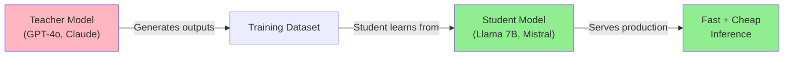
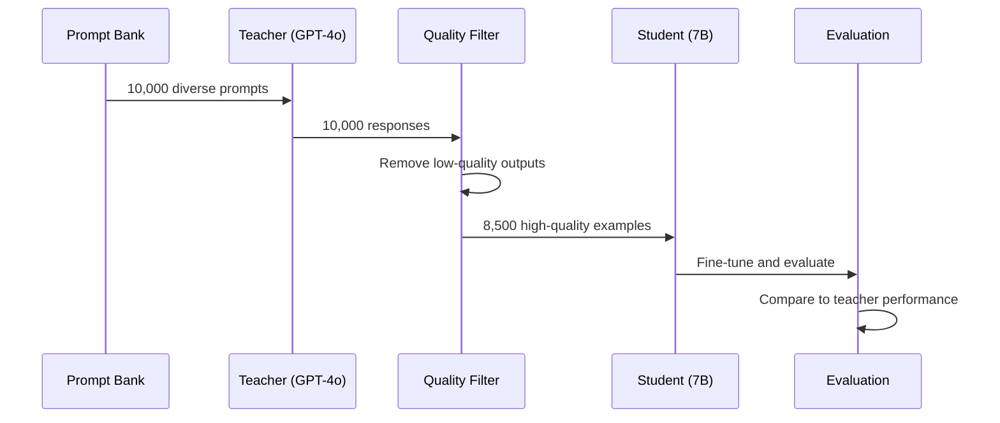
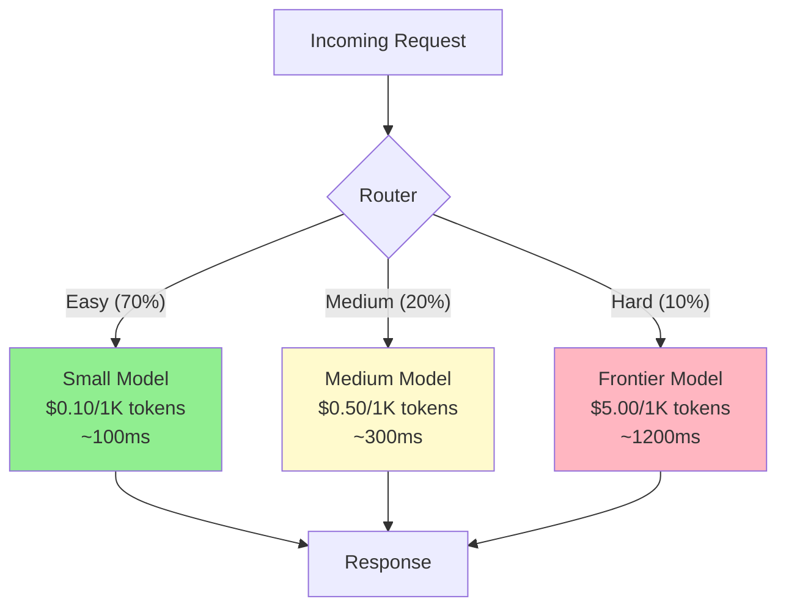
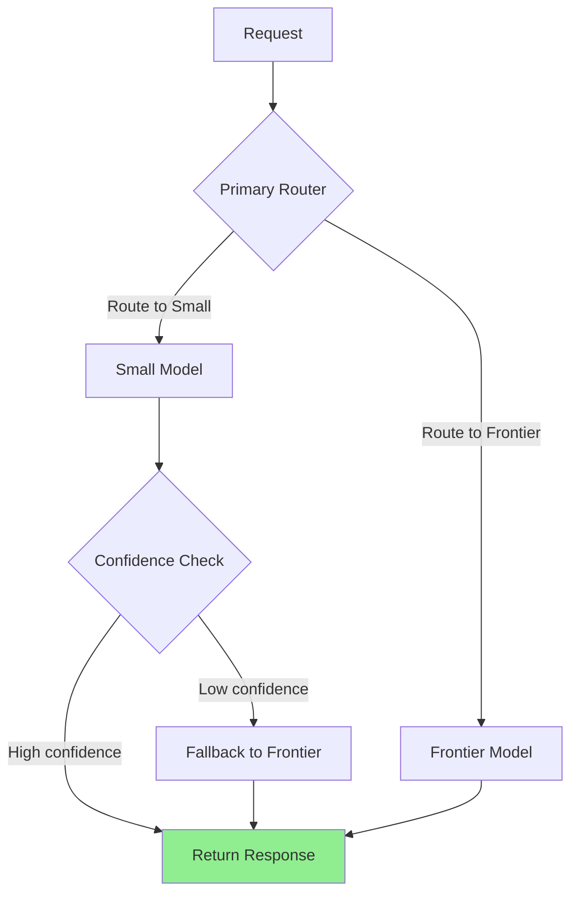
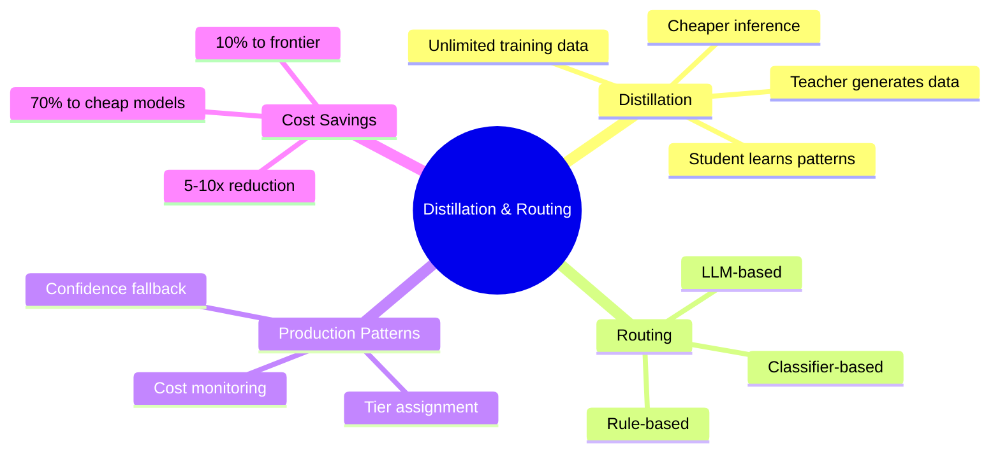

# Model Distillation and Routing

You have a powerful frontier model that works great but costs too much for every request. You also have small models that are fast and cheap but not smart enough for hard tasks. The solution: **distill** the big model's knowledge into the small one, then **route** each request to the right model based on complexity. This combination can cut costs 5-10x while maintaining quality.

> **Coming from Software Engineering?** Model routing is like a load balancer with intelligence -- instead of round-robin, it routes based on request complexity. Easy requests go to the lightweight service (cheap, fast), hard requests go to the heavyweight service (expensive, accurate). And distillation? That's like generating a comprehensive test suite from your senior engineer's decisions, then training a junior engineer to handle the same cases.

---

## What Is Model Distillation?



Distillation is a form of knowledge transfer:

1. **Teacher generates**: Run a frontier model on thousands of examples
2. **Student learns**: Fine-tune a smaller model on the teacher's outputs
3. **Student serves**: Deploy the smaller model for production inference

The student doesn't just learn the right answers -- it learns the teacher's **reasoning style**, **formatting patterns**, and **decision boundaries**.

---

## Distillation vs Fine-tuning

These terms are often confused. Here's the distinction:

| Aspect | Fine-tuning | Distillation |
|--------|------------|--------------|
| Training data source | Human-labeled examples | Teacher model outputs |
| Goal | Adapt to a task | Compress a larger model |
| Data quality | Limited by human annotation | Limited by teacher quality |
| Scale | Typically hundreds-thousands | Can generate unlimited data |
| Cost to create data | Expensive (human time) | Cheap (API calls) |

```python
# script_id: day_082_distillation_routing/finetune_vs_distill
# Fine-tuning: you provide the gold labels
finetune_example = {
    "messages": [
        {"role": "user", "content": "Classify: 'Great product!' -> sentiment"},
        {"role": "assistant", "content": "positive"}  # Human-written label
    ]
}

# Distillation: the teacher provides the labels
distill_example = {
    "messages": [
        {"role": "user", "content": "Classify: 'Great product!' -> sentiment"},
        {"role": "assistant", "content": "positive"}  # GPT-4o generated this
    ]
}

# Same format, different source of truth
# Distillation lets you generate 10,000 examples for the cost of API calls
```

---

## Building a Distillation Pipeline



```python
# script_id: day_082_distillation_routing/distillation_pipeline
from openai import OpenAI
import json
import time

client = OpenAI()

def generate_teacher_outputs(
    prompts: list[str],
    teacher_model: str = "gpt-4o",
    system_prompt: str = "You are a helpful assistant.",
    batch_delay: float = 0.1,
) -> list[dict]:
    """Generate training data from a teacher model."""
    outputs = []

    for i, prompt in enumerate(prompts):
        try:
            response = client.chat.completions.create(
                model=teacher_model,
                messages=[
                    {"role": "system", "content": system_prompt},
                    {"role": "user", "content": prompt}
                ],
                temperature=0.7,  # Some diversity in outputs
            )

            outputs.append({
                "prompt": prompt,
                "response": response.choices[0].message.content,
                "tokens": response.usage.total_tokens,
                "model": teacher_model,
            })

            if (i + 1) % 100 == 0:
                print(f"Generated {i + 1}/{len(prompts)} outputs")

            time.sleep(batch_delay)  # Rate limiting

        except Exception as e:
            print(f"Error on prompt {i}: {e}")
            outputs.append({"prompt": prompt, "response": None, "error": str(e)})

    return outputs

def filter_quality(outputs: list[dict], min_length: int = 50) -> list[dict]:
    """Filter out low-quality teacher outputs."""
    filtered = []
    for out in outputs:
        if out.get("response") is None:
            continue
        if len(out["response"]) < min_length:
            continue
        if out["response"].startswith("I cannot") or out["response"].startswith("I'm sorry"):
            continue
        filtered.append(out)

    print(f"Kept {len(filtered)}/{len(outputs)} examples ({len(filtered)/len(outputs):.0%})")
    return filtered

def create_training_file(filtered_outputs: list[dict], output_path: str):
    """Convert teacher outputs to fine-tuning JSONL format."""
    with open(output_path, "w") as f:
        for out in filtered_outputs:
            example = {
                "messages": [
                    {"role": "user", "content": out["prompt"]},
                    {"role": "assistant", "content": out["response"]}
                ]
            }
            f.write(json.dumps(example) + "\n")

    print(f"Wrote {len(filtered_outputs)} examples to {output_path}")
```

---

## Model Routing: The Right Model for the Right Task

Not every request needs GPT-4o. A smart router sends easy tasks to cheap models and hard tasks to expensive ones.



---

## Implementing a Router

Three approaches to routing, from simple to sophisticated:

```python
# script_id: day_082_distillation_routing/router_implementations
import re
from typing import Callable

# Approach 1: Rule-based router (simple, fast, no ML needed)
def rule_based_router(prompt: str) -> str:
    """Route based on heuristics."""
    word_count = len(prompt.split())

    # Simple queries -> small model
    if word_count < 20 and "?" in prompt:
        return "small"

    # Code generation or complex reasoning -> frontier
    code_keywords = ["write code", "implement", "debug", "algorithm", "refactor"]
    if any(kw in prompt.lower() for kw in code_keywords):
        return "frontier"

    # Multi-step or analytical -> medium
    analysis_keywords = ["analyze", "compare", "evaluate", "summarize this document"]
    if any(kw in prompt.lower() for kw in analysis_keywords):
        return "medium"

    return "small"  # Default to cheapest


# Approach 2: Classifier-based router (trained on labeled difficulty data)
class ClassifierRouter:
    """Route using a lightweight text classifier."""

    def __init__(self, classifier_fn: Callable):
        self.classifier = classifier_fn

    def route(self, prompt: str) -> str:
        difficulty = self.classifier(prompt)  # Returns 0.0-1.0
        if difficulty < 0.3:
            return "small"
        elif difficulty < 0.7:
            return "medium"
        else:
            return "frontier"


# Approach 3: LLM-based router (most accurate, but adds latency)
def llm_router(prompt: str) -> str:
    """Use a small LLM to classify difficulty before routing."""
    classification = client.chat.completions.create(
        model="gpt-4o-mini",  # Cheap model classifies difficulty
        messages=[{
            "role": "system",
            "content": """Classify this prompt's difficulty as EASY, MEDIUM, or HARD.
            EASY: simple factual questions, greetings, basic formatting
            MEDIUM: summarization, moderate analysis, standard code
            HARD: complex reasoning, novel code, multi-step analysis
            Reply with only one word: EASY, MEDIUM, or HARD."""
        }, {
            "role": "user",
            "content": prompt
        }],
        max_tokens=5,
        temperature=0,
    )

    difficulty = classification.choices[0].message.content.strip().upper()
    return {"EASY": "small", "MEDIUM": "medium", "HARD": "frontier"}.get(difficulty, "medium")
```

---

## Cost Analysis: Routing Saves Real Money

```python
# script_id: day_082_distillation_routing/cost_analysis
def calculate_routing_savings(
    total_requests: int = 100_000,
    easy_pct: float = 0.70,
    medium_pct: float = 0.20,
    hard_pct: float = 0.10,
    avg_tokens: int = 500,
) -> dict:
    """Calculate cost savings from routing vs sending everything to frontier."""

    # Cost per 1K tokens (input + output combined estimate)
    costs = {
        "small":    0.10,   # e.g., GPT-4o-mini or fine-tuned 7B
        "medium":   0.50,   # e.g., Claude Haiku or GPT-4o-mini
        "frontier": 5.00,   # e.g., GPT-4o or Claude Sonnet
    }

    # All-frontier cost (no routing)
    all_frontier = total_requests * (avg_tokens / 1000) * costs["frontier"]

    # Routed cost
    easy_cost = (total_requests * easy_pct) * (avg_tokens / 1000) * costs["small"]
    medium_cost = (total_requests * medium_pct) * (avg_tokens / 1000) * costs["medium"]
    hard_cost = (total_requests * hard_pct) * (avg_tokens / 1000) * costs["frontier"]
    routed_total = easy_cost + medium_cost + hard_cost

    savings = all_frontier - routed_total
    savings_pct = savings / all_frontier

    print(f"All-frontier cost:  ${all_frontier:>10,.2f}")
    print(f"Routed cost:        ${routed_total:>10,.2f}")
    print(f"Savings:            ${savings:>10,.2f} ({savings_pct:.0%})")
    print(f"Cost reduction:     {all_frontier / routed_total:.1f}x cheaper")

    return {
        "all_frontier": all_frontier,
        "routed": routed_total,
        "savings": savings,
        "savings_pct": savings_pct,
    }

# Run the analysis
# calculate_routing_savings()
# All-frontier cost:  $  250,000.00
# Routed cost:        $   31,500.00
# Savings:            $  218,500.00 (87%)
# Cost reduction:     7.9x cheaper
```

---

## Production Routing Patterns



```python
# script_id: day_082_distillation_routing/router_implementations
class ProductionRouter:
    """Production-ready model router with fallback chains."""

    def __init__(self):
        self.models = {
            "small": "gpt-4o-mini",
            "medium": "gpt-4o-mini",  # Could be a fine-tuned model
            "frontier": "gpt-4o",
        }
        self.confidence_threshold = 0.8

    def route_with_fallback(self, prompt: str) -> dict:
        """Route request with automatic fallback on low confidence."""
        # Step 1: Determine initial route
        tier = rule_based_router(prompt)
        model = self.models[tier]

        # Step 2: Call the model
        response = client.chat.completions.create(
            model=model,
            messages=[{"role": "user", "content": prompt}],
            logprobs=True,
            top_logprobs=1,
        )

        content = response.choices[0].message.content

        # Step 3: Check confidence (using log probabilities)
        logprobs = response.choices[0].logprobs
        if logprobs and logprobs.content:
            avg_logprob = sum(t.logprob for t in logprobs.content) / len(logprobs.content)
            confidence = min(1.0, max(0.0, 1.0 + avg_logprob))  # Normalize
        else:
            confidence = 0.5  # Unknown confidence

        # Step 4: Fallback if confidence is low and we're not already on frontier
        if confidence < self.confidence_threshold and tier != "frontier":
            fallback_response = client.chat.completions.create(
                model=self.models["frontier"],
                messages=[{"role": "user", "content": prompt}],
            )
            return {
                "response": fallback_response.choices[0].message.content,
                "model_used": self.models["frontier"],
                "routed_tier": tier,
                "fell_back": True,
                "initial_confidence": confidence,
            }

        return {
            "response": content,
            "model_used": model,
            "routed_tier": tier,
            "fell_back": False,
            "confidence": confidence,
        }

# Usage
# router = ProductionRouter()
# result = router.route_with_fallback("What is 2 + 2?")
# print(f"Model: {result['model_used']}, Fallback: {result['fell_back']}")
```

---

## Monitoring Your Router

```python
# script_id: day_082_distillation_routing/router_metrics
from collections import defaultdict
from datetime import datetime

class RouterMetrics:
    """Track routing decisions and model performance."""

    def __init__(self):
        self.decisions = defaultdict(int)
        self.fallbacks = 0
        self.total = 0
        self.latencies = defaultdict(list)

    def record(self, tier: str, fell_back: bool, latency_ms: float):
        """Record a routing decision."""
        self.total += 1
        self.decisions[tier] += 1
        if fell_back:
            self.fallbacks += 1
        self.latencies[tier].append(latency_ms)

    def report(self) -> dict:
        """Generate a routing report."""
        return {
            "total_requests": self.total,
            "distribution": {k: v / self.total for k, v in self.decisions.items()},
            "fallback_rate": self.fallbacks / self.total if self.total > 0 else 0,
            "avg_latency_by_tier": {
                k: sum(v) / len(v) for k, v in self.latencies.items()
            },
        }

# Usage
# metrics = RouterMetrics()
# metrics.record("small", fell_back=False, latency_ms=95)
# metrics.record("small", fell_back=True, latency_ms=1350)
# metrics.record("frontier", fell_back=False, latency_ms=1100)
# print(metrics.report())
```

---

## Checkpoint

Run the `router_implementations` example with a mix of easy and hard prompts and confirm the cheap model handles the easy ones while the expensive model only gets the hard ones — then check `cost_analysis` shows a lower blended cost than routing everything to the big model. If every request goes to the expensive model, check the routing threshold/classifier logic that decides difficulty.

## Summary



---

## Quick Reference

```python
# script_id: day_082_distillation_routing/quick_reference
# Distillation pipeline
# 1. Generate teacher outputs:  teacher_model(prompts) -> responses
# 2. Filter quality:            remove short, refused, low-quality
# 3. Create JSONL:              {"messages": [user, assistant]}
# 4. Fine-tune student:         openai.fine_tuning.jobs.create(...)

# Router decision
# Easy (70%)   -> small model   ($0.10/1K)
# Medium (20%) -> medium model  ($0.50/1K)
# Hard (10%)   -> frontier      ($5.00/1K)

# Fallback pattern
# 1. Route to cheapest viable model
# 2. Check confidence (logprobs)
# 3. If low confidence, escalate to frontier
# 4. Monitor fallback rate (target < 15%)
```

---

## Exercises

1. **Distillation Pipeline**: Build a pipeline that generates 100 teacher outputs from GPT-4o on a classification task, filters for quality, and creates a JSONL training file for a student model.

2. **Router Implementation**: Implement all three router types (rule-based, classifier-based, LLM-based) and compare their routing decisions on 20 test prompts. Measure the accuracy and latency of each approach.

3. **Cost Calculator**: Build a cost analysis tool that takes your production traffic logs (prompt lengths and categories), simulates different routing strategies, and reports the projected monthly cost for each strategy.

---

## What's Next?

Fine-tuning block complete! Let's build the **API layer** for serving our models with FastAPI!
