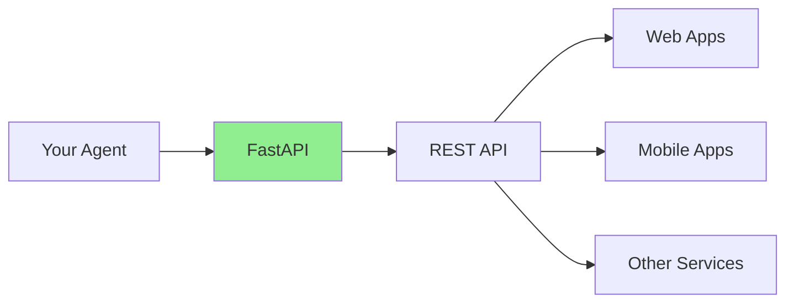
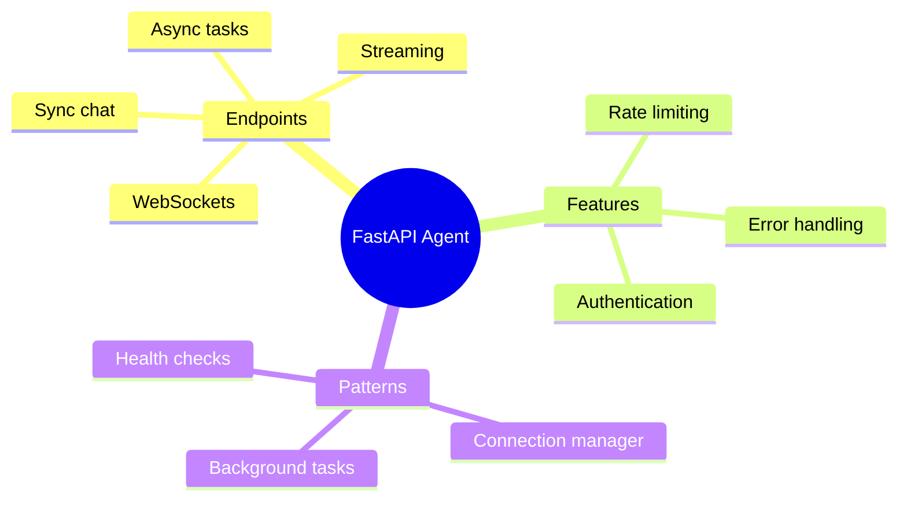

# Wrapping Agents in APIs with FastAPI

Your AI agents work great locally. Now let's make them accessible to the world! In this guide, you'll learn to expose your agents as **REST APIs** using FastAPI.

> **Coming from Software Engineering?** This is 100% your wheelhouse. FastAPI is just a Python web framework — if you've used Flask, Express, Spring Boot, or any REST framework, you already know how to do this. The only AI-specific consideration is that LLM calls are slow (seconds, not milliseconds), so you need async handlers and streaming responses. Your API design, error handling, and middleware skills transfer completely.

---

## Why FastAPI?



FastAPI is perfect for AI applications:
- **Fast**: High performance with async support
- **Type hints**: Automatic validation
- **Docs**: Auto-generated API documentation
- **Async**: Handle concurrent requests

---

## Basic Setup

```bash
pip install fastapi uvicorn python-multipart
```

### Simple Agent API

```python
# script_id: day_083_fastapi_agents/simple_agent_api
from fastapi import FastAPI, HTTPException
from pydantic import BaseModel
from openai import OpenAI

app = FastAPI(title="AI Agent API")
client = OpenAI()

class QueryRequest(BaseModel):
    message: str
    system_prompt: str = "You are a helpful assistant."

class QueryResponse(BaseModel):
    response: str
    tokens_used: int

@app.post("/chat", response_model=QueryResponse)
async def chat(request: QueryRequest):
    """Simple chat endpoint."""
    try:
        response = client.chat.completions.create(
            model="gpt-4o-mini",
            messages=[
                {"role": "system", "content": request.system_prompt},
                {"role": "user", "content": request.message}
            ]
        )

        return QueryResponse(
            response=response.choices[0].message.content,
            tokens_used=response.usage.total_tokens
        )

    except Exception as e:
        raise HTTPException(status_code=500, detail=str(e))

# Run with: uvicorn main:app --reload
```

---

## Complete Agent API

```python
# script_id: day_083_fastapi_agents/complete_agent_api
from fastapi import FastAPI, HTTPException, BackgroundTasks
from pydantic import BaseModel, Field
from typing import Optional, List
from openai import OpenAI
import uuid
from datetime import datetime

app = FastAPI(
    title="Agent API",
    description="REST API for AI agents",
    version="1.0.0"
)

client = OpenAI()

# In-memory storage (use Redis/DB in production)
conversations = {}
tasks = {}

# Models
class Message(BaseModel):
    role: str
    content: str

class ChatRequest(BaseModel):
    message: str
    conversation_id: Optional[str] = None
    system_prompt: str = "You are a helpful AI assistant."
    temperature: float = Field(0.7, ge=0, le=2)  # 0 = deterministic/repeatable, higher = more random/creative
    max_tokens: int = Field(1000, ge=1, le=4000)

class ChatResponse(BaseModel):
    response: str
    conversation_id: str
    tokens_used: int
    timestamp: str

class TaskStatus(BaseModel):
    task_id: str
    status: str  # pending, running, completed, failed
    result: Optional[str] = None
    created_at: str
    completed_at: Optional[str] = None

# Endpoints
@app.post("/chat", response_model=ChatResponse)
async def chat(request: ChatRequest):
    """Synchronous chat endpoint."""
    # Get or create conversation
    conv_id = request.conversation_id or str(uuid.uuid4())

    if conv_id not in conversations:
        conversations[conv_id] = [
            {"role": "system", "content": request.system_prompt}
        ]

    # Add user message
    conversations[conv_id].append({
        "role": "user",
        "content": request.message
    })

    try:
        response = client.chat.completions.create(
            model="gpt-4o-mini",
            messages=conversations[conv_id],
            temperature=request.temperature,
            max_tokens=request.max_tokens
        )

        assistant_message = response.choices[0].message.content

        # Store assistant response
        conversations[conv_id].append({
            "role": "assistant",
            "content": assistant_message
        })

        return ChatResponse(
            response=assistant_message,
            conversation_id=conv_id,
            tokens_used=response.usage.total_tokens,
            timestamp=datetime.now().isoformat()
        )

    except Exception as e:
        raise HTTPException(status_code=500, detail=str(e))

@app.get("/conversation/{conversation_id}")
async def get_conversation(conversation_id: str):
    """Get conversation history."""
    if conversation_id not in conversations:
        raise HTTPException(status_code=404, detail="Conversation not found")

    return {
        "conversation_id": conversation_id,
        "messages": conversations[conversation_id],
        "message_count": len(conversations[conversation_id])
    }

@app.delete("/conversation/{conversation_id}")
async def delete_conversation(conversation_id: str):
    """Delete a conversation."""
    if conversation_id in conversations:
        del conversations[conversation_id]
        return {"status": "deleted"}
    raise HTTPException(status_code=404, detail="Conversation not found")

# Health check
@app.get("/health")
async def health_check():
    """Health check endpoint."""
    return {
        "status": "healthy",
        "timestamp": datetime.now().isoformat(),
        "active_conversations": len(conversations)
    }
```

`temperature` controls randomness in the model's output — think of it as a creativity dial; leave it at the default unless a user wants more varied answers.

---

## Handling Long-Running Tasks

AI tasks can take a while. Use background tasks:

This is the classic submit-and-poll pattern — return a `task_id` immediately (like a 202 Accepted), then let the client poll `GET /task/{id}`, same as any async job queue.

```python
# script_id: day_083_fastapi_agents/complete_agent_api
from fastapi import BackgroundTasks
import asyncio

class LongTaskRequest(BaseModel):
    prompt: str
    task_type: str = "analysis"

@app.post("/task", response_model=TaskStatus)
async def create_task(request: LongTaskRequest, background_tasks: BackgroundTasks):
    """Create a long-running task."""
    task_id = str(uuid.uuid4())

    tasks[task_id] = {
        "status": "pending",
        "result": None,
        "created_at": datetime.now().isoformat(),
        "completed_at": None
    }

    # Run in background
    background_tasks.add_task(run_agent_task, task_id, request.prompt)

    return TaskStatus(
        task_id=task_id,
        status="pending",
        created_at=tasks[task_id]["created_at"]
    )

async def run_agent_task(task_id: str, prompt: str):
    """Execute the agent task in background."""
    tasks[task_id]["status"] = "running"

    try:
        # Simulate long-running task
        response = client.chat.completions.create(
            model="gpt-4o",
            messages=[{"role": "user", "content": prompt}],
            max_tokens=2000
        )

        tasks[task_id]["status"] = "completed"
        tasks[task_id]["result"] = response.choices[0].message.content
        tasks[task_id]["completed_at"] = datetime.now().isoformat()

    except Exception as e:
        tasks[task_id]["status"] = "failed"
        tasks[task_id]["result"] = str(e)
        tasks[task_id]["completed_at"] = datetime.now().isoformat()

@app.get("/task/{task_id}", response_model=TaskStatus)
async def get_task(task_id: str):
    """Get task status."""
    if task_id not in tasks:
        raise HTTPException(status_code=404, detail="Task not found")

    task = tasks[task_id]
    return TaskStatus(
        task_id=task_id,
        status=task["status"],
        result=task["result"],
        created_at=task["created_at"],
        completed_at=task["completed_at"]
    )
```

In production a real worker would run the LLM call off the event loop (e.g. a task queue or `run_in_executor`) so it doesn't block other requests.

---

## Streaming Responses

LLMs generate their answer a few words at a time, so instead of waiting for the whole reply you can forward each piece (a "chunk") to the client as it is produced — like flushing a response body incrementally. `delta.content` is the new text in that chunk. This uses Server-Sent Events (SSE) format — we explain the protocol below.

```python
# script_id: day_083_fastapi_agents/complete_agent_api
from fastapi.responses import StreamingResponse
import json

class StreamRequest(BaseModel):
    message: str
    system_prompt: str = "You are a helpful assistant."

@app.post("/chat/stream")
async def chat_stream(request: StreamRequest):
    """Streaming chat endpoint."""

    async def generate():
        stream = client.chat.completions.create(
            model="gpt-4o-mini",
            messages=[
                {"role": "system", "content": request.system_prompt},
                {"role": "user", "content": request.message}
            ],
            stream=True
        )

        for chunk in stream:
            if chunk.choices[0].delta.content:
                data = {"content": chunk.choices[0].delta.content}
                yield f"data: {json.dumps(data)}\n\n"

        yield "data: [DONE]\n\n"

    return StreamingResponse(
        generate(),
        media_type="text/event-stream"
    )
```

Here each `data:` payload is a small JSON object (`{"content": "..."}`), and the `[DONE]` sentinel marks the end of the stream — the same convention the OpenAI API uses. This is the async/streaming payoff promised up top — the user sees words appear immediately instead of waiting seconds for the full response.

---

## WebSocket for Real-Time Chat

FastAPI also supports WebSockets for bidirectional streaming — we go deep on production WebSocket handling (disconnects, reconnection, token streaming) on Day 85; this is a minimal taste.

```python
# script_id: day_083_fastapi_agents/complete_agent_api
from fastapi import WebSocket, WebSocketDisconnect
import json

class ConnectionManager:
    def __init__(self):
        self.active_connections: dict[str, WebSocket] = {}

    async def connect(self, websocket: WebSocket, client_id: str):
        await websocket.accept()
        self.active_connections[client_id] = websocket

    def disconnect(self, client_id: str):
        if client_id in self.active_connections:
            del self.active_connections[client_id]

    async def send_message(self, message: str, client_id: str):
        if client_id in self.active_connections:
            await self.active_connections[client_id].send_text(message)

manager = ConnectionManager()

@app.websocket("/ws/{client_id}")
async def websocket_endpoint(websocket: WebSocket, client_id: str):
    """WebSocket endpoint for real-time chat."""
    await manager.connect(websocket, client_id)

    try:
        while True:
            # Receive message from client
            data = await websocket.receive_text()
            message_data = json.loads(data)

            # Stream response back
            stream = client.chat.completions.create(
                model="gpt-4o-mini",
                messages=[{"role": "user", "content": message_data["message"]}],
                stream=True
            )

            for chunk in stream:
                if chunk.choices[0].delta.content:
                    await manager.send_message(
                        json.dumps({"content": chunk.choices[0].delta.content}),
                        client_id
                    )

            await manager.send_message(
                json.dumps({"done": True}),
                client_id
            )

    except WebSocketDisconnect:
        manager.disconnect(client_id)
```

---

## Adding Authentication

```python
# script_id: day_083_fastapi_agents/complete_agent_api
from fastapi import Security, Depends
from fastapi.security import APIKeyHeader

API_KEY_HEADER = APIKeyHeader(name="X-API-Key")
VALID_API_KEYS = {"key1": "user1", "key2": "user2"}  # Use database in production

async def verify_api_key(api_key: str = Security(API_KEY_HEADER)):
    """Verify API key."""
    if api_key not in VALID_API_KEYS:
        raise HTTPException(status_code=403, detail="Invalid API key")
    return VALID_API_KEYS[api_key]

@app.post("/secure/chat")
async def secure_chat(
    request: ChatRequest,
    user: str = Depends(verify_api_key)
):
    """Authenticated chat endpoint."""
    # User is verified, process request
    return {"user": user, "message": "Authenticated!"}
```

---

## Rate Limiting

```python
# script_id: day_083_fastapi_agents/complete_agent_api
from fastapi import Request
from collections import defaultdict
import time

# Simple in-memory rate limiter
request_counts = defaultdict(list)
RATE_LIMIT = 10  # requests per minute

async def rate_limit(request: Request):
    """Rate limiting middleware."""
    client_ip = request.client.host
    now = time.time()

    # Clean old requests
    request_counts[client_ip] = [
        t for t in request_counts[client_ip]
        if now - t < 60
    ]

    if len(request_counts[client_ip]) >= RATE_LIMIT:
        raise HTTPException(
            status_code=429,
            detail="Rate limit exceeded. Try again later."
        )

    request_counts[client_ip].append(now)

@app.post("/chat/limited")
async def limited_chat(request: ChatRequest, _: None = Depends(rate_limit)):
    """Rate-limited chat endpoint."""
    # Process normally
    pass
```

---

## Server-Sent Events (SSE), Explained

The streaming endpoint above already speaks SSE — here's the protocol behind it. Server-Sent Events is the standard pattern for streaming LLM output over HTTP. Unlike WebSockets, SSE is unidirectional (server to client), uses plain HTTP, and works through most proxies and CDNs without special configuration. This is how ChatGPT, Claude, and most LLM-powered UIs stream responses to the browser. The minimal version below strips the endpoint down to just the SSE mechanics.

```python
# script_id: day_083_fastapi_agents/sse_streaming
from fastapi import FastAPI
from fastapi.responses import StreamingResponse
from pydantic import BaseModel
from openai import OpenAI

app = FastAPI()
client = OpenAI()

class ChatRequest(BaseModel):
    message: str

@app.post("/chat/stream")
async def chat_stream(request: ChatRequest):
    """Stream LLM responses using Server-Sent Events."""
    async def generate():
        stream = client.chat.completions.create(
            model="gpt-4o-mini",
            messages=[{"role": "user", "content": request.message}],
            stream=True,
        )
        for chunk in stream:
            if chunk.choices[0].delta.content:
                yield f"data: {chunk.choices[0].delta.content}\n\n"
        yield "data: [DONE]\n\n"

    return StreamingResponse(generate(), media_type="text/event-stream")
```

On the client side, you consume SSE with the `EventSource` API in JavaScript or any HTTP client that supports streaming. The `data:` prefix and double newline are part of the SSE protocol -- each `data:` line is one event delivered to the client in real time. Here each `data:` payload is raw text (just the new words); the earlier endpoint wrapped its payload in JSON instead — pick one and have your client parse accordingly.

The `[DONE]` sentinel signals the end of the stream — this convention is also used by the OpenAI API itself. The `text/event-stream` media type tells the client to expect SSE.

---

## Summary



---

## Quick Reference

```python
# script_id: day_083_fastapi_agents/quick_reference
# Basic endpoint
@app.post("/chat")
async def chat(request: ChatRequest):
    return {"response": "..."}

# Streaming
@app.post("/stream")
async def stream():
    return StreamingResponse(generate(), media_type="text/event-stream")

# Background task
@app.post("/task")
async def task(background_tasks: BackgroundTasks):
    background_tasks.add_task(long_running_func)
    return {"task_id": "..."}

# Run server
# uvicorn main:app --reload --host 0.0.0.0 --port 8000
```

---

## Exercises

1. **Echo endpoint.** Build a `POST /chat` that takes a Pydantic `ChatRequest` and returns the model's reply. Validate the request with a typed model, not a raw dict.
2. **Stream it.** Add a `POST /stream` that returns a `StreamingResponse` yielding tokens as they arrive (`media_type="text/event-stream"`).
3. **Fire-and-forget.** Add a `POST /task` that kicks off a slow job with `BackgroundTasks` and immediately returns a `task_id`.
4. **Wire up lifespan.** Initialize your LLM client once at startup using the `lifespan` context manager (not `@app.on_event`) and reuse it across requests.

<details><summary>Solutions (approaches)</summary>

1. `class ChatRequest(BaseModel): message: str`; `async def chat(req: ChatRequest): ...` — FastAPI validates automatically.
2. `def gen(): yield from token_stream`; `return StreamingResponse(gen(), media_type="text/event-stream")`.
3. `async def task(bg: BackgroundTasks): bg.add_task(run_job, ...); return {"task_id": uuid4().hex}`.
4. `@asynccontextmanager async def lifespan(app): app.state.client = OpenAI(); yield`; pass `lifespan=lifespan` to `FastAPI(...)`.
</details>

---

## Checkpoint

Run the `complete_agent_api` with `uvicorn`, then `curl` the agent endpoint — you should get a JSON response back and see the request logged in the server console. If you get a 500, check the server logs for a missing `OPENAI_API_KEY`; if the connection refuses, confirm uvicorn is bound to the host/port you're curling.

---

## What's Next?

Now let's handle **long-running agent jobs** with async task queues — submit/poll endpoints, worker pools, and Celery.
