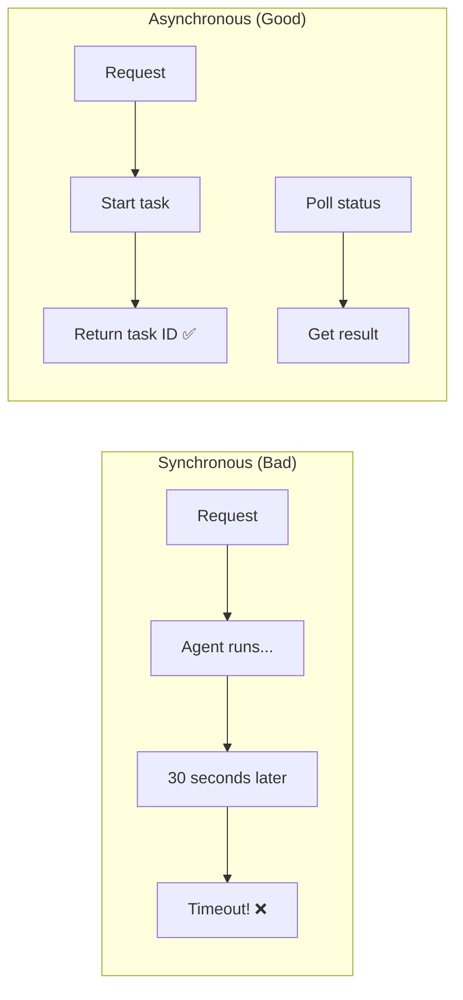
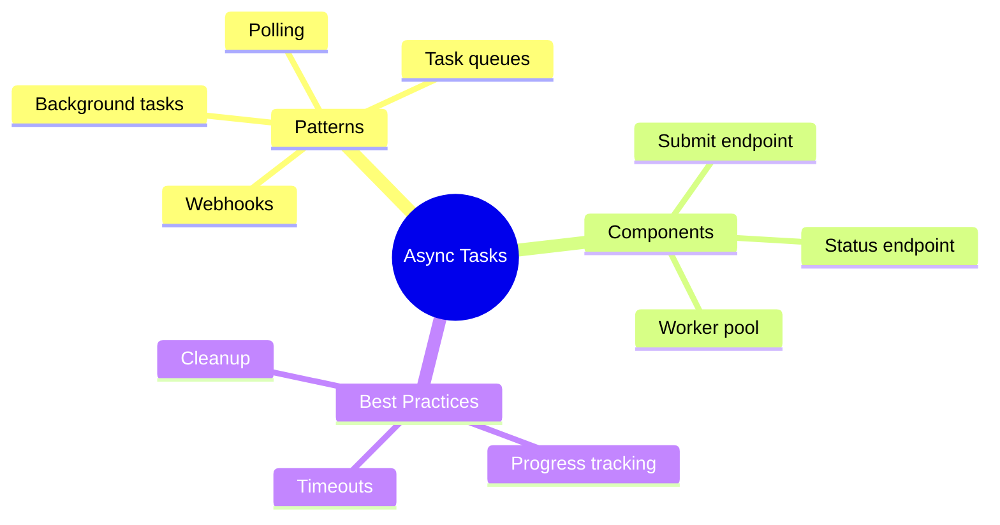

# Handling Long-Running Agent Tasks Asynchronously

Agent tasks can take minutes. Users can't wait that long! This guide shows you how to handle long-running tasks asynchronously in web servers.

> **Coming from Software Engineering?** This is the classic "long-running job" pattern: accept request → return job ID → process in background → poll or webhook for status. You've done this with Celery, Bull/BullMQ, Sidekiq, AWS SQS, or even just database-backed job queues. The pattern is identical for AI agents — the only difference is the "job" is an LLM conversation loop instead of a data processing task. Your queue management, status tracking, and timeout handling skills apply directly.

---

## The Problem



Issues with synchronous:
- HTTP timeouts (usually 30s)
- Blocked workers
- Poor user experience
- No progress updates

---

## Pattern 1: Background Tasks

You saw the bare `BackgroundTasks` version on Day 083; here we build it out toward production.

FastAPI's built-in background tasks:

```python
# script_id: day_084_async_task_handling/background_tasks
from fastapi import FastAPI, BackgroundTasks
from pydantic import BaseModel
import uuid
import asyncio

app = FastAPI()

# Store task results
task_results = {}

class TaskRequest(BaseModel):
    prompt: str

class TaskResponse(BaseModel):
    task_id: str
    status: str

def run_agent_task(task_id: str, prompt: str):
    """Run the agent task in background."""
    task_results[task_id] = {"status": "running", "result": None}

    # Simulate long-running agent
    import time
    time.sleep(10)  # Agent work

    # Store result
    task_results[task_id] = {
        "status": "completed",
        "result": f"Agent response to: {prompt}"
    }

@app.post("/agent/start", response_model=TaskResponse)
async def start_agent_task(request: TaskRequest, background_tasks: BackgroundTasks):
    """Start a long-running agent task."""

    task_id = str(uuid.uuid4())
    task_results[task_id] = {"status": "pending", "result": None}

    # Add to background tasks
    background_tasks.add_task(run_agent_task, task_id, request.prompt)

    return TaskResponse(task_id=task_id, status="pending")

@app.get("/agent/status/{task_id}")
async def get_task_status(task_id: str):
    """Get status of a task."""

    if task_id not in task_results:
        return {"error": "Task not found"}

    return task_results[task_id]
```

Note: `run_agent_task` is a plain `def` (not `async`), so FastAPI runs it in a threadpool and the blocking `time.sleep` is fine. Inside an `async` function you must use `await asyncio.sleep` instead — a blocking call there freezes the whole server. That is why Patterns 3-5 use asyncio.

Note: `task_results` lives in this process's memory, so it only works on a single worker/server and is wiped on restart. Patterns 2-3 fix that with a shared store/queue.

---

## Pattern 2: Task Queue with Redis

For production, use a proper task queue:

```python
# script_id: day_084_async_task_handling/celery_task_queue
from fastapi import FastAPI
from celery import Celery
from pydantic import BaseModel
import os

# Setup Celery
celery_app = Celery(
    "agent_tasks",
    broker=os.environ.get("REDIS_URL", "redis://localhost:6379/0"),
    backend=os.environ.get("REDIS_URL", "redis://localhost:6379/0")
)

app = FastAPI()

@celery_app.task(bind=True)
def run_agent(self, prompt: str):
    """Celery task for running agent."""

    # Update progress
    self.update_state(state="RUNNING", meta={"progress": 0})

    # Simulate agent work
    import time
    for i in range(5):
        time.sleep(2)
        self.update_state(state="RUNNING", meta={"progress": (i+1) * 20})

    return {"result": f"Completed: {prompt}"}

class AgentRequest(BaseModel):
    prompt: str

@app.post("/agent/start")
async def start_task(request: AgentRequest):
    """Start agent task."""
    task = run_agent.delay(request.prompt)
    return {"task_id": task.id}

@app.get("/agent/status/{task_id}")
async def get_status(task_id: str):
    """Get task status."""
    task = run_agent.AsyncResult(task_id)

    if task.state == "PENDING":
        return {"status": "pending", "progress": 0}
    elif task.state == "RUNNING":
        return {"status": "running", "progress": task.info.get("progress", 0)}
    elif task.state == "SUCCESS":
        return {"status": "completed", "result": task.result}
    else:
        return {"status": "failed", "error": str(task.info)}
```

---

## Pattern 3: In-Memory Queue

Simple queue for single-server deployments:

```python
# script_id: day_084_async_task_handling/in_memory_queue
from fastapi import FastAPI
from pydantic import BaseModel
import asyncio
import uuid
from datetime import datetime
from typing import Dict
from enum import Enum

class TaskStatus(Enum):
    PENDING = "pending"
    RUNNING = "running"
    COMPLETED = "completed"
    FAILED = "failed"

class Task:
    def __init__(self, task_id: str, prompt: str):
        self.id = task_id
        self.prompt = prompt
        self.status = TaskStatus.PENDING
        self.result = None
        self.error = None
        self.created_at = datetime.now()
        self.completed_at = None
        self.progress = 0

class TaskQueue:
    def __init__(self, max_workers: int = 3):
        self.tasks: Dict[str, Task] = {}
        self.queue = asyncio.Queue()
        self.max_workers = max_workers
        self.workers_started = False
        self._workers = []

    async def start_workers(self):
        """Start background workers."""
        if self.workers_started:
            return

        for i in range(self.max_workers):
            self._workers.append(asyncio.create_task(self._worker(i)))

        self.workers_started = True

    async def _worker(self, worker_id: int):
        """Process tasks from queue."""
        while True:
            task_id = await self.queue.get()
            task = self.tasks.get(task_id)

            if not task:
                continue

            try:
                task.status = TaskStatus.RUNNING
                task.result = await self._run_agent(task)
                task.status = TaskStatus.COMPLETED
            except Exception as e:
                task.status = TaskStatus.FAILED
                task.error = str(e)
            finally:
                task.completed_at = datetime.now()
                self.queue.task_done()

    async def _run_agent(self, task: Task) -> str:
        """Run the actual agent (your implementation)."""
        # Simulate long-running work with progress
        for i in range(10):
            await asyncio.sleep(1)
            task.progress = (i + 1) * 10

        return f"Agent completed: {task.prompt}"

    async def submit(self, prompt: str) -> str:
        """Submit a new task."""
        task_id = str(uuid.uuid4())
        task = Task(task_id, prompt)
        self.tasks[task_id] = task

        await self.queue.put(task_id)
        return task_id

    def get_status(self, task_id: str) -> dict:
        """Get task status."""
        task = self.tasks.get(task_id)
        if not task:
            return {"error": "Task not found"}

        return {
            "id": task.id,
            "status": task.status.value,
            "progress": task.progress,
            "result": task.result,
            "error": task.error
        }

# FastAPI app
app = FastAPI()
task_queue = TaskQueue(max_workers=3)

# NOTE: @app.on_event("startup") is deprecated in modern FastAPI. New code should
# use a lifespan context manager (see Day 97 for the lifespan pattern):
#   @asynccontextmanager
#   async def lifespan(app): await task_queue.start_workers(); yield
#   app = FastAPI(lifespan=lifespan)
@app.on_event("startup")
async def startup():
    await task_queue.start_workers()

class PromptRequest(BaseModel):
    prompt: str

@app.post("/agent/submit")
async def submit_task(request: PromptRequest):
    task_id = await task_queue.submit(request.prompt)
    return {"task_id": task_id}

@app.get("/agent/status/{task_id}")
async def get_status(task_id: str):
    return task_queue.get_status(task_id)
```

---

## Pattern 4: Polling Client

Client-side polling for results:

```python
# script_id: day_084_async_task_handling/polling_client
import httpx
import asyncio

async def run_agent_with_polling(prompt: str, poll_interval: float = 1.0):
    """Submit task and poll until complete."""

    async with httpx.AsyncClient() as client:
        # Submit task
        response = await client.post(
            "http://localhost:8000/agent/submit",
            json={"prompt": prompt}
        )
        task_id = response.json()["task_id"]
        print(f"Task submitted: {task_id}")

        # Poll for completion
        while True:
            status_response = await client.get(
                f"http://localhost:8000/agent/status/{task_id}"
            )
            status = status_response.json()

            print(f"Status: {status['status']}, Progress: {status.get('progress', 0)}%")

            if status["status"] == "completed":
                return status["result"]
            elif status["status"] == "failed":
                raise Exception(status.get("error", "Unknown error"))

            await asyncio.sleep(poll_interval)

# Usage
result = asyncio.run(run_agent_with_polling("Analyze this document"))
print(f"Result: {result}")
```

---

## Pattern 5: Callback/Webhook

Notify when complete:

```python
# script_id: day_084_async_task_handling/callback_webhook
from fastapi import FastAPI
from pydantic import BaseModel
import httpx
import asyncio
import uuid

app = FastAPI()

class TaskWithCallback(BaseModel):
    prompt: str
    callback_url: str  # Where to POST result

async def run_agent_with_callback(task_id: str, prompt: str, callback_url: str):
    """Run agent and call webhook on completion."""

    try:
        # Simulate agent work
        await asyncio.sleep(10)
        result = f"Completed: {prompt}"

        # Send callback
        async with httpx.AsyncClient() as client:
            await client.post(callback_url, json={
                "task_id": task_id,
                "status": "completed",
                "result": result
            })
    except Exception as e:
        async with httpx.AsyncClient() as client:
            await client.post(callback_url, json={
                "task_id": task_id,
                "status": "failed",
                "error": str(e)
            })

@app.post("/agent/submit-with-callback")
async def submit_with_callback(request: TaskWithCallback):
    task_id = str(uuid.uuid4())

    # Start task in background
    asyncio.create_task(
        run_agent_with_callback(task_id, request.prompt, request.callback_url)
    )

    return {"task_id": task_id, "status": "submitted"}

# Client receives POST to callback_url when done
```

---

## Best Practices

These snippets build on the `Task`/`TaskQueue` classes from Pattern 3 — they are illustrative and assume those definitions are in scope.

### 1. Task Timeouts

```python
# script_id: day_084_async_task_handling/task_timeout
# fragment: illustrative best-practice snippet / not standalone-runnable
async def run_with_timeout(task: Task, timeout: int = 300):
    """Run task with timeout."""
    try:
        result = await asyncio.wait_for(
            run_agent(task),
            timeout=timeout
        )
        return result
    except asyncio.TimeoutError:
        task.status = TaskStatus.FAILED
        task.error = f"Task timed out after {timeout}s"
        raise
```

### 2. Progress Updates

```python
# script_id: day_084_async_task_handling/progress_updates
# fragment: illustrative best-practice snippet / not standalone-runnable
async def run_agent_with_progress(task: Task):
    """Run agent with progress updates."""
    # The steps are just an example - the point is you set task.progress between each slow step.
    task.progress = 10
    step1 = await load_inputs()

    task.progress = 40
    step2 = await process(step1)

    task.progress = 70
    step3 = await call_model(step2)

    task.progress = 100
    return step3
```

### 3. Cleanup Old Tasks

```python
# script_id: day_084_async_task_handling/cleanup_old_tasks
# fragment: illustrative best-practice snippet / not standalone-runnable
from datetime import datetime, timedelta

async def cleanup_old_tasks(task_queue: TaskQueue, max_age_hours: int = 24):
    """Remove old completed tasks."""
    cutoff = datetime.now() - timedelta(hours=max_age_hours)

    to_remove = [
        task_id for task_id, task in task_queue.tasks.items()
        if task.completed_at and task.completed_at < cutoff
    ]

    for task_id in to_remove:
        del task_queue.tasks[task_id]
```

---

## Summary



---

## Quick Reference

```python
# script_id: day_084_async_task_handling/quick_reference
# fragment: illustrative cheat-sheet / not standalone-runnable
# Submit task
POST /agent/submit
{"prompt": "..."}
-> {"task_id": "abc123"}

# Check status
GET /agent/status/abc123
-> {"status": "running", "progress": 50}
-> {"status": "completed", "result": "..."}

# With Celery
task = run_agent.delay(prompt)
task.id  # Get task ID
task.state  # Check status
task.result  # Get result
```

---

## Exercises

1. **Submit + poll.** Build `POST /agent/submit` that returns a `task_id` and `GET /agent/status/{id}` that reports `pending`/`running`/`completed` with the result when done.
2. **Track progress.** Have the worker write a `progress` percentage somewhere the status endpoint can read, so a client can show a progress bar.
3. **Move to Celery.** Re-implement the worker as a Celery task; submit with `.delay(prompt)` and read `task.state` / `task.result` in the status endpoint.
4. **Add a timeout + cleanup.** Cancel a task that runs past N seconds and delete finished task records after a TTL so memory doesn't grow forever.

<details><summary>Solutions (approaches)</summary>

1. Store state in a dict keyed by `uuid4().hex`; submit kicks off a background task that mutates the entry; status returns it.
2. Worker updates `tasks[id]["progress"]` as it goes; status endpoint returns that field.
3. `@celery.task def run_agent(prompt): ...`; `task = run_agent.delay(prompt)`; map Celery states to your API's status strings.
4. Use `asyncio.wait_for(coro, timeout=N)` (or Celery `soft_time_limit`); a periodic sweep removes entries older than the TTL.
</details>

---

## Checkpoint

Run the `background_tasks` API: POST a job and confirm you get back a task ID immediately (not a blocked request), then poll the status endpoint with the `polling_client` and watch it flip from `pending` to `completed`. If the status never changes, check that the background worker is actually running and writing back to the same task store the status endpoint reads from.

---

## What's Next?

Now let's implement **WebSockets for real-time streaming** of agent thoughts!
