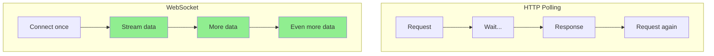
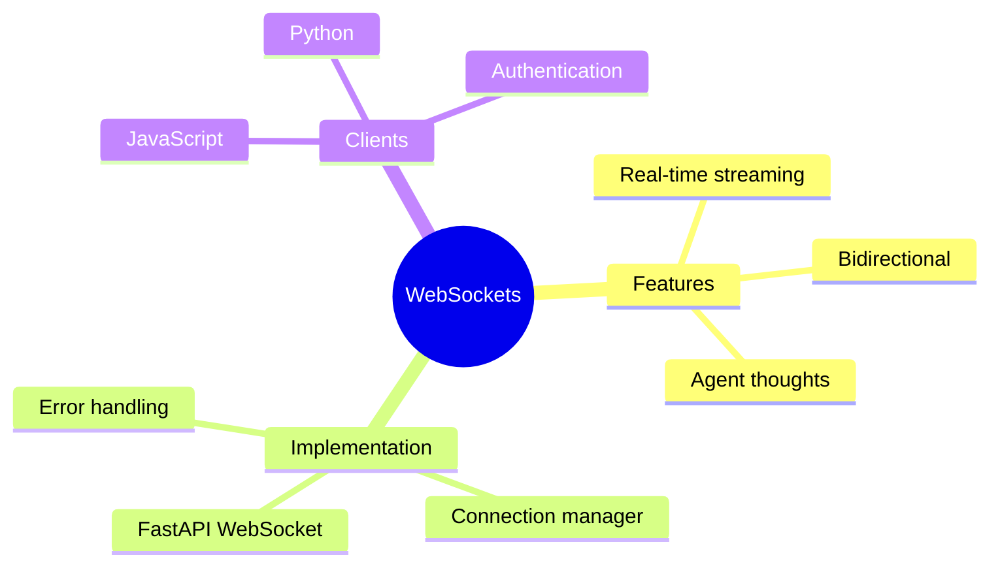

# WebSockets for Real-Time Agent Streaming

Watch your agent think in real-time! WebSockets enable bidirectional communication for streaming agent responses and thoughts.

> **Coming from Software Engineering?** If you've built real-time features — chat apps, live dashboards, collaborative editing, or notification systems — you already know WebSockets. The pattern here is identical: open a persistent connection, stream data as it becomes available, handle disconnections gracefully. Server-Sent Events (SSE) also works well for one-way streaming. The AI-specific part is streaming token-by-token output, which is just pushing small chunks of text over the socket as the LLM generates them.

---

## Why WebSockets?



Benefits:
- **Real-time**: Instant updates
- **Bidirectional**: Client and server can send
- **Efficient**: Single connection
- **Better UX**: See agent thinking

---

## Basic WebSocket Server

```python
# script_id: day_085_websockets_streaming/basic_websocket_server
from fastapi import FastAPI, WebSocket, WebSocketDisconnect
import asyncio

app = FastAPI()

@app.websocket("/ws/agent")
async def agent_websocket(websocket: WebSocket):
    """WebSocket endpoint for agent interaction."""

    await websocket.accept()

    try:
        while True:
            # Receive message from client
            data = await websocket.receive_text()

            # Stream response back
            async for chunk in stream_agent_response(data):
                await websocket.send_text(chunk)

            # Send completion marker
            await websocket.send_text("[DONE]")

    except WebSocketDisconnect:
        print("Client disconnected")

async def stream_agent_response(prompt: str):
    """Generate streaming response."""

    # Simulate streaming agent response
    response = f"Processing your request: {prompt}. "
    response += "Here's my analysis... "
    response += "And my conclusion."

    for word in response.split():
        yield word + " "
        await asyncio.sleep(0.1)  # Simulate thinking
```

---

## Streaming LLM Responses

Stream actual LLM output:

```python
# script_id: day_085_websockets_streaming/streaming_llm_responses
from fastapi import FastAPI, WebSocket
from openai import OpenAI

app = FastAPI()
client = OpenAI()

@app.websocket("/ws/chat")
async def chat_websocket(websocket: WebSocket):
    """Stream LLM responses via WebSocket."""

    await websocket.accept()

    try:
        while True:
            # Get user message
            user_message = await websocket.receive_text()

            # Stream response
            stream = client.chat.completions.create(
                model="gpt-4o-mini",
                messages=[{"role": "user", "content": user_message}],
                stream=True
            )

            for chunk in stream:
                if chunk.choices[0].delta.content:
                    await websocket.send_text(chunk.choices[0].delta.content)

            await websocket.send_text("\n[DONE]")

    except Exception as e:
        await websocket.send_text(f"[ERROR] {str(e)}")
```

---

## Streaming Agent Thoughts

Stream the agent's reasoning process:

```python
# script_id: day_085_websockets_streaming/streaming_agent_thoughts
from fastapi import FastAPI, WebSocket
from dataclasses import dataclass
from typing import AsyncGenerator
import json

app = FastAPI()

@dataclass
class AgentThought:
    type: str  # "thinking", "action", "observation", "answer"
    content: str

async def run_agent_with_thoughts(prompt: str) -> AsyncGenerator[AgentThought, None]:
    """Run agent and yield thoughts."""

    # Thinking
    yield AgentThought("thinking", "Analyzing the question...")
    await asyncio.sleep(0.5)

    yield AgentThought("thinking", "I need to search for information")
    await asyncio.sleep(0.5)

    # Action
    yield AgentThought("action", "Searching: relevant information")
    await asyncio.sleep(1)

    # Observation
    yield AgentThought("observation", "Found: relevant results about the topic")
    await asyncio.sleep(0.5)

    # More thinking
    yield AgentThought("thinking", "Processing the results...")
    await asyncio.sleep(0.5)

    # Final answer
    yield AgentThought("answer", "Based on my research, here's the answer...")

@app.websocket("/ws/agent-thoughts")
async def agent_thoughts_websocket(websocket: WebSocket):
    """Stream agent thoughts via WebSocket."""

    await websocket.accept()

    try:
        while True:
            prompt = await websocket.receive_text()

            async for thought in run_agent_with_thoughts(prompt):
                message = json.dumps({
                    "type": thought.type,
                    "content": thought.content
                })
                await websocket.send_text(message)

            await websocket.send_text(json.dumps({"type": "done"}))

    except WebSocketDisconnect:
        pass
```

---

## Connection Manager

Handle multiple clients:

```python
# script_id: day_085_websockets_streaming/connection_manager
from fastapi import FastAPI, WebSocket, WebSocketDisconnect
from typing import List, Dict
import json

class ConnectionManager:
    """Manage WebSocket connections."""

    def __init__(self):
        self.active_connections: Dict[str, WebSocket] = {}

    async def connect(self, websocket: WebSocket, client_id: str):
        await websocket.accept()
        self.active_connections[client_id] = websocket

    def disconnect(self, client_id: str):
        if client_id in self.active_connections:
            del self.active_connections[client_id]

    async def send_personal(self, message: str, client_id: str):
        if client_id in self.active_connections:
            await self.active_connections[client_id].send_text(message)

    async def broadcast(self, message: str):
        for connection in self.active_connections.values():
            await connection.send_text(message)

manager = ConnectionManager()
app = FastAPI()

@app.websocket("/ws/{client_id}")
async def websocket_endpoint(websocket: WebSocket, client_id: str):
    await manager.connect(websocket, client_id)

    try:
        while True:
            data = await websocket.receive_text()

            # Process and stream back
            async for chunk in process_message(data):
                await manager.send_personal(chunk, client_id)

    except WebSocketDisconnect:
        manager.disconnect(client_id)
```

---

## Client-Side JavaScript

```html
<!DOCTYPE html>
<html>
<head>
    <title>Agent Chat</title>
</head>
<body>
    <div id="chat"></div>
    <input type="text" id="input" placeholder="Type a message...">
    <button onclick="send()">Send</button>

    <script>
        const ws = new WebSocket("ws://localhost:8000/ws/agent");
        const chat = document.getElementById("chat");
        let currentMessage = "";

        ws.onmessage = function(event) {
            const data = JSON.parse(event.data);

            if (data.type === "done") {
                // Add final message
                chat.innerHTML += `<div class="message">${currentMessage}</div>`;
                currentMessage = "";
            } else if (data.type === "thinking") {
                // Show thinking indicator
                chat.innerHTML += `<div class="thinking">💭 ${data.content}</div>`;
            } else if (data.type === "answer") {
                currentMessage += data.content;
                // Update live
                document.getElementById("current").innerHTML = currentMessage;
            }
        };

        ws.onopen = function() {
            console.log("Connected!");
        };

        ws.onclose = function() {
            console.log("Disconnected");
        };

        function send() {
            const input = document.getElementById("input");
            ws.send(input.value);
            chat.innerHTML += `<div class="user">You: ${input.value}</div>`;
            chat.innerHTML += `<div id="current"></div>`;
            input.value = "";
        }
    </script>
</body>
</html>
```

---

## Python WebSocket Client

```python
# script_id: day_085_websockets_streaming/python_websocket_client
import asyncio
import websockets
import json

async def chat_with_agent():
    """Connect to agent WebSocket and chat."""

    uri = "ws://localhost:8000/ws/agent-thoughts"

    async with websockets.connect(uri) as websocket:
        # Send message
        await websocket.send("What is machine learning?")

        # Receive streaming response
        while True:
            message = await websocket.recv()
            data = json.loads(message)

            if data["type"] == "done":
                break
            elif data["type"] == "thinking":
                print(f"💭 {data['content']}")
            elif data["type"] == "action":
                print(f"🔧 {data['content']}")
            elif data["type"] == "observation":
                print(f"👁️ {data['content']}")
            elif data["type"] == "answer":
                print(f"✅ {data['content']}")

# Run client
asyncio.run(chat_with_agent())
```

---

## Error Handling

```python
# script_id: day_085_websockets_streaming/error_handling
from fastapi import WebSocket, WebSocketDisconnect
import traceback

@app.websocket("/ws/robust")
async def robust_websocket(websocket: WebSocket):
    """WebSocket with robust error handling."""

    await websocket.accept()

    try:
        while True:
            try:
                data = await asyncio.wait_for(
                    websocket.receive_text(),
                    timeout=60.0  # 60 second timeout
                )

                async for chunk in process(data):
                    await websocket.send_text(chunk)

            except asyncio.TimeoutError:
                # Send ping to keep connection alive
                await websocket.send_text(json.dumps({"type": "ping"}))

            except Exception as e:
                # Send error to client
                await websocket.send_text(json.dumps({
                    "type": "error",
                    "message": str(e)
                }))

    except WebSocketDisconnect:
        print("Client disconnected normally")
    except Exception as e:
        print(f"WebSocket error: {traceback.format_exc()}")
```

---

## Authentication

Secure your WebSocket:

```python
# script_id: day_085_websockets_streaming/websocket_auth
import os
from fastapi import WebSocket, Query, HTTPException
import jwt  # pip install PyJWT

# Never hardcode the signing secret — load it from the environment / a secrets
# manager. Hardcoding "secret" means anyone can forge a valid token.
JWT_SECRET = os.environ["JWT_SECRET"]

async def get_current_user(token: str):
    """Validate JWT token."""
    try:
        payload = jwt.decode(token, JWT_SECRET, algorithms=["HS256"])
        return payload["user_id"]
    except Exception:
        return None

@app.websocket("/ws/secure")
async def secure_websocket(
    websocket: WebSocket,
    token: str = Query(...)
):
    """Authenticated WebSocket endpoint."""

    user_id = await get_current_user(token)
    if not user_id:
        await websocket.close(code=4001, reason="Invalid token")
        return

    await websocket.accept()
    # ... rest of handler
```

---

## Summary



---

## Quick Reference

```python
# script_id: day_085_websockets_streaming/quick_reference
# Server
@app.websocket("/ws")
async def ws(websocket: WebSocket):
    await websocket.accept()
    data = await websocket.receive_text()
    await websocket.send_text("response")

# Stream LLM
for chunk in stream:
    await websocket.send_text(chunk.choices[0].delta.content)

# Client (JavaScript)
const ws = new WebSocket("ws://localhost:8000/ws");
ws.onmessage = (e) => console.log(e.data);
ws.send("Hello");

# Client (Python)
async with websockets.connect(uri) as ws:
    await ws.send("Hello")
    response = await ws.recv()
```

---

## What's Next?

Now let's build **beautiful agent UIs** with Streamlit and Gradio!
