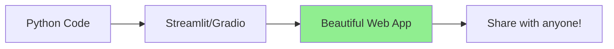
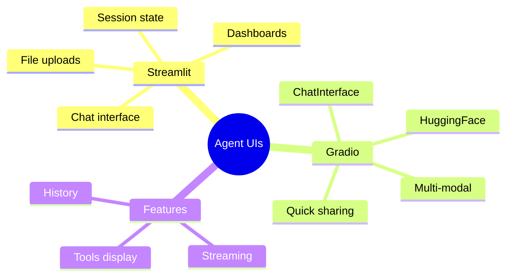

# Building Agent UIs with Streamlit and Gradio

Your AI agents need interfaces! In this guide, you'll learn to build beautiful, interactive UIs without being a frontend expert.

> **Coming from Software Engineering?** Streamlit and Gradio are like Swagger UI or Storybook for AI — they auto-generate a usable web interface from your Python code. If you're a backend engineer who's built internal tools with admin panels, these frameworks let you skip the frontend entirely. Think of them as rapid prototyping tools: great for demos, internal tools, and MVPs. For production UIs you'd still want React/Next.js, but for everything else these save weeks of work.

---

## Why Streamlit & Gradio?



Both frameworks let you build UIs with **pure Python** - no HTML, CSS, or JavaScript needed!

---

## Streamlit: The Data App Framework

### Installation

```bash
pip install streamlit
```

### Basic Chat UI

```python
# script_id: day_086_streamlit_gradio/streamlit_chat_ui
# app.py
import streamlit as st
from openai import OpenAI

client = OpenAI()

st.title("🤖 AI Chat Assistant")

# Initialize chat history
if "messages" not in st.session_state:
    st.session_state.messages = []

# Display chat messages
for message in st.session_state.messages:
    with st.chat_message(message["role"]):
        st.markdown(message["content"])

# Chat input
if prompt := st.chat_input("What would you like to know?"):
    # Display user message
    st.session_state.messages.append({"role": "user", "content": prompt})
    with st.chat_message("user"):
        st.markdown(prompt)

    # Get AI response
    with st.chat_message("assistant"):
        stream = client.chat.completions.create(
            model="gpt-4o-mini",
            messages=[{"role": m["role"], "content": m["content"]}
                      for m in st.session_state.messages],
            stream=True
        )
        response = st.write_stream(stream)

    st.session_state.messages.append({"role": "assistant", "content": response})

# Run with: streamlit run app.py
```

### RAG Application UI

```python
# script_id: day_086_streamlit_gradio/streamlit_rag_app
import streamlit as st
from openai import OpenAI
import chromadb

st.set_page_config(page_title="RAG App", page_icon="📚", layout="wide")

# Initialize clients
@st.cache_resource
def init_clients():
    return OpenAI(), chromadb.PersistentClient(path="./db")

openai_client, chroma_client = init_clients()
collection = chroma_client.get_or_create_collection("documents")

# Sidebar for settings
with st.sidebar:
    st.header("Settings")
    num_results = st.slider("Documents to retrieve", 1, 10, 3)
    temperature = st.slider("Temperature", 0.0, 2.0, 0.7)

    st.header("Upload Documents")
    uploaded_file = st.file_uploader("Choose a file", type=["txt", "pdf"])

    if uploaded_file:
        content = uploaded_file.read().decode()
        # Add to vector store
        collection.add(
            ids=[uploaded_file.name],
            documents=[content]
        )
        st.success(f"Added {uploaded_file.name}!")

# Main area
st.title("📚 Document Q&A")

query = st.text_input("Ask a question about your documents:")

if query:
    with st.spinner("Searching..."):
        # Get embedding
        emb = openai_client.embeddings.create(
            model="text-embedding-3-small",
            input=query
        )

        # Search
        results = collection.query(
            query_embeddings=[emb.data[0].embedding],
            n_results=num_results
        )

    # Show sources
    with st.expander("📄 Sources"):
        for i, doc in enumerate(results["documents"][0]):
            st.markdown(f"**Source {i+1}:**")
            st.text(doc[:300] + "...")

    # Generate answer
    with st.spinner("Generating answer..."):
        context = "\n\n".join(results["documents"][0])
        response = openai_client.chat.completions.create(
            model="gpt-4o-mini",
            messages=[
                {"role": "system", "content": f"Answer based on this context:\n{context}"},
                {"role": "user", "content": query}
            ],
            temperature=temperature
        )

    st.markdown("### Answer")
    st.markdown(response.choices[0].message.content)
```

### Agent Dashboard

```python
# script_id: day_086_streamlit_gradio/agent_dashboard
import streamlit as st
import pandas as pd
import plotly.express as px

st.set_page_config(layout="wide")
st.title("🤖 Agent Dashboard")

# Metrics row
col1, col2, col3, col4 = st.columns(4)
with col1:
    st.metric("Total Queries", "1,234", "+12%")
with col2:
    st.metric("Avg Response Time", "2.3s", "-0.5s")
with col3:
    st.metric("Success Rate", "94.5%", "+2.1%")
with col4:
    st.metric("Cost Today", "$12.45", "+$3.20")

# Charts
col1, col2 = st.columns(2)

with col1:
    st.subheader("Queries Over Time")
    data = pd.DataFrame({
        "hour": range(24),
        "queries": [10, 5, 3, 2, 4, 15, 45, 120, 150, 130, 100, 90,
                   110, 95, 88, 100, 130, 140, 120, 80, 50, 30, 20, 15]
    })
    fig = px.line(data, x="hour", y="queries")
    st.plotly_chart(fig, use_container_width=True)

with col2:
    st.subheader("Query Types")
    data = pd.DataFrame({
        "type": ["Q&A", "Code", "Analysis", "Creative"],
        "count": [450, 300, 250, 234]
    })
    fig = px.pie(data, values="count", names="type")
    st.plotly_chart(fig, use_container_width=True)

# Recent queries table
st.subheader("Recent Queries")
queries_df = pd.DataFrame({
    "Time": ["10:30", "10:28", "10:25", "10:22"],
    "Query": ["How to sort a list?", "Explain ML", "Write a poem", "Debug this code"],
    "Status": ["✅", "✅", "✅", "⚠️"],
    "Latency": ["1.2s", "2.1s", "3.4s", "4.5s"]
})
st.dataframe(queries_df, use_container_width=True)
```

---

## Gradio: The ML Demo Framework

### Installation

```bash
pip install gradio
```

### Basic Chat Interface

```python
# script_id: day_086_streamlit_gradio/gradio_chat
import gradio as gr
from openai import OpenAI

client = OpenAI()

def chat(message, history):
    """Chat function for Gradio.

    With type="messages" (the Gradio 5 default), `history` is already a list of
    {"role": ..., "content": ...} dicts — the same shape the OpenAI API wants —
    so we can pass it straight through instead of un-pairing tuples.
    """
    messages = history + [{"role": "user", "content": message}]

    response = client.chat.completions.create(
        model="gpt-4o-mini",
        messages=messages
    )

    return response.choices[0].message.content

# Create the interface
demo = gr.ChatInterface(
    chat,
    type="messages",  # pass OpenAI-style {role, content} dicts (Gradio 5 default)
    title="🤖 AI Assistant",
    description="Chat with an AI assistant powered by GPT-4o mini",
    examples=["Hello!", "Explain Python", "Write a haiku"],
    theme="soft"
)

demo.launch()
```

### Multi-Modal Interface

```python
# script_id: day_086_streamlit_gradio/gradio_chat
import gradio as gr
from openai import OpenAI
import base64

client = OpenAI()

def analyze_image(image, question):
    """Analyze an image with GPT-4o vision."""
    # Encode image
    with open(image, "rb") as f:
        image_data = base64.b64encode(f.read()).decode()

    response = client.chat.completions.create(
        # gpt-4-vision-preview was deprecated; vision is built into gpt-4o / gpt-4o-mini
        model="gpt-4o",
        messages=[
            {
                "role": "user",
                "content": [
                    {"type": "text", "text": question},
                    {
                        "type": "image_url",
                        "image_url": {"url": f"data:image/jpeg;base64,{image_data}"}
                    }
                ]
            }
        ],
        max_tokens=500
    )

    return response.choices[0].message.content

def transcribe_audio(audio):
    """Transcribe audio with Whisper."""
    with open(audio, "rb") as f:
        transcript = client.audio.transcriptions.create(
            model="whisper-1",
            file=f
        )
    return transcript.text

# Create tabbed interface
with gr.Blocks(title="Multi-Modal AI") as demo:
    gr.Markdown("# 🎨 Multi-Modal AI Assistant")

    with gr.Tab("Image Analysis"):
        with gr.Row():
            image_input = gr.Image(type="filepath", label="Upload Image")
            image_output = gr.Textbox(label="Analysis", lines=5)
        question_input = gr.Textbox(label="Question about the image")
        analyze_btn = gr.Button("Analyze")
        analyze_btn.click(analyze_image, [image_input, question_input], image_output)

    with gr.Tab("Audio Transcription"):
        audio_input = gr.Audio(type="filepath", label="Upload Audio")
        transcribe_btn = gr.Button("Transcribe")
        transcript_output = gr.Textbox(label="Transcript", lines=5)
        transcribe_btn.click(transcribe_audio, audio_input, transcript_output)

    with gr.Tab("Chat"):
        chatbot = gr.ChatInterface(chat)

demo.launch()
```

### Agent with Tools UI

```python
# script_id: day_086_streamlit_gradio/gradio_agent_tools
import gradio as gr
from openai import OpenAI
import json

client = OpenAI()

# Simple tools
def search(query):
    return f"Search results for: {query}"

def calculate(expr):
    import ast, operator
    def safe_eval(node):
        if isinstance(node, ast.Constant): return node.value
        elif isinstance(node, ast.BinOp):
            ops = {ast.Add: operator.add, ast.Sub: operator.sub,
                   ast.Mult: operator.mul, ast.Div: operator.truediv}
            return ops[type(node.op)](safe_eval(node.left), safe_eval(node.right))
        elif isinstance(node, ast.UnaryOp) and isinstance(node.op, ast.USub):
            return -safe_eval(node.operand)
        raise ValueError("Unsupported expression")
    return str(safe_eval(ast.parse(expr, mode='eval').body))

tools = {"search": search, "calculate": calculate}

def agent_chat(message, history):
    """Agent with tools."""

    messages = [{"role": "system", "content": """You are a helpful agent.
Use [TOOL:name:input] to use tools.
Available: search, calculate"""}]

    for h in history:
        messages.append({"role": "user", "content": h[0]})
        if h[1]:
            messages.append({"role": "assistant", "content": h[1]})

    messages.append({"role": "user", "content": message})

    response = client.chat.completions.create(
        model="gpt-4o-mini",
        messages=messages
    )

    content = response.choices[0].message.content

    # Check for tool calls
    import re
    tool_pattern = r'\[TOOL:(\w+):([^\]]+)\]'
    matches = re.findall(tool_pattern, content)

    for tool_name, tool_input in matches:
        if tool_name in tools:
            result = tools[tool_name](tool_input)
            content = content.replace(
                f"[TOOL:{tool_name}:{tool_input}]",
                f"**{tool_name}({tool_input})** → {result}"
            )

    return content

demo = gr.ChatInterface(
    agent_chat,
    title="🛠️ Agent with Tools",
    description="I can search and calculate!",
    examples=["Search for Python", "Calculate 15 * 23", "What is 100 / 4?"]
)

demo.launch()
```

---

## Comparison

| Feature | Streamlit | Gradio |
|---------|-----------|--------|
| Best for | Dashboards, data apps | ML demos, sharing |
| Chat UI | st.chat_message | gr.ChatInterface |
| Sharing | Streamlit Cloud | HuggingFace Spaces |
| Customization | More control | Simpler |
| Layout | Flexible columns | Tabs, rows |

---

## Summary



---

## Quick Reference

```python
# script_id: day_086_streamlit_gradio/quick_reference
# Streamlit Chat
import streamlit as st
if prompt := st.chat_input("Message"):
    with st.chat_message("user"):
        st.write(prompt)

# Gradio Chat
import gradio as gr
demo = gr.ChatInterface(fn=my_chat_function)
demo.launch()
```

---

## Exercises

1. **Streamlit chat.** Build a minimal chat app with `st.chat_input` / `st.chat_message` that keeps history across turns using `st.session_state`.
2. **Gradio in three lines.** Wrap your chat function in `gr.ChatInterface(fn=..., type="messages")` and launch it. Note how little code it took.
3. **Stream the reply.** Make either UI render tokens as they arrive instead of after the full response (Streamlit `st.write_stream`, or yield from the Gradio fn).
4. **Add a file upload.** Let the user upload a document and feed its text into the next prompt.

<details><summary>Solutions (approaches)</summary>

1. Append each turn to `st.session_state.messages`; re-render the list at the top of the script on every run.
2. `gr.ChatInterface(fn=chat, type="messages").launch()` — `type="messages"` passes OpenAI-style `{role, content}` dicts.
3. Streamlit: `st.write_stream(token_generator)`; Gradio: make `fn` a generator and `yield` partial strings.
4. `st.file_uploader(...)` / `gr.File(...)`, read the bytes, extract text, prepend it to the user message.
</details>

---

## What's Next?

Now let's add **generative / agentic UIs** — letting the agent decide what UI components to render, not just text.
