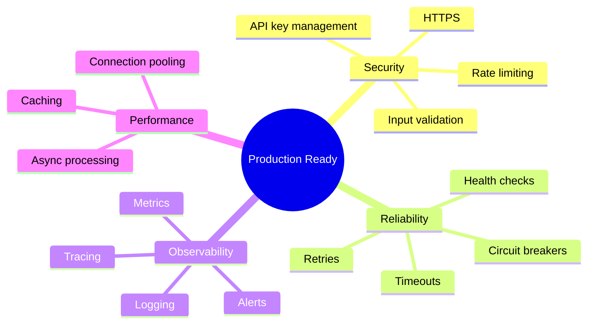
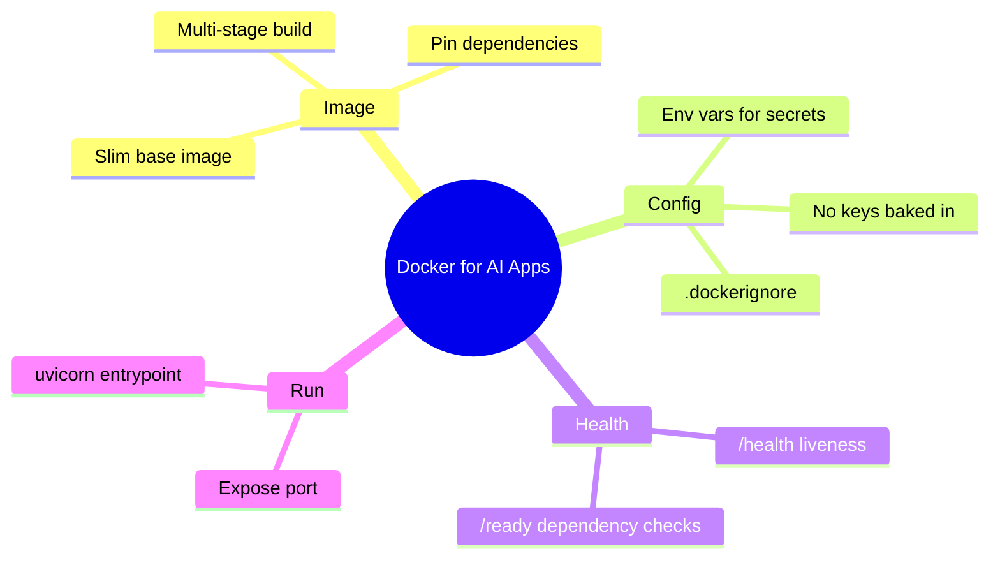

# Docker Deployment

Let's package your AI applications into Docker containers so they run the same way everywhere — the foundation for the cloud deployment you'll do on Day 93.

> **Coming from Software Engineering?** This is standard containerized deployment — Dockerfile, docker-compose, health checks, environment variables, secrets. If you've deployed any web service with Docker, this is identical. The AI-specific additions are minimal: you need to pass API keys as secrets, configure model endpoints, and potentially mount volume storage for vector databases. Your Docker, CI/CD, and infrastructure skills are directly applicable.

---

## Dockerizing Your Application

```dockerfile
# Dockerfile
FROM python:3.12-slim

WORKDIR /app

# Install dependencies
COPY requirements.txt .
RUN pip install --no-cache-dir -r requirements.txt

# Copy application
COPY . .

# Expose port
EXPOSE 8000

# Run the application
CMD ["uvicorn", "main:app", "--host", "0.0.0.0", "--port", "8000"]
```

```bash
# Build and run
docker build -t my-ai-agent .
docker run -p 8000:8000 -e OPENAI_API_KEY=$OPENAI_API_KEY my-ai-agent
```

### Docker Compose for Multiple Services

```yaml
# docker-compose.yml
services:
  api:
    build: .
    ports:
      - "8000:8000"
    environment:
      - OPENAI_API_KEY=${OPENAI_API_KEY}
      - REDIS_URL=redis://redis:6379
    depends_on:
      - redis
      - chroma

  redis:
    image: redis:alpine
    ports:
      - "6379:6379"

  chroma:
    image: chromadb/chroma
    ports:
      - "8001:8000"
    volumes:
      - chroma_data:/chroma/chroma

volumes:
  chroma_data:
```

---

## Running Reliably in a Container

A containerized agent still calls flaky upstreams (LLM providers cap you on requests *and* tokens per minute, so 429s are common). The resilience patterns that handle this — retry with exponential backoff + jitter, rate limiting, and the circuit breaker — are covered in depth on **Day 90 (Rate Limits and Backoffs)**. Wire those in around your provider calls; nothing about them is Docker-specific, so we don't repeat them here.

> **In production:** bake your dependencies and a non-root user into the image (below), but keep secrets like `OPENAI_API_KEY` out of the image — inject them as environment variables at run time (see the Compose and platform configs).

---

## Where Docker Fits in Deployment

Docker is the *packaging* step. Once you have a working image, **Day 93 (Cloud Deployment)** covers shipping it to Render, Railway, AWS, and GCP, plus CI/CD and monitoring. The rest of this lesson focuses on getting the image itself right.

---

## Production Checklist



### Complete Production Setup

```python
# script_id: day_089_docker_deployment/production_setup
from fastapi import FastAPI, Request
from fastapi.middleware.cors import CORSMiddleware
import logging
import time
import os
from openai import OpenAI

client = OpenAI()

# Configure logging
logging.basicConfig(
    level=logging.INFO,
    format='%(asctime)s - %(name)s - %(levelname)s - %(message)s'
)
logger = logging.getLogger(__name__)

app = FastAPI(title="Production AI Agent")

# CORS
app.add_middleware(
    CORSMiddleware,
    allow_origins=os.getenv("ALLOWED_ORIGINS", "*").split(","),
    allow_methods=["*"],
    allow_headers=["*"],
)

# Request logging middleware
@app.middleware("http")
async def log_requests(request: Request, call_next):
    start_time = time.time()

    response = await call_next(request)

    duration = time.time() - start_time
    logger.info(
        f"{request.method} {request.url.path} "
        f"completed in {duration:.3f}s "
        f"status={response.status_code}"
    )

    return response

# Health check
@app.get("/health")
async def health():
    return {"status": "healthy", "version": os.getenv("VERSION", "1.0.0")}

# Readiness check
@app.get("/ready")
async def ready():
    # Check dependencies
    checks = {
        "openai": check_openai(),
        "database": check_database(),
        "vectordb": check_vectordb()
    }
    all_ready = all(checks.values())
    return {"ready": all_ready, "checks": checks}

def check_openai():
    try:
        client.models.list()
        return True
    except Exception:
        return False

def check_database():
    # Check your database connection
    return True

def check_vectordb():
    # For a RAG app, your readiness probe should also confirm the vector
    # store (Chroma) is reachable — if it's down, retrieval silently returns
    # nothing. Ping your Chroma client here; stubbed True for the example.
    return True
```

---

## Summary



---

## Quick Reference

```dockerfile
# Minimal FastAPI agent image
FROM python:3.12-slim
WORKDIR /app
COPY requirements.txt .
RUN pip install --no-cache-dir -r requirements.txt
COPY . .
EXPOSE 8000
CMD ["uvicorn", "main:app", "--host", "0.0.0.0", "--port", "8000"]
```

```bash
docker build -t agent .                  # Build image
docker run -p 8000:8000 --env-file .env agent   # Run with secrets from file
docker history agent                     # Verify no secrets are baked in
```

---

## Exercises

1. **Containerize it.** Write a `Dockerfile` for your FastAPI agent on a `-slim` base, build it, and run it mapped to port 8000.
2. **Keep secrets out.** Pass your API key with `--env-file` (or `-e`) instead of `COPY`-ing it in. Confirm with `docker history` that the key isn't in any layer.
3. **Add liveness + readiness.** Implement `/health` (process is up) and `/ready` (dependencies reachable) and explain why orchestrators need both.
4. **Shrink the image.** Add a `.dockerignore` and try a multi-stage build; report the size before and after.

<details><summary>Solutions (approaches)</summary>

1. See the Dockerfile above; `docker build -t agent . && docker run -p 8000:8000 agent`.
2. `docker run --env-file .env agent`; read keys via `os.environ`; `docker history agent` should show no key strings.
3. `/health` returns `{"status":"healthy"}` always-fast; `/ready` pings OpenAI/DB so traffic isn't routed before deps are live.
4. `.dockerignore` excludes `.git`, `__pycache__`, tests; multi-stage builds dependencies in one stage and copies only the venv/site-packages into the final slim image.
</details>

---

## Checkpoint

Build and run the `production_setup` container, then hit the app's port from your host and confirm you get a healthy response back. If the container exits immediately or the port isn't reachable, check that `EXPOSE`/`-p` map the same port your app binds to and that the `OPENAI_API_KEY` was passed in as an env var (not baked into the image).

---

## What's Next?

Your service is containerized — but containers alone don't survive real traffic. Next up: **Rate Limits, Exponential Backoffs & Circuit Breakers** — token-bucket rate limiting and provider fallback, the resilience pieces that complement the retries and circuit breaker you just built.
