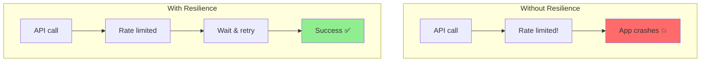
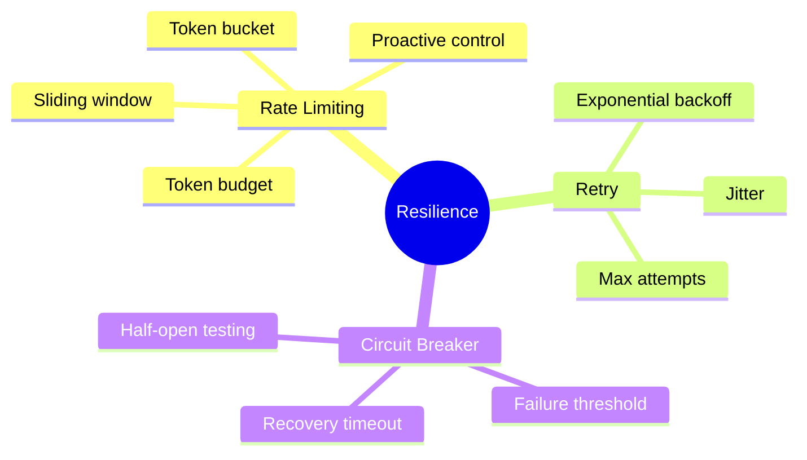

# Rate Limits, Exponential Backoffs & Circuit Breakers

Production systems must handle failures gracefully. This guide shows you how to implement resilient API calls.

> **Coming from Software Engineering?** This is resilience engineering — you've implemented all of these patterns before. Exponential backoff with jitter for retries, circuit breakers (Hystrix/Resilience4j pattern) to prevent cascade failures, rate limiting to stay within quotas. The only new concept is *token-based* rate limiting, where APIs limit you by tokens-per-minute (a token is roughly a chunk of a word — the unit LLMs meter and bill by, about 3/4 of a word on average) rather than requests-per-minute. Your existing retry logic, backoff strategies, and circuit breaker implementations transfer directly.

---

## Why Resilience Matters



Common issues:
- **Rate limits**: API says "slow down"
- **Transient errors**: Network blips
- **Service unavailable**: Backend overloaded
- **Timeouts**: Response too slow

---

## Basic Retry with Backoff

```python
# script_id: day_090_rate_limits_backoffs/basic_retry_with_backoff
import time
import random
from typing import Callable, Any

def retry_with_backoff(
    func: Callable,
    max_retries: int = 3,
    base_delay: float = 1.0,
    max_delay: float = 60.0,
    exponential_base: float = 2.0,
    jitter: bool = True
) -> Any:
    """
    Retry a function with exponential backoff.

    Args:
        func: Function to retry
        max_retries: Maximum retry attempts
        base_delay: Initial delay in seconds
        max_delay: Maximum delay between retries
        exponential_base: Multiplier for each retry
        jitter: Add randomness so clients that all failed at the same instant don't all retry at the same instant (a thundering herd) and re-overload the API.
    """

    last_exception = None

    for attempt in range(max_retries + 1):
        try:
            return func()
        except Exception as e:
            last_exception = e

            if attempt == max_retries:
                break

            # Calculate delay
            delay = min(base_delay * (exponential_base ** attempt), max_delay)

            # Add jitter
            if jitter:
                delay = delay * (0.5 + random.random())

            print(f"Attempt {attempt + 1} failed: {e}. Retrying in {delay:.2f}s...")
            time.sleep(delay)

    raise last_exception

# Usage
from openai import OpenAI

client = OpenAI()  # openai v1: call methods on a client instance, not the module

def call_api():
    return client.chat.completions.create(
        model="gpt-4o-mini",
        messages=[{"role": "user", "content": "Hello!"}],
    )

if __name__ == "__main__":
    result = retry_with_backoff(call_api)
```

---

## Decorator-Based Retry

```python
# script_id: day_090_rate_limits_backoffs/resilience_toolkit
import functools
import time
import random
from typing import Tuple, Type

def retry(
    max_retries: int = 3,
    base_delay: float = 1.0,
    exceptions: Tuple[Type[Exception], ...] = (Exception,)
):
    """Decorator for retry with exponential backoff."""

    def decorator(func):
        @functools.wraps(func)
        def wrapper(*args, **kwargs):
            last_exception = None

            for attempt in range(max_retries + 1):
                try:
                    return func(*args, **kwargs)
                except exceptions as e:
                    last_exception = e

                    if attempt == max_retries:
                        break

                    delay = base_delay * (2 ** attempt) * (0.5 + random.random())
                    print(f"Retry {attempt + 1}/{max_retries} after {delay:.2f}s")
                    time.sleep(delay)

            raise last_exception
        return wrapper
    return decorator

# Usage
from openai import OpenAI, RateLimitError, APIError

client = OpenAI()

@retry(max_retries=3, exceptions=(RateLimitError, APIError))
def call_openai(prompt: str) -> str:
    response = client.chat.completions.create(
        model="gpt-4o-mini",
        messages=[{"role": "user", "content": prompt}]
    )
    return response.choices[0].message.content

if __name__ == "__main__":
    result = call_openai("Hello!")
```

---

## Rate Limiter

Proactively limit your request rate:

```python
# script_id: day_090_rate_limits_backoffs/resilience_toolkit
import time
from collections import deque
from threading import Lock

class RateLimiter:
    """Token bucket rate limiter."""

    def __init__(self, requests_per_minute: int = 60):
        self.rpm = requests_per_minute
        self.interval = 60.0 / requests_per_minute
        self.timestamps = deque()
        self.lock = Lock()

    def acquire(self):
        """Wait until a request slot is available."""
        with self.lock:
            now = time.time()

            # Remove old timestamps
            while self.timestamps and now - self.timestamps[0] > 60:
                self.timestamps.popleft()

            # Check if we're at the limit
            if len(self.timestamps) >= self.rpm:
                # Wait until oldest request expires
                sleep_time = 60 - (now - self.timestamps[0])
                if sleep_time > 0:
                    print(f"Rate limit: waiting {sleep_time:.2f}s")
                    time.sleep(sleep_time)
                    self.timestamps.popleft()

            self.timestamps.append(time.time())

    def __call__(self, func):
        """Use as decorator."""
        @functools.wraps(func)
        def wrapper(*args, **kwargs):
            self.acquire()
            return func(*args, **kwargs)
        return wrapper

# Usage
limiter = RateLimiter(requests_per_minute=20)

@limiter
def call_api():
    return "ok"  # stand-in for a real client.chat.completions.create(...) call

# Or manual
limiter.acquire()
result = call_api()
```

---

## Circuit Breaker

Stop calling failing services:

```python
# script_id: day_090_rate_limits_backoffs/resilience_toolkit
import time
from enum import Enum
from threading import Lock

class CircuitState(Enum):
    CLOSED = "closed"      # Normal operation
    OPEN = "open"          # Failing, reject requests
    HALF_OPEN = "half_open"  # Testing if service recovered

class CircuitBreaker:
    """
    Circuit breaker pattern implementation.

    States:
    - CLOSED: Normal operation, requests go through
    - OPEN: Service failing, reject requests immediately
    - HALF_OPEN: Testing recovery, allow limited requests
    """

    def __init__(
        self,
        failure_threshold: int = 5,
        recovery_timeout: float = 30.0,
        expected_exceptions: tuple = (Exception,)
    ):
        self.failure_threshold = failure_threshold
        self.recovery_timeout = recovery_timeout
        self.expected_exceptions = expected_exceptions

        self.state = CircuitState.CLOSED
        self.failure_count = 0
        self.last_failure_time = None
        self.lock = Lock()

    def call(self, func, *args, **kwargs):
        """Execute function through circuit breaker."""

        with self.lock:
            if self.state == CircuitState.OPEN:
                # Check if recovery timeout passed
                if time.time() - self.last_failure_time > self.recovery_timeout:
                    print("Circuit half-open, testing...")
                    self.state = CircuitState.HALF_OPEN
                else:
                    raise CircuitBreakerOpen("Circuit breaker is open")

        try:
            result = func(*args, **kwargs)

            with self.lock:
                # Success - reset failures
                self.failure_count = 0
                if self.state == CircuitState.HALF_OPEN:
                    print("Circuit closed (recovered)")
                    self.state = CircuitState.CLOSED

            return result

        except self.expected_exceptions as e:
            with self.lock:
                self.failure_count += 1
                self.last_failure_time = time.time()

                if self.failure_count >= self.failure_threshold:
                    print(f"Circuit opened after {self.failure_count} failures")
                    self.state = CircuitState.OPEN

            raise

    def __call__(self, func):
        """Use as decorator."""
        @functools.wraps(func)
        def wrapper(*args, **kwargs):
            return self.call(func, *args, **kwargs)
        return wrapper

class CircuitBreakerOpen(Exception):
    pass

# Usage
circuit = CircuitBreaker(failure_threshold=3, recovery_timeout=60)

def fallback_response():
    return {"ok": False, "cached": True}

@circuit
def call_external_api():
    return {"ok": True}  # stand-in for a real API call

# Manual usage
try:
    result = circuit.call(call_external_api)
except CircuitBreakerOpen:
    print("Service unavailable, using fallback")
    result = fallback_response()
```

---

## Combined Resilience

Put it all together:

```python
# script_id: day_090_rate_limits_backoffs/resilience_toolkit
from dataclasses import dataclass
from typing import Optional, Callable
import time
import random

@dataclass
class ResilienceConfig:
    max_retries: int = 3
    base_delay: float = 1.0
    max_delay: float = 60.0
    requests_per_minute: int = 60
    circuit_failure_threshold: int = 5
    circuit_recovery_timeout: float = 30.0

class ResilientClient:
    """API client with rate limiting, retries, and circuit breaker."""

    def __init__(self, config: ResilienceConfig = None):
        self.config = config or ResilienceConfig()
        self.rate_limiter = RateLimiter(self.config.requests_per_minute)
        self.circuit_breaker = CircuitBreaker(
            failure_threshold=self.config.circuit_failure_threshold,
            recovery_timeout=self.config.circuit_recovery_timeout
        )

    def call(self, func: Callable, *args, **kwargs):
        """Make a resilient API call."""

        last_exception = None

        for attempt in range(self.config.max_retries + 1):
            try:
                # Rate limiting
                self.rate_limiter.acquire()

                # Circuit breaker
                return self.circuit_breaker.call(func, *args, **kwargs)

            except CircuitBreakerOpen:
                # Don't retry if circuit is open
                raise

            except Exception as e:
                last_exception = e

                if attempt == self.config.max_retries:
                    break

                # Exponential backoff
                delay = min(
                    self.config.base_delay * (2 ** attempt),
                    self.config.max_delay
                )
                delay *= (0.5 + random.random())  # Jitter

                print(f"Attempt {attempt + 1} failed. Retrying in {delay:.2f}s")
                time.sleep(delay)

        raise last_exception

# Usage
client = ResilientClient(ResilienceConfig(
    max_retries=3,
    requests_per_minute=20,
    circuit_failure_threshold=5
))

def make_api_call():
    return "ok"  # stand-in for a real client.chat.completions.create(...) call

result = client.call(make_api_call)
```

---

## Using Tenacity Library

You have now implemented backoff three ways by hand to understand the mechanics; in production, reach for the `tenacity` library instead:

```bash
pip install tenacity
```

```python
# script_id: day_090_rate_limits_backoffs/tenacity_retry
from tenacity import (
    retry,
    stop_after_attempt,
    wait_exponential,
    retry_if_exception_type,
    before_sleep_log
)
import logging

logging.basicConfig(level=logging.INFO)
logger = logging.getLogger(__name__)

from openai import OpenAI, RateLimitError, APIError

client = OpenAI()

@retry(
    stop=stop_after_attempt(3),
    wait=wait_exponential(multiplier=1, min=1, max=60),
    retry=retry_if_exception_type((RateLimitError, APIError)),
    before_sleep=before_sleep_log(logger, logging.WARNING)
)
def call_openai(prompt: str) -> str:
    """Call OpenAI with automatic retry."""
    response = client.chat.completions.create(
        model="gpt-4o-mini",
        messages=[{"role": "user", "content": prompt}]
    )
    return response.choices[0].message.content

# More complex configuration
from tenacity import retry, RetryError
from openai import AsyncOpenAI

aclient = AsyncOpenAI()

@retry(
    stop=stop_after_attempt(5),
    wait=wait_exponential(multiplier=1, min=4, max=60),
    retry=retry_if_exception_type(Exception),
    reraise=True
)
async def async_api_call():
    """Async API call with retry."""
    response = await aclient.chat.completions.create(
        model="gpt-4o-mini",
        messages=[{"role": "user", "content": "Hello!"}]
    )
    return response.choices[0].message.content
```

---

## Token Budget Management

In production, you need to prevent cost explosions. Token budgets enforce limits per user, per organization, or per time window.

```python
# script_id: day_090_rate_limits_backoffs/token_budget
import time
from dataclasses import dataclass, field

@dataclass
class TokenBudget:
    """Track and enforce token usage limits."""
    max_tokens_per_hour: int = 100_000
    max_tokens_per_request: int = 10_000
    usage_log: list = field(default_factory=list)

    def check_budget(self, estimated_tokens: int) -> bool:
        """Returns True if the request is within budget."""
        if estimated_tokens > self.max_tokens_per_request:
            return False

        # Clean old entries (older than 1 hour)
        cutoff = time.time() - 3600
        self.usage_log = [(t, tokens) for t, tokens in self.usage_log if t > cutoff]

        # Check hourly budget
        hourly_usage = sum(tokens for _, tokens in self.usage_log)
        return (hourly_usage + estimated_tokens) <= self.max_tokens_per_hour

    def record_usage(self, tokens_used: int):
        """Record actual token usage after a request."""
        self.usage_log.append((time.time(), tokens_used))

    @property
    def remaining_budget(self) -> int:
        cutoff = time.time() - 3600
        self.usage_log = [(t, tokens) for t, tokens in self.usage_log if t > cutoff]
        used = sum(tokens for _, tokens in self.usage_log)
        return max(0, self.max_tokens_per_hour - used)


# Per-user budgets
user_budgets: dict[str, TokenBudget] = {}

def get_user_budget(user_id: str) -> TokenBudget:
    if user_id not in user_budgets:
        user_budgets[user_id] = TokenBudget(
            max_tokens_per_hour=50_000,   # Free tier
            max_tokens_per_request=4_000
        )
    return user_budgets[user_id]

class _Resp:
    class usage:
        total_tokens = 0

def call_llm(prompt: str):
    # stand-in for a real client.chat.completions.create(...) call
    return _Resp()

# Usage in your API handler
def handle_request(user_id: str, prompt: str):
    budget = get_user_budget(user_id)
    estimated = int(len(prompt.split()) * 1.3)  # Rough input-only estimate (~1.3 tokens/word); the reply is unknown until the call returns, so add headroom and reconcile via record_usage() below.

    if not budget.check_budget(estimated):
        raise Exception(f"Token budget exceeded. Remaining: {budget.remaining_budget}")

    response = call_llm(prompt)
    budget.record_usage(response.usage.total_tokens)
    return response
```

> **Coming from Software Engineering?** Token budgets are API rate limiting measured in tokens instead of requests. The same patterns — sliding window, per-user quotas, tiered plans — apply. The key difference: a single LLM request can vary from 100 to 100,000 tokens — the same endpoint handles a one-line question and a request to summarize a 50-page document, and you pay for the size of the text in and out, not the number of calls — so request-count limits alone are insufficient.

---

## Checkpoint

Run the `basic_retry_with_backoff` (or `tenacity_retry`) example against a function that raises a simulated 429 and confirm the base wait roughly doubles each attempt (1s, 2s, 4s…) before jitter is applied — the printed values will scatter between about half and one-and-a-half times that base, which is expected. To see the clean doubling, run with jitter=False. If it retries instantly with no delay, check that you're actually `sleep`-ing the computed backoff and that jitter isn't collapsing the interval to near-zero.

## Summary



---

## Quick Reference

```python
# script_id: day_090_rate_limits_backoffs/quick_reference
# fragment
# Simple retry
@retry(max_retries=3, base_delay=1.0)
def api_call():
    ...

# Rate limiter
limiter = RateLimiter(requests_per_minute=60)
limiter.acquire()

# Circuit breaker
circuit = CircuitBreaker(failure_threshold=5)
result = circuit.call(api_call)

# Tenacity
from tenacity import retry, stop_after_attempt, wait_exponential

@retry(stop=stop_after_attempt(3), wait=wait_exponential())
def resilient_call():
    ...
```

---

## Exercises

1. **Exponential backoff.** Write a `retry_with_backoff` wrapper that retries a call on `429`/`RateLimitError` with delays of 1s, 2s, 4s, 8s and gives up after 5 tries.
2. **Add jitter.** Improve it by adding random jitter to each delay and explain in one line why a thundering herd makes fixed delays dangerous.
3. **Respect the server.** When the API returns a `Retry-After` header, sleep for that exact duration instead of your computed backoff.
4. **Per-user token budget.** Implement a sliding-window token budget that blocks a user once they exceed N tokens/hour, and returns their remaining allowance.

<details><summary>Solutions (approaches)</summary>

1. `for i in range(5): try: return fn() except RateLimitError: time.sleep(2 ** i)`; raise after the loop.
2. `delay = (2 ** i) + random.uniform(0, 1)`; without jitter, all clients retry at the same instant and re-collide.
3. `wait = int(e.response.headers.get("Retry-After", 2 ** i)); time.sleep(wait)`.
4. Keep `(timestamp, tokens)` entries; drop entries older than 3600s; `remaining = max_per_hour - sum(tokens)`.
</details>

---

## What's Next?

Now let's cut cost and latency with **Semantic Caching** — reusing answers for questions that *mean* the same thing, not just exact-match strings.
