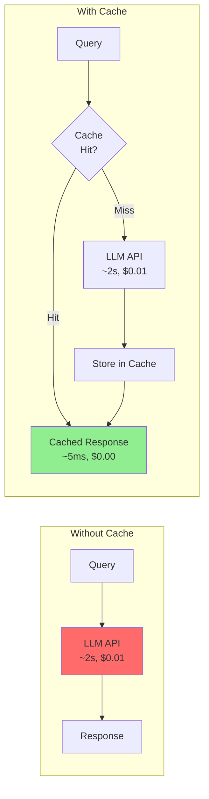
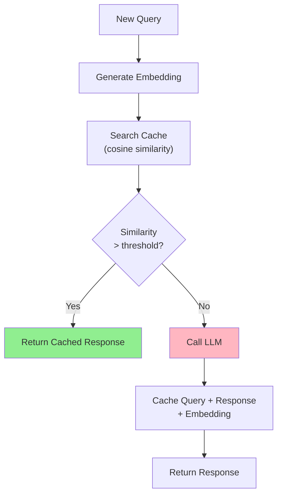
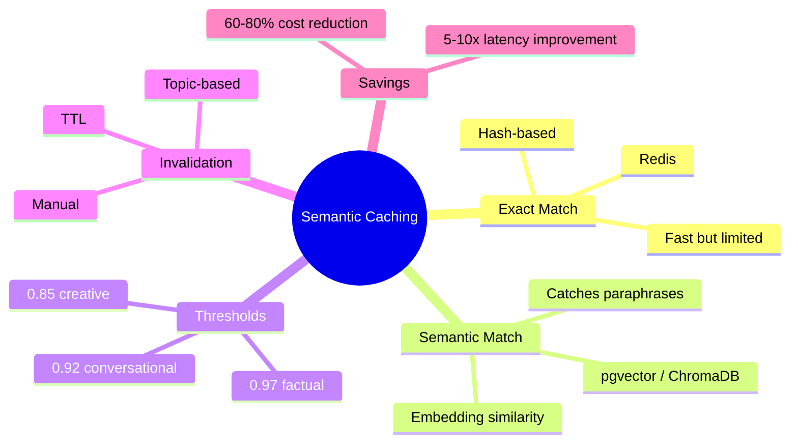

# Semantic Caching for LLM Applications

Every LLM call costs money and takes seconds. In production, many queries are semantically identical — "What's the return policy?" and "How do I return an item?" should hit the same cache. This guide teaches you to build caching layers that dramatically reduce cost and latency.

> **Coming from Software Engineering?** Semantic caching is like a CDN with fuzzy matching — instead of exact URL match, you match by meaning. If you've built Redis caching layers with cache-aside patterns, the architecture is identical. The only new concept is using embeddings for cache key similarity instead of string equality.

---

## Why Cache LLM Calls?



| Metric | Without Cache | With Cache (70% hit rate) |
|--------|--------------|--------------------------|
| Avg latency | 2,000ms | 605ms |
| Cost per 1000 queries | $10.00 | $3.00 |
| Monthly cost (10K queries/day) | $3,000 | $900 |

---

## Level 1: Exact-Match Caching

The simplest approach — hash the prompt and check for exact matches.

```python
# script_id: day_091_semantic_caching/exact_match_cache
import hashlib
import json
import time
from functools import lru_cache
from openai import OpenAI

client = OpenAI()

# In-memory exact-match cache
class ExactMatchCache:
    """Cache LLM responses by exact prompt match."""

    def __init__(self, ttl_seconds: int = 3600):
        self.cache: dict[str, dict] = {}
        self.ttl = ttl_seconds
        self.hits = 0
        self.misses = 0

    def _hash_key(self, model: str, messages: list, **kwargs) -> str:
        """Create a deterministic hash from the request."""
        key_data = json.dumps({"model": model, "messages": messages, **kwargs}, sort_keys=True)
        return hashlib.sha256(key_data.encode()).hexdigest()

    def get(self, model: str, messages: list, **kwargs) -> str | None:
        key = self._hash_key(model, messages, **kwargs)
        entry = self.cache.get(key)

        if entry and (time.time() - entry["timestamp"]) < self.ttl:
            self.hits += 1
            return entry["response"]

        self.misses += 1
        return None

    def set(self, model: str, messages: list, response: str, **kwargs):
        key = self._hash_key(model, messages, **kwargs)
        self.cache[key] = {"response": response, "timestamp": time.time()}

    @property
    def hit_rate(self) -> float:
        total = self.hits + self.misses
        return self.hits / total if total > 0 else 0.0


# Usage
cache = ExactMatchCache(ttl_seconds=3600)

def cached_chat(messages: list, model: str = "gpt-4o") -> str:
    # Check cache first
    cached = cache.get(model, messages)
    if cached:
        return cached

    # Cache miss — call LLM
    response = client.chat.completions.create(model=model, messages=messages)
    result = response.choices[0].message.content

    # Store in cache
    cache.set(model, messages, result)
    return result
```

### Redis-Backed Exact Cache

For multi-instance deployments:

```python
# script_id: day_091_semantic_caching/redis_llm_cache
import redis
import hashlib
import json

class RedisLLMCache:
    """Redis-backed LLM cache for distributed deployments."""

    def __init__(self, redis_url: str = "redis://localhost:6379", ttl: int = 3600):
        self.redis = redis.from_url(redis_url)
        self.ttl = ttl

    def _key(self, model: str, messages: list) -> str:
        data = json.dumps({"model": model, "messages": messages}, sort_keys=True)
        return f"llm:cache:{hashlib.sha256(data.encode()).hexdigest()}"

    def get(self, model: str, messages: list) -> str | None:
        result = self.redis.get(self._key(model, messages))
        return result.decode() if result else None

    def set(self, model: str, messages: list, response: str):
        self.redis.setex(self._key(model, messages), self.ttl, response)
```

**Limitation:** Exact-match only helps when users send _identical_ prompts. In practice, "What's your return policy?" and "How do returns work?" are semantically the same but hash differently.

---

## Level 2: Semantic Caching

Match queries by **meaning**, not exact text. Use embeddings to find similar past queries.



### Complete Semantic Cache

```python
# script_id: day_091_semantic_caching/semantic_cache
from openai import OpenAI
import chromadb
import time
import uuid

client = OpenAI()

class SemanticCache:
    """Cache LLM responses using embedding similarity."""

    def __init__(self, similarity_threshold: float = 0.95, ttl_seconds: int = 3600):
        self.threshold = similarity_threshold
        self.ttl = ttl_seconds
        self.chroma = chromadb.Client()
        self.collection = self.chroma.get_or_create_collection(
            name="llm_cache",
            metadata={"hnsw:space": "cosine"}
        )
        self.stats = {"hits": 0, "misses": 0}

    def _get_embedding(self, text: str) -> list[float]:
        response = client.embeddings.create(
            model="text-embedding-3-small",
            input=text
        )
        return response.data[0].embedding

    def _query_to_key(self, messages: list) -> str:
        """Extract the semantic key from messages (last user message)."""
        for msg in reversed(messages):
            if msg["role"] == "user":
                return msg["content"]
        return str(messages)

    def get(self, messages: list) -> str | None:
        """Check cache for semantically similar query."""
        query_text = self._query_to_key(messages)
        query_embedding = self._get_embedding(query_text)

        # Search for similar cached queries
        results = self.collection.query(
            query_embeddings=[query_embedding],
            n_results=1
        )

        if not results["ids"][0]:
            self.stats["misses"] += 1
            return None

        # Check similarity threshold
        distance = results["distances"][0][0]
        similarity = 1 - distance  # ChromaDB returns distance, not similarity

        if similarity >= self.threshold:
            # Check TTL
            metadata = results["metadatas"][0][0]
            if time.time() - metadata["timestamp"] < self.ttl:
                self.stats["hits"] += 1
                return metadata["response"]

        self.stats["misses"] += 1
        return None

    def set(self, messages: list, response: str):
        """Cache a query-response pair."""
        query_text = self._query_to_key(messages)
        embedding = self._get_embedding(query_text)

        self.collection.add(
            ids=[str(uuid.uuid4())],
            embeddings=[embedding],
            documents=[query_text],
            metadatas=[{
                "response": response,
                "timestamp": time.time()
            }]
        )

    @property
    def hit_rate(self) -> float:
        total = self.stats["hits"] + self.stats["misses"]
        return self.stats["hits"] / total if total > 0 else 0.0


# Usage
semantic_cache = SemanticCache(similarity_threshold=0.92)

def smart_chat(messages: list, model: str = "gpt-4o") -> str:
    # Try semantic cache
    cached = semantic_cache.get(messages)
    if cached:
        return cached

    # Cache miss
    response = client.chat.completions.create(model=model, messages=messages)
    result = response.choices[0].message.content

    semantic_cache.set(messages, result)
    return result

# These will hit the same cache entry!
q1 = [{"role": "user", "content": "What is your return policy?"}]
q2 = [{"role": "user", "content": "How do I return an item?"}]
q3 = [{"role": "user", "content": "Can I send back a product?"}]

print(smart_chat(q1))  # Cache miss — calls LLM
print(smart_chat(q2))  # Cache hit! Same meaning
print(smart_chat(q3))  # Cache hit! Same meaning
```

---

## Choosing Similarity Thresholds

The threshold controls the tradeoff between cache hit rate and response accuracy:

| Threshold | Hit Rate | Risk | Best For |
|-----------|----------|------|----------|
| 0.98+ | Low (~10%) | Very safe | Factual/compliance queries |
| 0.95 | Moderate (~30%) | Safe | Customer support, FAQ |
| 0.92 | High (~50%) | Some false positives | Conversational, general Q&A |
| 0.85 | Very high (~70%) | Risky | Only for non-critical use |

```python
# script_id: day_091_semantic_caching/adaptive_thresholds
# Adaptive thresholds by query category
THRESHOLDS = {
    "factual": 0.97,      # "What are your hours?" — wrong answer is bad
    "conversational": 0.92, # "Tell me about X" — slight variation is OK
    "creative": 0.85,       # "Write a poem about..." — reuse is fine
}
```

> **Warning:** A semantic cache can return stale or wrong answers if the threshold is too low. Always monitor your false-positive rate in production — track cases where users ask follow-up questions (indicating the cached answer didn't help).

---

## Cache Invalidation

```python
# script_id: day_091_semantic_caching/semantic_cache
class InvalidatingSemanticCache(SemanticCache):
    """Semantic cache with invalidation strategies."""

    def invalidate_by_age(self, max_age_seconds: int):
        """Remove entries older than max_age."""
        # In production, run this periodically
        all_entries = self.collection.get()
        stale_ids = []

        for i, metadata in enumerate(all_entries["metadatas"]):
            if time.time() - metadata["timestamp"] > max_age_seconds:
                stale_ids.append(all_entries["ids"][i])

        if stale_ids:
            self.collection.delete(ids=stale_ids)
            print(f"Invalidated {len(stale_ids)} stale cache entries")

    def invalidate_by_topic(self, topic_query: str, threshold: float = 0.85):
        """Invalidate all entries similar to a topic (e.g., after content update)."""
        embedding = self._get_embedding(topic_query)
        results = self.collection.query(
            query_embeddings=[embedding],
            n_results=100
        )

        to_delete = []
        for i, dist in enumerate(results["distances"][0]):
            if 1 - dist >= threshold:
                to_delete.append(results["ids"][0][i])

        if to_delete:
            self.collection.delete(ids=to_delete)
            print(f"Invalidated {len(to_delete)} entries related to: {topic_query}")
```

**When to invalidate:**
- Source documents updated (invalidate by topic)
- Model changed (invalidate everything)
- Time-based TTL expired (background cleanup)
- User reports wrong answer (invalidate specific entry)

---

## GPTCache: Production Library

For production deployments, consider [GPTCache](https://github.com/zilliztech/GPTCache):

```python
# script_id: day_091_semantic_caching/gptcache_usage
# pip install gptcache

from gptcache import cache
from gptcache.adapter import openai
from gptcache.embedding import Onnx
from gptcache.similarity_evaluation.distance import SearchDistanceEvaluation

# Initialize with semantic matching
onnx = Onnx()
cache.init(
    embedding_func=onnx.to_embeddings,
    similarity_evaluation=SearchDistanceEvaluation()
)

# Use like normal OpenAI — caching is automatic
response = openai.ChatCompletion.create(
    model="gpt-4o",
    messages=[{"role": "user", "content": "What is Python?"}]
)
```

---

## Cost Analysis

```python
# script_id: day_091_semantic_caching/cost_analysis
def estimate_cache_savings(
    daily_queries: int = 10_000,
    cost_per_query: float = 0.01,
    embedding_cost_per_query: float = 0.00002,
    cache_hit_rate: float = 0.60
):
    """Estimate monthly savings from semantic caching."""
    monthly_queries = daily_queries * 30

    # Without cache
    no_cache_cost = monthly_queries * cost_per_query

    # With cache
    hits = monthly_queries * cache_hit_rate
    misses = monthly_queries * (1 - cache_hit_rate)

    cache_cost = (
        monthly_queries * embedding_cost_per_query +  # Embedding for every query
        misses * cost_per_query                        # LLM call only on miss
    )

    savings = no_cache_cost - cache_cost
    return {
        "monthly_without_cache": f"${no_cache_cost:,.2f}",
        "monthly_with_cache": f"${cache_cost:,.2f}",
        "monthly_savings": f"${savings:,.2f}",
        "savings_percent": f"{(savings/no_cache_cost)*100:.0f}%"
    }

print(estimate_cache_savings())
# monthly_without_cache: $3,000.00
# monthly_with_cache: $1,206.00
# monthly_savings: $1,794.00
# savings_percent: 60%
```

---

## Native Prompt Caching

Separately from semantic caching, major providers now offer **server-side prompt caching** that discounts repeated prefixes in your API calls. This is especially useful for system prompts, few-shot examples, or large context documents that stay the same across requests.

**OpenAI** automatically caches prompt prefixes for requests to supported models, giving a 50% discount on cached input tokens with no code changes required.

**Anthropic** offers explicit cache control -- you mark which parts of the prompt to cache and receive a 90% discount on cached input tokens:

```python
# script_id: day_091_semantic_caching/anthropic_prompt_caching
# Anthropic prompt caching — 90% discount on cached input tokens
response = client.messages.create(
    model="claude-sonnet-4-5",
    max_tokens=1024,
    system=[{
        "type": "text",
        "text": "Your large system prompt here...",
        "cache_control": {"type": "ephemeral"}
    }],
    messages=[{"role": "user", "content": query}]
)
```

**How this complements semantic caching:** Prompt caching and semantic caching solve different problems. Prompt caching handles repeated *prefixes* -- the same system prompt or context documents sent across many requests. Semantic caching handles similar *queries* -- different users asking the same question in different words. In production, you often want both: prompt caching reduces per-token cost on every request, while semantic caching eliminates redundant LLM calls entirely for repeated questions.

---

## Summary



---

## What's Next?

Caching saves money when the same provider is up. But what happens when it goes down? Next, we'll build **model fallback strategies** — routing between providers for reliability and cost optimization.
