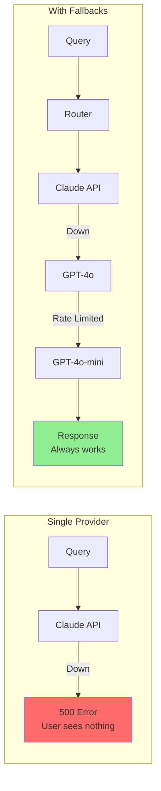
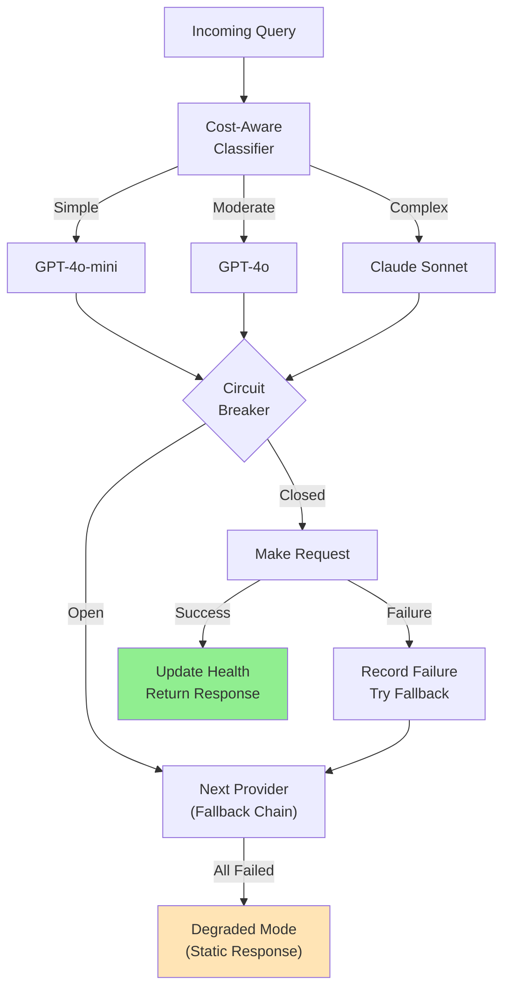
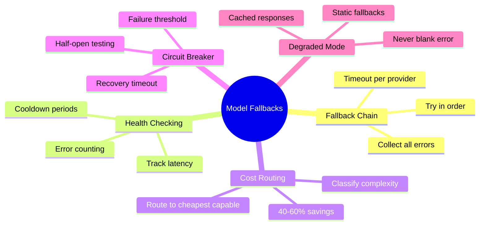

# Model Fallback Strategies

Production AI systems can't depend on a single model or provider. APIs go down, rate limits hit, and costs spiral. This guide teaches you to build resilient model routing with automatic fallbacks, health checking, and cost-aware selection.

> **Coming from Software Engineering?** Model fallbacks are like DNS failover or multi-region deployments — your system routes to the best available provider and gracefully degrades when the primary is down. If you've built systems with primary/replica database failover, multi-CDN routing, or active-active service meshes, the pattern is identical. The only difference: instead of routing HTTP requests, you're routing LLM inference calls.

---

## Why Fallbacks Matter



Real-world failure modes:
- **Provider outages**: OpenAI, Anthropic, and Google all have had multi-hour outages
- **Rate limits**: Burst traffic exceeds your tier limits
- **Latency spikes**: Provider is up but responding in 30+ seconds
- **Cost overruns**: Primary model is too expensive for low-value queries

---

## Simple Fallback Chain

The most straightforward pattern — try each provider in order:

```python
# script_id: day_092_model_fallback_strategies/fallback_chain_with_health
from openai import OpenAI
from anthropic import Anthropic
import time

class ModelFallbackChain:
    """Try models in order until one succeeds."""

    def __init__(self):
        self.openai = OpenAI()
        self.anthropic = Anthropic()
        self.attempts = []

    def chat(self, messages: list, timeout: float = 30.0) -> dict:
        """Send a chat request with automatic fallback."""

        providers = [
            ("claude-sonnet", self._call_anthropic, "claude-sonnet-4-6"),
            ("gpt-4o", self._call_openai, "gpt-4o"),
            ("gpt-4o-mini", self._call_openai, "gpt-4o-mini"),
        ]

        errors = []
        for name, call_fn, model in providers:
            try:
                start = time.time()
                result = call_fn(messages, model, timeout)
                latency = time.time() - start

                self.attempts.append({
                    "provider": name, "success": True, "latency": latency
                })
                return {"content": result, "provider": name, "latency": latency}

            except Exception as e:
                errors.append(f"{name}: {e}")
                self.attempts.append({
                    "provider": name, "success": False, "error": str(e)
                })
                continue

        # All providers failed
        raise RuntimeError(f"All providers failed: {errors}")

    def _call_openai(self, messages: list, model: str, timeout: float) -> str:
        response = self.openai.chat.completions.create(
            model=model,
            messages=messages,
            timeout=timeout
        )
        return response.choices[0].message.content

    def _call_anthropic(self, messages: list, model: str, timeout: float) -> str:
        # Convert from OpenAI format to Anthropic format
        system = ""
        anthropic_msgs = []
        for msg in messages:
            if msg["role"] == "system":
                system = msg["content"]
            else:
                anthropic_msgs.append(msg)

        # The Anthropic SDK doesn't take `timeout` as a messages.create() kwarg —
        # set it per-request via with_options() (or on the client constructor).
        response = self.anthropic.with_options(timeout=timeout).messages.create(
            model=model,
            max_tokens=4096,
            system=system,
            messages=anthropic_msgs,
        )
        return response.content[0].text


# Usage
chain = ModelFallbackChain()
result = chain.chat([
    {"role": "system", "content": "You are a helpful assistant."},
    {"role": "user", "content": "Explain Python generators in one paragraph."}
])
print(f"Answered by: {result['provider']} in {result['latency']:.2f}s")
```

---

## Health Checking

Don't wait for failures — proactively track provider health:

```python
# script_id: day_092_model_fallback_strategies/fallback_chain_with_health
import time
import threading
from dataclasses import dataclass, field
from collections import deque

@dataclass
class ProviderHealth:
    """Track health metrics for a model provider."""
    name: str
    is_healthy: bool = True
    error_count: int = 0
    success_count: int = 0
    recent_latencies: deque = field(default_factory=lambda: deque(maxlen=100))
    last_check: float = 0
    cooldown_until: float = 0  # Don't retry until this time

    def record_success(self, latency: float):
        self.success_count += 1
        self.error_count = max(0, self.error_count - 1)  # Decay errors
        self.recent_latencies.append(latency)
        self.is_healthy = True

    def record_failure(self):
        self.error_count += 1
        if self.error_count >= 3:
            self.is_healthy = False
            self.cooldown_until = time.time() + 60  # 1-min cooldown

    @property
    def avg_latency(self) -> float:
        if not self.recent_latencies:
            return float("inf")
        return sum(self.recent_latencies) / len(self.recent_latencies)

    @property
    def available(self) -> bool:
        if time.time() < self.cooldown_until:
            return False
        return self.is_healthy


class HealthAwareRouter:
    """Route to healthy providers with latency awareness."""

    def __init__(self):
        self.chain = ModelFallbackChain()
        self.health: dict[str, ProviderHealth] = {
            "claude-sonnet": ProviderHealth("claude-sonnet"),
            "gpt-4o": ProviderHealth("gpt-4o"),
            "gpt-4o-mini": ProviderHealth("gpt-4o-mini"),
        }

    def get_available_providers(self) -> list[str]:
        """Return healthy providers sorted by average latency."""
        available = [
            (name, h) for name, h in self.health.items()
            if h.available
        ]
        available.sort(key=lambda x: x[1].avg_latency)
        return [name for name, _ in available]

    def status(self) -> dict:
        """Get health dashboard data."""
        return {
            name: {
                "healthy": h.is_healthy,
                "available": h.available,
                "avg_latency": f"{h.avg_latency:.2f}s",
                "error_count": h.error_count,
            }
            for name, h in self.health.items()
        }
```

---

## Cost-Aware Model Selection

Not every query needs your most expensive model. Route by complexity:

```python
# script_id: day_092_model_fallback_strategies/cost_aware_router
class CostAwareRouter:
    """Route queries to the cheapest capable model."""

    # Cost per 1K tokens (input + output estimate)
    MODEL_COSTS = {
        "claude-sonnet": 0.018,   # $3 + $15 per 1M
        "gpt-4o": 0.0125,         # $2.50 + $10 per 1M
        "gpt-4o-mini": 0.00075,   # $0.15 + $0.60 per 1M
    }

    def classify_complexity(self, query: str) -> str:
        """Classify query complexity. In production, use an LLM or classifier."""
        query_lower = query.lower()

        # Simple heuristics (replace with a classifier in production)
        complex_signals = [
            "analyze", "compare", "explain why", "trade-offs",
            "architecture", "design", "debug this", "review"
        ]
        simple_signals = [
            "what is", "define", "list", "how to",
            "translate", "summarize", "format"
        ]

        if any(signal in query_lower for signal in complex_signals):
            return "complex"
        if any(signal in query_lower for signal in simple_signals):
            return "simple"
        return "moderate"

    def select_model(self, query: str) -> str:
        """Select the cheapest appropriate model."""
        complexity = self.classify_complexity(query)

        routing = {
            "simple": "gpt-4o-mini",     # Cheap and fast
            "moderate": "gpt-4o",          # Good balance
            "complex": "claude-sonnet",    # Best quality
        }

        return routing[complexity]

    def estimate_savings(self, queries: list[str]) -> dict:
        """Estimate cost savings from smart routing vs always using best model."""
        always_best_cost = len(queries) * self.MODEL_COSTS["claude-sonnet"]

        routed_cost = sum(
            self.MODEL_COSTS[self.select_model(q)]
            for q in queries
        )

        return {
            "always_best": f"${always_best_cost:.2f}",
            "smart_routed": f"${routed_cost:.2f}",
            "savings": f"{(1 - routed_cost/always_best_cost) * 100:.0f}%"
        }


# Usage
router = CostAwareRouter()

queries = [
    "What is Python?",                              # simple -> mini
    "Compare microservices vs monolith trade-offs",  # complex -> claude
    "Translate 'hello' to Spanish",                  # simple -> mini
    "Debug this recursive function and explain why it stack overflows",  # complex -> claude
    "List the top 5 Python web frameworks",          # simple -> mini
]

for q in queries:
    model = router.select_model(q)
    complexity = router.classify_complexity(q)
    print(f"[{complexity:>8}] {model:>15} <- {q[:50]}")

print(router.estimate_savings(queries))
```

---

## Circuit Breaker Integration

Combine with the circuit breaker pattern from the rate limits lesson:

```python
# script_id: day_092_model_fallback_strategies/provider_circuit_breaker
from enum import Enum

class CircuitState(Enum):
    CLOSED = "closed"      # Normal operation
    OPEN = "open"          # Failing, don't try
    HALF_OPEN = "half_open"  # Testing recovery

class ProviderCircuitBreaker:
    """Circuit breaker per provider."""

    def __init__(self, failure_threshold: int = 5, recovery_timeout: int = 60):
        self.failure_threshold = failure_threshold
        self.recovery_timeout = recovery_timeout
        self.state = CircuitState.CLOSED
        self.failure_count = 0
        self.last_failure_time = 0

    def can_execute(self) -> bool:
        if self.state == CircuitState.CLOSED:
            return True
        if self.state == CircuitState.OPEN:
            if time.time() - self.last_failure_time > self.recovery_timeout:
                self.state = CircuitState.HALF_OPEN
                return True
            return False
        return True  # HALF_OPEN: allow one test request

    def record_success(self):
        self.failure_count = 0
        self.state = CircuitState.CLOSED

    def record_failure(self):
        self.failure_count += 1
        self.last_failure_time = time.time()
        if self.failure_count >= self.failure_threshold:
            self.state = CircuitState.OPEN
```

---

## Degraded Mode Operation

When ALL providers fail, don't show a blank error page:

```python
# script_id: day_092_model_fallback_strategies/degraded_mode_handler
class DegradedModeHandler:
    """Handle total provider failure gracefully."""

    FALLBACK_RESPONSES = {
        "general": "I'm experiencing technical difficulties. Please try again in a few minutes.",
        "search": "Search is temporarily unavailable. Here are our most popular articles: [links]",
        "support": "Our AI assistant is temporarily offline. Please contact support@example.com.",
    }

    def __init__(self):
        self.cached_responses: dict[str, str] = {}  # Last-known-good responses

    def handle_total_failure(self, query: str, category: str = "general") -> dict:
        """Return the best possible response when all models are down."""

        # Try cached response first
        if query in self.cached_responses:
            return {
                "content": self.cached_responses[query],
                "source": "cache",
                "degraded": True
            }

        # Fall back to static response
        return {
            "content": self.FALLBACK_RESPONSES.get(category, self.FALLBACK_RESPONSES["general"]),
            "source": "static",
            "degraded": True
        }
```

---

## Full Architecture



---

## Summary



---

## Quick Reference

| Pattern | Purpose | Key idea |
|---|---|---|
| Fallback chain | Survive a provider outage | Try providers in order; collect errors; return first success |
| Health checking | Skip known-bad providers | Track latency + error count; cooldown before retrying |
| Cost routing | Spend less | Classify request complexity; route to cheapest capable model |
| Circuit breaker | Stop hammering a dead provider | Open after N failures; half-open probe after a timeout |
| Degraded mode | Never return a blank error | Serve cached/static response as last resort |

```python
# Fallback chain (pseudo-flow)
errors = []
for provider in [primary, secondary, cheap_local]:
    if breaker.is_open(provider):
        continue
    try:
        return provider.call(prompt, timeout=10)
    except Exception as e:
        errors.append((provider.name, e))
        breaker.record_failure(provider)
return degraded_response(errors)   # cached or static, never blank
```

---

## Exercises

1. **Two-provider chain.** Implement a fallback that tries provider A, and on failure/timeout tries provider B, returning the first success.
2. **Circuit breaker.** Add a breaker that opens after 5 consecutive failures for a provider and half-opens with a single probe after a 30s cooldown.
3. **Cost-aware routing.** Classify each request as simple/complex and route simple ones to a cheap model (e.g. Haiku/`gpt-4o-mini`), complex ones to a stronger model.
4. **Degraded mode.** When *every* provider is down, return a cached or static answer instead of a 500, and log that you served degraded.

<details><summary>Solutions (approaches)</summary>

1. Loop providers, `try` each with a per-call `timeout`; `except` records the error and continues; raise/degrade only if all fail.
2. Track `failures` per provider; `open` blocks calls; after cooldown allow one probe and `close` on success, re-`open` on failure.
3. A cheap classifier (length/heuristics or a small model) tags complexity; a dict maps tag → model id.
4. `except AllProvidersDown: return cache.get(key) or STATIC_FALLBACK` and `logging.warning("degraded mode")`.
</details>

---

## What's Next?

With caching and fallbacks in place, your system is resilient and cost-efficient. Next, let's deploy it to the **cloud** — AWS, GCP, Render, and Railway.
