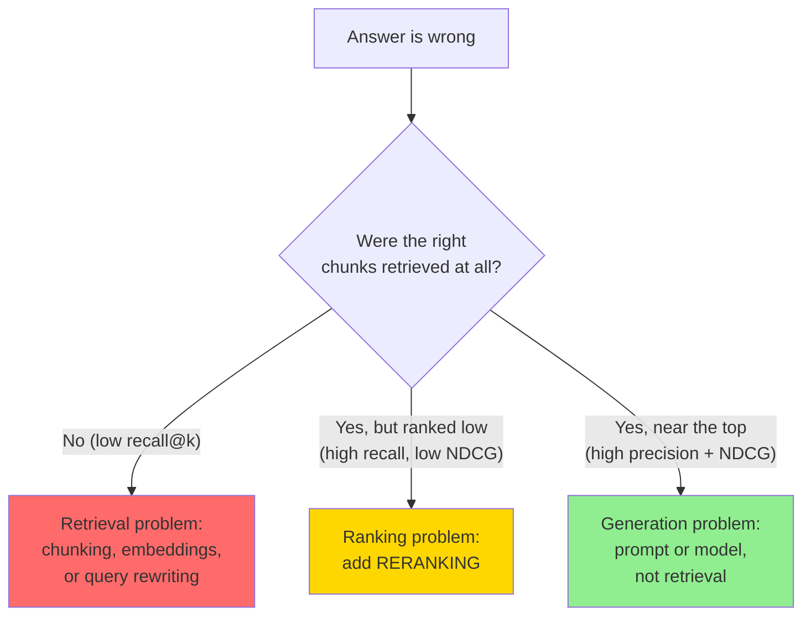
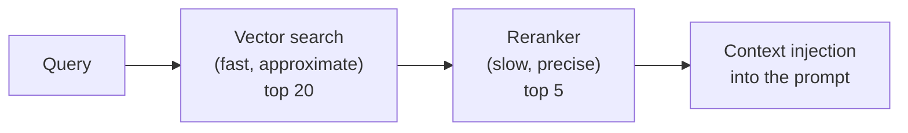
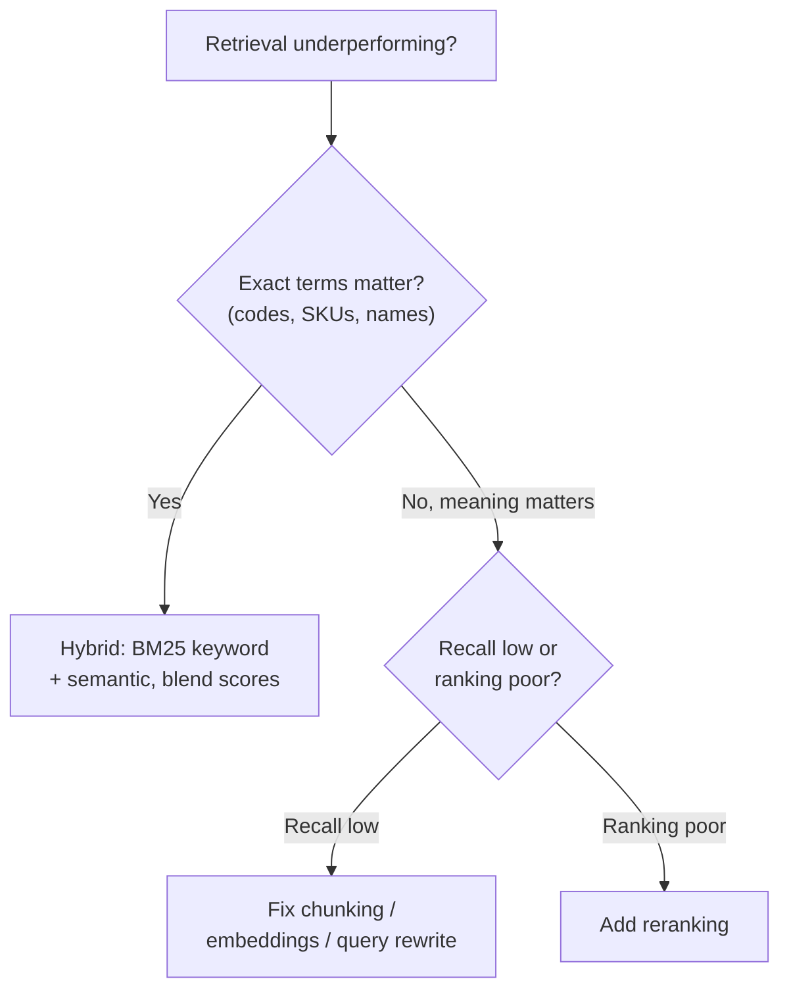
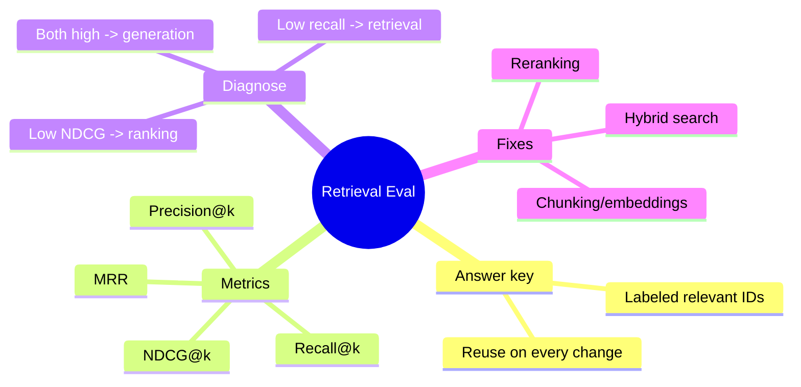

# Retrieval Evaluation & Reranking

Your RAG chatbot gives a vague answer. Is the *retrieval* bad (it fetched the wrong chunks) or is the *generation* bad (it had the right chunks and still fumbled)? You can't fix what you can't measure. This lesson gives you a retrieval test suite — precision, recall, NDCG, MRR — and the highest-ROI lever for improving it: **reranking**.

> **Coming from Software Engineering?** Retrieval evaluation is a **test suite for search** — a set of queries with known-correct results (the "answer key"), run on every change so you catch regressions. Reranking is a **precise sort applied after a cheap approximate filter**: the vector index is your fast index scan, the reranker is the careful `ORDER BY` you run on the small candidate set. If you've tuned a search system with a "candidate generation → ranking" pipeline, this is the same shape.

---

## The Setup: You Need an Answer Key

Every retrieval metric compares **what your search returned** against **what you know is relevant**. So step one is a small labeled set: for each test query, the IDs of the documents that *should* come back. Think of it like the expected output in a unit test — a handful of queries, hand-labeled once, reused forever.

```python
# script_id: day_092_retrieval_evaluation_reranking/metrics
# An eval set: each query maps to the set of doc IDs a human marked relevant.
# Build this once (10-50 queries is plenty to start) and reuse it on every change.
eval_set = {
    "how do I reset my password": {"doc_12", "doc_47"},
    "what is the refund window": {"doc_03"},
    "do you ship internationally": {"doc_21", "doc_22", "doc_88"},
}

# What your retriever actually returned, in rank order (best first):
retrieved = {
    "how do I reset my password": ["doc_12", "doc_99", "doc_47", "doc_05"],
    "what is the refund window": ["doc_77", "doc_03", "doc_14"],
    "do you ship internationally": ["doc_22", "doc_21", "doc_61", "doc_88"],
}
```

---

## The Core Metrics

Two questions matter: *are the results relevant* (precision), and *did I find everything relevant* (recall). Then: *are the best ones near the top* (NDCG, MRR).

```python
# script_id: day_092_retrieval_evaluation_reranking/metrics
import math

def precision_at_k(retrieved_ids: list[str], relevant_ids: set[str], k: int) -> float:
    """Of the top-k returned, what fraction are relevant? (less noise = higher)"""
    top_k = retrieved_ids[:k]
    if not top_k:
        return 0.0
    hits = sum(1 for doc_id in top_k if doc_id in relevant_ids)
    return hits / len(top_k)

def recall_at_k(retrieved_ids: list[str], relevant_ids: set[str], k: int) -> float:
    """Of all relevant docs, what fraction did we find in the top-k? (missed = lower)"""
    if not relevant_ids:
        return 0.0
    hits = sum(1 for doc_id in retrieved_ids[:k] if doc_id in relevant_ids)
    return hits / len(relevant_ids)

def mrr(retrieved_ids: list[str], relevant_ids: set[str]) -> float:
    """Mean Reciprocal Rank: 1/rank of the FIRST relevant hit. Rewards getting
    a right answer to the top. 1.0 = first result is relevant; 0.5 = second; etc."""
    for rank, doc_id in enumerate(retrieved_ids, start=1):
        if doc_id in relevant_ids:
            return 1.0 / rank
    return 0.0

def ndcg_at_k(retrieved_ids: list[str], relevant_ids: set[str], k: int) -> float:
    """Normalized Discounted Cumulative Gain: like a graded results page, but the
    further down a relevant hit sits, the less it counts (the 1/log2(rank+1)
    discount). Divided by the best-possible ordering, so it's always 0-to-1."""
    def dcg(ids: list[str]) -> float:
        return sum(
            (1.0 if doc_id in relevant_ids else 0.0) / math.log2(rank + 1)
            for rank, doc_id in enumerate(ids[:k], start=1)
        )
    actual = dcg(retrieved_ids)
    # ideal = all relevant docs ranked first
    ideal_order = list(relevant_ids) + [d for d in retrieved_ids if d not in relevant_ids]
    best = dcg(ideal_order)
    return actual / best if best > 0 else 0.0


# Run the whole eval set and average
def evaluate(eval_set: dict, retrieved: dict, k: int = 5) -> dict:
    queries = list(eval_set)
    return {
        f"precision@{k}": sum(precision_at_k(retrieved[q], eval_set[q], k) for q in queries) / len(queries),
        f"recall@{k}":    sum(recall_at_k(retrieved[q], eval_set[q], k) for q in queries) / len(queries),
        "mrr":            sum(mrr(retrieved[q], eval_set[q]) for q in queries) / len(queries),
        f"ndcg@{k}":      sum(ndcg_at_k(retrieved[q], eval_set[q], k) for q in queries) / len(queries),
    }

print(evaluate(eval_set, retrieved, k=5))
# e.g. {'precision@5': 0.43, 'recall@5': 0.78, 'mrr': 0.61, 'ndcg@5': 0.74}
```

**Reading the numbers:** low **recall** means relevant docs aren't being retrieved at all (a chunking or embedding problem). High recall but low **precision/NDCG** means the right docs *are* in the candidate set but ranked too low — that's exactly what reranking fixes.

---

## Diagnosing "Why Is My RAG Bad?"

When an answer is wrong, the decision tree is short:



Measuring first tells you *which* knob to turn instead of guessing. The single highest-ROI fix when recall is fine but ranking is poor is reranking.

---

## Reranking: A Precise Second Pass

Vector search is fast but approximate — the top-K are the nearest neighbors in embedding space, not necessarily the most *useful* answers. A **reranker** re-scores each candidate against the query with a more powerful (slower) model, then you keep the best few.



### Cross-Encoder (open-source, self-hosted)

A cross-encoder reads the query and a candidate *together* and emits one relevance score — unlike embedding search, which encodes them separately. Slower, but that joint look is what makes it accurate.

```python
# script_id: day_092_retrieval_evaluation_reranking/reranking
# pip install sentence-transformers
# `candidates` = your top-20 docs from vector search; each item is (doc_id, text)
from sentence_transformers import CrossEncoder

reranker = CrossEncoder("cross-encoder/ms-marco-MiniLM-L-6-v2")

def rerank(query: str, candidates: list[tuple[str, str]], top_n: int = 5) -> list[str]:
    """Re-score (doc_id, text) candidates against the query; return top_n doc IDs."""
    pairs = [(query, text) for _doc_id, text in candidates]
    scores = reranker.predict(pairs)
    ranked = sorted(zip(scores, candidates), key=lambda x: x[0], reverse=True)
    return [doc_id for _score, (doc_id, _text) in ranked[:top_n]]
```

### Cohere Rerank (managed API)

If you'd rather not host a model, a managed reranker is a drop-in:

```python
# script_id: day_092_retrieval_evaluation_reranking/reranking_managed
# pip install cohere   (SDK v5+ uses ClientV2)
import cohere

co = cohere.ClientV2()  # reads COHERE_API_KEY

def rerank_managed(query: str, candidates: list[tuple[str, str]], top_n: int = 5) -> list[str]:
    res = co.rerank(
        model="rerank-v3.5",
        query=query,
        documents=[text for _doc_id, text in candidates],
        top_n=top_n,
    )
    return [candidates[r.index][0] for r in res.results]
```

> As of 2026, model names and pricing for managed rerankers move quickly — verify `rerank-v3.5` and the SDK shape at the provider before shipping.

### Measure the win

The point of the metrics above is to *prove* reranking helped, not assume it:

```python
# script_id: day_092_retrieval_evaluation_reranking/reranking
# Compare baseline retrieval vs reranked retrieval on the SAME eval set.
def benchmark_reranking(eval_set, baseline_retrieved, reranked_retrieved, k=5):
    base = evaluate(eval_set, baseline_retrieved, k)
    rer = evaluate(eval_set, reranked_retrieved, k)
    for metric in base:
        delta = rer[metric] - base[metric]
        print(f"{metric:14} {base[metric]:.3f} -> {rer[metric]:.3f}  ({delta:+.3f})")
```

Reranking typically lifts NDCG and precision the most — it's reordering, so recall@k (whether the doc was in the candidate set at all) barely moves. If reranking *doesn't* help, your problem is recall, not ranking — go back to chunking and embeddings.

---

## When to Reach for Each Lever



- **Reranking** — best when recall is fine but the right chunk sits at position 5 instead of 1. Highest-ROI fix for an existing pipeline.
- **Hybrid search** (keyword + semantic) — best when queries hinge on exact tokens semantic search whiffs on (error codes, SKUs, names). You saw the pgvector version on Day 23.
- **Better chunking/embeddings** — the fix when recall itself is low (the right doc never makes the candidate set).

---

## Checkpoint

Run the metrics block end-to-end on the sample `eval_set`/`retrieved` data and confirm you get four numbers. Then hand-edit `retrieved` to move a relevant doc from the bottom to the top of one query's list and re-run: **precision@5 and recall@5 should be unchanged, but MRR and NDCG should rise** — proving they're the rank-sensitive metrics (and exactly what reranking improves).

---

## Summary



---

## Quick Reference

| Metric | Question it answers | Sensitive to rank? |
|---|---|---|
| Precision@k | Are the top-k results relevant? | No |
| Recall@k | Did I find all the relevant docs? | No |
| MRR | How high is the *first* relevant hit? | Yes |
| NDCG@k | Are the best results near the top? | Yes |
| **Lever** | **Use when** | |
| Reranking | Recall fine, ranking poor | |
| Hybrid search | Exact tokens matter (codes/SKUs) | |
| Fix chunking/embeddings | Recall is low | |

---

## Exercises

1. Build a 10-query eval set from your own Day 34 RAG chatbot's documents and compute precision@5, recall@5, MRR, and NDCG@5 on its current retrieval.
2. Add a cross-encoder reranking pass over the top 20 candidates and re-measure. Did NDCG improve? Did recall@5 stay flat (it should)?
3. Find one query where semantic search fails on an exact term (an error code or product name) and show that hybrid keyword+semantic retrieval fixes it.

<details><summary>Solutions (approaches)</summary>

1. Reuse the `evaluate()` helper; the only new work is hand-labeling relevant doc IDs per query — keep it small.
2. Wrap your retriever to fetch top-20, pass `(doc_id, text)` pairs to `rerank()`, keep top-5, and feed both the baseline and reranked rankings to `benchmark_reranking()`. Recall@5 stays flat because reranking only reorders the candidate set — it can't add a doc that retrieval never fetched.
3. Run the query through pure semantic search (likely misses the exact token), then through the Day 23 hybrid `tsvector` + vector query; the keyword arm pins the exact match while the vector arm covers paraphrases.

</details>

---

## What's Next?

Next up is **Day 93 — Cloud Deployment**, where you ship the containerized app to Render, Railway, AWS, and GCP with CI/CD and monitoring.
