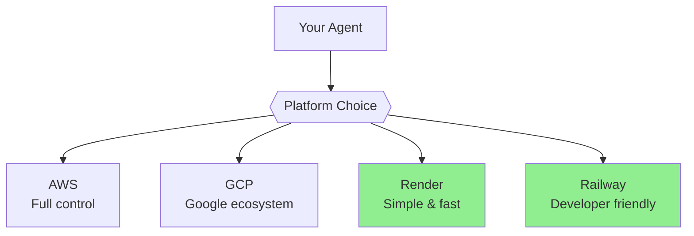
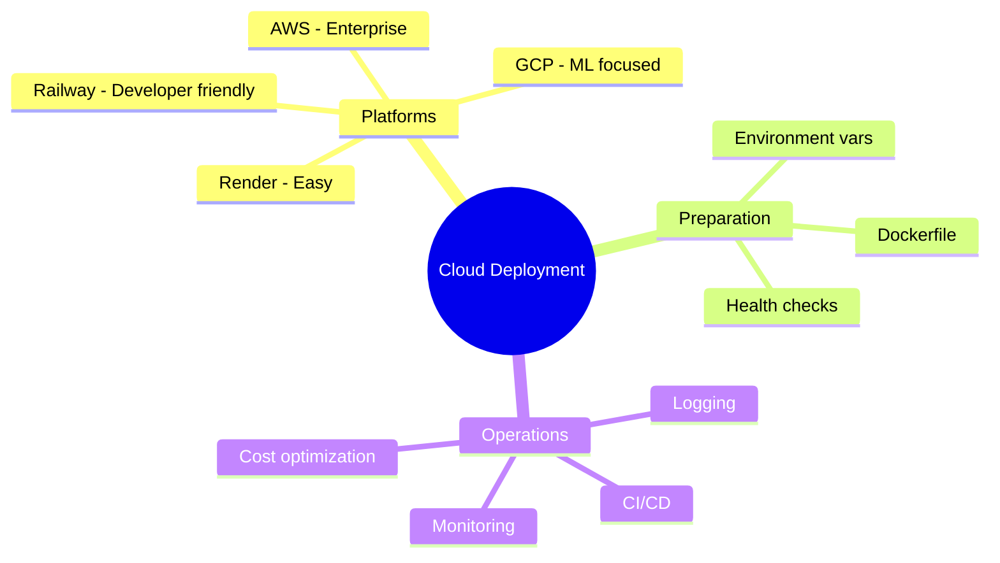

# Cloud Deployment: AWS, GCP, Render & Railway

Take your agent from localhost to the world! This guide covers deploying to major cloud platforms.

> **Coming from Software Engineering?** You've deployed services before — this is the same workflow with different service names. ECS/Cloud Run for containers, managed databases for persistence, secrets manager for API keys. PaaS options like Render and Railway are even simpler — push to git and it deploys, just like Heroku. The AI-specific consideration is that LLM-backed services have higher latency and cost-per-request than typical web services, so right-size your infrastructure accordingly.

---

## Deployment Options



| Platform | Complexity | Cost | Best For |
|----------|------------|------|----------|
| AWS | High | Variable | Enterprise, full control |
| GCP | High | Variable | ML workloads, BigQuery |
| Render | Low | Predictable | Startups, simple apps |
| Railway | Low | Predictable | Side projects, MVPs |

---

## Preparing for Deployment

### 1. Environment Variables

```python
# script_id: day_093_cloud_deployment/env_config
# config.py
import os

class Config:
    OPENAI_API_KEY = os.environ.get("OPENAI_API_KEY")
    DATABASE_URL = os.environ.get("DATABASE_URL")
    ENVIRONMENT = os.environ.get("ENVIRONMENT", "development")

    @classmethod
    def validate(cls):
        required = ["OPENAI_API_KEY"]
        missing = [v for v in required if not getattr(cls, v)]
        if missing:
            raise ValueError(f"Missing env vars: {missing}")
```

### 2. Requirements File

```txt
# requirements.txt
fastapi==0.104.1
uvicorn==0.24.0
openai==1.3.0
pydantic==2.5.0
python-dotenv==1.0.0
gunicorn==21.2.0
```

### 3. Dockerfile

```dockerfile
FROM python:3.11-slim

WORKDIR /app

# Install dependencies
COPY requirements.txt .
RUN pip install --no-cache-dir -r requirements.txt

# Copy application
COPY . .

# Expose port
EXPOSE 8000

# Run
CMD ["uvicorn", "main:app", "--host", "0.0.0.0", "--port", "8000"]
```

---

## Deploy to Render

The easiest option for most cases:

### 1. Create render.yaml

```yaml
# render.yaml
services:
  - type: web
    name: my-agent-api
    env: docker
    plan: starter  # or standard for more resources
    envVars:
      - key: OPENAI_API_KEY
        sync: false  # Set manually in dashboard
      - key: ENVIRONMENT
        value: production
    healthCheckPath: /health
    autoDeploy: true
```

### 2. Deploy

```bash
# Connect GitHub repo to Render
# Or use Render CLI
render deploy
```

### 3. FastAPI Health Check

```python
# script_id: day_093_cloud_deployment/health_check_render
from fastapi import FastAPI

app = FastAPI()

@app.get("/health")
def health_check():
    return {"status": "healthy"}
```

---

## Deploy to Railway

Developer-friendly platform:

### 1. railway.json (Optional)

```json
{
  "build": {
    "builder": "DOCKERFILE"
  },
  "deploy": {
    "startCommand": "uvicorn main:app --host 0.0.0.0 --port $PORT",
    "healthcheckPath": "/health",
    "restartPolicyType": "ON_FAILURE"
  }
}
```

### 2. Deploy via CLI

```bash
# Install Railway CLI
npm install -g @railway/cli

# Login
railway login

# Initialize project
railway init

# Deploy
railway up

# Set environment variables
railway variables set OPENAI_API_KEY=sk-...
```

---

## Deploy to AWS

For production workloads:

### Option 1: AWS App Runner (Simplest)

```yaml
# apprunner.yaml
version: 1.0
runtime: python3
build:
  commands:
    build:
      - pip install -r requirements.txt
run:
  command: uvicorn main:app --host 0.0.0.0 --port 8080
  network:
    port: 8080
```

Deploy:
```bash
aws apprunner create-service \
  --service-name my-agent \
  --source-configuration file://apprunner.yaml
```

### Option 2: ECS with Fargate

```yaml
# task-definition.json
{
  "family": "agent-task",
  "containerDefinitions": [
    {
      "name": "agent-container",
      "image": "YOUR_ECR_IMAGE",
      "portMappings": [
        {
          "containerPort": 8000,
          "protocol": "tcp"
        }
      ],
      "environment": [
        {
          "name": "ENVIRONMENT",
          "value": "production"
        }
      ],
      "secrets": [
        {
          "name": "OPENAI_API_KEY",
          "valueFrom": "arn:aws:secretsmanager:..."
        }
      ],
      "logConfiguration": {
        "logDriver": "awslogs",
        "options": {
          "awslogs-group": "/ecs/agent",
          "awslogs-region": "us-east-1"
        }
      }
    }
  ],
  "requiresCompatibilities": ["FARGATE"],
  "cpu": "256",
  "memory": "512"
}
```

### Option 3: Lambda (Serverless)

```python
# script_id: day_093_cloud_deployment/lambda_handler
# handler.py
from mangum import Mangum
from main import app

handler = Mangum(app)
```

```yaml
# serverless.yml
service: agent-api

provider:
  name: aws
  runtime: python3.11

functions:
  api:
    handler: handler.handler
    events:
      - http:
          path: /{proxy+}
          method: ANY
    environment:
      OPENAI_API_KEY: ${ssm:/agent/openai-key}
```

---

## Deploy to GCP

### Option 1: Cloud Run (Recommended)

```bash
# Build and push to GCR
gcloud builds submit --tag gcr.io/PROJECT_ID/agent

# Deploy to Cloud Run
gcloud run deploy agent \
  --image gcr.io/PROJECT_ID/agent \
  --platform managed \
  --region us-central1 \
  --allow-unauthenticated \
  --set-env-vars "ENVIRONMENT=production" \
  --set-secrets "OPENAI_API_KEY=openai-key:latest"
```

### Option 2: Kubernetes (GKE)

```yaml
# k8s/deployment.yaml
apiVersion: apps/v1
kind: Deployment
metadata:
  name: agent-deployment
spec:
  replicas: 2
  selector:
    matchLabels:
      app: agent
  template:
    metadata:
      labels:
        app: agent
    spec:
      containers:
      - name: agent
        image: gcr.io/PROJECT_ID/agent:latest
        ports:
        - containerPort: 8000
        env:
        - name: ENVIRONMENT
          value: "production"
        - name: OPENAI_API_KEY
          valueFrom:
            secretKeyRef:
              name: api-secrets
              key: openai-key
        resources:
          limits:
            memory: "512Mi"
            cpu: "500m"
---
apiVersion: v1
kind: Service
metadata:
  name: agent-service
spec:
  selector:
    app: agent
  ports:
  - port: 80
    targetPort: 8000
  type: LoadBalancer
```

---

## CI/CD Pipeline

### GitHub Actions

```yaml
# .github/workflows/deploy.yml
name: Deploy

on:
  push:
    branches: [main]

jobs:
  deploy:
    runs-on: ubuntu-latest
    steps:
      - uses: actions/checkout@v3

      - name: Set up Python
        uses: actions/setup-python@v4
        with:
          python-version: '3.11'

      - name: Run tests
        run: |
          pip install -r requirements.txt
          pytest

      - name: Deploy to Render
        uses: johnbeynon/render-deploy-action@v0.0.8
        with:
          service-id: ${{ secrets.RENDER_SERVICE_ID }}
          api-key: ${{ secrets.RENDER_API_KEY }}
```

---

## Monitoring & Logging

### Structured Logging

```python
# script_id: day_093_cloud_deployment/structured_logging
import logging
import json
from datetime import datetime

class JSONFormatter(logging.Formatter):
    def format(self, record):
        log_data = {
            "timestamp": datetime.utcnow().isoformat(),
            "level": record.levelname,
            "message": record.getMessage(),
            "module": record.module,
        }
        if hasattr(record, "extra"):
            log_data.update(record.extra)
        return json.dumps(log_data)

# Setup
handler = logging.StreamHandler()
handler.setFormatter(JSONFormatter())
logger = logging.getLogger(__name__)
logger.addHandler(handler)
logger.setLevel(logging.INFO)

# Usage
logger.info("Agent started", extra={"agent_id": "123", "model": "gpt-4o"})
```

### Health Checks

```python
# script_id: day_093_cloud_deployment/health_checks
from fastapi import FastAPI
from datetime import datetime

app = FastAPI()
start_time = datetime.now()

@app.get("/health")
def health():
    return {
        "status": "healthy",
        "uptime": (datetime.now() - start_time).total_seconds()
    }

@app.get("/ready")
def readiness():
    # Check dependencies
    checks = {
        "database": check_database(),
        "openai": check_openai_connection()
    }
    all_healthy = all(checks.values())
    return {
        "ready": all_healthy,
        "checks": checks
    }
```

---

## Observability & Tracing

Structured logging (above) is the minimum. For production AI systems, you need **trace-level observability** — seeing the full lifecycle of each request including LLM calls, tool executions, retrieval steps, and token costs.

### LangSmith Integration

```python
# script_id: day_093_cloud_deployment/langsmith_tracing
# pip install langsmith
import os

# Set environment variables
os.environ["LANGCHAIN_TRACING_V2"] = "true"
os.environ["LANGCHAIN_API_KEY"] = os.getenv("LANGSMITH_API_KEY")
os.environ["LANGCHAIN_PROJECT"] = "production-agent"

# If using LangChain/LangGraph, tracing is automatic.
# For custom code, use the @traceable decorator:
from langsmith import traceable

@traceable(name="generate_response")
def generate_response(query: str) -> str:
    """This function's inputs, outputs, and timing are automatically traced."""
    response = client.chat.completions.create(
        model="gpt-4o",
        messages=[{"role": "user", "content": query}]
    )
    return response.choices[0].message.content
```

### Langfuse (Open Source Alternative)

```python
# script_id: day_093_cloud_deployment/langfuse_tracing
# pip install langfuse
from langfuse import Langfuse
from langfuse.decorators import observe

langfuse = Langfuse(
    public_key=os.getenv("LANGFUSE_PUBLIC_KEY"),
    secret_key=os.getenv("LANGFUSE_SECRET_KEY"),
    host=os.getenv("LANGFUSE_HOST", "https://cloud.langfuse.com")
)

@observe()
def rag_pipeline(query: str) -> str:
    """Each step is automatically traced — retrieval, generation, tool calls."""
    docs = retrieve_documents(query)
    context = format_context(docs)
    response = generate_with_context(query, context)
    return response
```

### What to Track in Production

| Metric | Why It Matters | Tool |
|--------|---------------|------|
| Latency per step | Find bottlenecks (retrieval vs generation) | LangSmith / Langfuse |
| Token usage per request | Cost attribution, budget enforcement | Any tracing tool |
| Error rates by type | Distinguish LLM errors from infra errors | Structured logs + traces |
| User feedback signals | Ground truth for eval dataset | Custom + Langfuse |
| Retrieval relevance scores | RAG quality degradation alerts | Custom metrics |

> **Coming from Software Engineering?** LangSmith / Langfuse are the Datadog APM of AI. Instead of tracing HTTP requests through microservices, you're tracing queries through retrieval → LLM → tool execution chains. Same observability mindset, different telemetry.

---

## Cost Optimization

```python
# script_id: day_093_cloud_deployment/cost_optimization
# Caching to reduce API calls. lru_cache keys on the function arguments, so
# cache directly on the text — the earlier version cached on a hash but then
# called generate_embedding(text) with `text` out of scope (a NameError).
from functools import lru_cache

@lru_cache(maxsize=1000)
def cached_embedding(text: str):
    # Only called on a cache miss
    return generate_embedding(text)

def get_embedding(text: str):
    return cached_embedding(text)
```

---

## Summary



---

## Quick Reference

```bash
# Render
render deploy

# Railway
railway up

# AWS App Runner
aws apprunner create-service ...

# GCP Cloud Run
gcloud run deploy ...

# Docker
docker build -t agent .
docker run -p 8000:8000 agent
```

---

## Exercises

1. **Pick a platform.** For a containerized FastAPI agent, choose between Render, Railway, AWS App Runner, and GCP Cloud Run, and justify the pick in two sentences.
2. **Deploy once.** Push your Dockerized app to one of them and get a public URL responding to `/health`.
3. **Secrets, not code.** Move every API key out of the image and into the platform's environment/secret store; confirm the key never appears in `docker history`.
4. **Health + autoscale.** Add a `/health` endpoint and configure the platform to scale on it (min/max instances). Note what happens to a cold start.

<details><summary>Solutions (approaches)</summary>

1. Render/Railway = fastest DX for small apps; Cloud Run/App Runner = better scale-to-zero + IAM if you're already on that cloud.
2. `docker build -t agent .` then the platform's deploy command (`render deploy`, `railway up`, `gcloud run deploy ...`).
3. Set keys via the dashboard/CLI secret store; in code read `os.environ[...]`; never `COPY .env` into the image.
4. `@app.get("/health") def health(): return {"ok": True}`; set min instances ≥1 to avoid cold starts, or accept the first-request latency.
</details>

---

## What's Next?

Your app is deployed to the cloud. Next, we make the prompts behind it maintainable: **Prompt Engineering Discipline** — versioning prompts as files, A/B testing with traffic splitting, LLM-as-judge evaluation, and the anti-patterns to avoid.
