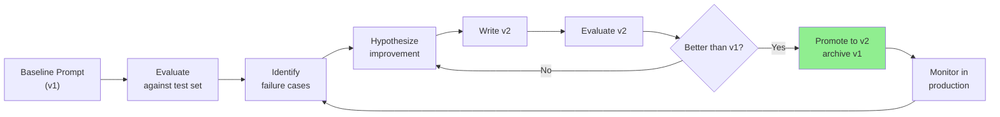
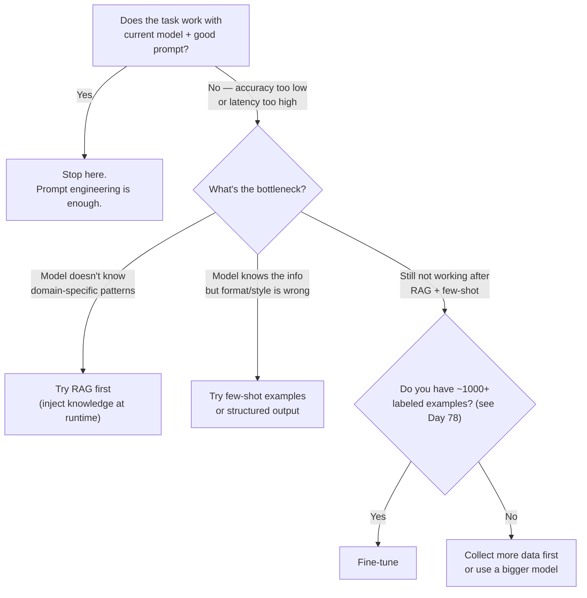
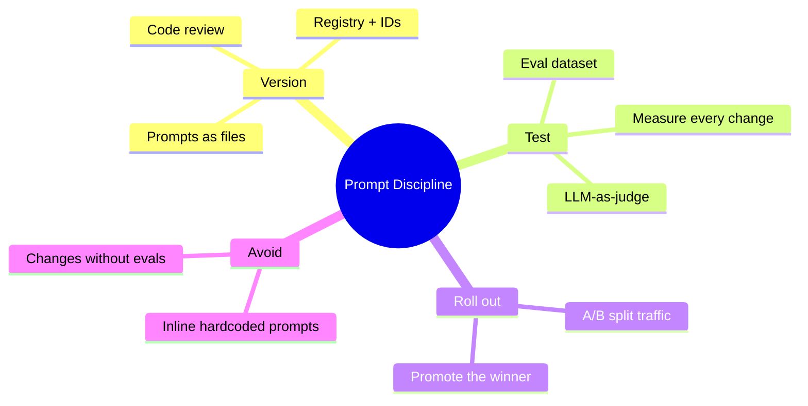

# Prompt Engineering as a Discipline

"Just write a good prompt" is how most teams start. Six months later, they have 47 prompts scattered across 12 files, nobody knows which version is in production, a junior engineer changed the sentiment analysis prompt two weeks ago and nobody noticed, and the quality has quietly degraded.

> **Coming from Software Engineering?** This is configuration management and infrastructure-as-code applied to prompts. You already treat infrastructure as code (Terraform), feature flags as managed state (LaunchDarkly), and database schemas as versioned migrations. Prompts deserve the same discipline: version control, code review, automated testing, and staged rollout. If you've set up a CI/CD pipeline for infrastructure changes, you know exactly how to build one for prompt changes.

Prompt engineering as a discipline means treating prompts like code: version them, test them, measure them, and manage them intentionally.

---

## The Problem with Inline Prompts

```python
# script_id: day_094_prompt_engineering_discipline/inline_prompt_antipattern
# What most teams do — and regret
def analyze_sentiment(text: str) -> str:
    response = client.chat.completions.create(
        model="gpt-4o",
        messages=[
            {
                "role": "system",
                # 👇 Hardcoded. No versioning. No testing. No way to A/B test.
                "content": "Analyze the sentiment of the following text. Return positive, negative, or neutral.",
            },
            {"role": "user", "content": text},
        ],
    )
    return response.choices[0].message.content
```

Problems with this:
- Prompt is invisible in version control diffs (buried in code)
- Changing the prompt requires a code deploy
- No way to test prompt changes without deploying
- Multiple engineers editing the same prompt = conflicts
- No history of what changed and why

---

## Prompts as Files: The Foundation

Store prompts as standalone files. Treat them like templates.

```
prompts/
  v1/
    sentiment_analysis.txt
    entity_extraction.txt
    summarization.txt
  v2/
    sentiment_analysis.txt    ← new version being tested
  registry.json               ← maps logical names to versions
```

```python
# script_id: day_094_prompt_engineering_discipline/sentiment_prompt_template
# fragment: illustrative cheat-sheet / not standalone-runnable
# prompts/v1/sentiment_analysis.txt
You are a sentiment analysis expert. Analyze the sentiment of the following text.

Rules:
- Respond with exactly one word: "positive", "negative", or "neutral"
- Base your assessment on the overall emotional tone
- Ignore sarcasm markers unless clearly intentional

Text to analyze:
{{text}}
```

```python
# script_id: day_094_prompt_engineering_discipline/prompt_management_system
# prompt_manager.py
from pathlib import Path
import json
from string import Template
from openai import OpenAI


client = OpenAI()
PROMPTS_DIR = Path(__file__).parent / "prompts"


class PromptManager:
    """Load, version, and render prompt templates."""

    def __init__(self, prompts_dir: Path = PROMPTS_DIR):
        self.prompts_dir = prompts_dir
        self._cache: dict[str, str] = {}

    def get(self, name: str, version: str = "v1") -> str:
        """Load a prompt template by name and version."""
        cache_key = f"{version}/{name}"

        if cache_key not in self._cache:
            path = self.prompts_dir / version / f"{name}.txt"
            if not path.exists():
                raise FileNotFoundError(f"Prompt not found: {path}")
            self._cache[cache_key] = path.read_text(encoding="utf-8").strip()

        return self._cache[cache_key]

    def render(self, name: str, variables: dict, version: str = "v1") -> str:
        """Load a prompt and substitute {{variables}}."""
        template = self.get(name, version)

        # Replace {{variable}} placeholders
        for key, value in variables.items():
            template = template.replace(f"{{{{{key}}}}}", str(value))

        # Check for unreplaced variables
        import re
        remaining = re.findall(r'\{\{(\w+)\}\}', template)
        if remaining:
            raise ValueError(f"Unreplaced variables in prompt: {remaining}")

        return template

    def list_versions(self, name: str) -> list[str]:
        """List all available versions of a prompt."""
        versions = []
        for version_dir in sorted(self.prompts_dir.iterdir()):
            if version_dir.is_dir():
                if (version_dir / f"{name}.txt").exists():
                    versions.append(version_dir.name)
        return versions


# Usage
pm = PromptManager()

def analyze_sentiment(text: str, prompt_version: str = "v1") -> str:
    system_prompt = pm.render(
        "sentiment_analysis",
        variables={"text": text},
        version=prompt_version,
    )

    response = client.chat.completions.create(
        model="gpt-4o-mini",
        messages=[{"role": "user", "content": system_prompt}],
        max_tokens=10,
    )
    return response.choices[0].message.content.strip().lower()
```

We switch to the cheaper `gpt-4o-mini` for these classification calls; the LLM judge later stays on the stronger `gpt-4o`.

---

## Prompt Versioning with a Registry

```json
// prompts/registry.json
{
  "sentiment_analysis": {
    "production": "v1",
    "staging": "v2",
    "description": "Classify text sentiment as positive/negative/neutral",
    "versions": {
      "v1": {
        "created": "2025-01-15",
        "author": "alice",
        "notes": "Initial version"
      },
      "v2": {
        "created": "2025-03-20",
        "author": "bob",
        "notes": "Added confidence score output, handles sarcasm better"
      }
    }
  }
}
```

```python
# script_id: day_094_prompt_engineering_discipline/prompt_management_system
class PromptRegistry:
    """Manage prompt versions with environment routing."""

    def __init__(self, registry_path: Path, prompts_dir: Path):
        self.registry_path = registry_path
        self.pm = PromptManager(prompts_dir)
        self._registry = json.loads(registry_path.read_text())

    def get_version(self, name: str, env: str = "production") -> str:
        """Get the active version for a prompt in an environment."""
        entry = self._registry.get(name)
        if not entry:
            raise KeyError(f"Unknown prompt: {name}")
        return entry.get(env, entry.get("production", "v1"))

    def render_for_env(self, name: str, variables: dict, env: str = "production") -> str:
        """Render a prompt using the version active in the given environment."""
        version = self.get_version(name, env)
        return self.pm.render(name, variables, version)

    def promote(self, name: str, version: str, env: str = "production"):
        """Promote a prompt version to an environment."""
        self._registry[name][env] = version
        self.registry_path.write_text(json.dumps(self._registry, indent=2))
        print(f"Promoted {name} {version} to {env}")
```

---

## A/B Testing Prompts in Production

This is where treating prompts as code pays off. Run two versions simultaneously and measure which performs better.

```python
# script_id: day_094_prompt_engineering_discipline/prompt_management_system
import random
import time
from dataclasses import dataclass
from collections import defaultdict


@dataclass
class PromptExperiment:
    """Track A/B test results for prompt variants."""
    name: str
    variants: dict[str, float]  # variant_name → traffic_percentage

    _results: dict = None

    def __post_init__(self):
        self._results = defaultdict(lambda: {"calls": 0, "successes": 0, "latency_ms": []})

        # Validate traffic splits sum to 100
        total = sum(self.variants.values())
        if abs(total - 100) > 0.01:
            raise ValueError(f"Traffic splits must sum to 100, got {total}")

    def select_variant(self) -> str:
        """Select a variant based on traffic percentages."""
        # Weighted routing — same idea as a feature flag: roll a number 0-100 and pick the bucket it lands in.
        rand = random.uniform(0, 100)
        cumulative = 0
        for variant, percentage in self.variants.items():
            cumulative += percentage
            if rand <= cumulative:
                return variant
        return list(self.variants.keys())[-1]

    def record(self, variant: str, success: bool, latency_ms: float):
        self._results[variant]["calls"] += 1
        if success:
            self._results[variant]["successes"] += 1
        self._results[variant]["latency_ms"].append(latency_ms)

    def report(self) -> dict:
        report = {}
        for variant, data in self._results.items():
            calls = data["calls"]
            if calls == 0:
                continue
            latencies = data["latency_ms"]
            report[variant] = {
                "calls": calls,
                "success_rate": data["successes"] / calls,
                "avg_latency_ms": sum(latencies) / len(latencies) if latencies else 0,
            }
        return report


# Running the experiment
experiment = PromptExperiment(
    name="sentiment_v1_vs_v2",
    variants={"v1": 50, "v2": 50},
)


def analyze_with_experiment(text: str) -> tuple[str, str]:
    """Run sentiment analysis, routing via A/B experiment."""
    variant = experiment.select_variant()
    start = time.time()

    try:
        system_prompt = pm.render("sentiment_analysis", {"text": text}, version=variant)
        response = client.chat.completions.create(
            model="gpt-4o-mini",
            messages=[{"role": "user", "content": system_prompt}],
            max_tokens=10,
        )
        result = response.choices[0].message.content.strip().lower()
        success = result in ["positive", "negative", "neutral"]

        latency = (time.time() - start) * 1000
        experiment.record(variant, success, latency)

        return result, variant

    except Exception as e:
        latency = (time.time() - start) * 1000
        experiment.record(variant, False, latency)
        raise


# After enough calls, check results
report = experiment.report()
for variant, stats in report.items():
    print(f"{variant}: {stats['success_rate']:.1%} success, {stats['avg_latency_ms']:.0f}ms avg")
```

---

## Measuring Prompt Quality: Automated Evaluation

Do not rely on vibes. Measure.

```python
# script_id: day_094_prompt_engineering_discipline/prompt_management_system
from pydantic import BaseModel
from openai import OpenAI
import json


class EvalResult(BaseModel):
    score: float          # 0.0 to 1.0
    reasoning: str
    passed: bool


def llm_judge(
    prompt_output: str,
    expected_behavior: str,
    rubric: str,
    judge_model: str = "gpt-4o",
) -> EvalResult:
    """Use an LLM to evaluate another LLM's output quality.
    
    This is the 'LLM-as-judge' pattern from Days 58-59.
    """
    judge_prompt = f"""Evaluate this AI response based on the rubric below.

EXPECTED BEHAVIOR:
{expected_behavior}

ACTUAL RESPONSE:
{prompt_output}

RUBRIC:
{rubric}

Return JSON with:
- score: float 0.0-1.0 (1.0 = perfect)
- reasoning: brief explanation
- passed: bool (true if score >= 0.7)"""

    response = client.chat.completions.create(
        model=judge_model,
        messages=[{"role": "user", "content": judge_prompt}],
        response_format={"type": "json_object"},
    )

    data = json.loads(response.choices[0].message.content)
    return EvalResult(**data)


# Evaluation dataset
SENTIMENT_EVAL_SET = [
    {"text": "This product is absolutely amazing! Best purchase ever.", "expected": "positive"},
    {"text": "Complete waste of money. Broke after one day.", "expected": "negative"},
    {"text": "It arrived on time and works as described.", "expected": "neutral"},
    {"text": "I wanted to love this but it just didn't work for me.", "expected": "negative"},
    {"text": "Pretty good overall, minor issues with the packaging.", "expected": "neutral"},
]


def evaluate_prompt_version(version: str) -> dict:
    """Evaluate a prompt version against the test set."""
    results = []

    for example in SENTIMENT_EVAL_SET:
        system_prompt = pm.render(
            "sentiment_analysis",
            {"text": example["text"]},
            version=version,
        )

        response = client.chat.completions.create(
            model="gpt-4o-mini",
            messages=[{"role": "user", "content": system_prompt}],
            max_tokens=10,
        )
        output = response.choices[0].message.content.strip().lower()
        correct = output == example["expected"]
        results.append(correct)

    accuracy = sum(results) / len(results)
    return {
        "version": version,
        "accuracy": accuracy,
        "correct": sum(results),
        "total": len(results),
    }


# Compare versions
for version in pm.list_versions("sentiment_analysis"):
    stats = evaluate_prompt_version(version)
    print(f"{version}: {stats['accuracy']:.1%} accuracy ({stats['correct']}/{stats['total']})")
```

---

## Iterative Prompt Optimization



```python
# script_id: day_094_prompt_engineering_discipline/prompt_management_system
def find_failure_cases(version: str, n: int = 5) -> list[dict]:
    """Find the examples where a prompt version fails."""
    failures = []

    for example in SENTIMENT_EVAL_SET:
        system_prompt = pm.render(
            "sentiment_analysis",
            {"text": example["text"]},
            version=version,
        )

        response = client.chat.completions.create(
            model="gpt-4o-mini",
            messages=[{"role": "user", "content": system_prompt}],
            max_tokens=10,
        )
        output = response.choices[0].message.content.strip().lower()

        if output != example["expected"]:
            failures.append({
                "text": example["text"],
                "expected": example["expected"],
                "got": output,
            })

    return failures[:n]


# Workflow: find failures, improve prompt, test again
failures = find_failure_cases("v1")
print("Failures in v1:")
for f in failures:
    print(f"  Text: {f['text'][:60]}...")
    print(f"  Expected: {f['expected']} | Got: {f['got']}")
```

---

## Prompt Anti-Patterns

### Too Long

```
# BAD: 400-word system prompt for a simple classification task
system = """
You are an expert sentiment analysis AI with 20 years of experience in NLP,
trained on millions of customer reviews across 47 industries. Your task is to
carefully consider the nuanced emotional landscape of the following text...
[300 more words]
"""

# GOOD: Precise and minimal
system = """Classify text sentiment as exactly one of: positive, negative, neutral.
Consider the overall tone. Return only the classification word."""
```

### Too Vague

```
# BAD: Leaves too much to interpretation
system = "Analyze this text and tell me what you think about it."

# GOOD: Explicit output format
system = """Analyze this customer review. Return JSON:
{"sentiment": "positive|negative|neutral", "confidence": 0.0-1.0, "key_phrase": "main reason"}"""
```

### Conflicting Instructions

```
# BAD: Contradictions confuse the model
system = """Be concise. Give detailed explanations. Answer in one sentence.
Provide comprehensive analysis."""

# GOOD: Clear priority order
system = """Answer the question in 2-3 sentences. 
Prioritize accuracy over brevity."""
```

---

## SWE to AI Engineering Bridge

| Software Engineering | Prompt Engineering |
|---|---|
| Source code files | Prompt template files (.txt) |
| Version control (git) | Prompt version directories |
| Unit tests | Eval datasets with expected outputs |
| Feature flags | Prompt A/B experiments |
| CI/CD pipeline | Automated prompt evaluation on change |
| Code review | Prompt review before production deploy |
| Monitoring / metrics | Prompt quality metrics (accuracy, latency) |
| Staging environment | Staging prompt version |

---

## When Prompting Isn't Enough: The Fine-Tuning Decision

Prompt engineering solves most problems. But not all of them. Here is a framework for deciding when to go beyond prompting.

### Decision Flowchart



*few-shot = show the model 2-3 worked examples in the prompt (Day 6); RAG = look up relevant info and paste it into the prompt at runtime (Phase 2).*

### When to Fine-Tune

- **Custom output format** that prompting can't reliably produce
- **Domain-specific jargon/style** (legal, medical, financial)
- **Latency-sensitive applications** — a fine-tuned smaller model often beats a prompted larger model
- **Cost optimization** — a fine-tuned smaller model can be much cheaper per call than a prompted larger one (often roughly an order of magnitude — verify current pricing at the provider)

### Fine-Tuning Options

| Provider | Method | Min Examples | Cost |
|----------|--------|-------------|------|
| OpenAI | Fine-tune API | ~50-100 | ~$0.008/1K tokens |
| Open-source | LoRA/QLoRA (lightweight fine-tuning — trains a small add-on instead of the whole model; see Day 78) | hundreds to 1000+ (see Day 78) | GPU time only |

Costs and example minimums are illustrative — as of 2026-06; verify current provider pricing and requirements before planning. Anthropic fine-tuning availability changes — check current docs before planning around it.

### The 80/20 Rule

In practice, 80% of use cases are solved by better prompting + RAG. Fine-tuning is for the remaining 20% where you need consistent style, format, or domain adaptation that can't be achieved through context alone.

> **Coming from Software Engineering?** Think of fine-tuning like training a junior developer on your team's coding standards. You could write an exhaustive style guide (prompting) or pair them with senior devs who show examples (RAG/few-shot). But sometimes you need them to internalize the patterns so deeply that they produce correct output without being told — that's fine-tuning.

---

## Key Takeaways

1. **Store prompts as files, not strings** — they belong in version control, not buried in code
2. **Every prompt change needs an evaluation** — never change a production prompt without measuring the impact
3. **A/B test before promoting** — run v1 and v2 in parallel, promote the winner
4. **LLM-as-judge scales your eval** — you cannot manually review thousands of responses
5. **Failure case analysis drives improvement** — find where the prompt breaks, fix those cases
6. **Shorter prompts are usually better** — clear and concise beats long and comprehensive

---

## Checkpoint

Run the `prompt_management_system` and confirm it loads the `sentiment_prompt_template` from its versioned file and renders it with your variables substituted in. If you see literal `{{placeholder}}` text in the final prompt, check that the template variables match the keys you're passing to the render call.

## Summary



---

## Quick Reference

| Concern | Anti-pattern | Discipline |
|---|---|---|
| Storage | Prompt hardcoded in a function | `prompts/v1/<name>.txt` loaded by a `PromptManager` |
| Change control | Edit string, deploy | Versioned file + code review |
| Validation | Eyeball a few outputs | Eval dataset + automated score before promote |
| Rollout | Swap in place | A/B split, compare, then promote |
| Scoring at scale | Manual review | LLM-as-judge over the eval set |

---

## Exercises

1. Move all inline prompts from your capstone project into a `prompts/v1/` directory and build a `PromptManager` that loads them by name + version.
2. Build an eval dataset of 20 examples for one of your prompts and measure its accuracy.
3. Write v2 of one prompt targeting the failure cases you find, and verify it improves accuracy.
4. Implement the A/B experiment framework and run it with 100 test calls split 50/50 between v1 and v2.

<details><summary>Solutions (approaches)</summary>

1. `PromptManager.get("sentiment", version="v1")` reads `prompts/v1/sentiment.txt`; version is just a directory.
2. A list of `(input, expected)` pairs; run the prompt over each, compare, report `correct / total`.
3. Inspect the misses, edit the wording for those cases, re-run the same eval set, confirm the score went up.
4. Hash the request id to pick v1/v2 50/50, log `(version, score)`, then compare mean scores before promoting.
</details>

---

## What's Next?

Next we standardize how agents talk to tools and data sources: the **Model Context Protocol (MCP)** — a common interface for exposing tools, resources, and prompts to any MCP-aware client.
