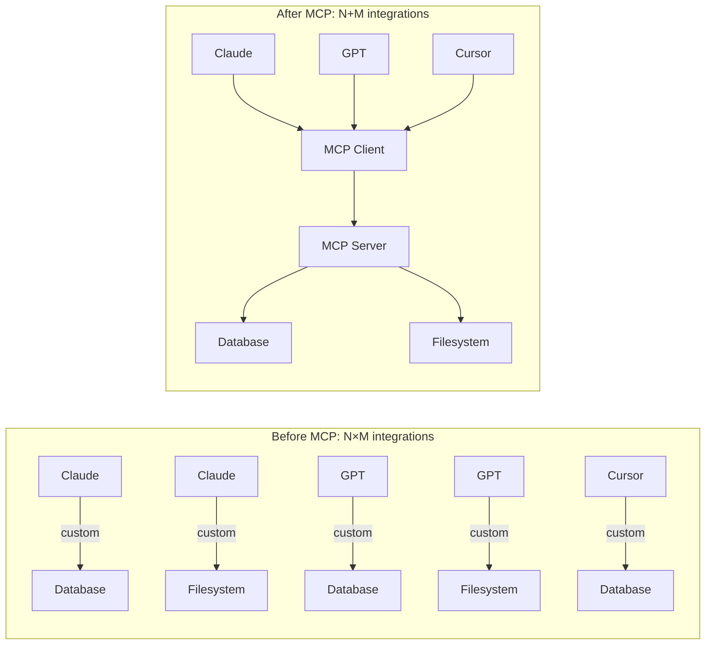
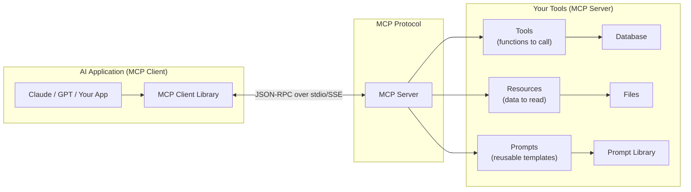
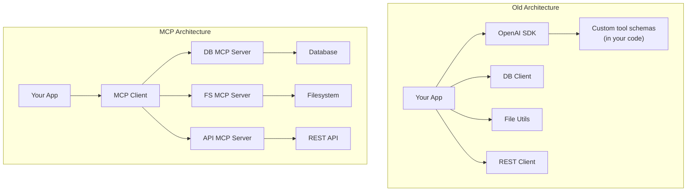
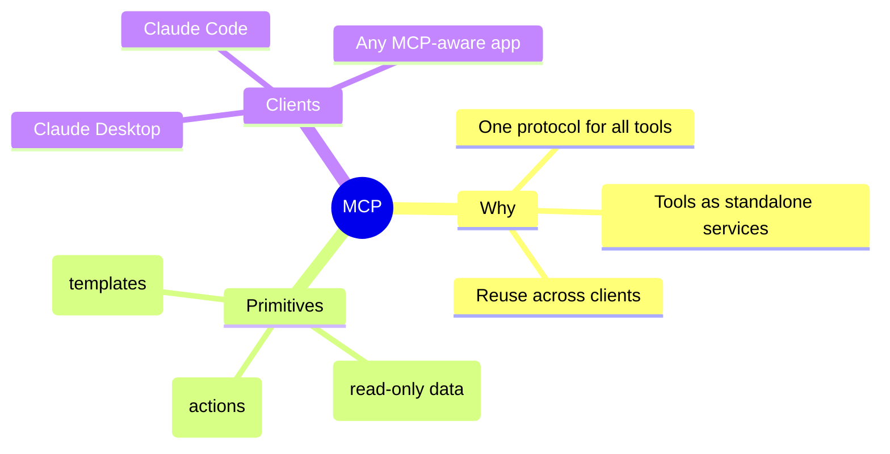

# Model Context Protocol (MCP)

Picture this: you want to give Claude access to your company's internal database. You also want it to read files from your filesystem, call your REST API, and query your calendar. That's four different integrations, four different tool schemas, four different auth patterns, four different things to maintain.

> **Coming from Software Engineering?** MCP is a standardized interface protocol — like ODBC/JDBC for databases, or LSP (Language Server Protocol) for code editors. Instead of every AI app building custom integrations for every tool, MCP defines a universal protocol that any tool can implement and any AI client can consume. If you've built or consumed REST APIs following OpenAPI/Swagger specs, or implemented LSP for an editor plugin, you already understand the value of standardized interfaces.

Now multiply that by every AI assistant, every model provider, every application framework. You get a combinatorial explosion of custom integrations. Every tool needs to know about every AI system.

MCP solves this by being the USB-C of AI tool integrations.

---

## The Problem MCP Solves



Before MCP: every AI model needed a custom integration with every tool. N models × M tools = N×M integrations.

After MCP: each tool exposes one MCP server. Each AI client implements one MCP client. N + M total implementations.

---

## MCP Architecture



### Core Concepts

**MCP Client** — the AI application side. Claude Desktop, Claude Code, Cursor, and your custom apps all act as MCP clients.

**MCP Server** — a process you run that exposes tools, resources, and prompts over the MCP protocol. You write these.

**Tools** — functions the AI can call. Like OpenAI function calling, but standardized.

**Resources** — data the AI can read (files, database records, API responses). Think of it as a read-only filesystem abstraction.

**Prompts** — reusable prompt templates the server can provide to the client.

---

## Building Your First MCP Server

Install the SDK:

```bash
pip install mcp
```

Here is a minimal MCP server that exposes database query capabilities:

```python
# script_id: day_095_model_context_protocol/db_mcp_server
# db_mcp_server.py
import asyncio
import sqlite3
from typing import Any
import mcp.server.stdio
import mcp.types as types
from mcp.server import NotificationOptions, Server
from mcp.server.models import InitializationOptions

# Initialize the MCP server
server = Server("database-server")

# Your actual database connection
DB_PATH = "company.db"


def get_db():
    conn = sqlite3.connect(DB_PATH)
    conn.row_factory = sqlite3.Row
    return conn


@server.list_tools()
async def handle_list_tools() -> list[types.Tool]:
    """Declare what tools this server provides."""
    return [
        types.Tool(
            name="query_database",
            description=(
                "Execute a read-only SQL query against the company database. "
                "Use this to look up customer records, orders, products, etc. "
                "Only SELECT queries are allowed."
            ),
            inputSchema={
                "type": "object",
                "properties": {
                    "sql": {
                        "type": "string",
                        "description": "The SELECT SQL query to execute",
                    },
                    "limit": {
                        "type": "integer",
                        "description": "Maximum rows to return (default 10, max 100)",
                        "default": 10,
                    },
                },
                "required": ["sql"],
            },
        ),
        types.Tool(
            name="list_tables",
            description="List all available tables in the database with their schemas.",
            inputSchema={
                "type": "object",
                "properties": {},
            },
        ),
    ]


@server.call_tool()
async def handle_call_tool(
    name: str, arguments: dict[str, Any] | None
) -> list[types.TextContent]:
    """Execute a tool call."""
    arguments = arguments or {}

    if name == "query_database":
        sql = arguments.get("sql", "").strip()
        limit = min(int(arguments.get("limit", 10)), 100)

        # Security: only allow SELECT
        if not sql.upper().startswith("SELECT"):
            return [types.TextContent(
                type="text",
                text="Error: Only SELECT queries are allowed."
            )]

        try:
            conn = get_db()
            # `limit` is safe to interpolate because we cast it to int and cap it
            # above. `sql` itself is NOT parameterized here — we only gate it to
            # SELECT. For untrusted input, use a real SQL parser/allowlist rather
            # than a prefix check, and never f-string raw user SQL.
            cursor = conn.execute(f"{sql} LIMIT {limit}")
            rows = cursor.fetchall()
            columns = [desc[0] for desc in cursor.description]
            conn.close()

            if not rows:
                return [types.TextContent(type="text", text="No results found.")]

            # Format as markdown table
            result = "| " + " | ".join(columns) + " |\n"
            result += "| " + " | ".join(["---"] * len(columns)) + " |\n"
            for row in rows:
                result += "| " + " | ".join(str(v) for v in row) + " |\n"

            result += f"\n*{len(rows)} rows returned*"
            return [types.TextContent(type="text", text=result)]

        except Exception as e:
            return [types.TextContent(type="text", text=f"Database error: {e}")]

    elif name == "list_tables":
        try:
            conn = get_db()
            cursor = conn.execute(
                "SELECT name FROM sqlite_master WHERE type='table' ORDER BY name"
            )
            tables = [row[0] for row in cursor.fetchall()]

            result = "Available tables:\n"
            for table in tables:
                result += f"- {table}\n"

            conn.close()
            return [types.TextContent(type="text", text=result)]

        except Exception as e:
            return [types.TextContent(type="text", text=f"Error: {e}")]

    else:
        return [types.TextContent(type="text", text=f"Unknown tool: {name}")]


async def main():
    async with mcp.server.stdio.stdio_server() as (read_stream, write_stream):
        await server.run(
            read_stream,
            write_stream,
            InitializationOptions(
                server_name="database-server",
                server_version="0.1.0",
                capabilities=server.get_capabilities(
                    notification_options=NotificationOptions(),
                    experimental_capabilities={},
                ),
            ),
        )


if __name__ == "__main__":
    asyncio.run(main())
```

---

## Adding Resources

Resources let the AI read data without calling a function. Think of it as exposing files or structured data.

```python
# script_id: day_095_model_context_protocol/db_mcp_server
@server.list_resources()
async def handle_list_resources() -> list[types.Resource]:
    """Expose readable resources."""
    return [
        types.Resource(
            uri="database://schema",
            name="Database Schema",
            description="Full schema of all database tables",
            mimeType="text/plain",
        ),
        types.Resource(
            uri="database://stats",
            name="Database Statistics",
            description="Row counts and last-updated timestamps for all tables",
            mimeType="text/plain",
        ),
    ]


@server.read_resource()
async def handle_read_resource(uri: str) -> str:
    """Return the content of a resource by URI."""
    if uri == "database://schema":
        conn = get_db()
        cursor = conn.execute(
            "SELECT sql FROM sqlite_master WHERE type='table' ORDER BY name"
        )
        schema = "\n\n".join(row[0] for row in cursor.fetchall() if row[0])
        conn.close()
        return schema

    elif uri == "database://stats":
        conn = get_db()
        cursor = conn.execute(
            "SELECT name FROM sqlite_master WHERE type='table'"
        )
        tables = [row[0] for row in cursor.fetchall()]

        stats = []
        for table in tables:
            count = conn.execute(f"SELECT COUNT(*) FROM {table}").fetchone()[0]
            stats.append(f"{table}: {count} rows")

        conn.close()
        return "\n".join(stats)

    raise ValueError(f"Unknown resource: {uri}")
```

---

## Connecting to Claude Desktop

Once your server is built, connect it to Claude Desktop by editing the config file:

**macOS:** `~/Library/Application Support/Claude/claude_desktop_config.json`

```json
{
  "mcpServers": {
    "database": {
      "command": "python",
      "args": ["/path/to/your/db_mcp_server.py"],
      "env": {
        "DB_PATH": "/path/to/company.db"
      }
    }
  }
}
```

Restart Claude Desktop. You will see a hammer icon in the input area — that means Claude has access to your tools.

---

## A More Practical Example: File System MCP Server

```python
# script_id: day_095_model_context_protocol/filesystem_mcp_server
# filesystem_mcp_server.py
import os
from pathlib import Path
import mcp.server.stdio
import mcp.types as types
from mcp.server import Server, NotificationOptions
from mcp.server.models import InitializationOptions
import asyncio

server = Server("filesystem-server")

# Restrict access to a safe directory
ALLOWED_ROOT = Path(os.environ.get("ALLOWED_ROOT", "/tmp/ai_workspace")).resolve()


def safe_path(requested: str) -> Path:
    """Resolve path and verify it's within ALLOWED_ROOT."""
    resolved = (ALLOWED_ROOT / requested).resolve()
    if not str(resolved).startswith(str(ALLOWED_ROOT)):
        raise ValueError(f"Path traversal attempt: {requested}")
    return resolved


@server.list_tools()
async def handle_list_tools() -> list[types.Tool]:
    return [
        types.Tool(
            name="read_file",
            description="Read the contents of a file in the workspace.",
            inputSchema={
                "type": "object",
                "properties": {
                    "path": {"type": "string", "description": "Relative path to the file"},
                },
                "required": ["path"],
            },
        ),
        types.Tool(
            name="list_directory",
            description="List files and directories at a given path.",
            inputSchema={
                "type": "object",
                "properties": {
                    "path": {"type": "string", "description": "Relative path (default: root)", "default": "."},
                },
            },
        ),
        types.Tool(
            name="write_file",
            description="Write content to a file in the workspace.",
            inputSchema={
                "type": "object",
                "properties": {
                    "path": {"type": "string"},
                    "content": {"type": "string"},
                },
                "required": ["path", "content"],
            },
        ),
    ]


@server.call_tool()
async def handle_call_tool(name: str, arguments: dict | None) -> list[types.TextContent]:
    arguments = arguments or {}

    if name == "read_file":
        try:
            path = safe_path(arguments["path"])
            content = path.read_text(encoding="utf-8")
            return [types.TextContent(type="text", text=content)]
        except Exception as e:
            return [types.TextContent(type="text", text=f"Error: {e}")]

    elif name == "list_directory":
        try:
            path = safe_path(arguments.get("path", "."))
            entries = []
            for item in sorted(path.iterdir()):
                prefix = "📁 " if item.is_dir() else "📄 "
                entries.append(f"{prefix}{item.name}")
            return [types.TextContent(type="text", text="\n".join(entries) or "Empty directory")]
        except Exception as e:
            return [types.TextContent(type="text", text=f"Error: {e}")]

    elif name == "write_file":
        try:
            path = safe_path(arguments["path"])
            path.parent.mkdir(parents=True, exist_ok=True)
            path.write_text(arguments["content"], encoding="utf-8")
            return [types.TextContent(type="text", text=f"Written: {path}")]
        except Exception as e:
            return [types.TextContent(type="text", text=f"Error: {e}")]

    return [types.TextContent(type="text", text=f"Unknown tool: {name}")]


async def main():
    async with mcp.server.stdio.stdio_server() as (read_stream, write_stream):
        await server.run(
            read_stream, write_stream,
            InitializationOptions(
                server_name="filesystem-server",
                server_version="0.1.0",
                capabilities=server.get_capabilities(
                    notification_options=NotificationOptions(),
                    experimental_capabilities={},
                ),
            ),
        )

if __name__ == "__main__":
    asyncio.run(main())
```

---

## How MCP Changes AI Application Architecture



The key shift: **tools become services**. Instead of inline tool definitions in your code, you have standalone MCP servers that any AI client can connect to. Your database MCP server works with Claude Desktop, with your custom app, with any MCP-compatible agent framework.

---

## Real MCP Servers to Know

The ecosystem is growing fast. Useful ones already exist:

- **`@modelcontextprotocol/server-filesystem`** — filesystem access
- **`@modelcontextprotocol/server-github`** — GitHub repos, issues, PRs
- **`@modelcontextprotocol/server-postgres`** — PostgreSQL queries
- **`@modelcontextprotocol/server-brave-search`** — web search
- **`mcp-server-fetch`** — fetch any URL

Find them at: `github.com/modelcontextprotocol/servers`

---

## SWE to AI Engineering Bridge

| Software Concept | MCP Equivalent |
|---|---|
| REST API | MCP Server (standardized tool interface) |
| API endpoint | MCP Tool |
| Static file server | MCP Resource |
| OpenAPI/Swagger spec | MCP Tool schemas |
| SDK / client library | MCP Client |
| Microservice | MCP Server (each service exposes its own) |

---

## Key Takeaways

1. **MCP is the USB-C of AI integrations** — write one server, connect to any AI client
2. **Tools vs Resources** — tools are callable functions; resources are readable data
3. **Security matters** — always validate paths, sanitize inputs, restrict SQL to SELECT
4. **The ecosystem is moving fast** — check the official MCP servers repo before building your own
5. **MCP works with Claude Desktop and Claude Code** — great for personal productivity tools
6. **MCP changes architecture** — tools become standalone services, not inline code

---

## Checkpoint

Run the `filesystem_mcp_server` and confirm an MCP client can list and call its exposed tools (e.g. read a file) over the protocol. If the client connects but sees no tools, check that each function is registered with the server's tool decorator and that the server finished its startup handshake before the client queried.

## Summary



---

## Quick Reference

| Concept | What it is | Analogy for a SWE |
|---|---|---|
| MCP server | A process exposing tools/resources/prompts | A microservice with a typed contract |
| Tool | A callable action with a schema | An RPC endpoint |
| Resource | Read-only data the client can fetch | A GET-only resource/URI |
| Prompt | A reusable templated instruction | A stored query / snippet |
| Client | The host that connects (Claude Desktop, Code) | The service consumer |

```text
# Register a Claude Desktop MCP server (config sketch)
# ~/Library/Application Support/Claude/claude_desktop_config.json
{
  "mcpServers": {
    "db": { "command": "python", "args": ["db_mcp_server.py"] }
  }
}
```

---

## Exercises

1. Build an MCP server that exposes your Day 40 RAG chatbot's vector database as a queryable tool.
2. Create a simple MCP server for a REST API you use (weather, news, etc.) and connect it to Claude Desktop.
3. Add a `search_schema` tool to the database server that finds tables matching a keyword.
4. Write an MCP server that exposes your local git repository: `git_log`, `git_diff`, `git_status` tools.

<details><summary>Solutions (approaches)</summary>

1. Wrap your existing `retrieve(query)` in a tool function; the schema takes `query: str` and returns the top-k chunks.
2. One tool per endpoint; map tool args → request params; return the parsed JSON as the tool result.
3. `search_schema(keyword)` runs `SELECT table_name ... WHERE table_name LIKE '%keyword%'` and returns matches.
4. Shell out to `git` (`git log --oneline`, `git diff`, `git status --short`) and return stdout as the tool result; restrict to a safe repo path.
</details>

---

## What's Next?

**Next up:** the Claude Agent SDK and the agent patterns underneath it — the loop the SDKs automate, routing/handoffs, and guardrails, all on the Messages API.
