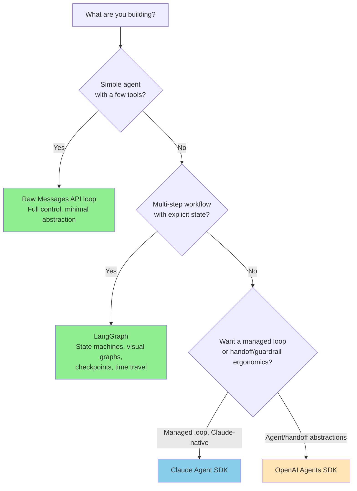
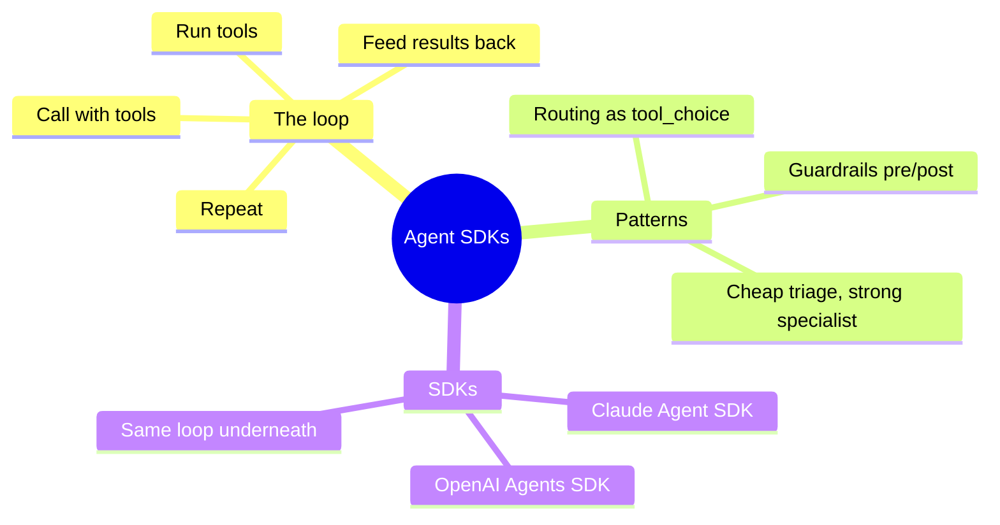

# Agent SDKs and the Patterns Underneath

You have built agents three ways on this journey: a raw ReAct loop, LangGraph state machines, and CrewAI pipelines. Today we look at the **agent SDKs** — higher-level libraries that package the agent loop, tool dispatch, routing, and guardrails — and, just as importantly, at *what they do under the hood* so you can build the same patterns directly on the Messages API when you want full control.

> **Coming from Software Engineering?** An agent SDK is to the LLM API what a web framework is to raw sockets. Flask/Express handle routing, middleware, and the request lifecycle so you don't hand-roll them; an agent SDK handles the tool-call loop, multi-agent routing, and input/output validation. And like web frameworks, the value is the *pattern*, not the package — once you've seen the loop, you can implement it on bare HTTP when you need to.

---

## The two SDKs you'll hear about

There are two distinct "agent SDKs" in the Claude ecosystem, and they're easy to confuse:

| | **Claude Agent SDK** | **OpenAI Agents SDK** |
|---|---|---|
| Package | `claude-agent-sdk` | `openai-agents` |
| Origin | Anthropic (the renamed Claude Code SDK) | OpenAI (model-agnostic; works with Claude) |
| Entry points | `query()`, `ClaudeSDKClient` | `Agent`, `Runner`, `handoff` |
| Mental model | A managed coding-agent loop with built-in file/bash/MCP tools | `Agent` objects with tools, `handoff`s, and guardrails, run by a `Runner` |
| Best when | You want Anthropic's managed agent harness (bash, file edits, MCP) | You want the `Agent`/handoff/guardrail ergonomics, possibly across providers |

> ⚠️ **Accuracy note.** SDK APIs move fast, and the two SDKs above have **different** surfaces — don't mix them up (the `Agent`/`Runner`/`Handoff` names belong to the OpenAI Agents SDK, not the Claude Agent SDK). Before writing SDK-specific code, read the current docs: the [Claude Agent SDK docs](https://docs.claude.com/en/api/agent-sdk/overview) and the OpenAI Agents SDK docs. **The runnable code in this lesson uses the plain `anthropic` Messages API** — which is stable and provider-accurate — so you learn the patterns the SDKs automate without depending on a fast-moving wrapper.

### What the Claude Agent SDK gives you (at a glance)

At a high level the Claude Agent SDK exposes:

- **`query(...)`** — fire a prompt and stream the agent's messages back (a one-shot/async-iterator entry point).
- **`ClaudeSDKClient`** — a stateful client for multi-turn agent sessions.
- **`ClaudeAgentOptions`** — configuration (model, system prompt, allowed tools, working directory, permission mode, etc.).
- **custom tools** via a tool decorator + `create_sdk_mcp_server` (your tools are exposed to the agent as an in-process MCP server).
- built-in **file, bash, and MCP** tools and a managed agent loop.

Reach for it when you want Anthropic to run that loop for you. Reach for the Messages API (below) when you want to own every step. Consult the docs for exact signatures before you build — they change between releases.

---

## When to use what



---

## The agent loop, on the Messages API

Every agent SDK is wrapping this loop: call the model with tools, execute any tool calls it requests, feed results back, repeat until it stops asking for tools. Here it is directly.

```python
# script_id: day_096_claude_agent_sdk/support_agent
import anthropic

client = anthropic.Anthropic()


# 1. Tool implementations (plain Python functions)
def search_web(query: str) -> str:
    """Pretend web search — wire to a real API in production."""
    return f"Results for '{query}': [result 1], [result 2]"


def calculate(expression: str) -> str:
    """Evaluate arithmetic safely (never eval untrusted input)."""
    import ast, operator
    ops = {ast.Add: operator.add, ast.Sub: operator.sub,
           ast.Mult: operator.mul, ast.Div: operator.truediv, ast.Pow: operator.pow}

    def _eval(node):
        if isinstance(node, ast.Constant):
            return node.value
        if isinstance(node, ast.BinOp):
            return ops[type(node.op)](_eval(node.left), _eval(node.right))
        if isinstance(node, ast.UnaryOp) and isinstance(node.op, ast.USub):
            return -_eval(node.operand)
        raise ValueError("Unsupported expression")

    try:
        return str(_eval(ast.parse(expression, mode="eval").body))
    except Exception as e:  # noqa: BLE001
        return f"Error: {e}"


TOOL_IMPLS = {"search_web": search_web, "calculate": calculate}

# 2. Tool schemas the model sees
TOOLS = [
    {
        "name": "search_web",
        "description": "Search the web for current information.",
        "input_schema": {
            "type": "object",
            "properties": {"query": {"type": "string", "description": "Search query"}},
            "required": ["query"],
        },
    },
    {
        "name": "calculate",
        "description": "Evaluate a math expression like '100 * 0.15'.",
        "input_schema": {
            "type": "object",
            "properties": {"expression": {"type": "string"}},
            "required": ["expression"],
        },
    },
]


# 3. The loop the SDKs automate for you
def run_agent(system: str, tools: list, impls: dict, user_message: str,
              model: str = "claude-opus-4-8", max_steps: int = 6) -> str:
    messages = [{"role": "user", "content": user_message}]
    for _ in range(max_steps):
        response = client.messages.create(
            model=model,
            max_tokens=1024,
            system=system,
            tools=tools,
            messages=messages,
        )
        if response.stop_reason != "tool_use":
            # No more tool calls — return the final text.
            return "".join(b.text for b in response.content if b.type == "text")

        # Echo the assistant turn (including its tool_use blocks), then run the tools.
        messages.append({"role": "assistant", "content": response.content})
        results = []
        for block in response.content:
            if block.type == "tool_use":
                output = impls[block.name](**block.input)
                results.append({
                    "type": "tool_result",
                    "tool_use_id": block.id,
                    "content": str(output),
                })
        messages.append({"role": "user", "content": results})
    return "Stopped: max steps reached."


print(run_agent(
    system="You are a research assistant. Use tools for facts and math.",
    tools=TOOLS,
    impls=TOOL_IMPLS,
    user_message="What is 15% of 847?",
))
```

That `run_agent` function is, in essence, what `Runner.run()` (OpenAI Agents SDK) or the Claude Agent SDK's managed loop does for you.

---

## Routing: the "handoff" pattern

A "handoff" is a triage agent deciding which specialist should handle a request. You can implement it by forcing a routing decision with `tool_choice`, then dispatching to the chosen specialist — each specialist is just another `run_agent` call with its own system prompt and tools.

```python
# script_id: day_096_claude_agent_sdk/support_agent

SPECIALISTS = {
    "billing": {
        "system": "You are a billing specialist. Be precise with amounts and dates; "
                  "confirm before processing any change.",
        "model": "claude-haiku-4-5",
    },
    "technical": {
        "system": "You are technical support. Ask for error messages and stack traces "
                  "when relevant.",
        "model": "claude-sonnet-4-6",
    },
    "general": {
        "system": "You handle general product and account questions.",
        "model": "claude-haiku-4-5",
    },
}


def triage(user_message: str) -> str:
    """Force the model to pick a specialist via a single-tool choice."""
    route_tool = {
        "name": "route",
        "description": "Route the request to the right specialist.",
        "input_schema": {
            "type": "object",
            "properties": {
                "specialist": {"type": "string", "enum": list(SPECIALISTS)},
            },
            "required": ["specialist"],
        },
    }
    response = client.messages.create(
        model="claude-haiku-4-5",
        max_tokens=256,
        system="Route the customer's request. Do not answer it yourself.",
        tools=[route_tool],
        tool_choice={"type": "tool", "name": "route"},  # must call route
        messages=[{"role": "user", "content": user_message}],
    )
    tool_use = next(b for b in response.content if b.type == "tool_use")
    return tool_use.input["specialist"]


def handle(user_message: str) -> str:
    specialist = triage(user_message)
    cfg = SPECIALISTS[specialist]
    print(f"Routed to: {specialist}")
    return run_agent(
        system=cfg["system"], tools=TOOLS, impls=TOOL_IMPLS,
        user_message=user_message, model=cfg["model"],
    )


print(handle("I was charged twice for my subscription this month"))
```

`tool_choice={"type": "tool", "name": "route"}` guarantees the model returns a routing decision rather than free text — the reliable way to get a structured branch.

---

## Guardrails

Guardrails are just validation that runs **before** the request (block bad input) and **after** the response (block bad output). They're plain functions — no framework required.

```python
# script_id: day_096_claude_agent_sdk/guardrails
import re


class GuardrailTripped(Exception):
    """Raised when a guardrail blocks the request or response."""


PII_PATTERNS = {
    "SSN": r"\b\d{3}-\d{2}-\d{4}\b",
    "Credit Card": r"\b(?:4[0-9]{12}(?:[0-9]{3})?|5[1-5][0-9]{14})\b",
}


def input_guardrail(message: str) -> None:
    """Block PII before it ever reaches the model."""
    for label, pattern in PII_PATTERNS.items():
        if re.search(pattern, message):
            raise GuardrailTripped(f"Input blocked: contains {label}")


def output_guardrail(response_text: str) -> None:
    """Block low-quality or injection-echoing responses."""
    if len(response_text.strip()) < 20:
        raise GuardrailTripped("Output blocked: too short to be useful")
    for pattern in ("ignore previous instructions", "jailbreak"):
        if pattern in response_text.lower():
            raise GuardrailTripped(f"Output blocked: contains '{pattern}'")


def guarded_run(run_fn, user_message: str) -> str:
    """Wrap any agent call with input/output guardrails."""
    input_guardrail(user_message)            # pre-check
    result = run_fn(user_message)            # run the agent
    output_guardrail(result)                 # post-check
    return result


# Usage:
#   guarded_run(handle, "How do I reset my password?")  -> runs
#   guarded_run(handle, "My SSN is 123-45-6789")        -> GuardrailTripped
```

This is the same pre/post-validation an SDK's `input_guardrails` / `output_guardrails` give you — you just own the policy.

---

## Async for production

Web apps should not block on the agent loop. Use `AsyncAnthropic` and `await` the calls; the loop structure is identical.

```python
# script_id: day_096_claude_agent_sdk/async_api
import anthropic
from fastapi import FastAPI
from pydantic import BaseModel

aclient = anthropic.AsyncAnthropic()
app = FastAPI()


async def run_agent_async(system: str, tools: list, impls: dict, user_message: str,
                          model: str = "claude-opus-4-8", max_steps: int = 6) -> str:
    messages = [{"role": "user", "content": user_message}]
    for _ in range(max_steps):
        response = await aclient.messages.create(
            model=model, max_tokens=1024, system=system, tools=tools, messages=messages,
        )
        if response.stop_reason != "tool_use":
            return "".join(b.text for b in response.content if b.type == "text")
        messages.append({"role": "assistant", "content": response.content})
        results = [
            {"type": "tool_result", "tool_use_id": b.id, "content": str(impls[b.name](**b.input))}
            for b in response.content if b.type == "tool_use"
        ]
        messages.append({"role": "user", "content": results})
    return "Stopped: max steps reached."


class ChatRequest(BaseModel):
    message: str


@app.post("/chat")
async def chat(request: ChatRequest):
    answer = await run_agent_async(
        system="You are a helpful assistant.",
        tools=[], impls={}, user_message=request.message,
    )
    return {"response": answer}
```

---

## Observability

You don't need a framework to trace an agent — log each step of the loop (model, stop reason, tool calls, token usage). Drop these into LangSmith/Phoenix (Day 56) in production.

```python
# script_id: day_096_claude_agent_sdk/support_agent

def run_agent_traced(system: str, tools: list, impls: dict, user_message: str,
                     model: str = "claude-opus-4-8", max_steps: int = 6) -> str:
    messages = [{"role": "user", "content": user_message}]
    for step in range(max_steps):
        response = client.messages.create(
            model=model, max_tokens=1024, system=system, tools=tools, messages=messages,
        )
        u = response.usage
        print(f"[step {step}] stop={response.stop_reason} "
              f"in={u.input_tokens} out={u.output_tokens}")
        for b in response.content:
            if b.type == "tool_use":
                print(f"  tool_use: {b.name}({b.input})")
        if response.stop_reason != "tool_use":
            return "".join(b.text for b in response.content if b.type == "text")
        messages.append({"role": "assistant", "content": response.content})
        messages.append({"role": "user", "content": [
            {"type": "tool_result", "tool_use_id": b.id, "content": str(impls[b.name](**b.input))}
            for b in response.content if b.type == "tool_use"
        ]})
    return "Stopped: max steps reached."
```

---

## SDK vs. the raw loop: the real comparison

| Concern | Agent SDK | Raw Messages API loop |
|---|---|---|
| Learning curve | Low | Low–Medium |
| The agent loop | Handled for you | You write `run_agent` (≈30 lines) |
| Routing / handoffs | Built-in primitive | `tool_choice` + dispatch |
| Guardrails | Built-in hooks | Plain pre/post functions |
| Built-in tools (bash, file, MCP) | Yes (Claude Agent SDK) | You provide them |
| Control over every step | Lower | Total |
| Multi-provider | OpenAI Agents SDK: yes | Anthropic-only here |

The SDK saves you the boilerplate; the raw loop gives you total control and zero version risk. Knowing both means you can start fast and drop down when you hit a wall.

---

## SWE to AI Engineering Bridge

| Software pattern | Agent equivalent |
|---|---|
| Web framework request loop | The agent tool-call loop |
| Service routing / dispatch | Triage + handoff |
| Input validation middleware | Input guardrail |
| Response interceptor | Output guardrail |
| Structured logging / tracing | Per-step loop logging |
| Async request handlers | `AsyncAnthropic` + `await` |

---

## Key Takeaways

1. **Every agent SDK wraps the same loop** — call with tools, run tools, feed results back, repeat. Learn the loop and the SDKs become conveniences, not magic.
2. **Two different SDKs** — the **Claude Agent SDK** (`query`/`ClaudeSDKClient`, managed loop) and the **OpenAI Agents SDK** (`Agent`/`Runner`/handoff). Don't conflate their APIs; check current docs for exact signatures.
3. **Routing is `tool_choice` + dispatch** — forcing a structured routing decision is the reliable handoff mechanism.
4. **Guardrails are just pre/post validation** — no framework required.
5. **Use cheap models for triage** (Haiku) and stronger models for specialists (Sonnet/Opus).
6. **Async is the production path** — `AsyncAnthropic` with the identical loop.

---

## Checkpoint

Run the `support_agent` example and confirm it completes a multi-turn tool-using loop — calling a tool, getting a result, and returning a final answer — with the `guardrails` rejecting any disallowed action. If the loop never terminates, check that you're feeding each tool result back into the next Messages API call and stopping once `stop_reason` is `end_turn`.

## Summary



---

## Quick Reference

| Building block | On the Messages API | Note |
|---|---|---|
| Tools | `tools=[{name, input_schema, ...}]` in `messages.create` | Schemas are what the model sees |
| Run a tool | Detect `tool_use` blocks, execute, send back `tool_result` | This is the loop the SDKs automate |
| Routing | Force a structured choice via `tool_choice`, then dispatch | Reliable handoff mechanism |
| Guardrails | Plain validation before/after the call | No framework required |
| Streaming | `client.messages.stream(...)` | Tokens as they generate |
| Async | `AsyncAnthropic` with the identical loop | Production path |

> The real **Claude Agent SDK** (`query` / `ClaudeAgentOptions`) wraps this loop for you — check the official docs for current signatures rather than guessing them.

---

## Exercises

1. Extend `run_agent` to support streaming (`client.messages.stream(...)`) so tokens appear as they're generated.
2. Build a three-way support router (billing / technical / general) on top of `triage` + `run_agent`, and log which specialist handled each request.
3. Add an output guardrail that declines off-topic requests (not about your product) politely.
4. Compare token usage of the same task on `claude-haiku-4-5` vs `claude-opus-4-8`, and decide where each belongs.
5. **Stretch:** reimplement the support router using the real Claude Agent SDK (`query` / `ClaudeAgentOptions`) and compare the ergonomics with the raw loop. Check the official docs for the current API.

<details><summary>Solutions (approaches)</summary>

1. Swap `messages.create` for `with client.messages.stream(...) as s:` and iterate `s.text_stream`.
2. `triage` returns a label via forced `tool_choice`; a dict maps label → specialist system prompt; log the chosen label.
3. Post-call check: if the reply (or request) is off-topic, return a fixed polite decline instead of the model output.
4. Run the same prompt on both models, read `response.usage.input_tokens`/`output_tokens`; route cheap/simple to Haiku, hard to Opus.
5. Follow the official Agent SDK docs for `query`/`ClaudeAgentOptions`; don't hand-write signatures from memory.
</details>

---

## What's Next?

**Capstone — Deploy to Production**, where you bring the whole content pipeline together behind FastAPI, Docker, monitoring, and a cloud deployment.
