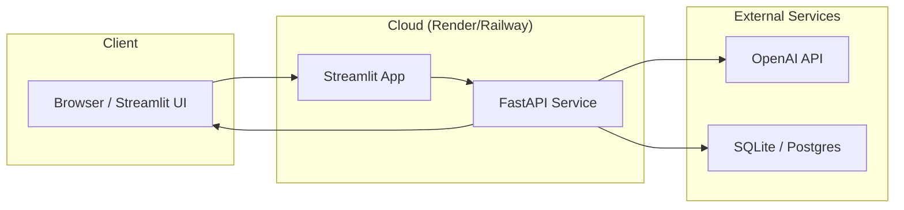

# Capstone — Deploy an AI Agent to Production

You've built real systems. Now it's time to put them on the internet.

> **Coming from Software Engineering?** This capstone is a standard deployment exercise — Dockerize, configure, deploy, monitor. You've done this for web apps, APIs, and microservices. The AI parts (LLM API calls, vector DB, streaming responses) are just components inside the same container/service architecture you already know. This is where your SWE background gives you the biggest advantage: many AI engineers can build impressive demos but struggle with production. You won't.

This is where many AI engineers stop. They have impressive demos that run on localhost, but they've never deployed an AI system to production. That gap is both a career liability and a missed learning opportunity — because production is where you discover all the things your demo hid from you.

Today we take the content pipeline from Day 81, wrap it in a FastAPI backend, add a Streamlit UI, containerize everything with Docker, and deploy it to a public URL. By the end of today, you'll have something you can share with anyone.

---

## What You're Deploying

The Day 73 multi-agent content pipeline, now with:
- **FastAPI backend** with streaming responses
- **Streamlit UI** for human review
- **Docker** for consistent, portable deployment
- **Render or Railway** for cloud hosting
- **Health checks** and structured logging
- **Rate limiting** to prevent abuse
- **Cost tracking** to monitor spend



---

## Project Structure

```
deploy/
├── api/
│   ├── main.py           # FastAPI app
│   ├── routers/
│   │   ├── pipeline.py   # Pipeline endpoints
│   │   └── health.py     # Health check endpoints
│   ├── middleware/
│   │   ├── rate_limit.py
│   │   └── cost_tracker.py
│   └── models.py         # Pydantic request/response models
├── ui/
│   └── app.py            # Streamlit UI
├── pipeline/             # Day 81 pipeline code (copied here)
│   ├── agents/
│   ├── evaluator.py
│   ├── security.py
│   └── pipeline.py
├── Dockerfile.api
├── Dockerfile.ui
├── docker-compose.yml
├── render.yaml           # Render deployment config
└── requirements.txt
```

---

## Step 1: FastAPI Backend with Streaming

```python
# script_id: day_097_capstone_deploy_to_production/api_main
# api/main.py
import os
import logging
import time
from contextlib import asynccontextmanager
from fastapi import FastAPI, Request
from fastapi.middleware.cors import CORSMiddleware
from fastapi.responses import JSONResponse

from routers.pipeline import router as pipeline_router
from routers.health import router as health_router

logging.basicConfig(
    level=logging.INFO,
    format="%(asctime)s %(levelname)s %(name)s %(message)s",
)
logger = logging.getLogger(__name__)


@asynccontextmanager
async def lifespan(app: FastAPI):
    """Startup and shutdown events."""
    logger.info("Starting content pipeline API...")
    # Initialize any connections, warm up models, etc.
    yield
    logger.info("Shutting down content pipeline API...")


app = FastAPI(
    title="AI Content Pipeline",
    description="Multi-agent content creation with human review",
    version="1.0.0",
    lifespan=lifespan,
)

# CORS for the Streamlit frontend
app.add_middleware(
    CORSMiddleware,
    allow_origins=["*"],  # In production: specify your UI domain
    allow_credentials=True,
    allow_methods=["*"],
    allow_headers=["*"],
)

# Request logging middleware
@app.middleware("http")
async def log_requests(request: Request, call_next):
    start = time.time()
    response = await call_next(request)
    duration = time.time() - start
    logger.info(
        f"{request.method} {request.url.path} "
        f"status={response.status_code} duration={duration:.2f}s"
    )
    return response

app.include_router(pipeline_router, prefix="/api/v1")
app.include_router(health_router)
```

```python
# script_id: day_097_capstone_deploy_to_production/api_models
# api/models.py
from pydantic import BaseModel, Field
from typing import Optional, Literal
from enum import Enum


class ContentType(str, Enum):
    blog_post = "blog_post"
    social_media = "social_media"
    email = "email"
    summary = "summary"


class PipelineRequest(BaseModel):
    topic: str = Field(..., min_length=5, max_length=500, description="Content topic")
    content_type: ContentType = ContentType.blog_post
    target_audience: str = Field(default="general audience", max_length=200)
    require_human_review: bool = Field(default=False, description="Skip human review for API")
    min_quality_threshold: float = Field(default=0.7, ge=0.0, le=1.0)

    model_config = {
        "json_schema_extra": {
            "examples": [
                {
                    "topic": "How AI agents are transforming software development",
                    "content_type": "blog_post",
                    "target_audience": "software engineers",
                    "require_human_review": False,
                    "min_quality_threshold": 0.7,
                }
            ]
        }
    }


class PipelineResponse(BaseModel):
    success: bool
    run_id: Optional[str] = None
    content: Optional[str] = None
    evaluation: Optional[dict] = None
    revision_count: Optional[int] = None
    total_tokens: Optional[int] = None
    estimated_cost_usd: Optional[float] = None
    error: Optional[str] = None
```

```python
# script_id: day_097_capstone_deploy_to_production/api_router_pipeline
# api/routers/pipeline.py
import asyncio
import json
from fastapi import APIRouter, HTTPException, Depends
from fastapi.responses import StreamingResponse
from api.models import PipelineRequest, PipelineResponse
from api.middleware.rate_limit import check_rate_limit
from api.middleware.cost_tracker import track_cost
from pipeline.pipeline import ContentPipeline

router = APIRouter(tags=["pipeline"])


@router.post("/run", response_model=PipelineResponse)
async def run_pipeline(
    request: PipelineRequest,
    _rate_limit: None = Depends(check_rate_limit),
):
    """
    Run the content pipeline synchronously.
    Returns when the pipeline completes.
    """
    try:
        pipeline = ContentPipeline(
            min_quality_threshold=request.min_quality_threshold,
            max_revisions=2,
            require_human_review=request.require_human_review,
        )

        # Run in thread pool to avoid blocking the event loop
        loop = asyncio.get_event_loop()
        result = await loop.run_in_executor(
            None,
            lambda: pipeline.run(
                raw_topic=request.topic,
                content_type=request.content_type.value,
                target_audience=request.target_audience,
            ),
        )

        return PipelineResponse(**result)

    except Exception as e:
        raise HTTPException(status_code=500, detail=str(e))


@router.post("/stream")
async def stream_pipeline(request: PipelineRequest):
    """
    Run the content pipeline with streaming progress updates.
    Returns Server-Sent Events.
    """

    async def event_generator():
        """Generate SSE events for pipeline progress."""

        async def progress_callback(stage: str, data: dict = None):
            event = {"stage": stage, "data": data or {}}
            yield f"data: {json.dumps(event)}\n\n"

        try:
            yield f"data: {json.dumps({'stage': 'started', 'topic': request.topic})}\n\n"

            pipeline = ContentPipeline(
                min_quality_threshold=request.min_quality_threshold,
                max_revisions=2,
                require_human_review=False,  # Can't do HITL in streaming
            )

            # Run in thread pool
            loop = asyncio.get_event_loop()
            result = await loop.run_in_executor(
                None,
                lambda: pipeline.run(
                    raw_topic=request.topic,
                    content_type=request.content_type.value,
                    target_audience=request.target_audience,
                ),
            )

            yield f"data: {json.dumps({'stage': 'complete', 'result': result})}\n\n"

        except Exception as e:
            yield f"data: {json.dumps({'stage': 'error', 'error': str(e)})}\n\n"

    return StreamingResponse(
        event_generator(),
        media_type="text/event-stream",
        headers={
            "Cache-Control": "no-cache",
            "X-Accel-Buffering": "no",
        },
    )
```

```python
# script_id: day_097_capstone_deploy_to_production/api_router_health
# api/routers/health.py
import os
from fastapi import APIRouter
from pydantic import BaseModel

router = APIRouter(tags=["health"])


class HealthResponse(BaseModel):
    status: str
    version: str
    openai_configured: bool


@router.get("/health", response_model=HealthResponse)
async def health_check():
    """Health check endpoint for deployment monitoring."""
    return HealthResponse(
        status="healthy",
        version="1.0.0",
        openai_configured=bool(os.environ.get("OPENAI_API_KEY")),
    )


@router.get("/")
async def root():
    return {"message": "AI Content Pipeline API", "docs": "/docs"}
```

---

## Step 2: Rate Limiting and Cost Tracking

```python
# script_id: day_097_capstone_deploy_to_production/api_middleware_rate_limit
# api/middleware/rate_limit.py
import time
from collections import defaultdict
from fastapi import Request, HTTPException

# Simple in-memory rate limiter (use Redis in production for multi-instance)
request_counts = defaultdict(list)
RATE_LIMIT = 10       # requests per window
WINDOW_SECONDS = 60   # window size


async def check_rate_limit(request: Request):
    """
    Rate limit by IP address.
    In production: use slowapi or a Redis-backed rate limiter.
    """
    client_ip = request.client.host
    now = time.time()
    window_start = now - WINDOW_SECONDS

    # Clean up old requests
    request_counts[client_ip] = [t for t in request_counts[client_ip] if t > window_start]

    if len(request_counts[client_ip]) >= RATE_LIMIT:
        raise HTTPException(
            status_code=429,
            detail=f"Rate limit exceeded. Max {RATE_LIMIT} requests per {WINDOW_SECONDS}s.",
        )

    request_counts[client_ip].append(now)
```

```python
# script_id: day_097_capstone_deploy_to_production/api_middleware_cost_tracker
# api/middleware/cost_tracker.py
import sqlite3
import logging
from datetime import datetime

logger = logging.getLogger(__name__)

# Rough token costs (update as pricing changes)
COST_PER_1K_TOKENS = {
    "gpt-4o": 0.005,
    "gpt-4o-mini": 0.00015,
}


def estimate_pipeline_cost(content_length: int) -> float:
    """
    Rough cost estimate for a pipeline run.
    A blog post pipeline uses ~5k-10k tokens across all agents.
    """
    estimated_tokens = max(5000, content_length * 3)
    return estimated_tokens * COST_PER_1K_TOKENS["gpt-4o-mini"] / 1000


def log_cost(run_id: str, estimated_cost: float, content_type: str):
    """Log pipeline cost to SQLite for monitoring."""
    try:
        conn = sqlite3.connect("./costs.db")
        conn.execute("""
            CREATE TABLE IF NOT EXISTS pipeline_costs (
                run_id TEXT, timestamp TEXT, estimated_cost REAL, content_type TEXT
            )
        """)
        conn.execute(
            "INSERT INTO pipeline_costs VALUES (?, ?, ?, ?)",
            (run_id, datetime.now().isoformat(), estimated_cost, content_type),
        )
        conn.commit()
        conn.close()
    except Exception as e:
        logger.error(f"Failed to log cost: {e}")


async def track_cost(run_id: str, result: dict, content_type: str):
    """Track and log the cost of a pipeline run."""
    content_length = len(result.get("content", ""))
    cost = estimate_pipeline_cost(content_length)
    log_cost(run_id, cost, content_type)
    logger.info(f"Pipeline {run_id}: estimated cost ${cost:.4f}")
    return cost
```

---

## Step 3: Streamlit UI

```python
# script_id: day_097_capstone_deploy_to_production/streamlit_ui
# ui/app.py
import streamlit as st
import requests
import json

API_URL = "http://localhost:8000"  # or your deployed API URL

st.set_page_config(
    page_title="AI Content Pipeline",
    page_icon="✍️",
    layout="wide",
)

st.title("AI Content Pipeline")
st.caption("Multi-agent content creation with quality evaluation")

# Sidebar configuration
with st.sidebar:
    st.header("Settings")
    content_type = st.selectbox(
        "Content Type",
        ["blog_post", "social_media", "email", "summary"],
        index=0,
    )
    target_audience = st.text_input("Target Audience", value="software engineers")
    min_quality = st.slider("Minimum Quality Threshold", 0.5, 1.0, 0.7, 0.05)
    st.divider()
    st.caption("Each run costs approximately $0.01-0.05 in API calls.")

# Main input
topic = st.text_area(
    "What should we write about?",
    placeholder="e.g., How AI agents are transforming software development workflows",
    height=100,
)

if st.button("Generate Content", type="primary", disabled=not topic):
    if not topic.strip():
        st.error("Please enter a topic.")
    else:
        with st.spinner("Running content pipeline..."):
            try:
                response = requests.post(
                    f"{API_URL}/api/v1/run",
                    json={
                        "topic": topic,
                        "content_type": content_type,
                        "target_audience": target_audience,
                        "min_quality_threshold": min_quality,
                        "require_human_review": False,
                    },
                    timeout=120,
                )
                result = response.json()

                if result.get("success"):
                    # Quality metrics
                    col1, col2, col3 = st.columns(3)
                    eval_data = result.get("evaluation", {})
                    col1.metric("Quality Score", f"{eval_data.get('normalized_score', 0):.0%}")
                    col2.metric("Revisions", result.get("revision_count", 0))
                    col3.metric("Run ID", result.get("run_id", "N/A"))

                    # Content
                    st.divider()
                    st.subheader("Generated Content")
                    st.markdown(result["content"])

                    # Download button
                    st.download_button(
                        "Download as Markdown",
                        data=result["content"],
                        file_name=f"content_{result.get('run_id', 'output')}.md",
                        mime="text/markdown",
                    )

                    # Evaluation details
                    with st.expander("Evaluation Details"):
                        st.json(eval_data)

                else:
                    st.error(f"Pipeline failed: {result.get('error', 'Unknown error')}")

            except requests.exceptions.Timeout:
                st.error("Request timed out. The pipeline is taking longer than expected.")
            except Exception as e:
                st.error(f"Error connecting to API: {e}")
```

---

## Step 4: Docker

```dockerfile
# Dockerfile.api
FROM python:3.11-slim

WORKDIR /app

# Install dependencies first (layer caching)
COPY requirements.txt .
RUN pip install --no-cache-dir -r requirements.txt

# Copy application code
COPY api/ ./api/
COPY pipeline/ ./pipeline/

EXPOSE 8000

# Non-root user for security
RUN useradd -m appuser && chown -R appuser:appuser /app
USER appuser

CMD ["uvicorn", "api.main:app", "--host", "0.0.0.0", "--port", "8000"]
```

```dockerfile
# Dockerfile.ui
FROM python:3.11-slim

WORKDIR /app

COPY requirements-ui.txt .
RUN pip install --no-cache-dir -r requirements-ui.txt

COPY ui/ ./ui/

EXPOSE 8501

RUN useradd -m appuser && chown -R appuser:appuser /app
USER appuser

CMD ["streamlit", "run", "ui/app.py", "--server.port=8501", "--server.address=0.0.0.0"]
```

```yaml
# docker-compose.yml
version: "3.8"

services:
  api:
    build:
      context: .
      dockerfile: Dockerfile.api
    ports:
      - "8000:8000"
    environment:
      - OPENAI_API_KEY=${OPENAI_API_KEY}
    volumes:
      - ./data:/app/data  # Persist SQLite databases
    healthcheck:
      test: ["CMD", "curl", "-f", "http://localhost:8000/health"]
      interval: 30s
      timeout: 10s
      retries: 3
    restart: unless-stopped

  ui:
    build:
      context: .
      dockerfile: Dockerfile.ui
    ports:
      - "8501:8501"
    environment:
      - API_URL=http://api:8000
    depends_on:
      api:
        condition: service_healthy
    restart: unless-stopped
```

```bash
# Build and run locally
docker-compose up --build

# API: http://localhost:8000
# UI: http://localhost:8501
# API docs: http://localhost:8000/docs
```

---

## Step 5: Deploy to Render

Render is the easiest production deployment for this type of project. Free tier available.

```yaml
# render.yaml
services:
  - type: web
    name: content-pipeline-api
    env: docker
    dockerfilePath: ./Dockerfile.api
    plan: free
    healthCheckPath: /health
    envVars:
      - key: OPENAI_API_KEY
        sync: false  # Set this in Render dashboard, not here
      - key: PYTHON_ENV
        value: production

  - type: web
    name: content-pipeline-ui
    env: docker
    dockerfilePath: ./Dockerfile.ui
    plan: free
    envVars:
      - key: API_URL
        fromService:
          name: content-pipeline-api
          type: web
          property: host
```

**Deployment steps:**

1. Push your code to GitHub
2. Go to [render.com](https://render.com) and create a new account
3. Click "New +" → "Blueprint" → connect your GitHub repo
4. Render detects `render.yaml` and creates both services
5. Set the `OPENAI_API_KEY` environment variable in the Render dashboard
6. Deploy — takes about 5 minutes
7. Your API is live at `https://content-pipeline-api.onrender.com`

**Railway alternative:**
```bash
# Install Railway CLI
npm install -g @railway/cli

railway login
railway init
railway up

# Set env vars
railway variables set OPENAI_API_KEY=sk-...
```

---

## Step 6: Monitoring

Your service is live. Now you need to know when it breaks.

```python
# script_id: day_097_capstone_deploy_to_production/api_router_health_detailed
# api/routers/health.py (expanded)
import os
import time
import psutil
from fastapi import APIRouter
from pydantic import BaseModel
from typing import Optional

router = APIRouter(tags=["health"])

START_TIME = time.time()


class DetailedHealthResponse(BaseModel):
    status: str
    version: str
    uptime_seconds: float
    openai_configured: bool
    memory_mb: Optional[float] = None
    cpu_percent: Optional[float] = None


@router.get("/health/detailed", response_model=DetailedHealthResponse)
async def detailed_health():
    """Detailed health check with system metrics."""
    try:
        memory_mb = psutil.Process().memory_info().rss / 1024 / 1024
        cpu_percent = psutil.cpu_percent(interval=0.1)
    except Exception:
        memory_mb = None
        cpu_percent = None

    return DetailedHealthResponse(
        status="healthy",
        version="1.0.0",
        uptime_seconds=time.time() - START_TIME,
        openai_configured=bool(os.environ.get("OPENAI_API_KEY")),
        memory_mb=round(memory_mb, 1) if memory_mb else None,
        cpu_percent=cpu_percent,
    )
```

For production monitoring, set up:
- **UptimeRobot** (free) — pings your `/health` endpoint every 5 minutes and alerts you if it's down
- **Render's built-in metrics** — CPU, memory, and request logs in the dashboard
- **Structured logging** — the `logging.basicConfig` we set up in `main.py` streams to Render's log viewer

---

## What You've Built

A production-deployed AI system with:
- FastAPI backend with streaming SSE support
- Rate limiting to prevent abuse and cost explosions
- Cost tracking with SQLite persistence
- Streamlit UI for human interaction
- Docker containerization for consistent environments
- Cloud deployment with health checks
- Structured logging for observability

**The URL matters.** When you say "I built a content pipeline" in an interview, you can follow it with "here's the live URL." That's a completely different conversation than showing code on GitHub. Deployed systems demonstrate engineering judgment — you made choices about infrastructure, security, and reliability.

**For your portfolio:**

*"I deployed a multi-agent AI content pipeline to production using FastAPI, Streamlit, and Docker, hosted on Render. The system includes rate limiting, cost tracking, health monitoring, and streaming responses. It's live at [your URL]."*

---

## What's Next

You're 97 days in. Three days left.

Day 98-99 are for polishing your portfolio — making sure every project has a good README, the code is clean, and the deployed URLs work. Day 100 is the career launch guide.

You're almost there.

---

*Next up: AI Engineering Interview Prep*
