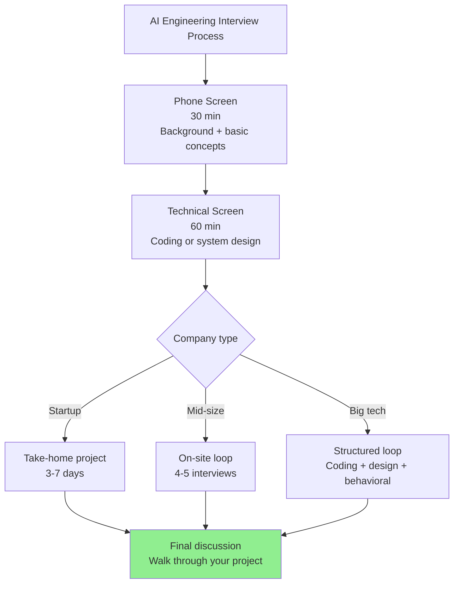
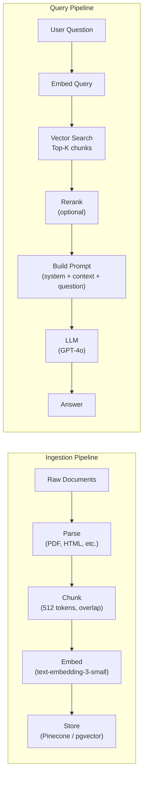

# AI Engineering Interview Prep

You have spent 97 days building real skills. Now you need to demonstrate them to someone who has 45 minutes and a rubric. The interview is a different skill from the engineering — but if you have done the work, it is learnable.

> **Coming from Software Engineering?** You already know how to interview for engineering roles — system design, coding challenges, behavioral questions. AI engineering interviews add a layer: expect to discuss RAG tradeoffs, agent architecture decisions, evaluation strategies, and cost analysis alongside standard system design. Your SWE interview skills transfer; you just need to prepare AI-specific examples. The good news: interviewers love candidates who bring production engineering discipline to AI problems.

AI engineering interviews are still settling into consistent patterns, which means companies vary a lot. But there are common threads. Here is what to expect and how to prepare.

---

## The Interview Landscape



Most AI engineering interviews are a mix of:
1. **System design** — "Design a RAG system for our docs"
2. **Coding** — "Parse this LLM output / implement this tool"
3. **Take-home** — "Build a working AI feature in a week"
4. **Behavioral** — "Tell me about a time your model failed in production"

---

## System Design: The Big Three Questions

These come up constantly. Know them cold.

### "Design a RAG System"



**What interviewers want to hear:**
- Chunking strategy and why (semantic vs fixed-size, overlap rationale)
- Embedding model choice and trade-offs
- Vector DB selection (managed vs self-hosted, ANN algorithm)
- Retrieval quality: hybrid search (keyword + semantic), reranking
- Caching: exact-match for repeated queries, semantic cache
- Evaluation: RAGAS metrics (faithfulness, answer relevance, context recall)
- Cost: embedding is cheap, LLM is expensive; optimize context window usage
- Scaling: async ingestion pipeline, batch embedding

### "Design a Multi-Agent Pipeline"

The question is usually something like: "Design an AI system that can research a topic, write a report, and email it to stakeholders."

**Your answer structure:**

1. **Decompose the task** into agents: Researcher, Writer, Reviewer, Sender
2. **Choose a topology**: supervisor orchestrates workers, or sequential pipeline
3. **Define handoffs**: what data passes between agents, in what format
4. **Handle failures**: what if the researcher can't find enough info? What if the writer produces garbage?
5. **Human-in-the-loop**: where does a human need to approve before sending?
6. **Cost and latency**: parallel execution where possible, cheap models for simple tasks

### "Design an Eval Framework"

This one signals seniority. Most candidates skip evaluation — interviewers notice.

```
Components to cover:
1. Test set construction (golden examples, edge cases, adversarial)
2. Metric selection (task-dependent: accuracy, F1, BLEU, RAGAS, custom)
3. LLM-as-judge (when human eval doesn't scale)
4. Regression testing (detect quality drops between versions)
5. A/B testing infrastructure (prompt versions, model versions)
6. Monitoring in production (not just offline eval)
7. Human annotation workflow (when and how to involve humans)
```

---

## Coding Interview Patterns

AI engineering coding interviews test your ability to work with LLM APIs, parse outputs, and handle the messiness of real LLM responses.

### Pattern 1: Structured Output Extraction

```python
# script_id: day_098_ai_engineering_interview_prep/structured_output_extraction
# Common prompt: "Parse this LLM response and extract structured data"
from pydantic import BaseModel, field_validator
from openai import OpenAI
import json

client = OpenAI()


class JobPosting(BaseModel):
    title: str
    company: str
    salary_min: int | None
    salary_max: int | None
    required_skills: list[str]
    remote: bool

    @field_validator("title", "company")
    @classmethod
    def not_empty(cls, v):
        if not v or not v.strip():
            raise ValueError("must not be empty")
        return v.strip()


def extract_job_posting(raw_text: str) -> JobPosting:
    """Extract structured job posting data from unstructured text."""
    response = client.chat.completions.create(
        model="gpt-4o-mini",
        messages=[
            {
                "role": "system",
                "content": f"""Extract job posting details as JSON matching this schema:
{json.dumps(JobPosting.model_json_schema(), indent=2)}

For salary: extract numbers only (no $ or commas). Use null if not mentioned.
For remote: true only if explicitly stated as remote/hybrid.""",
            },
            {"role": "user", "content": raw_text},
        ],
        response_format={"type": "json_object"},
    )

    data = json.loads(response.choices[0].message.content)
    return JobPosting(**data)
```

### Pattern 2: Tool Calling Implementation

```python
# script_id: day_098_ai_engineering_interview_prep/tool_calling_agent
# Common prompt: "Implement a tool-calling agent for X"
import json
from openai import OpenAI

client = OpenAI()

TOOLS = [
    {
        "type": "function",
        "function": {
            "name": "get_stock_price",
            "description": "Get the current stock price for a ticker symbol",
            "parameters": {
                "type": "object",
                "properties": {
                    "ticker": {"type": "string", "description": "Stock ticker, e.g. AAPL"},
                },
                "required": ["ticker"],
            },
        },
    },
]


def get_stock_price(ticker: str) -> dict:
    """Simulated stock price lookup."""
    prices = {"AAPL": 185.20, "GOOGL": 142.50, "MSFT": 415.30}
    price = prices.get(ticker.upper())
    if not price:
        return {"error": f"Unknown ticker: {ticker}"}
    return {"ticker": ticker.upper(), "price": price, "currency": "USD"}


def run_stock_agent(question: str) -> str:
    messages = [{"role": "user", "content": question}]

    for _ in range(5):  # Max 5 iterations
        response = client.chat.completions.create(
            model="gpt-4o-mini",
            messages=messages,
            tools=TOOLS,
        )

        message = response.choices[0].message

        if not message.tool_calls:
            return message.content

        messages.append(message)

        for tool_call in message.tool_calls:
            fn_name = tool_call.function.name
            fn_args = json.loads(tool_call.function.arguments)

            if fn_name == "get_stock_price":
                result = get_stock_price(**fn_args)
            else:
                result = {"error": f"Unknown function: {fn_name}"}

            messages.append({
                "role": "tool",
                "tool_call_id": tool_call.id,
                "content": json.dumps(result),
            })

    return "Max iterations reached"
```

---

## Take-Home Project Patterns

Take-homes are your chance to shine. Most candidates submit a notebook with basic functionality. Here is what separates good submissions.

### What Interviewers Actually Look For

```
Baseline (everyone does this):
✓ Core functionality works
✓ README explains what it does
✓ Code runs without errors

Good (most candidates miss this):
✓ Error handling and edge cases
✓ Tests (even basic ones)
✓ Cost and latency considerations mentioned
✓ Evaluation of output quality

Great (stands out):
✓ Thoughtful design decisions explained
✓ "What I'd do with more time" section
✓ Tradeoffs explicitly called out
✓ Production considerations (logging, monitoring)
✓ Clean, readable code that a team could maintain
```

### The README Template That Works

```markdown
# [Project Name]

## What it does
One paragraph. What problem does it solve? What is the output?

## How to run it
```bash
pip install -r requirements.txt
export OPENAI_API_KEY=...
python main.py --input "your query here"
```

## Design decisions
- Why I chose [model]: [reason]
- Why I chose [chunking strategy]: [reason]
- Tradeoffs I made: [what I optimized for, what I sacrificed]

## Evaluation
Results on my test set of N examples: [metric] = [value]

## What I'd do with more time
- Better evaluation with RAGAS
- Semantic caching to reduce costs
- Streaming responses for better UX
```

---

## Behavioral Questions Specific to AI Roles

These are different from standard behavioral questions because they probe your AI-specific judgment.

**"Tell me about a time your model/agent failed in production."**

Structure: situation → what failed → how you detected it → what you did → what you changed.

Good answer includes: a specific failure mode (not just "it gave wrong answers"), how you detected it (monitoring? user report?), a root cause analysis, and a systemic fix (not just "I fixed the prompt").

**"How do you evaluate whether an AI system is working well?"**

They want: offline metrics + online monitoring + human evaluation + A/B testing. Not just "I tested it manually."

**"How do you decide which model to use for a task?"**

They want: quality/cost/latency triangle, task-specific considerations (long context? structured output? reasoning?), benchmark results, and your own empirical testing.

**"How do you handle non-determinism in your AI systems?"**

They want: testing with mocks, integration tests with structural assertions, evaluation datasets, and acceptance that some variance is expected and managed.

---

## Talking About Your 100-Day Journey

You have a coherent narrative. Use it.

```
The story structure that works:

1. Why you started (SWE background, wanted to understand AI)
2. What you built (5 progressively complex projects)
3. What you learned (specific, technical, not vague)
4. What surprised you (shows genuine engagement)
5. What you'd do differently (shows maturity)
6. What you want to work on next (shows direction)
```

**Specific things to mention:**
- "I built a RAG chatbot that serves [topic] and handles [X] queries with [Y] latency"
- "I learned that the hardest part is evaluation — knowing if your system is actually better"
- "I was surprised by how much prompt engineering matters even with strong models"
- "The debugging agent work taught me that observability is as important as functionality"

---

## Red Flags and Green Flags in Job Postings

### Green Flags
- "We evaluate model outputs systematically" (they care about quality)
- "We have an eval team / evaluation infrastructure" (mature practice)
- "We use observability tools like LangSmith / Helicone" (they monitor production)
- "We contribute to open source AI projects" (technical depth)
- Specific models mentioned (they actually use them, not just theorizing)

### Red Flags
- "AI/ML Engineer" with no specifics (may be data science, not AI engineering)
- "Prompt engineer" as the only role (limited scope, may not be what you want)
- "We are building AGI" (run)
- "No prior AI experience required, just enthusiasm" (no real AI work happening)
- Job description is 80% buzzwords, 20% actual requirements

---

## Negotiation Tips for AI Roles

AI engineering is in high demand and short supply. Use that.

1. **Know the market rate.** As a rough benchmark (US, as of early 2026 — verify current data on levels.fyi / Glassdoor for your market), senior AI engineers command roughly $180-300K+ total comp at large companies; startups compensate with equity. Treat these numbers as directional, not current — comp moves fast.

2. **Your portfolio is leverage.** "I have a working RAG system, a multi-agent pipeline, and a production deployment" is negotiating power. Use it.

3. **Ask about the AI stack.** What models do they use? What's their eval process? How many AI engineers are on the team? Asking informed questions signals you are not just hunting a title.

4. **Negotiate total comp.** Base, bonus, equity, and — increasingly — compute budget (how much GPU/API budget do you have to experiment with?).

5. **Get the offer in writing before making decisions.** Verbal offers don't count.

---

## The Week Before Interviews

```
Day 1-2: Review your projects. Be able to explain any technical decision.
Day 3: Practice system design out loud (record yourself, it's uncomfortable but useful).
Day 4: Do 2-3 LeetCode mediums (yes, some AI roles still ask these).
Day 5: Review fundamentals: embeddings, RAG, agents, evals, cost.
Day 6: Mock interview with a friend or on Pramp.
Day 7: Rest. Seriously.
```

---

## SWE to AI Engineering Bridge

Your SWE background is an advantage, not a liability. Here is how to frame it:

| SWE Skill | How it applies to AI Engineering |
|---|---|
| Debugging complex systems | Agent debugging and trace analysis |
| Writing testable code | Mocked LLM tests, eval frameworks |
| System design | RAG pipelines, multi-agent architectures |
| Performance optimization | Token reduction, caching, model routing |
| Code review | Prompt review, eval dataset review |
| Production monitoring | LLM observability, cost tracking |
| API integration | LLM API integration, tool calling |

---

## Key Takeaways

1. **System design interviews require depth on RAG, multi-agent, and eval** — not just "I'd use ChatGPT"
2. **Coding interviews test structured output extraction and tool calling** — practice these
3. **Take-homes win on evaluation and production thinking** — not just "it works"
4. **Your 100-day journey is your story** — tell it specifically and confidently
5. **AI engineering is in demand** — negotiate from a position of strength
6. **Red flags are real** — a company that doesn't evaluate their AI systems is a company that ships bad AI

---

## Practice Exercises

1. Give yourself 45 minutes to design a RAG system for a company blog on a whiteboard (or paper). Time yourself.
2. Record yourself answering "Tell me about a time your model failed" — watch it back and refine your story
3. Write a README for your capstone project using the template above
4. Do 3 mock behavioral questions with the STAR format and get feedback from a friend

---

**Next up:** Building Your AI Portfolio, where you will package everything you have built into a professional presence that gets you hired.
