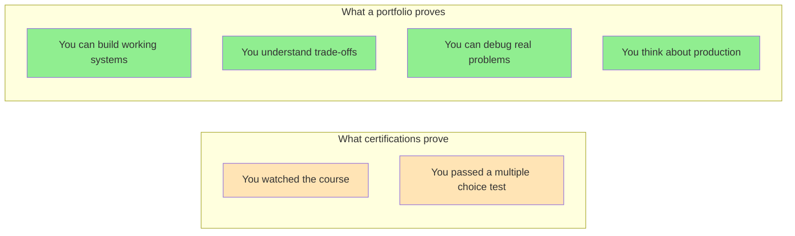
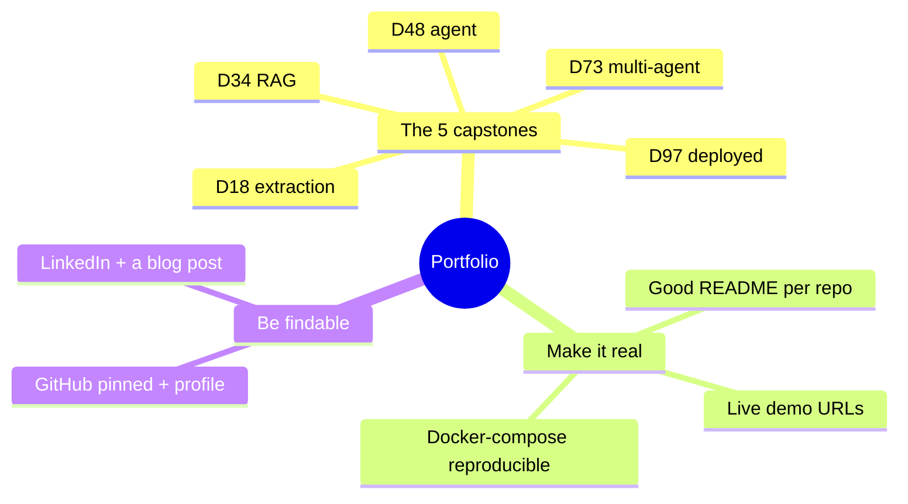

# Building Your AI Portfolio

Certifications say you watched videos. A portfolio says you built things. For AI engineering specifically, the gap between candidates who can talk about AI and candidates who have shipped AI is enormous — and a strong portfolio is how you prove which side you're on.

> **Coming from Software Engineering?** Your existing portfolio and GitHub already demonstrate engineering competence. For the AI transition, you need to show that you can apply that competence to AI-specific problems. The strongest signal: projects that combine solid engineering (clean code, tests, Docker, CI/CD) with AI capabilities (RAG, agents, eval pipelines). Most AI portfolios are messy notebooks — yours, with SWE discipline, will stand out immediately.

This is the day to think about how you package and present everything you have built over 99 days.

---

## Why Portfolio Over Certifications

Most AI certifications test whether you can recall definitions. Hiring managers know this. What they actually want to see:



A portfolio is also a forcing function. You cannot fake a working RAG chatbot. Either it retrieves relevant context and produces coherent answers, or it does not.

---

## Your 5 Capstone Projects: The Core

You built these. Now make them findable and understandable.

| Capstone | Day | What it demonstrates |
|---|---|---|
| Data Extraction Pipeline | Day 18 | Structured output, Pydantic, retry logic, testing |
| RAG Chatbot | Day 34 | Embeddings, vector DB, retrieval, cost management |
| Autonomous Research Agent | Day 48 | ReAct loop (reason-then-act), tool use, agent debugging, tracing |
| Multi-Agent Pipeline | Day 73 | Orchestration, handoffs, production hardening |
| Production Deployment | Day 97 | FastAPI, Docker, monitoring, prompt management |

Each project should have its own repository (or a clear subdirectory in a monorepo) with a README that a hiring manager can understand in 3 minutes.

---

## GitHub: Structure and Presentation

### Repository Structure

```
your-rag-chatbot/
├── README.md              ← The most important file
├── demo/
│   ├── demo.gif           ← Screen recording of it working
│   └── screenshots/
├── src/
│   ├── ingestion/         ← Clean, organized code
│   ├── retrieval/
│   └── api/
├── tests/                 ← Yes, tests matter
├── notebooks/
│   └── evaluation.ipynb   ← Show your eval work
├── prompts/               ← Versioned prompts
│   └── v1/
├── requirements.txt
├── docker-compose.yml
└── .env.example           ← Not .env — the example
```

### The README Formula

Every project README should answer these five questions in order:

```markdown
# RAG Chatbot for Technical Documentation

## What it does
A question-answering chatbot that retrieves relevant context from your 
technical documentation and generates accurate, cited answers.
Handles PDFs, Markdown, and HTML. Serves ~200 queries/minute.

## Demo


Try it live: [your-demo-url.com]  ← even a Hugging Face Space works

## Architecture
[Mermaid diagram or image]

## Technical highlights
- Hybrid search (keyword + semantic/meaning-based) returns the right document ~23% more often (recall)
- Semantic caching reduces API costs by ~40% in testing
- Pydantic schemas enforce structured output with automatic retry
- Eval suite (RAGAS): faithfulness 0.87 and answer relevance 0.91 (both 0–1, higher = better; faithfulness = answer sticks to the sources, relevance = it answers the question)

## Running locally
```bash
git clone https://github.com/you/rag-chatbot
cd rag-chatbot
cp .env.example .env  # Add your API keys
docker-compose up
```

## What I'd do with more time
- Fine-tune an embedding model on domain-specific vocabulary
- Add user feedback loop to improve retrieval over time
- Implement streaming responses for better perceived latency
```

> Every number in the "Technical highlights" block above is a placeholder. Replace each with results you actually measured in your own project — never quote a figure you cannot reproduce in an interview.

The "what I'd do with more time" section is underrated. It shows you understand limitations and think about next steps — which is exactly what senior engineers do.

---

## Making Your Projects Actually Run

A project nobody can run is a project nobody will evaluate.

```bash
# Minimum viable reproducibility checklist:
[ ] requirements.txt or pyproject.toml with pinned versions
[ ] .env.example with all required environment variables listed
[ ] README with exact commands to run it
[ ] Works on a fresh machine (test this!)
[ ] Graceful error message when API key is missing
[ ] Does not require special local setup beyond "pip install"
```

If you want extra points: a Docker Compose file that brings up everything with one command.

```yaml
# docker-compose.yml
version: "3.8"
services:
  app:
    build: .
    ports:
      - "8000:8000"
    environment:
      - OPENAI_API_KEY=${OPENAI_API_KEY}
    depends_on:
      - chromadb

  chromadb:
    image: chromadb/chroma:latest
    ports:
      # host:container — Chroma listens on 8000 inside the container
      - "8001:8000"
    volumes:
      - chroma_data:/chroma/chroma

volumes:
  chroma_data:
```

---

## Live Demos: The Multiplier

A live demo is worth 10 GitHub repos. People can see your work without cloning anything.

### Free hosting options:

| Platform | Best for | Cost |
|---|---|---|
| Hugging Face Spaces | Gradio / Streamlit apps | Free |
| Railway | FastAPI + database | $5/month |
| Fly.io | Docker containers | Free tier available |
| Render | Web services | Free tier (sleeps) |
| Vercel | Next.js + API routes | Free tier |

### Making a good demo video

If you can't keep a live demo running, a screen recording works.

```
Good demo video checklist:
[ ] Under 3 minutes
[ ] Shows a real use case, not "hello world"
[ ] Narrate what you're doing and why it matters
[ ] Show a failure case and how the system handles it
[ ] Mention the tech stack briefly at the end
[ ] Upload to YouTube (unlisted is fine) and link from README
```

---

## Writing Technical Blog Posts

Writing about what you learned does three things: it deepens your understanding, it builds your reputation, and it helps others. The hiring manager who read your blog post before your interview already trusts you.

### What to write about

You have 99 days of material. The best posts come from the things that surprised you or took you longer than expected to figure out.

Good titles:
- "Why My RAG Chatbot Was Returning Wrong Answers (And How I Fixed It)"
- "I Compared Every Python Vector Database. Here's What I Found."
- "How I Cut My LLM API Bill by 60% Without Sacrificing Quality"
- "The One Mistake Everyone Makes When Building AI Agents"

Each of those is a real thing you learned. Write honestly about the problem, your investigation, and what you found. Include code.

### Where to publish

- **dev.to** — great AI/ML audience, free, good SEO
- **Substack** — good for longer pieces, builds email list
- **Medium** — large audience, but algorithm is unpredictable
- **Your own site** — best for long-term, but start with a platform first
- **LinkedIn articles** — visible to your professional network

### The post structure that works

```
1. Hook (problem statement or surprising finding) — 1 paragraph
2. Why this matters — 1 paragraph  
3. The approach I tried first (and why it failed) — 1-2 paragraphs
4. What actually worked — the meat, with code
5. Results / what I measured — be specific
6. What I'd do differently — honest reflection
7. TL;DR — 3 bullet points
```

---

## Contributing to Open Source AI Projects

Open source contributions are visible work. They show you can read other people's code, understand a codebase, and communicate in a pull request.

### Where to start

**Easy first contributions:**
- Fix typos and documentation errors in popular repos
- Add missing docstrings to functions
- Add a missing test case you discovered
- Improve error messages

**Repos worth contributing to:**
- `langchain-ai/langchain` — huge community, many good first issues
- `chroma-core/chroma` — vector database, approachable codebase
- `BerriAI/litellm` — LLM routing library, very active
- `run-llama/llama_index` — RAG framework, good documentation issues
- `openai/openai-python` — SDK, high visibility

### Finding your first issue

```bash
# GitHub search for good first issues in AI repos
# site: github.com label:"good first issue" language:Python

# Topics to search on GitHub:
# "good first issue" + "llm"
# "help wanted" + "langchain"
# "documentation" + "embeddings"
```

A merged PR in a major AI repo is worth more on your resume than most certifications.

---

## Building Your Personal Brand

You do not need to be famous. You need to be findable and credible to the 5-10 hiring managers who will look you up.

### LinkedIn

Update your headline. Not "Software Engineer | Exploring AI" — that's everyone.

Try: "AI Engineer | Built RAG systems, AI agents, and production LLM pipelines | Open to roles"

In your About section, tell the 100-day story in 3 sentences. Then link your GitHub and best project.

For each capstone project, add it as a portfolio item with a 2-3 sentence description.

### Twitter/X

If you're going to use it, the highest-leverage move is sharing what you learn. Not hot takes — learning in public.

"I just figured out why my RAG system was returning irrelevant chunks. The chunking strategy was the problem, not the retrieval. Thread: [link to blog post]"

That kind of post gets engagement from exactly the people you want to know.

### GitHub profile README

Your GitHub profile is a landing page. Make it count.

```markdown
# Hi, I'm [Name]

AI Engineer building production LLM systems.

## Recent projects
- [RAG Chatbot](link) — semantic search + generation for technical docs
- [Autonomous Research Agent](link) — multi-step agent with web search and synthesis
- [Multi-Agent Pipeline](link) — orchestrated specialist agents with guardrails

## Writing
- [How I Cut My LLM Bill by 60%](blog-link)
- [Debugging AI Agents: A Systematic Approach](blog-link)

## Currently learning
[Whatever you're working on next]
```

---

## What Hiring Managers Actually Look At

Based on patterns from AI engineering hiring:

**In 30 seconds:** GitHub profile, pinned repos, README quality of top project

**In 5 minutes:** Does the code look like someone who has shipped things? Are there tests? Is there an eval notebook? Can I run it?

**In 15 minutes:** The most interesting project end-to-end. Does the architecture make sense? Are trade-offs mentioned? Is there evidence of real evaluation?

**Red flags that kill applications:**
- No README or a README that just says "TODO"
- Code with no error handling
- A Jupyter notebook with no structure ("just vibes")
- API keys committed to the repo
- "In progress" projects with no working code

**Green flags that get callbacks:**
- A working live demo
- An eval notebook with real metrics
- A blog post that explains the interesting technical decision
- Tests (even simple ones)
- A "what I'd do with more time" section in the README

---

## Your Pre-Application Checklist

Before applying anywhere, verify:

```
GitHub:
[ ] Profile README is complete and current
[ ] Top 5 repos are pinned
[ ] Each pinned repo has a complete README
[ ] Code is clean (no secrets, no "TODO: fix this")
[ ] At least one project has tests

LinkedIn:
[ ] Headline reflects AI engineering
[ ] Projects section links to GitHub repos
[ ] About section tells your story

Portfolio:
[ ] At least one live demo
[ ] At least one technical blog post
[ ] GitHub contribution graph shows recent activity

Interview ready:
[ ] Can explain every technical decision in your capstone projects
[ ] Have a "what surprised you" story for each major project
[ ] Can walk through your RAG or agent architecture on a whiteboard
```

---

## SWE to AI Engineering Bridge

| SWE Portfolio Concept | AI Portfolio Equivalent |
|---|---|
| Open source library contribution | AI framework PR (langchain, chroma, etc.) |
| Side project with users | Live demo with usage metrics |
| Technical blog post | AI engineering blog post (RAG, agents, evals) |
| System design writeup | Architecture README with Mermaid diagrams |
| Test coverage | Eval framework + test suite |
| CI/CD pipeline | Automated eval on prompt change |

---

## Key Takeaways

1. **A working live demo is worth more than any certification** — make at least one project publicly accessible
2. **READMEs are your first interview** — spend real time on them
3. **Write about what surprised you** — honest learning content gets read and shared
4. **Open source PRs are visible proof of skill** — one merged PR beats a dozen tutorials
5. **Hiring managers look at code quality, not just functionality** — clean, tested code signals a professional
6. **Your 100-day journey is a story** — tell it specifically, with numbers and trade-offs

---

## Checkpoint

Open your single best capstone repo right now and treat it like a PR a senior reviewer opens cold. Time yourself: can a stranger (1) understand what it does from the README, (2) see it work via a GIF or live URL, and (3) run it from a clean clone in under 3 minutes? If any of the three fail, that repo is not portfolio-ready — fix the weakest one before moving on.

---

## Summary



## Quick Reference

| Asset | Bar to clear |
|---|---|
| README (per project) | Problem → demo GIF/URL → how to run → stack → what you learned |
| Live demo | Public URL on HF Spaces / Railway / Render |
| Reproducibility | `docker compose up` (or one clear command) works from a clean clone |
| GitHub profile | 5 projects pinned; profile README mentions AI engineering |
| Reach | One technical blog post + LinkedIn updated with links |

---

## Practice Exercises

1. Rewrite the README for your best capstone project using the formula above — time yourself at 2 hours
2. Deploy one project to Hugging Face Spaces or Railway and get a public URL
3. Write a 500-word blog post about the most interesting technical problem you solved in this journey
4. Add your best project to your LinkedIn profile with a 3-sentence description and a link

---

**Next up:** Career Launch — What's Next. You have built the skills, the projects, and the portfolio. Tomorrow is about going out and using them.
