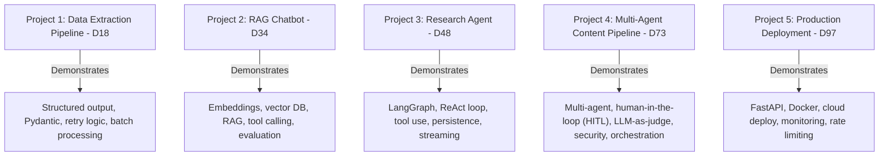
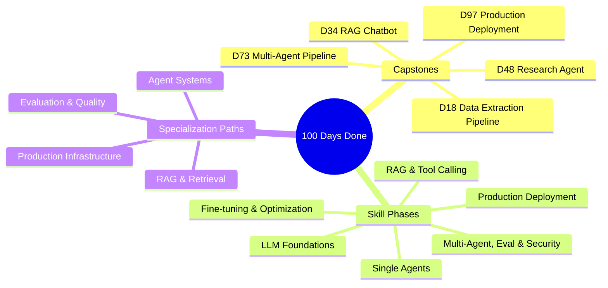

# Your 100-Day Journey is Complete — What's Next

You made it.

> **Coming from Software Engineering?** You didn't just learn AI — you learned AI *as an engineer*. That combination is rare and valuable. You understand both the production realities (deployment, testing, monitoring, cost) and the AI-specific patterns (RAG, agents, evals, guardrails). Most AI engineers come from research and struggle with production. Most SWEs struggle with AI concepts. You've closed both gaps. That makes you exceptionally hireable.

100 days. 5 capstone projects. A skill set that didn't exist 4 months ago. A portfolio that can get you interviews at companies building the future.

Take a moment with that before we talk about what comes next.

---

## What You've Actually Accomplished

Let's be specific, because vague pride doesn't help you in interviews. Here's what you can now do that you couldn't do 100 days ago:

**You can call any LLM API and get reliable, structured output.**
You know how to write prompts that work, validate responses with Pydantic, handle failures with retry logic, and track costs. This is the foundation everything else is built on.

**You can build RAG systems from scratch.**
You understand embeddings, know how to choose chunk sizes, can set up ChromaDB, implement semantic retrieval, inject context into prompts, and measure whether it's working with LLM-as-judge evaluation.

**You can build autonomous agents.**
You can wire up a LangGraph state machine, define tools, handle tool call/result cycles, implement iteration limits, and persist state to a database. You've built a research agent that actually researches things.

**You can orchestrate multiple agents.**
You understand supervisor patterns, agent specialization, inter-agent communication, and quality evaluation loops. You've built a pipeline where a researcher, writer, and reviewer collaborate.

**You can ship to production.**
You can wrap an AI system in a FastAPI service, add a Streamlit UI, containerize it with Docker, deploy it to the cloud, add health checks, rate limiting, and cost tracking, and give someone a URL to use.

This is not a beginner skill set.

---

## Your Portfolio: 5 Projects Ready to Showcase

**How to present each project:**

For every project, you should be able to answer:
1. What problem does it solve? (in one sentence)
2. What's the architecture? (the main components and how they connect)
3. What was the hardest part? (where you made a real engineering decision)
4. How would you improve it? (shows you think beyond the demo)

Practice these answers out loud. Not just in your head — out loud. The difference between a polished answer and a rambling one is practice.

---

## Full Skills Summary

Here's everything you've learned across 100 days:

### LLM Foundations
- How LLMs work (tokens, context windows, temperature)
- OpenAI and Anthropic API integration
- Prompt engineering: zero-shot, few-shot, chain-of-thought, system prompts
- Structured output with Pydantic and JSON mode
- Streaming responses
- Retry logic and error handling
- Token cost estimation

### External Knowledge
- Embedding models and vector similarity
- Text chunking strategies and trade-offs
- ChromaDB for vector storage and retrieval
- RAG pipeline design and implementation
- Context injection patterns
- Source attribution and citation
- LLM-as-judge evaluation

### Single Agents
- Tool/function calling with OpenAI
- ReAct (Reason + Act) agent pattern
- LangGraph state machines and conditional routing
- Memory: in-context vs. external
- Session persistence with SQLite
- Iteration limits and graceful termination
- Streaming agent execution

### Multi-Agent, Eval & Security
- Multi-agent patterns: supervisor, collaboration, specialization
- Agent-to-agent communication
- LLM evaluation frameworks
- Automated revision loops
- Human-in-the-loop design
- Prompt injection detection and defense
- Input sanitization

### Fine-tuning & Optimization
- When to fine-tune vs. when to use RAG (and when neither is needed)
- LoRA/QLoRA: adapting a model by training small add-on weights instead of the whole thing
- Quantization: shrinking a model so it runs cheaper and faster
- Serving optimized models in production

### Production
- FastAPI for AI service APIs
- Server-Sent Events for streaming
- Rate limiting
- Cost tracking and monitoring
- Docker and containerization
- Cloud deployment (Render/Railway)
- Health checks and observability
- Structured logging

---

## What Comes After Day 100

Finishing this course is not the end — it's the beginning of the real work. Here's how to keep growing:

### Specialize in One Area

The field is broad. The engineers who advance fastest pick a specialization and go deep. Here are the four main paths:

**Path 1: Agent Systems & Orchestration**
If you loved building the research agent and content pipeline, go deeper here. Study AutoGen, CrewAI, and the latest LangGraph patterns. Follow the research coming out of Microsoft, Google, and Anthropic on agent capabilities. Learn how agents remember things across long tasks, how they break a big goal into steps (planning), and how multiple agents coordinate without stepping on each other.

Key resources: LangGraph docs, AutoGen research papers, Lilian Weng's blog, Simon Willison's blog.

**Path 2: RAG and Knowledge Systems**
If the RAG chatbot felt like home, specialize here. Study advanced chunking strategies (semantic chunking, parent-document retrieval), reranking models (a second pass that re-sorts your search hits by relevance — Cohere Rerank, cross-encoders), hybrid search — combining keyword search (BM25, the classic full-text ranking algorithm) with vector search — and multi-vector retrieval. This is the foundation of most enterprise AI products.

Key resources: LlamaIndex docs, Weaviate blog, Qdrant documentation, RAGatouille library.

**Path 3: Evaluation and AI Quality**
If you found yourself more interested in "does this work?" than "how does this work?", evaluation is your path. Study RAGAS, DeepEval, and PromptFoo. Learn about benchmark design, adversarial testing, and the emerging field of AI safety evaluation.

Key resources: RAGAS paper, Hamel Husain's blog, Shreya Shankar's research on evaluation.

**Path 4: Production AI Infrastructure**
If the deployment day was the most satisfying, lean into infrastructure. Study model serving — the layer that runs an open-source model on your own GPUs and answers requests, like running your own server instead of calling someone else's API (vLLM, TensorRT-LLM) — observability (LangSmith, Langfuse, Helicone), and cost optimization. Learn about caching strategies, prompt compression, and model routing.

Key resources: LangSmith docs, vLLM docs, Anyscale blog, the MLOps community.

### Keep Building

The best thing you can do after Day 100 is build one more project in your specialization area. Not a tutorial project — something you genuinely want to exist. A tool you'd use, a problem you've noticed, a workflow you want to automate.

Building for a real use case forces you to make real decisions. And real projects on your GitHub are worth ten tutorial projects.

### Stay Current

This field moves fast. Here's how to stay current without drowning in noise:

**Follow these people (as of 2025-2026):**
- Andrej Karpathy — LLM fundamentals and intuition
- Simon Willison — practical AI engineering and security
- Lilian Weng — research summaries and agent theory
- Hamel Husain — evaluation and fine-tuning
- Harrison Chase — LangChain/LangGraph updates

**Read these newsletters:**
- The Batch (Andrew Ng) — weekly AI news
- Last Week in AI — research papers summarized
- Latent Space — technical deep dives

**Watch these communities:**
- LangChain Discord — active practitioners
- Hugging Face Discord — open source models
- r/MachineLearning — research discussions

---

## Communities to Join

You don't have to figure this out alone. These communities have practitioners at every level:

- **LangChain Discord** — active, helpful, full of working engineers
- **AI Engineer Foundation** — professional community for AI engineers
- **Hugging Face Discord** — open source model discussions
- **MLOps Community Slack** — deployment and production focus
- **Local AI meetups** — search Meetup.com for your city

Introduce yourself honestly: "I'm a software engineer who just completed a 100-day AI engineering course. I've built RAG systems, agents, and multi-agent pipelines. Looking to connect with others doing similar work."

That's a strong introduction. You've earned it.

---

## The Job Search: What to Do This Week

If you haven't started applying yet, start now. Here's the sequence:

**Week 1: Polish and Publish**
- Deploy all 5 projects if you haven't
- Write clean READMEs with screenshots and live URLs
- Update your resume with all 5 projects
- Update LinkedIn with skills and projects
- Pin your best repositories on GitHub

**Week 2: Warm Outreach**
- Message 5-10 people in your network who work at companies with AI engineering roles
- Don't ask for referrals immediately — ask for a 15-minute conversation about what they're building
- Be specific: "I've been building LLM systems for the last 100 days and I'm interested in what [company] is doing with AI."

**Week 3: Applications**
- Apply to 5-10 positions per week
- Prioritize companies where your RAG/agent experience matches the JD
- Write a custom cover note (not a full letter — a 3-sentence note) for each application
- Track everything in a spreadsheet: company, role, date, status, contacts

**Week 4+: Interviews**
- Prepare for the technical screen: be ready to explain any project from your portfolio in depth
- Practice system design for AI systems: "Design a document Q&A system for a legal firm"
- Prepare for the coding screen: know your Python, know your APIs, know your data structures
- Prepare for the behavioral: have 3-5 stories about problems you solved and decisions you made

---

## What the Field Is Like Right Now

Here's the honest picture of where AI engineering stands in 2026:

**The field is young.** The title "AI Engineer" barely existed 3 years ago. There are no engineers with 20 years of experience in this specific role. The "senior AI engineers" you're competing with have 2-4 years of relevant experience, not 10.

**The tooling is still stabilizing.** LangGraph, LlamaIndex, ChromaDB — these are v1 or v2 products. The patterns are settling but not settled. Engineers who are flexible and keep learning will outperform engineers who over-optimized for one framework.

**The demand is real and growing.** Every company that hasn't built AI features is planning to. The number of AI engineering roles is growing faster than the supply of qualified engineers. This is a good market to enter.

**The bar is practical, not theoretical.** Most companies hiring AI engineers don't care if you can derive transformers from scratch. They care if you can build a RAG system that actually works, debug why an agent is looping, and ship a feature that doesn't break production. You can do all of those things.

**Remote is the norm.** More than any other engineering specialty, AI engineering is remote-first. The talent pool is global, and companies have accepted this. Your location is less of a constraint than in most engineering roles.

---

## Summary

---

## Quick Reference: Specialization Paths

Pick the one that pulls at you — and name the first thing you'll learn next.

| Path | You'd go deep on | First next step |
|---|---|---|
| **Agents** | Multi-agent orchestration, tool reliability, long-horizon tasks | Rebuild your D48 agent with a richer tool surface + eval |
| **RAG / Retrieval** | Reranking, hybrid search, retrieval eval, GraphRAG | Add reranking + a retrieval-quality harness to your D34 bot |
| **Evaluation** | LLM-as-judge, RAGAS, regression suites, observability | Stand up an eval CI gate for one capstone |
| **Infrastructure** | Serving, scaling, cost/latency, fine-tuning, MCP (Model Context Protocol — a standard for connecting tools/data to LLMs) | Containerize + load-test a capstone; add caching/fallbacks |

(The final action items below are your exercises for today.)

---

## The Final Motivation

Here's what I want you to understand about the position you're in.

Most people who want to transition into AI engineering talk about it, read about it, follow the news about it, and watch tutorials about it. They don't build anything. They wait until they feel "ready," which means they wait forever.

You built things. You have working code. You have deployed projects. You have a vocabulary for discussing these systems that comes from having actually built them, not just read about them.

That puts you in a small group. Genuinely.

The engineers who are going to define how AI systems are built over the next decade are the ones who are doing the work right now, in this early period, when the patterns aren't established and the tooling isn't mature and you have to figure things out. Those engineers will have the intuition, the scars, and the judgment that only comes from having been in the arena.

You've been in the arena for 100 days.

That's not the end of anything. It's the beginning.

Go build something real.

---

## Practice Exercises

*Your final action items:*

1. **Celebrate.** Tell someone what you just accomplished. It matters.

2. **Deploy everything.** Every capstone should be accessible at a public URL.

3. **Update your GitHub profile.** Pin the 5 projects. Write good READMEs. Add a "About" that mentions AI engineering.

4. **Update LinkedIn today.** Not tomorrow. Today.

5. **Send one message** to someone in your network about what you've built. Not a job ask — just sharing what you've been working on.

6. **Pick your specialization.** Decide which of the four paths interests you most, and identify the first thing you'll learn next.

7. **Start the job search.** If you want a new role, there's no day better than today to begin.

---

*You've completed the 100-Day AI Engineering Journey. The journey continues — it just doesn't have a day counter anymore.*

*Good luck. You're ready.*
